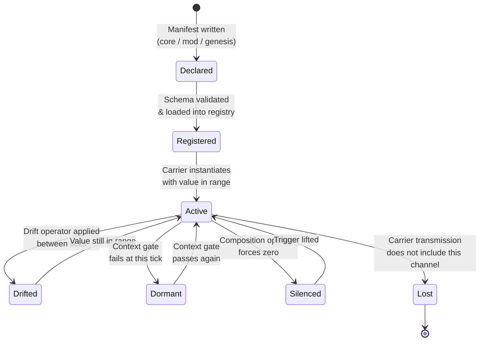
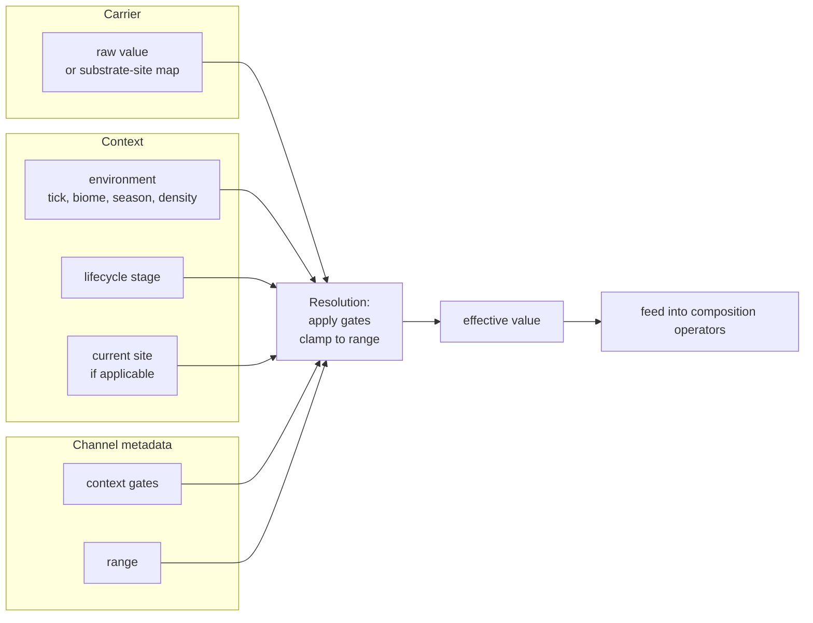

# 01 — Channels

> A **channel** is the atomic unit of the core model: a named, ranged scalar
> attached to a carrier, with enough metadata that a registry-driven interpreter
> can reason about it without knowing what domain it describes.
>
> A channel is *just a scalar*. It does not know how it changes over time
> (that's a drift operator — see [03](03_operators_and_composition.md)), nor
> what taxonomy it belongs to (there is no taxonomy — see
> [02](02_carriers.md)), nor whether it can vary across substrate sites
> (that's a context gate — see [06](06_context_gates.md)).

## 1. Definition

A channel is a tuple:

```
Channel = (id, carrier, range, operators, context_gates, provenance)
```

All fields are mandatory.

| Field | Purpose | Page |
|-------|---------|------|
| `id` | Unique snake_case identifier used as a key in channel-valued maps. | this |
| `carrier` | Which carrier this channel belongs to (genome, equipment, settlement, …). Determines which drift operators apply and which context-gate kinds are relevant. | [02](02_carriers.md) |
| `range` | Numeric domain `[min, max]` with units, defining what values are legal. | this |
| `operators` | Composition operators (how this channel combines with others at a tick) and drift operators (how its value changes between ticks). | [03](03_operators_and_composition.md) |
| `context_gates` | Under what conditions and at what substrate sites this channel applies. | [06](06_context_gates.md) |
| `provenance` | Origin tag (`core | mod:<id> | genesis:<parent>:<n>`). | [05](05_registries_and_manifests.md) |

That is the entire channel. Everything else lives elsewhere. In particular:

- **No `group` / `family` field.** The kernel has no taxonomy of channels.
  "Sensory" or "motor" are not properties a channel carries; they are soft
  labels a downstream labeler may assign by observing which primitives a
  channel actually emits. See [02 §4](02_carriers.md).
- **No `mutation_kernel` field.** How a channel drifts in value between ticks
  is a *drift operator* declared on the channel's `operators` list, not a
  first-class channel property. Gaussian mutation is one drift operator;
  monotonic wear is another; market momentum is another.
- **No `substrate_site_flag`.** Whether a channel is per-site is answered by
  whether it has a substrate-site context gate. If it does, values are carried
  per-site; if not, the channel is a single scalar. See [06](06_context_gates.md).

## 2. Research basis

- **Gene Regulatory Networks** (Wagner 2011, *The Origins of Evolutionary
  Innovations*) — the idea that phenotype emerges from a network of
  quantitative regulators whose topology and weights are themselves mutable.
- **Compositional Pattern Producing Networks** (Stanley 2007) — separation of
  *what is a signal* (a channel) from *how signals combine* (operators) so
  evolution can search both layers.
- **Unreal Gameplay Ability System — Gameplay Attributes** — each attribute
  is a scalar with a max and a stack of modifiers. Channels generalize it
  across carriers, not just actors.
- **Reaction-network models** — channels as "species concentrations",
  operators as "reaction rules", an interpreter as "rate-law evaluator".
  Useful when reasoning about cumulative dynamics.

## 3. Invariants

1. **Quantitative.** A channel value is a single scalar. Vectors and
   categorical enums are modeled as multiple correlated channels, not as
   structured channels.
2. **Ranged.** Every channel has explicit `[min, max]` and physical units.
   `units: "dimensionless"` is permitted but never absent.
3. **Carrier-bound.** Every channel belongs to exactly one carrier. Moving a
   channel to a different carrier is not a mutation — it requires a new id.
4. **Deterministic numerics.** All channel math runs on the Q32.32 substrate
   from [08](08_determinism.md). See
   [`INVARIANTS.md §1`](../INVARIANTS.md).
5. **No ghost channels.** A channel that appears in carrier state must have a
   corresponding registry entry; the interpreter rejects unknown ids. Genesis
   registers the new id before referencing it.
6. **Stable id.** Once a channel id is in circulation in save files or
   replay journals, it cannot be renamed or silently retyped.

## 4. Lifecycle



The kernel owns *Registered → Active → Drifted* and the *Active ↔ Dormant*
edge. Silencing and loss are driven by operators and carrier semantics.

## 5. Anatomy of a channel value

A channel value is always resolved against a carrier and a context:



- **Effective value** is what composition operators see.
- **Raw value** is what drift operators advance and what save files store.
- **Dormant channels** have effective value `0`; raw value is preserved.

## 6. Tradeoffs: what a channel is, and what it is not

| Option | Description | Pros | Cons | Chosen? |
|--------|-------------|------|------|---------|
| **Scalar in `[min, max]` with units** | Current. | Cheap; composable; determinism-friendly; maps to GRN literature. | Structured traits must decompose into multiple channels. | **Yes** |
| Scalar with taxonomy/family | Previous draft. | Defaults for mutation and composition; fast group queries. | Pre-emptive classification injects designer priors; fights emergence; couples kernel to biology vocabulary. | Rejected (this revision). |
| Vector-valued channels | Channel carries `ℝⁿ`. | Fewer registry entries; natural for color/position. | Operator set balloons; cross-domain tooling harder. | No. |
| Categorical channels | Enum-valued. | Directly models discrete state. | Breaks drift operators and composition kinds. | No. |
| Dynamic-range channels | Range changes over lifetime. | Models "max stamina grows with age". | Save-compat nightmare; invalidates replay. Model via static range + regulator. | No. |

**Rationale**: the scalar-in-`[min, max]` framing is the narrowest abstraction
that still supports the operator set we want. Removing the family taxonomy
(vs. the earlier draft) trades manifest terseness for cleaner emergence —
channels declare what they do via operators, not what they *are* via a label.

## 7. Beast-domain examples

*(Illustrative only — the kernel does not define these.)*

- `auditory_sensitivity` — carrier `genome`, range `[20, 100] dB`, drift
  operator *Gaussian mutation* with σ=0.1, threshold composition with
  `spatial_cognition`, substrate-site gate on head.
- `edge_sharpness` — carrier `equipment`, range `[0, 1]` dimensionless, drift
  operator *monotonic wear* (decreases with use), multiplicative composition
  with `impact_force`.
- `granary_capacity` — carrier `settlement`, range `[0, 10000] tonnes`, drift
  operator *institutional-drift* (stochastic decay + investment), additive
  composition with `food_security`.

None of these channels have a family. "Auditory" is a label a Chronicler may
assign after observing emissions; it is not something the channel claims
upfront.

## 8. Open questions

- Should the kernel support a declarative *initial value* in addition to a
  range, or is initialization always a carrier concern?
- Is there a role for *derived channels* (channels whose raw value is computed
  from other channels, not stored) — or is this always better expressed as a
  composition operator? Leaning towards the latter.
- Should units be a structured type (base-unit enum + exponent vector) for
  dimensional analysis at load time? Catches type errors; costs implementation
  weight.
