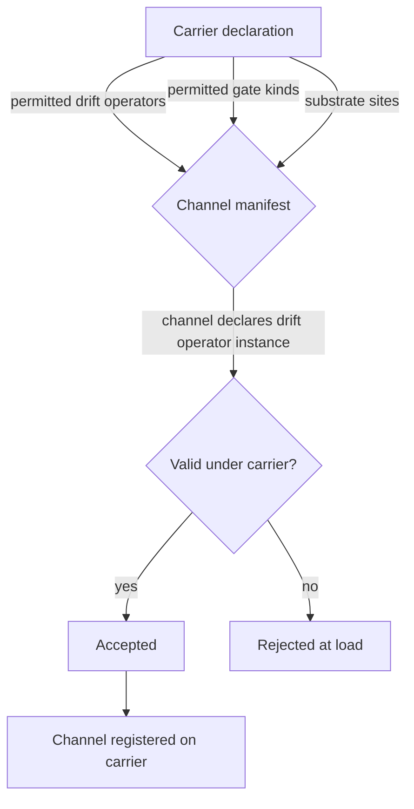

# 02 — Carriers

> A **carrier** is a context that holds channels. Genomes carry channels.
> Equipment carries channels. Settlements, cultures, and economies carry
> channels. A carrier declares *what changes channels over time* (its drift
> operator set) and *what conditions those channels care about* (its context
> gate kinds) — because those two things differ fundamentally between a
> creature's genome and a sword's edge.
>
> Carriers are the **only grouping** the kernel recognizes. There is no
> taxonomic classification of channels in the kernel. *"Sensory"* and
> *"motor"* are not carrier types, nor channel categories — if they are
> anything, they are soft labels a downstream labeler assigns after observing
> emission patterns.

## 1. Motivation

Earlier drafts of this folder used a "channel group" concept modeled on
Beast's biological `family` enum (sensory, motor, metabolic, etc.). On review,
that taxonomy fights the emergence principle: it pre-classifies channels
before evolution has told us whether the classification is useful. It also
couples the kernel to a biology vocabulary that has no analog in equipment,
economies, or cultures.

The natural grouping is *what kind of thing is holding this channel*. A
channel inside a genome behaves under mutation pressure; a channel inside an
equipment item behaves under wear and repair; a channel inside a settlement
behaves under institutional drift. These are different *dynamical* regimes,
not different *semantic* categories.

Carriers capture that difference.

## 2. What a carrier provides

A carrier declaration gives the kernel:

| Slot | Purpose |
|------|---------|
| `carrier_id` | Unique identifier used by channels to declare membership. |
| `drift_operators` | The set of drift-operator kinds permitted on channels of this carrier (e.g., `gaussian_mutation`, `monotonic_wear`, `momentum`). |
| `context_gate_kinds` | The set of context-gate kinds relevant to this carrier (e.g., `biome_flag`, `life_stage`, `mount_slot`, `fiscal_year`). |
| `substrate_site_enumeration` | If channels on this carrier can be per-site, the enumeration of legal site ids (`head`, `barrel`, `ward`, …). Empty if not. |
| `lifecycle` | How instances of the carrier are born, transmitted, and destroyed (birth-death-inheritance for genomes; craft-use-break for equipment; found-thrive-decline for settlements). |
| `identity_semantics` | Whether two instances are distinct by id only, by full state, or by something else. Needed for deterministic iteration. |

The kernel does not hardcode the list of carriers. A domain declares its
carrier set at bootstrap. Beast starts with `genome`; equipment and
settlements get added when those domains land.

## 3. What a carrier is NOT

- **Not a channel-behavior hint.** A carrier doesn't say "channels here emit
  sensory primitives". Whether a channel emits anything, and what, is
  declared by the channel's operator list.
- **Not a namespace.** Two different carriers may legally have channels with
  the same id (e.g., `durability` on equipment and `durability` on
  settlements). The registry keys carrier-scoped ids by `(carrier_id, id)`.
- **Not a runtime class.** The carrier is a *declaration* in the registry; the
  runtime data is a carrier *instance* (a specific genome, a specific sword,
  a specific settlement). The kernel distinguishes declarations and instances
  rigorously.

## 4. Tradeoffs: carriers vs. taxonomies vs. no grouping

| Option | Pros | Cons | Chosen |
|--------|------|------|--------|
| **Carriers as the only grouping** | Grouping matches the real dynamical difference between domains; no premature classification; new domains slot in cleanly. | Each carrier's declaration has to specify drift operators and gate kinds — more boilerplate per carrier. | **Yes** |
| Taxonomic families (previous draft: sensory/motor/…) | Terse manifests; intuitive for domain experts; cheap registry queries. | Pre-classifies behavior, fighting emergence; domain-specific vocabulary leaks into kernel. | Rejected in this revision. |
| No grouping at all | Minimal kernel surface. | Drift-operator dispatch has to be per-channel; can't say "every equipment channel wears monotonically". | No. |
| Free-form tags | Fully flexible. | Defaults are lost; drift semantics become per-channel; load-time validation weakens. | No — may return as an *optional* descriptive layer above carriers. |

**Rationale**: carriers are the thinnest abstraction that captures the real
difference between domains. We lose the "typical σ for sensory channels"
convenience, but mutation σ was never an emergent property anyway — it was a
designer default we can declare on a per-channel basis when we need it, or
as a carrier-level default on the drift operator.

## 5. Carrier → channel waterfall

Carriers carry *defaults for drift operators and gate kinds*, not channel
behavior directly. The waterfall is therefore narrower than the previous
family model:



The carrier's job is to **reject illegal declarations at load**: a genome
channel claiming a `monotonic_wear` drift operator is an error, because the
genome carrier doesn't permit that drift kind. This is structural
validation, not taxonomic.

## 6. Carrier identity and iteration

Because carriers determine identity semantics, they are the layer where
deterministic iteration rules apply:

```mermaid
flowchart LR
    subgraph Registry
      cr[Carrier registry<br/>BTreeMap&lt;carrier_id, Carrier&gt;]
      ch[Channel registry<br/>BTreeMap&lt;(carrier_id, channel_id), Channel&gt;]
    end
    subgraph World state
      inst[Carrier instances<br/>BTreeMap&lt;instance_id, state&gt;]
    end
    sys[System tick] --> cr
    sys --> ch
    sys --> inst
    inst -.|sorted iteration|.- sys
```

Every loop iterates over carriers in sorted `carrier_id` order, then over
instances of each carrier in sorted `instance_id` order, then over channels
of each carrier in sorted `(carrier_id, channel_id)` order. This is how the
kernel honors the sorted-iteration rule from [08](08_determinism.md).

## 7. Cross-carrier interaction

Many interesting behaviors span carriers: a creature *holding* equipment, or
a creature *inhabiting* a settlement. Cross-carrier interaction happens at
the interpreter layer ([07](07_interpreter.md)) via primitive emission —
each carrier runs its own interpretation, and the resulting primitive sets
are unioned with merge rules applied.

The kernel provides no *channel* cross-reference between carriers. A genome
channel cannot read the value of an equipment channel directly. If such a
coupling is needed, it is expressed as *one side emits a primitive that
modifies a world variable, the other side reads that variable via a context
gate or a primitive sampler*. This keeps carrier dynamics independent and
makes save/load straightforward.

## 8. Invariants

1. **Single membership.** A channel belongs to exactly one carrier.
2. **Declared carriers only.** The set of carriers is frozen at bootstrap;
   no new carriers may be declared at runtime.
3. **Carrier-scoped ids.** Channel ids are unique within a carrier, not
   globally. Registry keys are `(carrier_id, channel_id)`.
4. **Carrier declares drift kinds.** Channels can only use drift operator
   kinds permitted by their carrier.
5. **Carrier declares gate kinds.** Channels can only use context-gate kinds
   permitted by their carrier.
6. **Carrier-level lifecycle.** Carrier instance lifecycle (born, destroyed)
   is domain-owned; the kernel defines only the events the interpreter
   observes, not how they are produced.

## 9. Beast-domain example carrier declarations

*(Illustrative. The kernel does not ship these — the Beast domain does.)*

```
carriers:
  - id: genome
    drift_operators: [gaussian_mutation, correlated_mutation, regulatory_rewire, duplication]
    context_gate_kinds: [biome_flag, season, developmental_stage, social_density, scope_band]
    substrate_site_enumeration: [head, jaw, core, limb_l, limb_r, tail, appendage]
    lifecycle: {birth: reproduction, death: death_check, inheritance: offspring_merge}
    identity_semantics: {primary_key: entity_id, equality: structural}

  - id: equipment
    drift_operators: [monotonic_wear, repair_restore]
    context_gate_kinds: [mount_slot, durability_threshold, operator_stance]
    substrate_site_enumeration: [grip, barrel, underslung, edge, sight]
    lifecycle: {birth: craft, death: destruction, inheritance: none}
    identity_semantics: {primary_key: item_id, equality: structural}

  - id: settlement
    drift_operators: [institutional_drift, investment_boost]
    context_gate_kinds: [fiscal_year, season, disease_state, ruler_legitimacy]
    substrate_site_enumeration: [ward, district, gate, market, workshop]
    lifecycle: {birth: founding, death: abandonment, inheritance: none}
    identity_semantics: {primary_key: settlement_id, equality: structural}
```

Note that the same context-gate kind (`season`) appears in both genome and
settlement — the kernel's gate-kind registry spans carriers, but each carrier
opts in to the kinds it wants.

## 10. Open questions

- Should a channel ever be *transferable* between carriers (e.g., a trait
  passed from a creature to its tool via a cultural transmission event)?
  Today: no — transfer is expressed as two channels on two carriers
  correlated via a primitive emission.
- Do we want a `carrier_group` meta-concept for grouping multiple carriers
  under one umbrella (e.g., "biological carriers" vs. "artifact carriers")?
  Probably only needed if drift/gate kinds are shared across carrier
  families. Deferring.
- Should carriers declare a **default primitive-target kind** (see
  [04](04_primitives.md)) — e.g., "primitives emitted by genome channels
  default to targeting the carrier instance itself"? Would reduce manifest
  verbosity; watch for hidden coupling.
