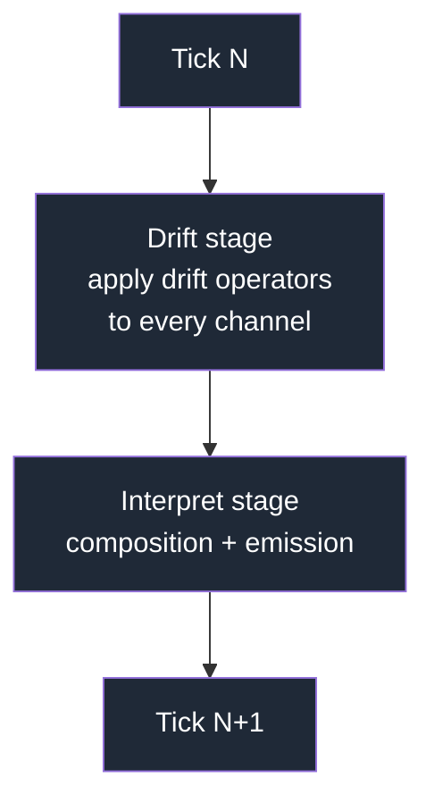
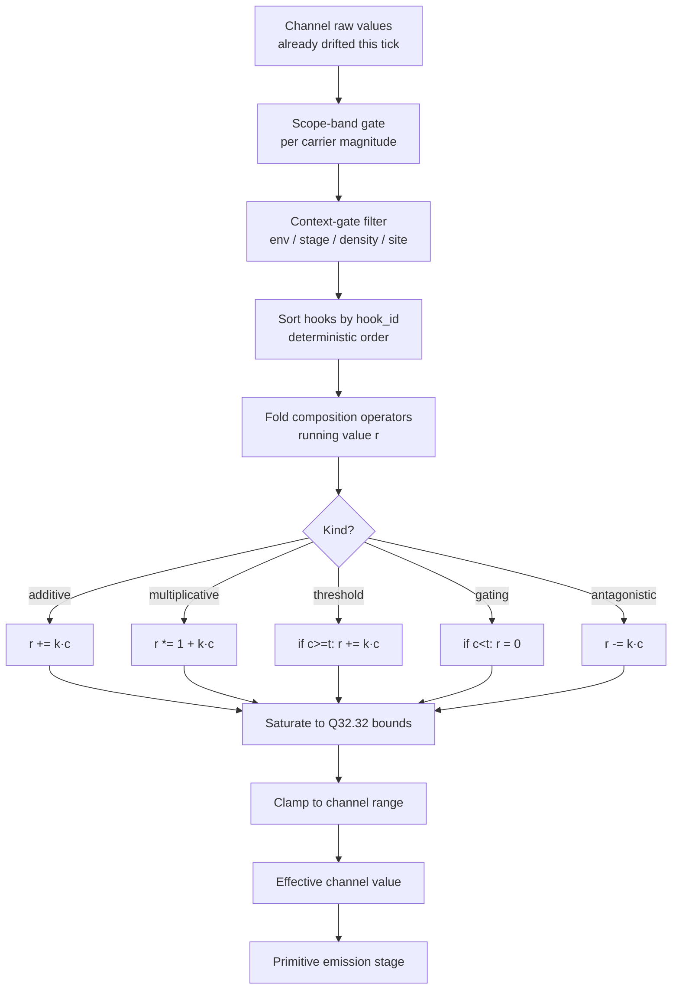

# 03 — Operators & Composition

> **Operators** are the kernel's only mechanism for *anything happening to a
> channel*. They split into two families:
>
> - **Composition operators** act *within* a tick. They combine channel values
>   to produce the effective value an interpreter feeds to primitive emission.
> - **Drift operators** act *between* ticks. They advance a channel's raw value
>   toward the next tick under whatever dynamical regime the carrier permits:
>   Gaussian mutation, monotonic wear, institutional drift, market momentum,
>   and so on.
>
> A channel is a dumb scalar. Everything that *does* anything to it is an
> operator.

## 1. Operator families at a glance

```mermaid
flowchart LR
    subgraph Temporal<br/>between ticks
      d1[Gaussian mutation]
      d2[Correlated mutation]
      d3[Monotonic wear]
      d4[Stochastic decay]
      d5[Momentum]
      d6[Schedule scan]
      d7[Other domain drift]
    end
    subgraph Instantaneous<br/>within a tick
      c1[additive]
      c2[multiplicative]
      c3[threshold]
      c4[gating]
      c5[antagonistic]
    end
    subgraph Supporting<br/>cross-cutting
      s1[correlation]
      s2[bounds policy]
      s3[merge strategy]
    end
    D[Drift operators]
    C[Composition operators]
    S[Supporting operators]
    d1 -.-> D
    d2 -.-> D
    d3 -.-> D
    d4 -.-> D
    d5 -.-> D
    d6 -.-> D
    d7 -.-> D
    c1 -.-> C
    c2 -.-> C
    c3 -.-> C
    c4 -.-> C
    c5 -.-> C
    s1 -.-> S
    s2 -.-> S
    s3 -.-> S
```

Composition operators are a small, closed set defined by the kernel. Drift
operators are an **open set declared by carriers** — a carrier permits a
subset of drift operator kinds, and domain code plugs in new ones.

## 2. Composition operators (within a tick)

Composition operators map directly to the existing `composition_hooks[].kind`
enum in the channel schema.

| Kind | Formula (`r` running value, `c` other channel, `k` coefficient, `t` threshold) | Typical use |
|------|----------------------------------------------------------------------------------|-------------|
| **additive** | `r ← r + k · c` | Stacking contributions. |
| **multiplicative** | `r ← r · (1 + k · c)` | Scaling; one channel amplifies another. |
| **threshold** | `r ← (c ≥ t) ? r + k · c : r` | Conditional contribution — a partner must cross a gate for extra to apply. |
| **gating** | `r ← (c ≥ t) ? r : 0` | Binary switch — a partner gates the whole effect on/off. |
| **antagonistic** | `r ← r − k · c` | Explicit subtraction / opposition. |

All five are expressible in fixed-point arithmetic and stay deterministic.
The schema marks `t` as conditionally required for `threshold` and `gating`.

### Tradeoff matrix — why exactly these five?

| Axis | 5-kind set (current) | Arithmetic only (add/mul) | Full expression grammar | Scripted (Lua/WASM) |
|------|----------------------|---------------------------|-------------------------|----------------------|
| **Expressiveness** | GRN + threshold circuits + antagonism with minimum nouns. | No gating, no antagonism. | Complete. | Complete. |
| **Determinism** | Fixed-point-safe; closed under saturating ops. | Fine. | Depends on grammar (div/mod are footguns). | Hard to guarantee across hosts. |
| **Diffable in JSON** | Declarative. | Declarative. | Strings, hard to diff. | Opaque. |
| **Evolution search space** | Kinds are discrete moves a genesis event can flip between. | Too flat. | Huge. | Useless. |
| **Performance** | Branchless for add/mul; two compares for threshold/gating. | Fastest. | Expression walk per tick. | VM overhead. |
| **Chosen** | ✅ | ❌ too weak | ❌ too broad | ❌ determinism tax |

## 3. Drift operators (between ticks)

A drift operator advances a channel's raw value from tick `n` to tick `n+1`:

```
drift(raw_value_n, carrier_state, env, rng_stream) → raw_value_{n+1}
```

Each drift-operator kind declares:

| Slot | Purpose |
|------|---------|
| `kind_id` | e.g., `gaussian_mutation`, `monotonic_wear`. |
| `permitted_carriers` | Which carriers may use this drift kind. |
| `parameters_schema` | Typed parameters (σ, wear_rate, momentum_coefficient, …). |
| `rng_stream` | Which subsystem stream it pulls from, if any. `none` for deterministic-only drifts. |
| `bounds_behavior` | How the drift interacts with the channel's range (clamp, reflect, wrap). |
| `cost_hint` | Optional — if drift consumes a carrier resource (wear consumes durability). |

### Representative drift kinds

These are *kernel-shipped* drift kinds that domains commonly need. Domains
may register additional ones.

| Kind | Behavior | PRNG? | Typical carrier |
|------|----------|-------|-----------------|
| `gaussian_mutation` | `raw ← raw + N(0, σ)` where σ is scaled by range width. | Yes (evolution stream). | `genome`. |
| `correlated_mutation` | Applies Gaussian noise coupled across correlated channels. | Yes. | `genome`. |
| `monotonic_wear` | `raw ← raw − f(use_intensity)` clamped to 0. No random component. | No. | `equipment`. |
| `stochastic_decay` | `raw ← raw · (1 − λ) + N(0, σ_noise)` — mean-reverting noise. | Yes. | `settlement`, `culture`. |
| `momentum` | `raw ← raw + β · Δprev` — first-order momentum. | No. | `economy`. |
| `schedule_scan` | Value follows a declared schedule (seasonal, diurnal). | No. | Any — deterministic forcing. |
| `none` | Channel never drifts (structural constants). | No. | Any. |

### Tradeoff matrix — drift as operators vs. as channel-level kernel field

| Option | Pros | Cons | Chosen |
|--------|------|------|--------|
| **Drift as a first-class operator (current)** | Channel stays a dumb scalar; adding a new dynamical regime is adding an operator kind; carriers control which regimes are legal; replay + save unchanged. | Extra indirection — a channel's σ lives on the drift operator declaration, not on the channel itself. | **Yes** |
| Mutation kernel as a channel field (old draft) | Terse for evolutionary domains. | Assumes every channel in every domain drifts by Gaussian mutation; fails for equipment/settlement/economy; leaks biology vocabulary into the kernel. | Rejected in this revision. |
| Drift as a separate system outside the kernel | Kernel stays minimal. | Cross-domain simulations reimplement drift dispatch; registries lose visibility into which channels drift how. | No. |

### Drift timing in the tick loop

Drift runs **before** composition each tick, mirroring Stage 1 (Genetics) of
[`ECS_SCHEDULE.md`](../architecture/ECS_SCHEDULE.md). The interpreter reads
already-drifted raw values; there is no drift inside the interpreter. This
preserves interpreter purity from [07 §6](07_interpreter.md).



## 4. Supporting operators (cross-cutting)

These are not pipeline steps of their own but parameters of the above:

| Kind | Purpose | Where it lives |
|------|---------|----------------|
| **correlation** (pairwise, `[-1, 1]`) | Declares that drift on channel A pulls channel B in the same / opposite direction. Consumed by drift operators like `correlated_mutation`. | On the drift operator instance, not the channel itself. |
| **bounds policy** (`clamp`, `reflect`, `wrap`) | How mutated or composed values handle range edges. | On the drift operator instance; composition pipeline always saturating-clamps. |
| **merge strategy** (`sum`, `max`, `mean`, `union`) | When multiple composition hooks emit the same primitive parameter in one tick, how parameters collapse. | On the primitive manifest (see [04](04_primitives.md)). |

## 5. The composition pipeline



Pipeline properties:

1. **Filters run first.** Dormant channels (gate fails) enter as `0`; operators
   receiving `0` from any operand produce `0`. No errors, no exceptions.
2. **Deterministic order.** Hooks are sorted by `hook_id` before the fold.
3. **Saturation, not wrapping.** Every arithmetic step saturates; wrapping
   is only a *drift-operator* bounds-policy, applied to raw values, not
   effective values.
4. **No re-entry.** One effective value per channel per tick. Cyclic channel
   references are detected at manifest load (see §6).

## 6. Cycle handling

A cycle exists when channel A's hooks read channel B whose hooks read channel
A. The kernel detects cycles at manifest load and either:

- **Rejects** the manifest (default), forcing the author to split the cycle; or
- **Accepts** as fixed-point iteration (opt-in) with fixed iteration count
  `N ≤ 4` and a convergence tolerance. Determinism is preserved because both
  constants are declared.

## 7. Invariants

1. **Closed arithmetic.** Every operator output stays in Q32.32 via
   saturation.
2. **Deterministic fold.** `fold(hooks_sorted_by_id, op, initial)` only;
   no parallel reductions inside one channel's composition.
3. **Drift runs before interpretation.** The interpreter never modifies raw
   values.
4. **Idempotent pipeline.** Given the same inputs and registries, same
   output.
5. **No named-ability logic.** Operator code never branches on channel
   *names*; branching is by carrier or id reference. See
   [`INVARIANTS.md §2`](../INVARIANTS.md).
6. **Drift kinds permitted by carrier.** A channel cannot declare a drift
   kind its carrier does not permit; rejected at load.

## 8. Beast-domain worked example: echolocation circuit

*(Still works unchanged — the operators don't care about the carrier.)*

- `auditory_sensitivity` and `vocal_modulation` on carrier `genome`, both
  with drift operator `gaussian_mutation` (σ=0.1), both with threshold
  composition on `spatial_cognition` (k=1.0, t=0.6).
- `spatial_cognition` on carrier `genome`, gating composition on both above.

When `spatial_cognition ≥ 0.6`, both partners contribute to primitive
emission. The Chronicler later clusters the emissions into the label
"echolocation"; the kernel never sees the word.

## 9. Open questions

- Should `coefficient` be range-typed per drift operator (e.g., `σ ∈ (0,
  1]`)? Bounded coefficients aid evolution search but cost flexibility.
- Do we want a sixth composition kind `bilinear` (`r += k · a · b`) for
  true two-channel epistasis? Expressible via `multiplicative` but less
  clear.
- Is there a role for *stateful* drift operators (operators that carry their
  own per-channel memory, like an integrator)? Today drift is stateless
  given `raw_value_n` and carrier state; adding operator-internal state
  complicates save format.
