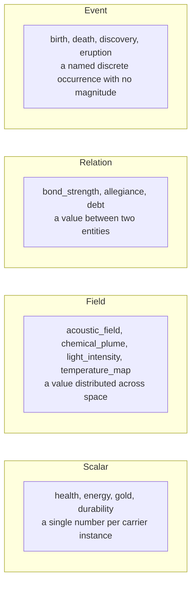
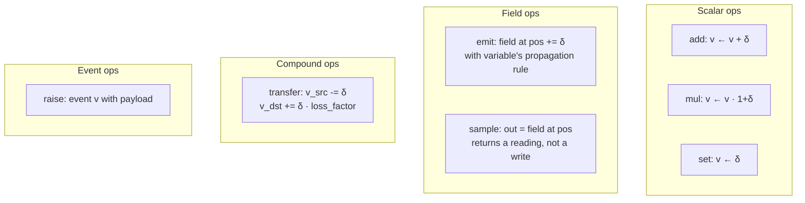
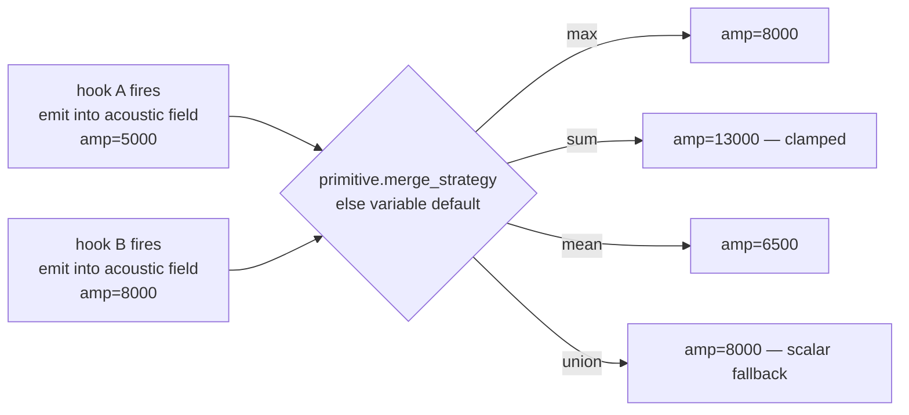

# 04 — Primitives & World Variables

> A **primitive** is a generic operation on a **world variable**. World
> variables are the simulation's state vector — temperature, humidity, health,
> energy, gold, acoustic-field-intensity, position, relationship-bond-strength,
> and anything else the domain declares. Primitives are the atomic
> *mutations* that make variables change.
>
> ```
> Primitive = (id, operation, variable_id, target_kind,
>              cost_function, merge_strategy, pattern_key, provenance)
> ```
>
> There are no fixed primitive categories ("signal_emission", "mass_transfer",
> "bond_formation"). The operation vocabulary is small, closed, and generic.
> The richness comes from the **variable registry**, which is declared per
> domain, not per kernel.

## 1. World variables come first

Before a primitive can exist, the simulation must have a thing for it to
modify. That thing is a **world variable** — a declared piece of simulation
state with a type, range, and semantics.

### World variable registry

Declared by the domain at bootstrap, frozen for the run. Each entry:

| Field | Purpose |
|-------|---------|
| `id` | Unique snake_case identifier (e.g., `temperature_c`, `gold_reserve`, `acoustic_field`). |
| `type` | One of `scalar`, `field`, `relation`, `event`. See §2. |
| `range` | Valid numeric domain (`[min, max]` + units). `scalar` and `field` only. |
| `modality` | Optional — `acoustic | chemical | visual | electric | mechanical | thermal | informational | behavioral | null`. Properties of the *medium*, not the *action*. Carried at the variable level because it's an intrinsic property of what is being modified. |
| `propagation` | How the variable's value spreads or attenuates in space / over agents. Relevant for `field` and `relation`. |
| `carrier_scope` | Whether the variable is global to the world, owned by a carrier type, or owned by a specific carrier instance. |
| `default_merge_strategy` | How multiple primitive emissions against this variable in one tick collapse, if the primitive doesn't override. |
| `provenance` | `core | mod:<id> | genesis:<parent>:<n>`. |

### Four variable types



- **Scalar** — one value per target. Most "stats" are scalars.
- **Field** — values indexed by position. Acoustic pulses, chemical plumes,
  and temperature maps are fields. Fields typically decay with distance and
  sum at overlaps.
- **Relation** — values indexed by a pair of entities. Trust between two
  agents, energetic coupling between host and parasite, debt between buyer
  and seller.
- **Event** — discrete, magnitude-less. Non-numeric occurrences that other
  systems may key off (death, harvest, pact). Events don't use `operation`;
  they're raised with a payload and consumed by event-listening systems.

## 2. The primitive shape

A primitive is:

| Field | Purpose |
|-------|---------|
| `id` | Unique snake_case id referenced by `composition_hooks[].emits`. |
| `operation` | One of `add`, `mul`, `set`, `emit` (into a field at a position), `sample` (from a field to an output), `transfer` (move conserved quantity between targets), `raise` (for event variables). |
| `variable_id` | The world variable this primitive acts on. Must exist in the variable registry. |
| `target_kind` | What resolves the target of the operation: `self`, `other_agent`, `position`, `region`, `relation_pair`, `global`. The composition hook fills in the specific target at emission time. |
| `cost_function` | Economic cost (energy / wear / fiscal / whatever the carrier defines) of emission. Power-law terms against emission magnitude. |
| `merge_strategy` | Per-parameter override of the variable's default merge strategy, if the primitive wants different behavior. |
| `pattern_key` | Opaque string used by the downstream labeler for clustering. |
| `provenance` | `core | mod:<id> | genesis:<parent>:<n>`. |

The primitive does **not** carry modality or detection range — those are
properties of the variable the primitive writes to, not of the operation.
A primitive that emits into `acoustic_field` is acoustic because
`acoustic_field` is acoustic, not because the primitive says so.

### The seven operations



The set is deliberately small. `add / mul / set / emit / sample / transfer /
raise` covers every emission pattern used by the current Beast primitive
vocabulary once categories are removed:

| Old Beast category | Now expressed as |
|--------------------|------------------|
| `signal_emission` | `emit` into a field variable (e.g., `acoustic_field`). |
| `signal_reception` | `sample` from a field variable, writing the reading to a scalar on the sampler. |
| `force_application` | `add` on a `velocity` or `health` variable of the target. |
| `state_induction` | `set` or `add` on a scalar variable of the target. |
| `spatial_integration` | `sample` + `add` combinations; the integration is a property of the channel, not a primitive kind. |
| `mass_transfer` | `transfer` on a mass/substance variable. |
| `energy_modulation` | `add` or `mul` on a `metabolic_rate` or `energy` variable. |
| `bond_formation` | `add` on a relation variable like `bond_strength`. |

Categories disappear. What they used to encode is either a property of the
*variable* (modality, propagation) or a property of the *operation* (emit
vs. sample vs. transfer).

## 3. Tradeoffs: category-free generic primitives vs. fixed vocabulary

| Axis | Variables + generic ops (current) | Fixed 8 categories (previous draft) | Open-ended domain-declared categories |
|------|-----------------------------------|-------------------------------------|----------------------------------------|
| **Domain-agnostic** | ✅ No biology vocabulary in kernel. | ❌ "bond_formation" presumes a social substrate. | Half — kernel is neutral but categories still exist. |
| **New variable cost** | Declare variable → primitives for it fall out naturally. | Must squeeze into one of 8 buckets or add a 9th. | Must declare category + primitive. |
| **Labeler ergonomics** | `pattern_key` + variable modality gives clusters enough signal. | Categories fed straight into the labeler. | Same as current. |
| **Mod authoring** | Mod declares variables + primitives on them; no category choice. | Mod must pick a category, sometimes awkwardly. | Mod declares its own category — easy but noisy. |
| **Kernel complexity** | Slightly more (variable registry is a new concept). | Least. | Medium. |
| **Emergence fit** | Best — no semantic pre-classification. | Worst — categories are a priori. | Middling. |
| **Chosen** | ✅ | ❌ | ❌ |

**Rationale**: the user's framing is stronger than the fixed-vocabulary
design. Every simulation variable *is* something primitives can modify; the
kernel acknowledges that directly instead of forcing effects through an
arbitrary category enum.

## 4. Parameter mapping

Composition hooks fill in primitive emission parameters using fixed-point
expressions over channel values. The expression language is purely
functional (channel reads, constants, Q32.32 arithmetic). Example:

```
emits: [{
  primitive_id: "emit_into_acoustic_field",
  parameter_mapping: {
    "amplitude": "ch[vocal_amplitude]",
    "frequency": "ch[vocal_frequency] * 20000",
    "position":  "self.position"
  }
}]
```

The primitive's `operation` and `variable_id` are fixed by the primitive
manifest; the hook supplies the operation's **magnitude** and **target**.

Constraints:

1. Typed expressions; result types must match primitive parameter types.
2. Range-checked at emit time using the variable's own range.
3. No side effects; pure channel reads and arithmetic.

## 5. Cost function

`cost(parameters) = base_cost + Σ coefficient_i · (parameter_i ^ exponent_i)`

Who pays the cost is a **carrier-level** concern (see
[02 §7](02_carriers.md)): a genome pays into a `metabolic_energy` variable,
equipment pays into `durability`, a settlement pays into `treasury`. The
*formula* lives on the primitive; the *accounting* is the carrier's.

## 6. Merge strategy

When two composition hooks emit the same primitive in one tick:



Merge strategies (`sum`, `max`, `mean`, `union`) are associative and
commutative so order of collapse doesn't affect the result (see
[08 §4](08_determinism.md)).

Lookup order at emission time:

1. Primitive's per-parameter `merge_strategy` if declared.
2. Variable's `default_merge_strategy`.
3. Hard default: `max`.

## 7. Pattern keys and the labeler

Primitives carry a `pattern_key` string that the downstream labeler (Beast's
Chronicler) uses to recognize recurring emission clusters. The kernel
produces primitives; the labeler looks at `(pattern_key, variable_id,
target_kind, emission_frequency)` tuples and assigns names after the fact.
The kernel never sees a name.

## 8. Compatibility

Since there are no channel families and no primitive categories, there is
no family-to-category compatibility check. The remaining constraint is
simpler:

- A channel declares which primitives it can emit (by id) in its composition
  hooks.
- A primitive declares which carrier types are legal emitters (optional; omit
  to mean "any").
- The variable registry constrains what the primitive can write to.

Invalid combinations are rejected at load time.

## 9. Invariants

1. **Variable registry frozen at bootstrap.** Genesis may append new
   variables between ticks, like any other manifest kind.
2. **Closed operation set.** `add / mul / set / emit / sample / transfer /
   raise` are kernel-defined. New operations require a kernel update.
3. **No categories.** Primitives do not classify themselves; classification
   is a *labeler* concern.
4. **Variable-sourced modality.** Modality and propagation come from the
   variable, not the primitive.
5. **Emergence closure.** Every observable world change traces back to a
   primitive acting on a variable, or to a drift operator acting on a
   channel. No bypass.
   See [`INVARIANTS.md §4`](../INVARIANTS.md).
6. **Parameter expressions pure.** No side effects, no PRNG in parameter
   mapping.

## 10. Beast-domain mapping (for migration planning)

The current Beast schema's 16 starter primitives map onto variables +
operations as follows (representative sample — full mapping is a future
migration doc):

| Current Beast primitive | Variable (proposed) | Operation |
|-------------------------|---------------------|-----------|
| `emit_acoustic_pulse` | `acoustic_field` (field, acoustic modality) | `emit` |
| `receive_acoustic_signal` | `acoustic_field` + carrier's `perceived_acoustic` scalar | `sample` → `set` |
| `apply_bite_force` | target's `health` (scalar) | `add` (negative) |
| `induce_paralysis` | target's `movement_capability` (scalar) | `set` to 0 |
| `inject_substance` | target's `toxin_load` (scalar) | `transfer` from self |
| `elevate_metabolic_rate` | self's `metabolic_rate` (scalar) | `mul` |
| `form_pair_bond` | `bond_strength` (relation) | `add` |

No information is lost in the mapping; the "category" was always a soft
classification of *what variable it touches and how*, and those two questions
are now first-class.

## 11. Open questions

- Should fields support *shapes* (radial, directional cone, linear beam) at
  the variable level, or is the propagation function enough? Directionality
  is a biggie for acoustic / visual — leaning toward adding a `propagation`
  sub-schema.
- Do we want a `read-only` variable type for things like `biome_id` that are
  set by the environment and never written by a primitive? Currently covered
  by constraining which primitives can write to a variable.
- Should `transfer` enforce conservation (what leaves `src` equals what
  enters `dst` minus a loss factor), or is it a convenience alias for two
  `add`s? Leaning conservation-enforced, with loss_factor declared on the
  variable.
