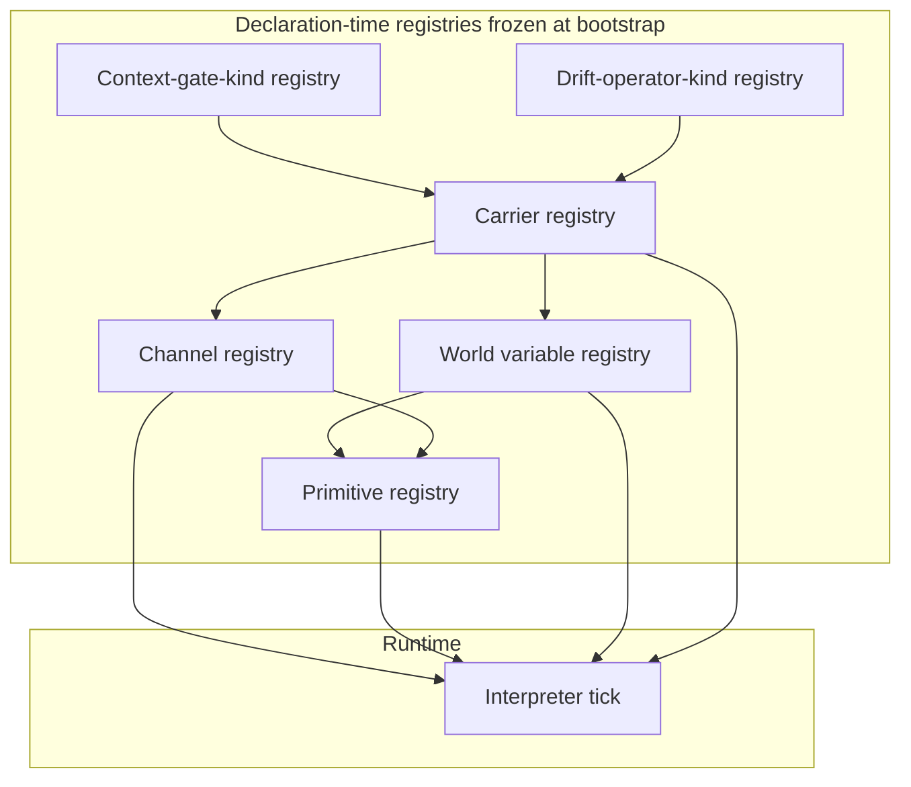
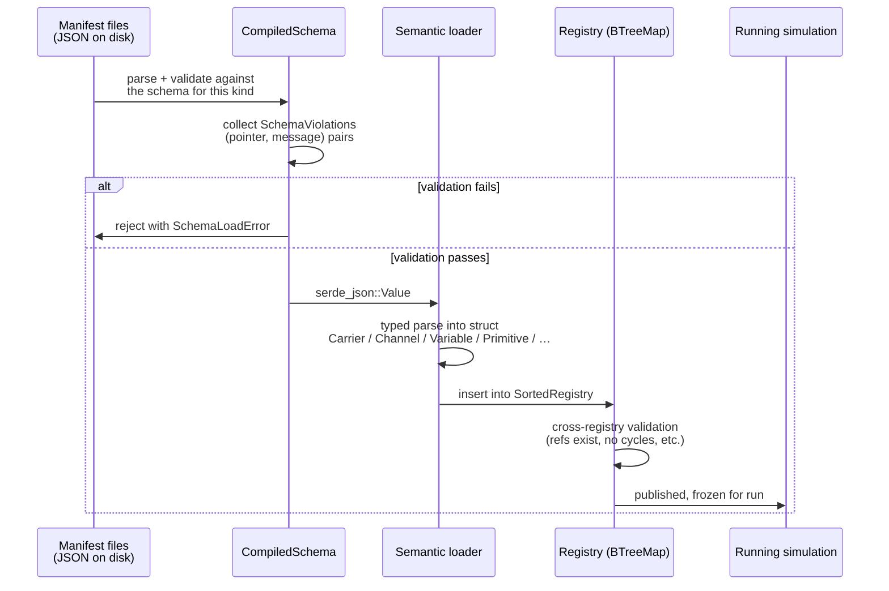
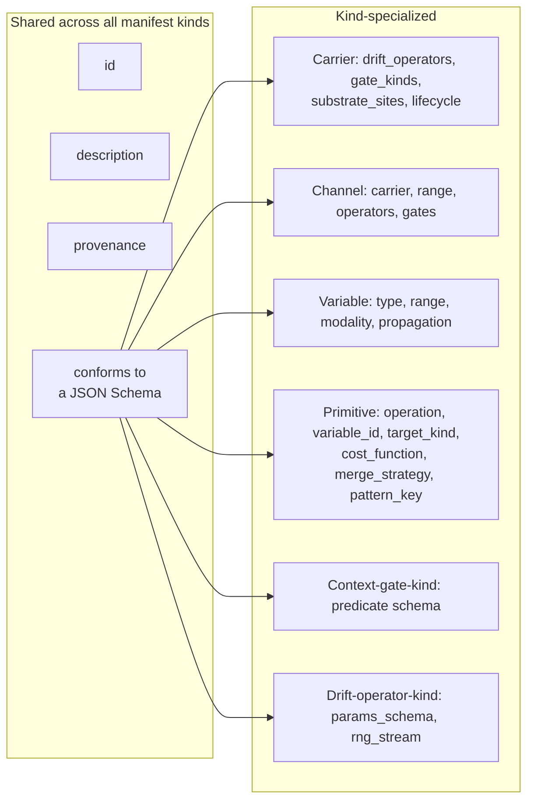

# 05 — Registries & Manifests

> **Manifests** are validated JSON documents that declare carriers, channels,
> world variables, primitives, context-gate kinds, and drift-operator kinds.
> **Registries** are the in-memory, deterministically-ordered stores that hold
> them at runtime.
>
> The kernel treats registries as the single source of truth at every tick. No
> system code may hardcode a channel id, variable id, primitive id, or carrier
> name: all references go through the registry. This is the formal
> expression of the **Channel Registry Monolithicism** invariant
> ([`INVARIANTS.md §3`](../INVARIANTS.md)) — generalized to every kernel
> manifest kind.

## 1. The six kernel registries



Six concepts, six registries. They load in dependency order:

1. **Carrier registry** — each carrier declares permitted drift kinds and
   gate kinds.
2. **Context-gate-kind registry** — the set of gate kinds the kernel +
   mods know about. Carriers reference this.
3. **Drift-operator-kind registry** — same story for drift operators.
4. **World variable registry** — the simulation's state variables; primitives
   operate on these.
5. **Channel registry** — channels, each bound to a carrier.
6. **Primitive registry** — primitives, each bound to a variable.

Load order matters: a channel referencing a carrier that isn't registered
is rejected; a primitive referencing a variable that isn't registered is
rejected.

## 2. The two-stage loader

Unchanged from the previous draft and from the existing `beast-manifest`
crate. Applies identically to every manifest kind above.



**Cross-registry validation** is the new step. Examples:

- A channel's `carrier` must be in the carrier registry.
- A channel's drift operator kinds must be permitted by its carrier.
- A channel's context-gate kinds must be permitted by its carrier.
- A primitive's `variable_id` must be in the variable registry.
- A composition hook's `emits[].primitive_id` must be in the primitive
  registry.

Every cross-reference is resolved once at load; runtime lookups are
constant-time.

## 3. Registry contract

```
Registry<M: Manifest> {
    by_id: BTreeMap<Id, M>,
    by_group: BTreeMap<GroupKey, Vec<Id>>,    // "group" here = carrier, variable_type, gate_kind_family, ...
    provenance_index: BTreeMap<Provenance, Vec<Id>>,
}
```

| Operation | Complexity | Determinism |
|-----------|------------|-------------|
| `get(id)` | O(log n) | ✅ |
| `iter()` | O(n) in id order | ✅ |
| `iter_group(g)` | O(log g + k) | ✅ |
| `sample_weighted(g, &mut rng)` | O(k) | ✅ — depends on injected stream |
| `insert(m)` | O(log n); rejects duplicate id | ✅ |
| `freeze()` | O(1); seals for run | — |

`BTreeMap` for every index ensures deterministic iteration (see
[08](08_determinism.md)).

## 4. Provenance

Every registry entry carries a provenance string matching
`^(core|mod:[a-z_][a-z0-9_]*|genesis:[a-z_][a-z0-9_]*:[0-9]+)$`:

| Class | Meaning | Mutability |
|-------|---------|------------|
| `core` | Shipped with the kernel / domain core. | Immutable across runs. |
| `mod:<mod_id>` | Registered by a loaded mod. | Immutable once loaded. |
| `genesis:<parent>:<generation>` | Created at runtime by a genesis event. | Immutable after creation; persists in saves. |

Provenance applies to **every** registry kind, not just channels. A mod can
introduce a new world variable, a new carrier type, a new drift kind, a new
gate kind — all with `mod:<mod_id>` provenance.

## 5. Monolithicism, re-examined

| Option | Pros | Cons | Chosen |
|--------|------|------|--------|
| **Six monolithic registries, one per kind** (current) | One source of truth per concept; unambiguous lookups; clean save format. | Slightly more registry plumbing than a single global one. | **Yes** |
| Per-carrier sharded channel registry | Carrier isolation; one carrier's load failure doesn't corrupt another. | Cross-carrier queries (how many channels total?) become awkward; breaks single-source-of-truth rule. | No. |
| One mega-registry with a `kind` discriminator | Absolute minimum plumbing. | All queries filter by kind; type safety is lost. | No. |

**Decision**: per-kind monolithic. Channels are keyed by
`(carrier_id, channel_id)`, giving the carrier-level namespacing from
[02 §3](02_carriers.md) without fragmenting the registry.

## 6. Sorted iteration (recap)

BTreeMap-backed registries + sorted entity keys are load-bearing for
determinism. `HashMap<String, _>` is forbidden. Parallel iteration
distributes contiguous index ranges to workers, never hash-sharded work.
See [08 §2.3](08_determinism.md).

## 7. Shared manifest fields

Four fields are universal across every manifest kind:



The universal fields let the `beast-manifest` crate provide one `Manifest`
trait and one generic `SortedRegistry<M: Manifest>`.

## 8. Invariants

1. **Schema-first.** Every manifest kind has a checked-in JSON Schema;
   loading without validation is forbidden.
2. **Id uniqueness per registry.** Channel ids are unique within a carrier;
   variable ids, primitive ids, carrier ids, gate-kind ids, drift-kind ids
   are each globally unique within their registry.
3. **Monolithic at runtime.** One registry per kind. Six registries total.
4. **Frozen after bootstrap.** `freeze()` is called before tick 0; only
   genesis events may append entries, and only between ticks.
5. **Sorted iteration.** BTreeMap ordering everywhere; no `HashMap`.
6. **Provenance canonical.** Provenance strings match the regex verbatim.
7. **Cross-registry refs resolved at load.** No runtime dangling id.

## 9. Mod interactions

Mods are loaded in stable sort order of mod ids. For each mod:

1. Parse mod metadata (id, version, load_order).
2. Load each manifest, assign provenance `mod:<mod_id>`.
3. Insert into the right registry; reject on id collision.
4. After all mods are loaded, run cross-registry validation.
5. Freeze.

A mod can declare a **new carrier type** (e.g., an `airship` carrier with
its own drift kinds and gate kinds) — the carrier registry is the
extensibility point that lets domains proliferate without touching the
kernel.

## 10. Open questions

- Should we support manifest versioning in-band (a `manifest_version` field)
  for future schema migrations, or rely on the schema file's git tag?
  Currently the latter.
- For genesis events, do we record the *full* derivation chain on child
  entries (parent_id → ancestors), or only the immediate parent? Today
  only immediate.
- Should registries expose a read-only trait object that hides the concrete
  `BTreeMap` so downstream crates can't accidentally mutate? Tightens
  layering at the cost of a small indirection.
