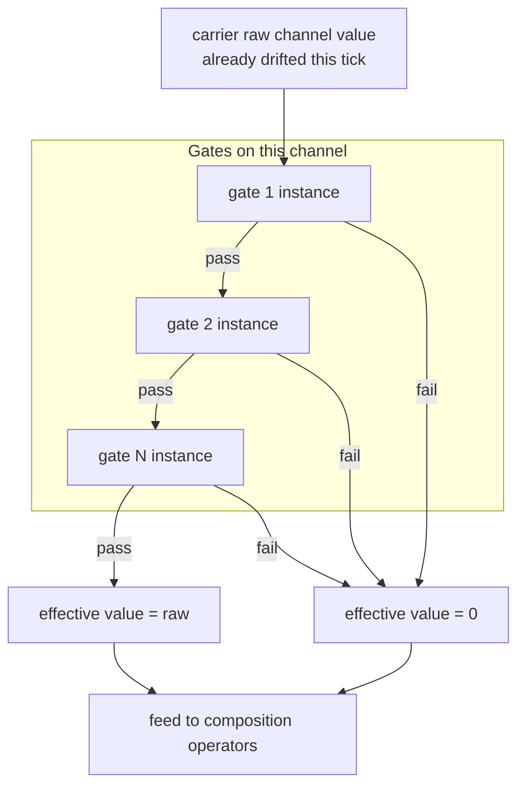
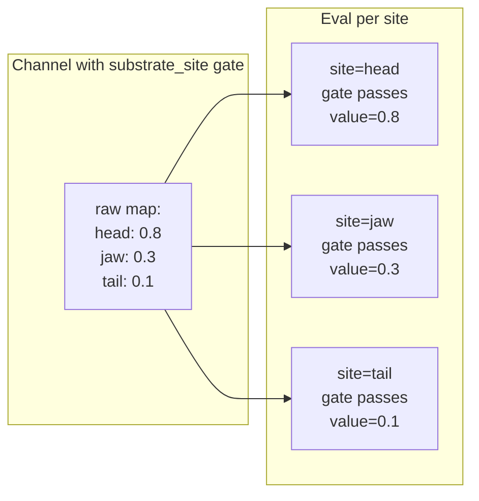
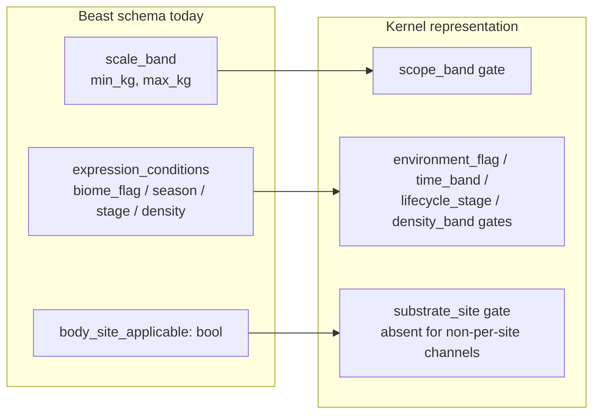

# 06 — Context Gates

> **Context gates** are the unified "when and where does this channel apply"
> abstraction. Gates are the *only* mechanism for conditional channel
> activation in the kernel. Scope-band gates, expression-condition gates, and
> substrate-site gates are all gate kinds — there is no separate
> `scale_band` or `body_site_applicable` field.
>
> A gate is a pure predicate over *(carrier instance, environment, tick,
> site?)*. If all gates on a channel pass, the channel is **active** and its
> raw value becomes the effective value; if any gate fails, the channel is
> **dormant** and its effective value is `0`.

## 1. What a gate is

A context gate is registered in the gate-kind registry (see
[05 §1](05_registries_and_manifests.md)) with:

| Field | Purpose |
|-------|---------|
| `kind_id` | e.g., `biome_flag`, `season`, `scope_band`, `substrate_site`. |
| `predicate_schema` | Typed parameters the gate instance carries (e.g., `min_kg / max_kg` for a scope_band gate). |
| `permitted_carriers` | Which carriers may use this gate kind (see [02 §2](02_carriers.md)). |
| `evaluation_order_hint` | Optional — cheap gates first so the short-circuit is efficient. |

Channels attach *instances* of gate kinds, supplying the parameter values.
Multiple gate instances on one channel are **AND-combined**; any failure
makes the channel dormant.

## 2. Gate evaluation

Evaluation is short-circuit AND. Gates are **pure predicates**: no RNG, no
side effects, no wall-clock.

## 3. Kernel-shipped gate kinds

The kernel ships a small set; domains register more. Each kind is generic
and carrier-agnostic.

| Kind | Parameters | Predicate |
|------|-----------|-----------|
| `scope_band` | `min_magnitude`, `max_magnitude`, `units` | Is the carrier instance's *magnitude* in range? (Body mass for creatures, mass for equipment, population for settlements, …) |
| `substrate_site` | `site_id` (or `sites: [id, id, …]`) | Is the current evaluation context at one of the declared substrate sites? |
| `environment_flag` | `flag: string` | Is the named flag set on the current environment? (Biome flags, cultural flags, fiscal flags — meaning is domain-supplied.) |
| `time_band` | `min`, `max`, `unit: season/tick/year/…` | Is the current simulated time in this band? |
| `lifecycle_stage` | `stage_id` | Is the carrier instance in this lifecycle stage? |
| `density_band` | `min_per_unit`, `max_per_unit`, `unit` | Is the local density in this range? (Population density, market density, …) |
| `variable_threshold` | `variable_id`, `min`, `max` | Does the value of a named world variable fall in range for this target? Generalizes "when X is high" gating. |
| `always` | — | Tautology; lets a channel declare no real gates without leaving the array empty. |

### Key change from earlier draft

There is no standalone `body_site_applicable: bool` or `scale_band:
{min_kg, max_kg}` field on channels. Both are expressed as gates:

- To make a channel per-site: attach a `substrate_site` gate listing the
  sites where it applies.
- To restrict a channel by magnitude: attach a `scope_band` gate.

A channel with no gates is **always active** — equivalent to the old `always`
behavior.

## 4. Substrate-site gates — semantics

When a channel carries a `substrate_site` gate, its raw value on the
carrier is a `{site_id → value}` map (not a single scalar). At evaluation
time, the interpreter walks substrate sites in sorted order; the gate picks
the site-specific value, and composition runs per-site.

Channels without a `substrate_site` gate are site-agnostic scalars. This
cleanly subsumes the old `body_site_applicable: bool` flag.

## 5. Tradeoffs: one gate family vs. three fields

| Axis | Unified gate family (current) | Three separate fields (old: `scale_band`, `expression_conditions`, `body_site_applicable`) |
|------|-------------------------------|---------------------------------------------------------------------------------------------|
| **Schema clarity** | One array of gate instances. | Three separate fields with special cases. |
| **Extensibility** | Add a gate kind; no schema change. | Add a new field for each new condition kind. |
| **Cross-domain reuse** | Same gates work for equipment, settlements, economies. | Field names leak biology vocabulary. |
| **Verbosity** | Slightly more per channel (every gate is explicit). | Slightly less. |
| **Chosen** | ✅ | ❌ |

## 6. Dormant vs. silenced vs. lost

A context gate produces **dormant** channels — passively inactive because the
situation doesn't call for them. This is distinct from:

| State | Cause | Transitions back? |
|-------|-------|-------------------|
| **Active** | All gates pass; effective value = raw value. | — |
| **Dormant** | A gate fails this tick. | Yes — automatically when gates pass again. |
| **Silenced** | A composition operator forces the effective value to zero. | Yes — when the triggering condition lifts. |
| **Lost** | The channel is not transmitted to a successor carrier instance. | No — must re-acquire via genesis or equivalent. |

Dormant channels persist in save files (raw value preserved). Silenced
channels persist (they are merely producing zero at this moment). Lost
channels are absent.

## 7. Invariants

1. **AND semantics.** All gates pass → active. Any failure → dormant.
2. **Dormant = effective 0, not missing.** Downstream operators receiving
   0 from any operand produce 0. Never an error.
3. **Pure predicates.** No side effects, no PRNG, no wall-clock.
4. **Gate kinds closed per run.** The set of permitted gate kinds is frozen
   at bootstrap (via the gate-kind registry).
5. **Substrate sites closed per run.** The enumeration of site ids per
   carrier is declared at bootstrap (via the carrier registry).
6. **Evaluation order irrelevant to result.** AND is commutative; the
   short-circuit is a performance optimization only.
7. **Carrier permits the gate kind.** A channel cannot use a gate kind its
   carrier does not permit; rejected at load.

## 8. Beast-domain mapping

Today the Beast schema uses three separate fields:

Migration is a pure JSON transformation (a single schema migration pass
can automate it when we're ready); semantics are preserved.

## 9. Open questions

- Should gate kinds support a `strength` parameter (probability of
  activation) rather than being strict Boolean? This would enable soft
  gating but introduces RNG into composition — current answer: no, gates
  are strict, stochasticity lives in drift operators.
- Is there a use case for *meta-gates* (a gate that checks "does another
  channel pass its gates")? Expressible via `variable_threshold` on a
  variable the other channel writes; leaning "do not add a dedicated kind".
- Should gate kinds be allowed to declare dependencies on world variables,
  enabling "gate this channel when temperature > 30°C" without a carrier
  state probe? `variable_threshold` already does this; may rename for
  clarity.
