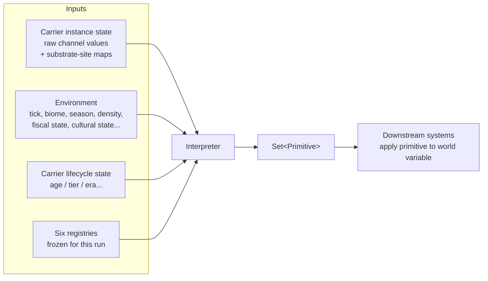
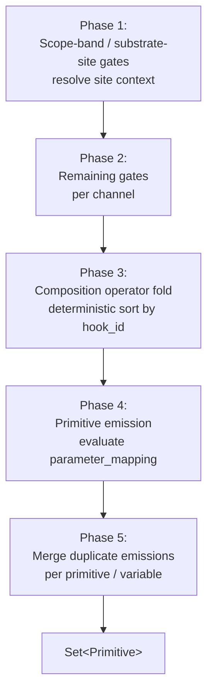
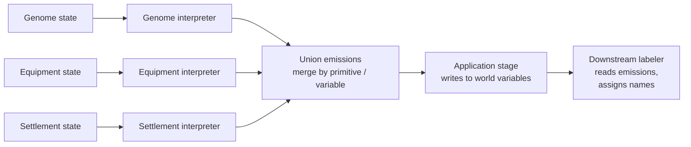

# 07 — The Interpreter Interface

> An **interpreter** is a pure function that converts a carrier instance's
> state + environment into a deterministic set of primitive emissions, using
> the six kernel registries as its rulebook.
>
> ```
> interpret(
>     carrier_instance,
>     env,
>     registries: (Carrier, GateKind, DriftKind, Variable, Channel, Primitive)
> ) → Set<Primitive>
> ```
>
> The interpreter has no mutable state of its own. It does not drift
> channels (drift is a separate pre-tick stage — see
> [03 §3](03_operators_and_composition.md)); it does not register new
> manifests (registries are frozen). It reads carrier state, reads environment,
> reads registries, and emits primitives.

## 1. Contract

| Property | Rule |
|----------|------|
| **Purity** | Same inputs → same outputs. No hidden state, no wall-clock, no OS RNG. |
| **Determinism** | Bit-identical output across runs, platforms, and replays. |
| **Totality** | For every valid input, returns a (possibly empty) set of primitives. Never panics on dormant channels, empty variables, or unrecognized ids. |
| **Read-only inputs** | Does not mutate carrier state, env, or registries. |
| **Registry-driven** | All branching is by registry lookup. No hardcoded ids, no named-ability checks. |
| **Composable** | Interpreters for different carriers (genome, equipment, settlement) are composed by unioning their outputs under per-variable merge strategies. |

## 2. Input surface



Carrier state and environment shapes are domain-supplied; the interpreter
reads them through typed adapters. The kernel is agnostic to whether a
carrier is a `Genome`, an `ItemInstance`, or a `SettlementRecord`.

## 3. Execution order

Five ordered phases. Order is part of the contract.



**Phase 1** — Resolve the site context. If a channel carries a
`substrate_site` gate, iterate sites in sorted order; if not, evaluate
once site-agnostically. Scope-band gates run here to zero out whole-carrier
dormant channels cheaply. This corresponds to
[`ECS_SCHEDULE.md` Stage 2a](../architecture/ECS_SCHEDULE.md).

**Phase 2** — Evaluate remaining context gates per channel. Dormant → 0.

**Phase 3** — Sort composition hooks by id; fold operators to produce
effective channel values.

**Phase 4** — For each hook with an `emits` list, evaluate parameter-mapping
expressions in Q32.32, range-clamp against the target variable's range, and
produce a `PrimitiveEffect` instance.

**Phase 5** — Merge per primitive id and per world-variable id using the
lookup order from [04 §6](04_primitives.md): primitive's explicit
`merge_strategy` → variable's `default_merge_strategy` → `max`.

## 4. Output shape

Each emission is a deterministic struct:

| Field | Description |
|-------|-------------|
| `id` | Instance id, unique within this tick. |
| `primitive_id` | Registry id of the primitive. |
| `variable_id` | Target world variable (copied from the primitive manifest for convenience). |
| `operation` | `add / mul / set / emit / sample / transfer / raise`. |
| `target` | Resolved target reference: entity id, position, relation pair, or global. |
| `parameters` | Final parameter map (after merging). |
| `cost` | Computed from the primitive's cost function. |
| `pattern_key` | For the downstream labeler. |
| `source_channels` | Channels that drove this emission (provenance for the labeler). |

Downstream systems consume this set and **apply** each emission to the
world (write to the variable, raise the event, sample and store the read).
The interpreter itself never writes to world state.

## 5. What the interpreter must not do

| Forbidden | Why |
|-----------|-----|
| Mutate carrier state | Purity. |
| Mutate world variables | Application is a separate stage. |
| Mutate registries | Monolithicism. |
| Advance raw channel values | Drift is a separate stage. |
| Call an OS RNG | Determinism. |
| Branch on channel or primitive *names* | Mechanics-Label Separation. |
| Emit a primitive not in the registry | Emergence closure. |
| Iterate an unordered map | Sorted-iteration rule. |
| Use floating-point arithmetic | Determinism. |

## 6. Tradeoffs: pure registry-driven vs. alternatives

| Axis | Pure registry-driven (current) | In-interpreter special cases | Hybrid with scripted hooks |
|------|-------------------------------|------------------------------|-----------------------------|
| **Expressiveness** | Everything expressible via operators + primitive ops. | Full Rust power. | Mostly declarative + escape hatch. |
| **Determinism** | Strong by construction. | Fragile. | Script determinism is a separate audit surface. |
| **Performance** | Highly optimizable (data-oriented). | Varies. | VM overhead per hook. |
| **Moddability** | Manifests only; no code. | None without recompile. | Scripts let mods add logic. |
| **Debuggability** | Emissions carry source_channels; trace is a registry walk. | Ad-hoc. | Stack traces complicate tracing. |
| **Chosen** | ✅ | ❌ | ❌ (for now) |

## 7. Composition across carriers

Multiple carriers coexist on the same sim tick. Their interpreters run
independently; the resulting primitive sets are unioned and collapsed by
variable-level merge strategy:



This is the primary payoff of the abstraction: three different carriers
share one variable registry, one operation vocabulary, and one labeler.

## 8. Invariants

1. **Determinism.** Same inputs, same output.
2. **Purity.** No mutation of inputs.
3. **Registry-driven branching.** See §5.
4. **Phase ordering.** Five phases in the order in §3.
5. **Fixed-point arithmetic.** See [08](08_determinism.md).
6. **Merge strategy per primitive then per variable.** See [04 §6](04_primitives.md).
7. **Primitives only.** No labels, no name strings. See
   [`INVARIANTS.md §4`](../INVARIANTS.md).

## 9. Beast-domain reference

The Beast implementation in
[`systems/11_phenotype_interpreter.md`](../systems/11_phenotype_interpreter.md)
becomes an instance of this interface with:

- Carrier = `Genome`
- Environment = `{biome, season, density, tick, developmental_stage}`
- Registries = all six kernel registries
- Adapter: exposes channel values and site maps through the generic reader

Everything else — operator semantics, merge strategy, emission shape — is
kernel-level and identical across carriers.

## 10. Open questions

- Should the interpreter expose a **streaming** mode (emit lazily) for very
  large carriers? Today the largest carrier has ≤20 active channels, so
  batch suffices.
- Do we provide a **dry-run** entry point (compute emissions without
  registering cost) to let the UI preview behavior? Useful for bestiary
  previews; may leak information.
- Should merge strategies be specializable by mods? Currently the strategy
  set is fixed (`sum`/`max`/`mean`/`union`); new strategies must be
  associative + commutative.
