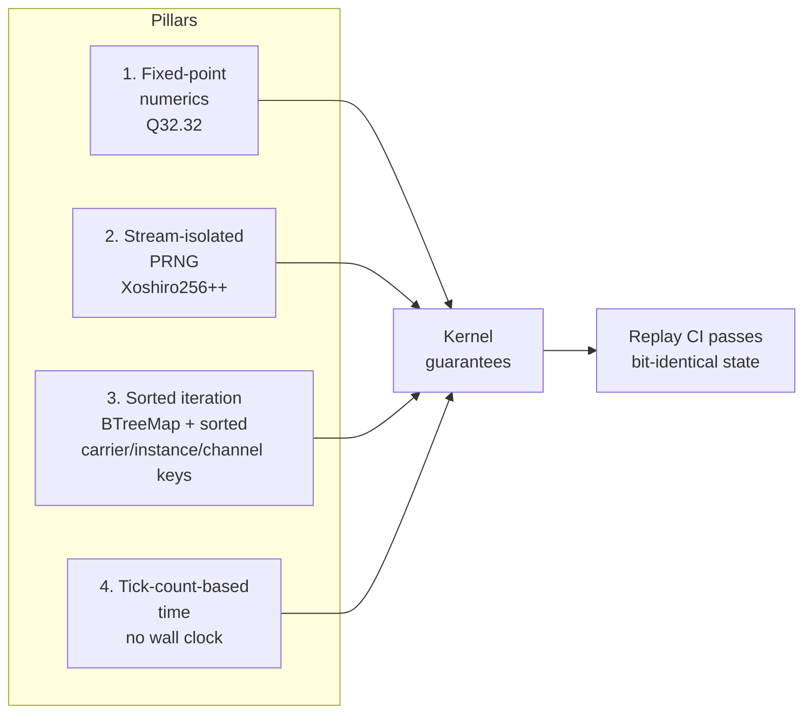

# 08 — Determinism Substrate

> Determinism is not a feature of the kernel — it is the substrate on which
> every other core-model abstraction depends. This page consolidates the
> numerical, stochastic, and iteration-order guarantees that every channel,
> carrier, operator, variable, primitive, registry, and interpreter assumes.
>
> Authoritative source: [`INVARIANTS.md §1`](../INVARIANTS.md). This page
> restates the *kernel-level* commitments only.

## 1. What "deterministic" means here

> **Given the same initial state, the same seeds, and the same input journal,
> the simulation produces bit-identical state at every tick on every platform
> and every build.**

Stronger than "reproducible on average" or "statistically stable". It is a
CI gate; it is what lets replays, multiplayer, modding, and bug reports
work.

## 2. The four pillars



### 2.1 Fixed-point numerics

- All channel values, drift-operator intermediates, composition
  intermediates, parameter-mapping expressions, and primitive emission
  magnitudes use **Q32.32** (`fixed::I32F32`).
- Arithmetic is **saturating**, not wrapping. Overflow clamps to Q32.32
  bounds.
- **Floating-point is forbidden in sim state.** UI/render layers may convert
  for display; logic that affects save state never may.

### 2.2 Stream-isolated PRNG

- Every subsystem that needs randomness owns exactly one
  Xoshiro256PlusPlus stream.
- Streams are **seeded once** at world creation via a splitting scheme
  (root seed + per-subsystem `jump()` calls advancing by 2^128).
- No stream is read twice for the same decision. No stream is shared across
  subsystems. No OS RNG anywhere.
- PRNG state is part of the save file; loading restores state exactly.

Drift operators declare which PRNG stream they draw from (see
[03 §3](03_operators_and_composition.md)). The interpreter itself is pure
and uses no streams.

| Kernel-relevant stream | Consumed by |
|------------------------|------------------|
| `rng_evolution` | Drift operators on genome carriers (Gaussian mutation, genesis). |
| `rng_input` | Random world events. |
| `rng_physics` | Stochastic collision outcomes. |
| `rng_combat` | Tie-break rolls in interaction resolution. |
| `rng_ecology` | Migration, extinction, speciation. |

Domain-declared drift operators may declare their own streams; all streams
are descendants of the root seed via `jump()` splits.

### 2.3 Sorted iteration

- Every registry is backed by `BTreeMap` (see
  [05](05_registries_and_manifests.md)).
- Every carrier-instance loop iterates over sorted `instance_id` order.
- Every channel loop iterates over sorted `(carrier_id, channel_id)`
  pairs.
- Every substrate-site loop iterates over sorted `site_id`.
- Parallel work is distributed by contiguous index ranges over the sorted
  order — never hash-sharded, never work-stealing across workers in a way
  that reorders effects.
- `HashMap` iteration is forbidden in any code whose output affects sim
  state.

### 2.4 Tick-count-based time

- All scheduling decisions use the monotonic tick counter.
- Wall-clock reads (`Instant::now`, `SystemTime::now`) are permitted only
  for profiling/logging, never for control flow.

## 3. Determinism and the pipeline

Each pillar maps onto a pipeline stage:

| Stage | Pillar concern |
|-------|----------------|
| Drift (between-tick) | Q32.32 + declared PRNG stream + sorted channel iteration. |
| Scope-band / substrate-site gate | Integer comparisons; sorted site iteration. |
| Context gates | Pure predicates; no RNG. |
| Composition operator fold | Sorted by hook_id; saturating Q32.32; no parallel reduction within one channel. |
| Primitive emission | Parameter expressions in Q32.32; variable range clamp. |
| Merge | Associative + commutative strategies only. |
| Application to world variables | Writes happen after merge; sorted by (variable_id, target). |

A violation is caught by the CI replay test, which reports the first
diverging tick, the first diverging carrier instance, and a per-field diff.

## 4. Merge determinism

Merge strategies must be associative and commutative so that the order of
collapse does not affect the result:

```mermaid
flowchart LR
    subgraph Associative & commutative ✅
      sum[sum: a+b+c = c+b+a]
      max[max: order-invariant]
      mean[mean: sum/count, order-invariant]
      union[union: set union]
    end
    subgraph Forbidden — non-commutative ❌
      first[first-emitter-wins]
      last[last-emitter-wins]
      ordered[weighted-by-emission-order]
    end
    first --> X[rejected]
    last --> X
    ordered --> X
    style X fill:#7f1d1d,color:#fff
```

Any new merge strategy must prove associativity + commutativity (or declare
the parameter as set-valued and use `union`).

## 5. Tradeoff matrices

### Why Q32.32?

| Option | Precision | Speed | Determinism | State | Chosen? |
|--------|-----------|-------|-------------|-------|---------|
| **Q32.32 (`fixed::I32F32`)** | ~2.3e-10 | Native 64-bit ops | ✅ | 64 b | **Yes** |
| Q16.16 | ~1.5e-5 | Native 32-bit | ✅ | 32 b | Too coarse for cumulative mutation. |
| f32 | 23 bits | Native | ❌ cross-platform | 32 b | Forbidden in sim state. |
| f64 | 52 bits | Native | ❌ same issue | 64 b | Forbidden. |
| Arbitrary precision | Unbounded | Slow (GMP) | ✅ | Variable | Overkill. |
| Hand-rolled | Configurable | Fastest | ⚠️ risky | Variable | Risky. |

### Why Xoshiro256++?

| PRNG | Cryptographic | Speed | State | Period | Jump/split | Chosen |
|------|---------------|-------|-------|--------|------------|--------|
| **Xoshiro256++** | No | ~20 cyc | 256 b | 2^256-1 | ✅ | **Yes** |
| MT19937 | No | ~200 cyc | ~20 kb | 2^19937-1 | ❌ | Too big, slow. |
| ChaCha20 | Yes | ~100 cyc | 512 b | ∞ | ❌ | Overkill, no jump. |
| SFC64 | No | ~10 cyc | 256 b | 2^256-1 | ❌ | No jump. |

## 6. Invariants (authoritative subset)

1. All kernel arithmetic runs in Q32.32 fixed-point.
2. All PRNG use is through Xoshiro256++ streams seeded once per subsystem.
3. All iteration over carriers, instances, channels, variables, primitives,
   substrate sites is sorted.
4. All timing is tick-count-based.
5. No `HashMap` ordering leaks into sim state.
6. No `std::time::Instant`, no `std::time::SystemTime` in control flow.
7. Merge strategies are associative and commutative.
8. Drift precedes interpretation; interpretation never advances raw values.

## 7. CI enforcement

The determinism gate ships once `beast-sim` lands (S6):

```
cargo test --test determinism_test -- --nocapture
```

On failure the test reports:

1. First diverging tick.
2. First diverging carrier instance.
3. Per-field diff.
4. PRNG stream state at that tick for every subsystem.

Investigation order: **numerical precision → PRNG seeding → iteration
order**.

## 8. Open questions

- Should we provide a `DeterministicFloat` feature-gated alternative for
  prototyping? Leaning absolute-no-float.
- Can we add a compile-time marker trait that forbids a function from
  touching non-deterministic types? Costs ergonomics.
- Should we ship a fuzz harness that permutes iteration order and checks
  output hash stability, catching regressions in parallel code paths?
