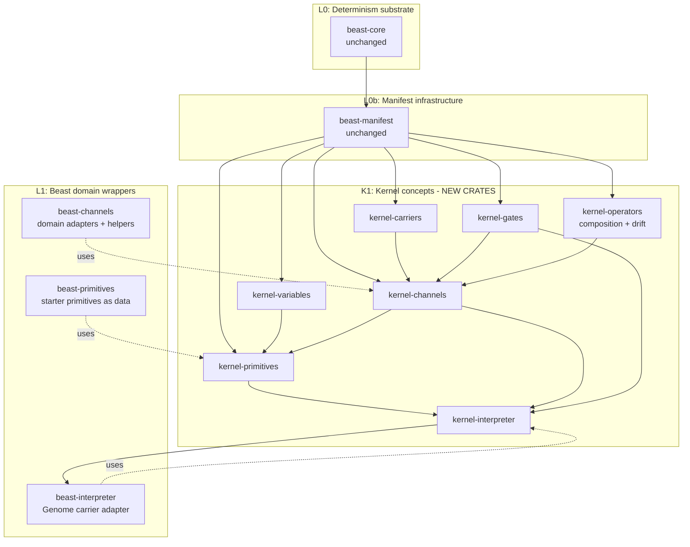

# 09 — Crate Blueprint: Extracting the Kernel

> The forward-looking blueprint for splitting a domain-neutral kernel out of
> the existing beast crates. It does **not** propose a refactor today — the
> current workspace (S1 + S2 shipped) is fine. It does ensure that when a
> refactor is desirable, the split lines are obvious and no rewrite is
> required.

## 1. Current state (April 2026)

| Crate | Core-model pages it implements today | Beast-specific content |
|-------|--------------------------------------|------------------------|
| `beast-core` | [08](08_determinism.md) | None — this is already kernel. |
| `beast-manifest` | [05](05_registries_and_manifests.md) | None — this is already kernel. |
| `beast-channels` | [01](01_channels.md), [03](03_operators_and_composition.md), [06](06_context_gates.md) | The nine biological family values (to be removed as a schema concept in the migration); kg-specific `scale_band`. |
| `beast-primitives` | [04](04_primitives.md) — partially | The eight primitive categories (to be replaced by the world-variable registry); the 16 starter primitives (to be reshaped into ops-on-variables). |
| `beast-interpreter` | [07](07_interpreter.md) | Genome-specific adapter; body-region resolution. |

Two crates are entirely kernel already. Three crates are kernel plus a small
beast-specific layer glued on.

## 2. The concept-to-crate map after revision

The revision shifts several concepts around compared to the previous draft:

| Concept | Where it lives now | Where it lives after the kernel split |
|---------|--------------------|---------------------------------------|
| Determinism substrate | `beast-core` | `beast-core` (no change). |
| Manifest loader + registry | `beast-manifest` | `beast-manifest` (no change). |
| Channels | `beast-channels::manifest` | `kernel-channels`. |
| Carriers | **Not yet modeled in code** — today every channel is implicitly on the genome. | `kernel-carriers` (new concept, new crate). |
| Composition operators | `beast-channels::composition` | `kernel-operators`. |
| Drift operators | **Today lives in evolution code** (mutation is a system on genome). | `kernel-operators` — drift becomes a first-class operator kind. |
| Context gates | `beast-channels::expression` + parts of `beast-channels::manifest` | `kernel-gates`. |
| World variables | **Not yet modeled** — today the 8 primitive categories implicitly carry this info. | `kernel-variables` (new concept, new crate). |
| Primitives | `beast-primitives` | `kernel-primitives` (reshaped around variables). |
| Interpreter | `beast-interpreter` | `kernel-interpreter`. |

Two new crates appear — `kernel-carriers` and `kernel-variables` — because
the revision surfaces two concepts that were previously implicit in beast
code.

## 3. Proposed crate split

Every `kernel-*` crate depends only on `beast-core` + `beast-manifest` and
has **no beast-specific code**. They can be reused by a second domain
(equipment, settlements, cultures) without touching biology.

## 4. Data migrations implied

The revision changes what lives in data, not just in code. These migrations
land together when the kernel is extracted (or sooner, if the team decides
to split them):

| Migration | What changes | Impact |
|-----------|--------------|--------|
| Drop `family` from channel schema | Channels lose their biological family enum. | Beast tooling that keys on family (genesis weight defaults, σ defaults) must declare these per-channel or per-carrier instead. |
| Replace `scale_band` / `body_site_applicable` with gates | Both become `context_gates` entries of kind `scope_band` / `substrate_site`. | Pure JSON transform; semantics preserved. |
| Move `mutation_kernel` off channels | Becomes a drift-operator instance declared on the channel's `operators` list. | σ, bounds_policy, correlation_with — all preserved as parameters of the drift-operator instance. |
| Introduce world-variable registry | Primitives reference variables; categories are replaced by variable + operation tuples. | Biggest change; 16 starter primitives re-expressed as ops on new variables (`acoustic_field`, `health`, `energy`, `bond_strength`, …). |
| Introduce carrier registry | Today there's only one carrier (`genome`) and it's implicit. The registry makes it explicit. | Beast-side: one-line `carrier: genome` in every existing channel manifest; no semantic change. |

Each migration should land behind its own ADR.

## 5. Tradeoffs: extract now vs. later vs. never

| Option | Pros | Cons | Chosen |
|--------|------|------|--------|
| **Extract now** | Multiple future domains (equipment, settlement) land cleaner. | Burns sprint capacity; slips sprint plan; the current crates work. | No. |
| **Extract when a second domain lands** | Deferred cost; shared surface proven by real use. | Second domain may have been partly built on beast-specific types and need refactor. | **Yes** |
| **Never extract** | Zero migration cost. | Locks future domains into beast-specific imports; defeats modular design. | No. |

## 6. Guardrails until extraction

Until the code split happens, the team can still enforce kernel purity by:

1. **Read this folder first** when adding to any of the five crates in §1.
   If a change belongs in a kernel-level file in `core-model/`, it should
   also apply to beast-specific implementation in the same PR (or vice
   versa).
2. **Do not import beast-domain types into generic code.** Biological
   vocabulary (family enum, kg units, body-site names) lives in the
   beast-specific files; keep it out of composition / drift / interpreter
   code that would move to the kernel.
3. **Gate new operator kinds, gate kinds, drift kinds, and variables on a
   core-model update.** If [03](03_operators_and_composition.md),
   [04](04_primitives.md), or [06](06_context_gates.md) doesn't describe
   what you're adding, start there.
4. **Watch the dependency DAG.** Current layering rules forbid backward
   edges; keep it that way.

## 7. GitHub issues

Per the repo-level scoping rule, these issues should exist:

| Proposed title | Labels | Scope |
|----------------|--------|-------|
| Extract `kernel-*` crates from `beast-channels` / `beast-primitives` / `beast-interpreter` | `kernel-extraction`, `post-mvp`, `needs-adr` | This page in whole. |
| Migrate schema: drop `family`, adopt carrier field, move drift off channels | `schema-migration`, `needs-adr` | §4 line 1 + 3. |
| Migrate schema: gates (scope_band, substrate_site) replace standalone fields | `schema-migration` | §4 line 2. |
| Migrate schema: world-variable registry + ops-on-variables primitives | `schema-migration`, `needs-adr` | §4 line 4. |
| Introduce carrier registry (single-carrier MVP: `genome`) | `kernel-extraction`, `post-mvp` | §4 line 5. |

## 8. Open questions

- Should the new kernel crates be published as an independent workspace so
  third-party projects can reuse them? Leaning "in-workspace now; split out
  if external interest appears".
- Do we ship a **conformance test suite** attached to the kernel crates
  that every domain implementation must pass (determinism round-trip,
  merge commutativity, saturating arithmetic, gate AND-semantics)? Strong
  case for yes.
- How do we version the kernel crates independently of beast? Probably
  `beast-kernel` workspace with its own versioning once extracted.
