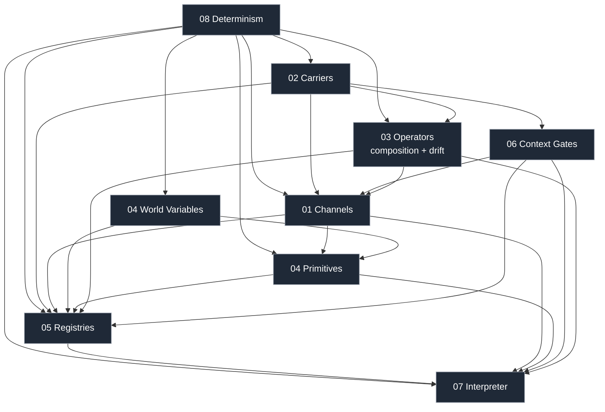

# Core Model: Domain-Agnostic Simulation Kernel

> *The reusable abstractions under Beast Evolution Game — extracted so they
> can be reused across genomes, equipment, economies, cultures, or any future
> domain that wants channel-based emergence.*

## 1. Why this folder exists

The Beast design describes channels, operators, and emissions in the
language of biology: channels as "genetic traits", families as "biological
families", interpreters running on "creatures". That framing is correct for
Beast's initial content, but the underlying machinery is domain-agnostic.
The same channel + operator + interpreter pipeline can be used for:

- **Equipment** — gear as carriers; edge sharpness, durability, and
  attunement as channels; wear and repair as drift operators; combat
  effects as emissions on world variables.
- **Settlements / factions** — settlements as carriers; institutional
  traits as channels; institutional drift as the drift operator;
  diplomatic / fiscal effects as emissions.
- **Cultures / languages** — cultures as carriers; memetic traits as
  channels; transmission drift as the drift operator; cultural effects as
  emissions.
- **Economies** — market participants as carriers; market-role traits as
  channels; momentum as the drift operator; trade flows as emissions.

Rather than re-implement channels three times, we extract the common
kernel here. `core-model/` is the **single, domain-neutral definition** of
what a channel, a carrier, an operator, a world variable, a primitive, a
registry, a manifest, a context gate, an interpreter, and a determinism
substrate are.

This folder is written to serve **two purposes simultaneously**:

1. **Conceptual spec** — so every future domain references the same
   definitions.
2. **Blueprint for a future crate split** — see
   [`09_crate_blueprint.md`](09_crate_blueprint.md). The goal is that when
   extraction is desirable, the split lines are already drawn.

## 2. Reading order

| # | File | What it defines |
|---|------|-----------------|
| 01 | [`01_channels.md`](01_channels.md) | The atomic unit: a named, ranged scalar bound to a carrier. Nothing else. |
| 02 | [`02_carriers.md`](02_carriers.md) | Carriers (genome, equipment, settlement, …) — the **only** grouping concept. Carriers declare which drift operators and gate kinds their channels may use. |
| 03 | [`03_operators_and_composition.md`](03_operators_and_composition.md) | The two operator families: **composition** (within-tick, five kinds) and **drift** (between-tick, open set). Supporting operators: correlation, bounds policies, merge strategies. |
| 04 | [`04_primitives.md`](04_primitives.md) | World-variable registry + generic primitive ops (`add`, `mul`, `set`, `emit`, `sample`, `transfer`, `raise`). No fixed categories. |
| 05 | [`05_registries_and_manifests.md`](05_registries_and_manifests.md) | The six kernel registries (carrier, gate kind, drift kind, world variable, channel, primitive), the two-stage loader, and provenance. |
| 06 | [`06_context_gates.md`](06_context_gates.md) | The unified gate family — scope-band, substrate-site, environment-flag, lifecycle, density, variable-threshold. |
| 07 | [`07_interpreter.md`](07_interpreter.md) | The pure-function contract: `interpret(carrier, env, registries) → Set<Primitive>`. |
| 08 | [`08_determinism.md`](08_determinism.md) | The substrate: Q32.32, Xoshiro256++, sorted iteration, tick-count time. |
| 09 | [`09_crate_blueprint.md`](09_crate_blueprint.md) | How these pages map onto the existing crates and a proposed future `kernel-*` split. |

## 3. Dependency graph

The abstractions depend on each other in a strict DAG. A future crate
split must respect this ordering.

Read from the top: **determinism** is the substrate. **Carriers** come next
because channels are bound to carriers. **Channels**, **operators**,
**world variables**, **primitives**, and **context gates** layer on top.
**Registries** are the load/lookup infrastructure. **Interpreter** consumes
everything.

## 4. Relationship to existing documentation

This folder does **not** replace `architecture/`, `systems/`, or
`schemas/`; it **extracts and generalizes** the concepts that live inside
them.

| Core-model concept | Current Beast artifact(s) |
|--------------------|---------------------------|
| Channel | [`schemas/channel_manifest.schema.json`](../schemas/channel_manifest.schema.json), [`schemas/README.md`](../schemas/README.md) |
| Carrier | Implicit — today's only carrier is the genome. Will become explicit when equipment / settlements / cultures land. |
| Composition operator | `composition_hooks` in channel schema; [`systems/11_phenotype_interpreter.md`](../systems/11_phenotype_interpreter.md) §6 |
| Drift operator | `mutation_kernel` on channels today; to be migrated off channels in the kernel extraction. |
| World variable | Implicit — today's primitives carry category + parameter schema. Will become explicit when the variable registry lands. |
| Primitive | [`schemas/primitive_manifest.schema.json`](../schemas/primitive_manifest.schema.json); category enum to be removed in the kernel extraction. |
| Context gate | `expression_conditions`, `scale_band`, `body_site_applicable` in channel schema (three separate fields today; unified here). |
| Registry / manifest | `beast-channels` / `beast-primitives` / `beast-manifest` in [`architecture/CRATE_LAYOUT.md`](../architecture/CRATE_LAYOUT.md) |
| Interpreter | [`systems/11_phenotype_interpreter.md`](../systems/11_phenotype_interpreter.md) |
| Determinism substrate | [`INVARIANTS.md §1`](../INVARIANTS.md), [`architecture/ECS_SCHEDULE.md`](../architecture/ECS_SCHEDULE.md) "Parallelism & Determinism Rules" |

**Authority**: When this folder contradicts an existing doc, the existing
doc wins unless a change was made deliberately here; in that case the
originating doc must be updated in the same PR (per the repo-level
*Conventions for Edits*).

## 5. What changed in this revision

This is revision 2 of the core-model folder. The most important shifts:

| Previous draft | This revision | Rationale |
|----------------|---------------|-----------|
| Channel groups = taxonomic families (sensory, motor, …). | **Carriers** replace channel groups. Carriers are genomes, equipment, settlements — the *contexts that hold channels* and *determine drift regimes*. Taxonomic families are removed from the kernel entirely. | Taxonomic pre-classification fights emergence. Carriers reflect a real dynamical difference (how channels change), not a designer-imposed category. |
| `mutation_kernel` was a field on each channel. | Drift is a **first-class operator family**. Gaussian mutation is one drift operator; wear, institutional drift, momentum are others. Carriers declare which drift kinds are legal. | Mutation is evolution-specific. Other carriers drift differently. Channels should be dumb scalars; *how* they change is an operator concern. |
| `body_site_applicable` and `scale_band` were separate channel fields. | Both become **context-gate kinds** (`substrate_site`, `scope_band`). Channels carry a single `context_gates` list. | One abstraction, uniformly extensible. |
| Eight fixed primitive categories (`signal_emission`, `mass_transfer`, …). | Primitives are **generic operations** (`add / mul / set / emit / sample / transfer / raise`) on **world variables** declared by the domain. The 8 categories are removed. | Every simulation variable can be acted on by a primitive. Categories pre-classified things the kernel shouldn't care about (modality is a property of the *variable*, not the *action*). |
| 4 kernel registries. | **6 kernel registries**: carrier, gate kind, drift kind, world variable, channel, primitive. | Each new first-class concept gets its own monolithic registry. |

Open questions rolled forward from v1 are tracked on each page.

## 6. Principles these pages enforce

1. **Domain neutrality.** A doc here must not assume creatures, biology,
   or any specific Beast subsystem. Beast-specific examples are fine when
   clearly marked.
2. **Tradeoff-first.** Every design decision records the alternatives
   considered and why the chosen path won.
3. **Emergence over taxonomy.** Concepts that classify things upfront
   (family, category) are avoided in favor of concepts that describe
   behavior (operator, variable).
4. **Mermaid over prose diagrams.** All diagrams are Mermaid so they
   render inline on GitHub.
5. **Invariants stay load-bearing.** Any concept that touches determinism
   references [`INVARIANTS.md`](../INVARIANTS.md) rather than redefining
   the rule.
