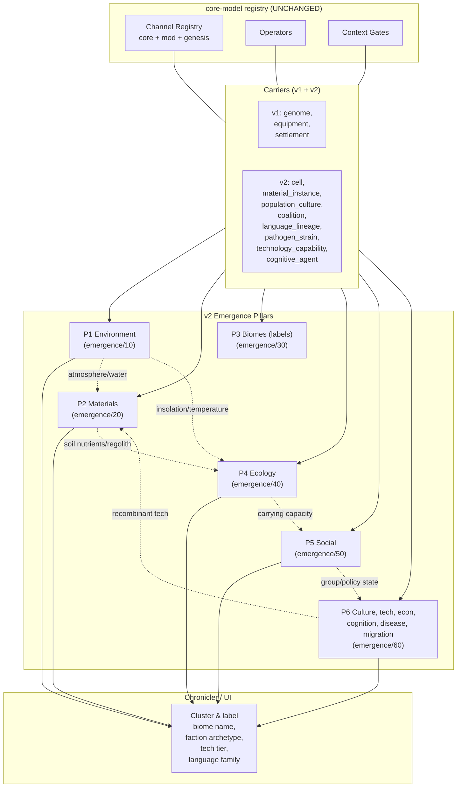

# 00 — Master Synthesis: Emergence v2 Architecture

**Status:** v2 design track, post-MVP. Authoritative for the emergence pillars.
**Companion docs:** the per-pillar specs (10/20/30/40/50/60), the topology decision (90), and the integration map (99).

---

## 1. Why a v2 track exists

The v1 system specs (`documentation/systems/01–23`) achieved a great deal: creature evolution is already built on a registry-driven channel system (`core-model/`), the phenotype interpreter emits primitive effects rather than named abilities, and the Chronicler assigns labels post-hoc. **For creatures, the simulation is already emergent.**

But for everything *around* the creatures, v1 is studded with designer-imposed taxonomies:

- **Biomes** are an enum of ~14 named types (`TROPICAL_RAINFOREST`, `TUNDRA`, …) with hardcoded Whittaker thresholds (`systems/15`).
- **Rocks** are an enum of 5 named types (`BASALT`, `GRANITE`, `SEDIMENTARY`, `LIMESTONE`, `VOLCANIC_ASH`) with `soil_fertility` reduced to a scalar (`systems/15`).
- **Atmospheric circulation** is hardcoded as a 3-cell pattern (Hadley/Ferrel/Polar) with fixed latitude bands (`systems/15`).
- **Faction opinions** live in a fixed 12-dimensional space (`systems/01,03,08`) — political emergence cannot escape these axes.
- **Material properties** are a fixed 17-property signature (`systems/04,05,06`) — the same 17 numbers describe every physical thing.
- **Tools, techniques, injuries, body locations, life stages, dialogue gates, social layers, exchange modes** … the v1 audit found ~169 such items across systems 01–10 alone, with more in 11–23 (see `01_HARDCODED_AUDIT.md`).

The aspiration of "simulation-first, emergence-driven" is met for creatures and broken for almost everything else. **v2 closes that gap.**

---

## 2. The unifying design principle

> **Everything is a channel.** Every quantity in the simulation — environmental, social, technological, material, cognitive — is a continuous, ranged, fixed-point scalar attached to a *carrier* and registered through the existing `core-model` registry. Discrete categories are not primary state; they are post-hoc Chronicler labels over clusters in channel space.

This principle is a strict generalisation of `INVARIANT 2: Mechanics-Label Separation`. In v1 we apply that invariant to creature abilities; in v2 we apply it to **everything**.

### What changes mechanically

The v1 `core-model/` already defines:

```
Channel = (id, carrier, range, operators, context_gates, provenance)
```

with carriers like `genome`, `equipment`, `settlement`. **v2 simply registers new carriers**:

| Carrier (new in v2) | Replaces in v1 |
|---------------------|----------------|
| `cell` (per-Voronoi-cell environmental field) | `Cell.climate`, `Cell.geology`, `Cell.hydrology`, biome enum |
| `material_instance` | the 17-property `MaterialSignature` (`systems/04,05,06`) |
| `population_culture` (per-faction cultural state) | the 12-dimensional opinion space (`systems/01,03,08`) |
| `coalition` | treaty-type enum (`systems/03`) |
| `language_lineage` | language family enum (`systems/18`) |
| `pathogen_strain` | disease-class enum (`systems/16`) |
| `technology_capability` | tech-tree nodes (`systems/19`) |
| `cognitive_agent` | cognition-tier enum (`systems/17`) |

No changes to `core-model/01_channels.md` are required — the abstraction already accommodates this. We are *populating* it more fully, not redesigning it.

### What discrete labels survive

The Chronicler still emits human-readable names for player-visible artefacts. A region with `(temperature_anom_K = -10, precipitation = 0.1, vegetation_lai = 0.05, soil_organic_carbon = 0.02)` may be labelled "tundra" in the bestiary. But the *simulation* sees only the four fixed-point numbers; nothing in systems 01–20 control flow ever branches on `biome == TUNDRA`. The label is presentation, not mechanism. This is the existing invariant (mechanics-label separation), now universal.

---

## 3. Architecture diagram



**Reading the diagram.** The registry and carrier scaffolding are unchanged from v1 — v2 doesn't re-architect the engine. Six pillar specs each define a set of new channels on new carriers, plus the update rules that drive them. Inter-pillar coupling is dataflow only (no shared mutable state, no cross-pillar control flow), which preserves the 8-stage tick schedule and lets each pillar own its sub-stages independently.

---

## 4. The six pillars in one paragraph each

### P1 Environment (`emergence/10`)
Replace the hardcoded 3-cell circulation, the `biome_type` enum, and the per-cell `temperature_celsius`/`precipitation_mm_per_year` scalars with a **moist energy-balance atmosphere on a spherical-Voronoi mesh** plus continuous environmental channels per cell: `temperature_anom_K`, `specific_humidity`, `precipitation_kg_m2_s`, `wind_u`/`wind_v`, `cloud_fraction`, `surface_albedo`, `insolation_W_m2`, `soil_moisture`, `groundwater_head_m`, `runoff_kg_m2_s`. Hadley-cell-like patterns *emerge* from the EBM; ITCZ migration *emerges* from seasonal solar forcing on a heat-capacity field; deserts *emerge* where evapotranspiration > precipitation. Cost target: ≈ 30 fixed-point ops/cell/tick on top of the existing schedule. See `10_environment_emergence.md`.

### P2 Materials (`emergence/20`)
Replace the 5-value `rock_type` enum and 17-value `MaterialSignature` with a **continuous mineralogical composition vector** per material instance: fractions of `quartz`, `feldspar`, `mafic`, `clay`, `carbonate`, `organic`, plus a small set of physical channels (`grain_size_mm`, `bulk_density_kg_m3`, `permeability_log_md`, `cohesion_kPa`). Soils are composition vectors of `sand`/`silt`/`clay`/`organic` with `cation_exchange_capacity` and nutrient pools (N/P/K). Weathering is a deterministic kinetic update (Arrhenius-style, fixed-point) that depends on the P1 atmospheric channels above the cell. Tool/equipment behaviour derives from composition rather than from a 17-number designer signature. See `20_materials_emergence.md`.

### P3 Biomes as labels (`emergence/30`)
This pillar contains *no new simulation state*. It defines the **post-hoc clustering and labelling pass** the Chronicler runs over the P1 + P2 + P4 channel space to assign a player-visible biome name to each cell. It is the formalisation of "biomes are not primary state". Methodologically: deterministic 1-NN over a fixed prototype gallery in `(temperature_anom, precipitation_anomaly, soil_moisture, lai, soil_fertility, elevation_band)` space, with prototypes registered through the registry (so mods can add new biome labels without changing simulation code). See `30_biomes_emergence.md`.

### P4 Ecology (`emergence/40`)
Replace the fixed `ENERGY_TRANSFER_EFFICIENCY = 0.10`, the integer trophic levels, and the `biome_productivity[]` lookup with the **Williams-Martinez niche model** layered on **allometric trophic networks (ATN)**: predator-prey links emerge from body-mass distributions, consumption rates come from allometric scaling (not Lindeman's 10%), trophic position is computed continuously from realised diet history (Post 2002), and decomposer pools are explicit (Century-style with 3 SOM pools). The carrying capacity that v1 systems/12 currently outputs is now an *emergent* quantity per (cell × species), not a designer table. See `40_ecology_emergence.md`.

### P5 Social (`emergence/50`)
Replace the 12-dimensional fixed opinion space, faction archetypes, treaty-type enum, governance enums, and the kinship-template scaffolding with **continuous, learnable social channels**: each `population_culture` carrier has a `cultural_trait_vector` of N continuous scalars whose semantic interpretation is *not* fixed by the kernel (CMLS-style; Boyd-Richerson, Henrich), a `governance_policy_vector` (centralisation, formalisation, succession-entropy, coercive vs. consensual, transparency), a `coalition_membership` vector, and explicit pedigree storage so kinship structures (clan, lineage, household) *derive* from residence rules + reproduction rather than from enum membership. Opinion dimensions emerge as principal axes of cultural drift (the Chronicler labels them); they are not pre-set. See `50_social_emergence.md`.

### P6 Culture, tech, economy, cognition, disease, migration (`emergence/60`)
The omnibus pillar. Replace **language family enums** with iterated-learning channels (phoneme inventory size, morphological complexity, syntactic-nesting depth, vocabulary divergence) on a `language_lineage` carrier; **tech-tree nodes** with combinatorial recombination of `technology_capability` channels (mechanical_leverage, thermal_control, chemical_utility, …) à la Brian Arthur; **resource-type enums** with continuous goods spaces and emergent matching markets (ACE-style); **cognition tiers** with continuous channels (`predictive_horizon`, `model_depth`, `theory_of_mind_order`, `precision_weight`) under an Active Inference framing; **disease-class enums** with `pathogen_strain` carriers carrying continuous antigenic-distance / transmissibility / virulence channels (multi-strain SIR with mutation); **migration triggers** with utility-driven gravity flow on the cell adjacency graph. See `60_culture_emergence.md`.

---

## 5. Master tradeoff matrix

The largest design choices for the v2 track. Per-pillar tradeoffs live in their own docs.

| Decision | Options | Sim Fidelity | Implementability | Player Legibility | Emergent Power | Choice + Why |
|----------|---------|--------------|------------------|-------------------|-----------------|-------------|
| **Universal architecture** | Special-case each pillar (separate state, separate update loop) vs. **Channels-on-carriers (registry-driven)** | Tied | Channels easier (reuses v1 plumbing) | Channels easier (one mental model) | Channels higher (mods extend uniformly) | **Channels on new carriers**. Reuses `core-model/` mechanism; no engine changes. |
| **Cell topology** | Square grid · Icosahedral hex · **Spherical Voronoi (SCVT)** | SCVT highest (matches MPAS-A finite-volume PDEs; no pole singularities) | Hex easiest; SCVT moderate (one-time generation) | Hex highest; SCVT acceptable | SCVT highest (variable resolution; natural coastlines) | **Spherical Voronoi (SCVT)**. See `90_topology_decision.md` — fully compatible with every model in pillars 1–6, fixed once at world creation, integer neighbour graph thereafter. |
| **Atmosphere model** | None (lookup) · 3-cell static · **Moist EBM** · Shallow-water · Full GCM | Full GCM; EBM strong | EBM moderate | EBM legible (zonal bands emerge) | EBM strong (ITCZ migration, monsoon) | **Moist EBM** + parametrised Hadley/Ferrel/Polar from emergent meridional heat transport. Cheap; deterministic; emerges what the static 3-cell model fakes. |
| **Soil & material model** | 17-property signature · **Composition vector + 3-pool SOM** · Full reactive transport | Full reactive transport highest | Composition vector moderate | Composition vector legible (visualised as ternary) | Composition vector strong (mineral cycles) | **Composition vector**, with optional reactive-transport upgrade in a later phase. |
| **Trophic dynamics** | Lookup biome_productivity · **Williams-Martinez + ATN** · Full DEB | Full DEB; ATN strong | ATN moderate | ATN legible if visualised | ATN strong (allometric niches) | **Williams-Martinez + ATN**, DEB for individual organisms only as a later option. |
| **Social state** | 12-dim fixed opinion + faction archetypes · **Continuous cultural vector + emergent dimensions (CMLS)** | CMLS higher | CMLS slightly harder | CMLS lower (axes shift over time) | CMLS dramatically higher | **CMLS**. Live with the legibility cost; the Chronicler can label axes post-hoc. |
| **Language** | Family enum · **Iterated learning channels** | IL higher | IL moderate | Both similar | IL much higher | **Iterated learning**. |
| **Technology** | Tech-tree DAG · **Combinatorial recombination over capability channels** | Combinatorial higher | Both similar | Tree easier; combinatorial requires Chronicler labelling | Combinatorial much higher | **Combinatorial**. |
| **Economy** | Polanyi 3-mode + resource enum · **Continuous goods space + matching markets (ACE)** | ACE higher | ACE harder | ACE harder (no clear "mode") | ACE much higher | **ACE**. Polanyi modes survive only as emergent labels. |
| **Disease** | Class enum (viral/bacterial/parasitic) · **Multi-strain antigenic-distance SIR** | Multi-strain higher | Both similar | Both similar (UI shows strain trees) | Multi-strain much higher | **Multi-strain**. |
| **Migration** | Scripted triggers · **Utility-driven gravity flow on adjacency graph** | Gravity higher | Both similar | Gravity legible (flow arrows) | Gravity higher | **Gravity flow**. |
| **Cognition** | Tier enum (reactive/deliberative/reflective) · **Continuous Active-Inference channels** | AI higher | AI harder | AI harder (no clear "tier") | AI much higher | **Active Inference**, with Chronicler tier labels for UI. |
| **Voronoi seed** | Random · **Deterministic blue-noise from world seed** | Blue-noise better | Same | Same | Same | **Blue-noise**, generated once at world creation, frozen as integer neighbour graph forever. |

The pattern: at every choice point, the higher-emergence option also has higher implementation cost. The recommendation is uniformly to take the higher-emergence path because (a) it aligns with the project's stated philosophy, and (b) the implementation cost is bounded — none of these models require engine changes; they all reduce to "register new channels on new carriers and define their drift operators" within the existing core-model.

---

## 6. Determinism & invariants — how v2 stays inside v1's contract

`documentation/INVARIANTS.md` is non-negotiable. Each pillar must satisfy:

1. **Determinism (Q32.32, sorted iteration, one Xoshiro stream per subsystem)**: every model in pillars 1–6 was screened for iteration-order sensitivity in the research syntheses (`research/R10`–`R30`). PDE updates use conservative finite-volume schemes with sorted-cell iteration; agent-based models (CMLS factions, ACE economy, SIR multi-strain) iterate over sorted entity ids; transcendentals (`exp`, `log`, `sqrt`) use pre-computed Q32.32 lookup tables.

2. **Mechanics-label separation**: the v2 pillars *enforce* this invariant for biome/faction/tech/language labels — they are emitted only by the Chronicler.

3. **Channel-registry monolithicism**: v2 adds new carriers (`cell`, `material_instance`, `population_culture`, …) but uses the same registry. No new abstraction, no parallel registry, no hardcoded channel ids in system code.

4. **Emergence closure**: every observable behaviour in a v2 pillar is traceable to primitive emissions or registered channel updates. No ghost mechanics; no `if biome == TUNDRA` branches in systems 01–20.

5. **Scale-band unification**: the same channel/operator machinery applies from microbial pathogens to macrofaunal hosts to settlement-scale social state. The pillar designs never branch on scale.

6. **UI vs. sim state**: the biome label, the faction-archetype name, the language-family name, the tech-tier label, the disease-class name — none of these appear in save files. They are recomputed on load from the channel state.

A dedicated audit pass (task #10) verifies these properties on each pillar doc before it's marked authoritative.

---

## 7. Voronoi: the headline topology decision

The user asked specifically: are Voronoi cells compatible with the proposed models? **Yes — and they are better than the alternatives for this game.** The full reasoning is in `90_topology_decision.md`. Summary:

- **MPAS-A and MPAS-O** — the state-of-the-art atmospheric and ocean models — use spherical centroidal Voronoi tessellations precisely because they avoid the lat-lon pole singularity and admit a clean C-grid finite-volume formulation. Every model in pillar P1 (moist EBM, hydrology, soil moisture, runoff routing) has a published Voronoi-compatible discretisation.
- **Implementation cost is bounded.** Lloyd's algorithm for SCVT generation runs *once at world creation* and produces an integer neighbour graph that's frozen for the lifetime of the world. We do not need fixed-point Lloyd's at runtime; the world-gen pass can use floating-point Lloyd's, hash the result, and store the mesh as part of the seeded world artefact. Replay determinism is preserved by storing the mesh in the save file (or by regenerating it from the seed via a deterministic SCVT routine — both are tractable).
- **Variable neighbour count (5–7) is a feature, not a bug.** Real ecosystems and real social networks have inhomogeneous adjacency. Hex grids force artificial 6-fold symmetry that subtly biases diffusion, migration, and disease-spread models.
- **The only models that break on Voronoi** are ones that hardcode 4- or 6-neighbour Moore/von-Neumann update rules — and we have no such models in v2.

Recommendation: **spherical centroidal Voronoi tessellation, generated once from the world seed**, neighbour graph stored as integer adjacency lists, ~5 000 – 50 000 cells depending on world size.

---

## 8. Phasing (informational, not a sprint plan)

Per the user's direction, no migration path is required yet. For reference, the natural ordering of pillar landings would be:

```mermaid
gantt
    dateFormat  X
    axisFormat  Sprint %s
    title v2 Emergence (informational only)
    section Foundation
    P1 Environment (atmosphere/EBM, hydrology, soils-coupled)        :a1, 1, 4
    P2 Materials (composition vectors, weathering)                    :a2, 2, 5
    P3 Biome labelling (Chronicler clustering)                        :a3, 4, 5
    section Living systems
    P4 Ecology (Williams-Martinez + ATN + emergent K)                 :a4, 5, 8
    section Sapience
    P5 Social (CMLS, kinship, governance, coalitions)                 :a5, 7, 10
    P6 Language / tech / econ / cognition / disease / migration       :a6, 9, 13
```



P1 → P2 → P3 → P4 → P5 → P6 is the dependency-respecting order. The actual sprint allocation will be decided when the v2 track is approved for the GitHub project board.

---

## 9. What this track does *not* try to do

To keep scope tractable:

- **No engine changes.** No new ECS stages, no new core-model abstractions. The 8-stage tick loop (`architecture/ECS_SCHEDULE.md`) is unchanged; v2 adds *systems* within existing stages.
- **No graphics or rendering work.** Cell visualisation, biome colours, faction icons — all UI-layer concerns deferred.
- **No changes to creature evolution (systems/01,02,11) or to the genome/phenotype-interpreter pipeline.** v2 is about everything *around* the creatures.
- **No migration plan from v1 → v2** at this stage. When a pillar is approved, the corresponding v1 system specs will be marked superseded; the actual replacement work is sprint-level planning for later.
- **No claims about specific gameplay verticals** (combat moments, dialogue beats, quest design). Those remain emergent from the simulation.

---

## 10. Open questions

These are flagged here for the project owner to resolve before any v2 pillar is approved for implementation:

1. **Cell count target.** SCVT at 5 000 / 20 000 / 80 000 cells gives very different perf budgets. P1's EBM cost scales linearly; P4's ATN cost scales worse (S² in species count, but S is roughly per-cell). Recommendation: 20 000 cells for the base world, multi-resolution refinement reserved for a later option.
2. **EBM time-step.** A 1-tick atmospheric update is too coarse; sub-stepping or a multi-rate scheme is needed. Recommendation: 1 atmosphere step per N ticks (configurable, default N = 24 representing one game-day).
3. **Cultural-vector dimensionality.** CMLS works at any dimensionality, but UI legibility prefers ≤ 16 axes. Recommendation: 32 latent axes in sim, top-K Chronicler-labelled axes shown in UI.
4. **Backwards-compat with v1 saves.** Open. Out of scope per the "no migration path yet" directive but flagged.
5. **Mod schema for v2 carriers.** The new carriers (cell, material_instance, etc.) need their JSON manifest schemas. Should re-use the patterns in `documentation/schemas/` rather than introduce new ones.

---

## 11. Sources & citations

Per-pillar citations live in the pillar docs. The headline references are:

- Boyd, R. & Richerson, P. (1985). *Culture and the Evolutionary Process*. (CMLS, social pillar.)
- Brose, U. et al. (2006). "Allometric scaling enhances stability in complex food webs." *Ecology Letters* 9. (Ecology pillar — ATN.)
- Friston, K. (2010). "The free-energy principle." *Nature Reviews Neuroscience* 11. (Cognition pillar.)
- Henrich, J. (2015). *The Secret of Our Success*. (Cultural multilevel selection.)
- Kirby, S. et al. (2008). "Cumulative cultural evolution in the laboratory." *PNAS* 105. (Iterated learning, language pillar.)
- Kooijman, S. (2010). *Dynamic Energy Budget Theory for Metabolic Organisation*. (Optional individual-level metabolism.)
- Parton, W. et al. (1987). "Analysis of factors controlling soil organic matter levels in Great Plains grasslands." *Soil Science Society of America Journal* 51. (Century model, materials pillar.)
- Post, D. M. (2002). "Using stable isotopes to estimate trophic position." *Ecology* 83. (Continuous trophic position.)
- Ringler, T. et al. (2010). "A multi-resolution approach to global ocean modeling." *Ocean Modelling* 33. (MPAS-O on SCVT — topology + environment pillars.)
- Skamarock, W. et al. (2012). "A multiscale nonhydrostatic atmospheric model using centroidal Voronoi tesselations and C-grid staggering." *Monthly Weather Review* 140. (MPAS-A — topology + environment pillars.)
- Tesfatsion, L. & Judd, K., eds. (2006). *Handbook of Computational Economics, Vol. 2: Agent-Based Computational Economics*. (Economy pillar.)
- Williams, R. & Martinez, N. (2000). "Simple rules yield complex food webs." *Nature* 404. (Niche model, ecology pillar.)

Full per-pillar citations and the supporting research syntheses live in `research/R10`, `R20`, `R30`, `R90`.
