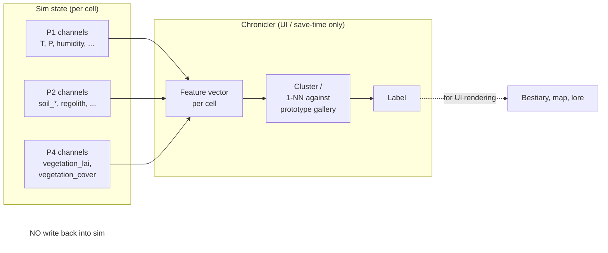

# 30 — Pillar P3: Biome Labels (Emergence by Clustering)

**Replaces in v1:** the `biome_type: enum {TROPICAL_RAINFOREST, SAVANNA, DESERT, GRASSLAND, TEMPERATE_FOREST, BOREAL_FOREST, TUNDRA, ALPINE, ESTUARY, CORAL_REEF, DEEP_OCEAN, VOLCANIC_VENT, COASTAL_SHELF, ...}` from `systems/15` and `systems/07`, **and the entire Whittaker-classification `if/elif` cascade** that assigned it.

**Special note.** This pillar is **architecturally trivial**: it has no new simulation state. Its only purpose is to formalise the rule that *biome names are labels, not state*, and to define the post-hoc clustering pass the Chronicler runs to assign them.

This is the simplest pillar by design. Its short length is the point.

---

## 1. Why this pillar exists

In v1, the world looks like: every cell carries a `biome_type` enum, set by a Whittaker classifier from `(temperature_celsius, precipitation_mm_per_year, elevation_m, hydrology)`. Many systems then branch on `if cell.biome == TUNDRA`. This:

- violates **mechanics-label separation** for the world (we already enforce it for creatures),
- forces a designer-authored taxonomy to define what's a biome and what's a transition,
- prevents emergent biomes (a designer would have to add a new enum entry for "salt flat", "alpine bog", "post-volcanic moss field", etc.),
- couples mod authoring to engine code (a mod that wants a new biome has to edit core).

In v2, the world looks like: every cell carries the channels defined in P1 (temperature_anom_K, precipitation, soil_moisture, …) and P2 (soil composition, nutrient pools) and P4 (vegetation_lai, vegetation_cover). **No `biome_type` channel exists in sim state.** The Chronicler runs a clustering pass to attach a *label* to each cell for UI purposes, and bestiary/UI surfaces never write that label back into sim state.

---

## 2. Architecture



The Chronicler's biome-labelling pass is part of Stage 7 (Labelling & Persistence) in the existing 8-stage tick loop. It runs every N ticks (default N = 60, "1 game-month") and is read-only against sim state.

---

## 3. Feature vector & prototype gallery

A small, registry-backed vector of channel readings per cell. Default features (mods can extend):

| Feature | Source channel |
|---------|----------------|
| `T_anom` | `cell.temperature_anom_K` |
| `precip_log` | `log10(cell.precipitation_kg_m2_s + ε)` |
| `soil_moist` | `cell.soil_moisture` |
| `lai` | `cell.vegetation_lai` (P4) |
| `veg_cover` | `cell.vegetation_cover` (P4) |
| `clay_frac` | `cell.soil_clay_frac` (P2) |
| `org_C` | `cell.soil_organic_carbon_kgm2` (P2) |
| `elev_band` | `quantize(cell.elevation_m)` |
| `marine` | bool: `cell.elevation_m < 0` |
| `river_disch` | `log10(cell.river_discharge_m3_s + ε)` |

The **prototype gallery** is a JSON-manifest file shipped with the game (and mod-extensible) that lists named prototypes — *not* enum values, just labelled vectors:

```jsonc
[
  {"label": "tropical_rainforest", "vec": [27, -4, 0.95, 6.5, 0.95, 0.55, 8, 0, false, 0]},
  {"label": "savanna",             "vec": [25, -5, 0.55, 1.5, 0.45, 0.3, 1, 0, false, 0]},
  {"label": "tundra",              "vec": [-10, -6, 0.7, 0.1, 0.2, 0.2, 0.5, 0, false, 0]},
  {"label": "alpine_meadow",       "vec": [3, -5, 0.6, 1, 0.5, 0.3, 1.5, 2, false, 0]},
  {"label": "salt_flat",           "vec": [22, -8, 0.05, 0, 0, 0.05, 0.05, 0, false, 0]},
  {"label": "thermal_vent",        "vec": [50, -7, 1, 0, 0, 0.2, 0.2, -3, true, -2]}
  // ...
]
```

Mods can add prototypes (`provenance: "mod:foo"`). New labels appear in the bestiary without any engine code change. **This is the entire "biome catalog" mechanism.**

---

## 4. Labelling rule

Deterministic 1-nearest-neighbour over a Mahalanobis-like weighted Euclidean distance:

```
fn label_cell(cell: &Cell, gallery: &[Prototype]) -> &str {
    let v = feature_vector(cell);                 // Q32.32 vector
    let mut best_dist = Q32_32::MAX;
    let mut best_label = "uncategorised";
    for proto in gallery.iter().sorted_by_label() {  // sorted for determinism on ties
        let d = weighted_l2(v, proto.vec, FEATURE_WEIGHTS);
        if d < best_dist {
            best_dist = d;
            best_label = proto.label;
        }
    }
    best_label
}
```

`FEATURE_WEIGHTS` is registry-backed (calibration). On distance ties, the sorted-by-label iteration order makes the choice deterministic.

For visual smoothness, the UI layer can interpolate between top-K labels (e.g., "transitional rainforest/savanna") without affecting sim. Sim-state labelling is always single-best.

---

## 5. Cross-pillar hooks

P3 *reads* P1, P2, P4 cell channels and writes nothing back to sim state. It writes only to UI/save-derivative state (`Cell.derived_label`, never serialised to disk per `INVARIANT 6: UI vs. Sim State Separation`).

---

## 6. Tradeoff matrix

| Decision | Options | Sim Fidelity | Implementability | Player Legibility | Emergent Power | Choice + Why |
|----------|---------|--------------|------------------|-------------------|-----------------|-------------|
| Classification method | Hardcoded thresholds (v1) / **1-NN over prototype gallery** / k-means / Learned classifier | 1-NN good enough | 1-NN trivial | 1-NN legible | 1-NN strong (mod-extensible) | **1-NN with registry-backed gallery**. |
| Feature set | Just (T, P) Whittaker / **(T, P, soil, vegetation, hydrology) extended** / Learned embedding | Extended sufficient | Extended easy | Extended legible (each axis has meaning) | Extended high (richer biome diversity) | **Extended**. |
| Update frequency | Every tick / **Every N ticks (N = 60)** / On state-change | Same | N-tick easiest | Identical | Identical | **N = 60 ticks**. Biome labels evolve slowly. |
| Mod extensibility | None / **JSON prototype gallery** / Full plugin | Same | JSON easy | Mods add labels visibly | High (modders ship biome packs) | **JSON gallery**. |

---

## 7. Emergent properties

1. **Novel biomes appear without engine changes.** A cell with `(T = 22, precip = 0.05, vegetation = 0)` lands closest to whatever prototype the gallery has — if no good match, "uncategorised" until a mod adds one. This is *good*; it surfaces gaps for designers/modders to fill.
2. **Smooth transitions.** A cell whose top-2 distances are close is surfaced in UI as "transitional X/Y" — players see real heterogeneity that v1's hard enum hid.
3. **Volcanic perturbations re-label cells.** When P1's `aerosol_optical_depth` spikes and temperature drops, cells near a label boundary flip labels — the bestiary records the change. No `if eruption: biome = ASH_DESERT` branch.
4. **Player legibility costs are bounded.** Sim does not depend on labels, so mis-labelling has no gameplay consequence — only cosmetic.

---

## 8. What is *deliberately* missing

- **No `biome_type` channel.** Even as a derived channel: it's UI state, not sim state.
- **No biome-specific behaviour anywhere in pillars 01–06.** Creature fitness reads continuous channels; ecology reads continuous channels; Chronicler reads continuous channels. The label is for the player, not the simulation.
- **No designer-authored "biome rules."** Whittaker thresholds, hand-tuned `if T < 0 and P < 250: TUNDRA` cascades — gone.

---

## 9. Sources

- Whittaker, R. H. (1975). *Communities and Ecosystems* (2nd ed.). — historical reference for the diagram we're replacing.
- Soberón, J., Peterson, A. (2005). "Interpretation of models of fundamental ecological niches and species' distributional areas." *Biodiversity Informatics* 2. — niche-as-cluster framing.
- Smith, T., Shugart, H., Woodward, F., eds. (1997). *Plant Functional Types*. — continuous-trait alternative to enumerated PFTs / biomes.
- Smith, B. et al. (2014). LPJ-GUESS — modern PFT-based vegetation model whose "biomes" are derived labels rather than primary state.
