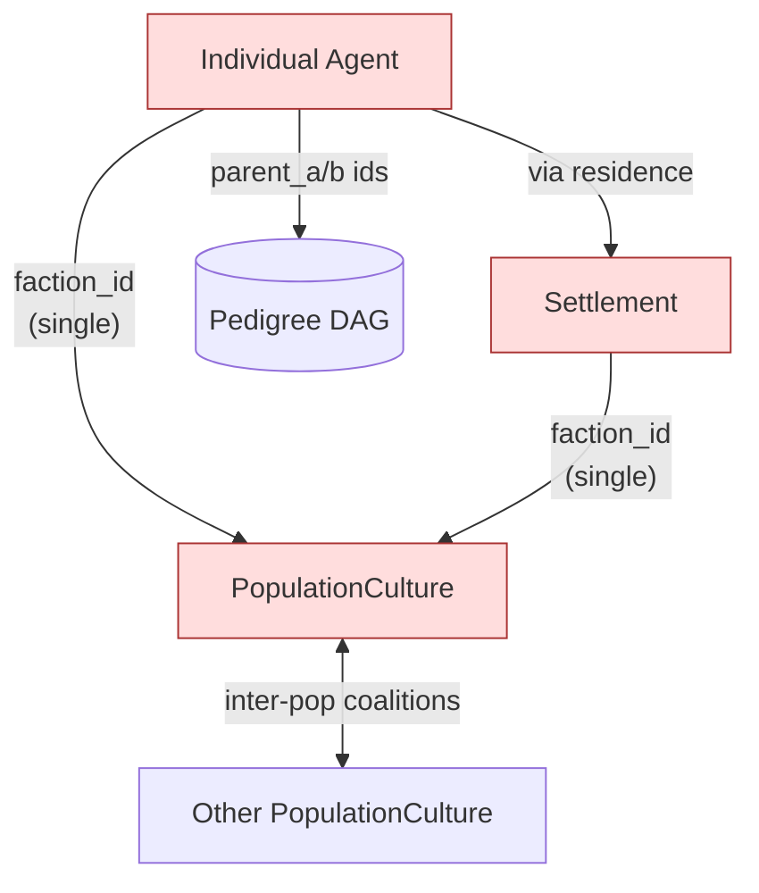
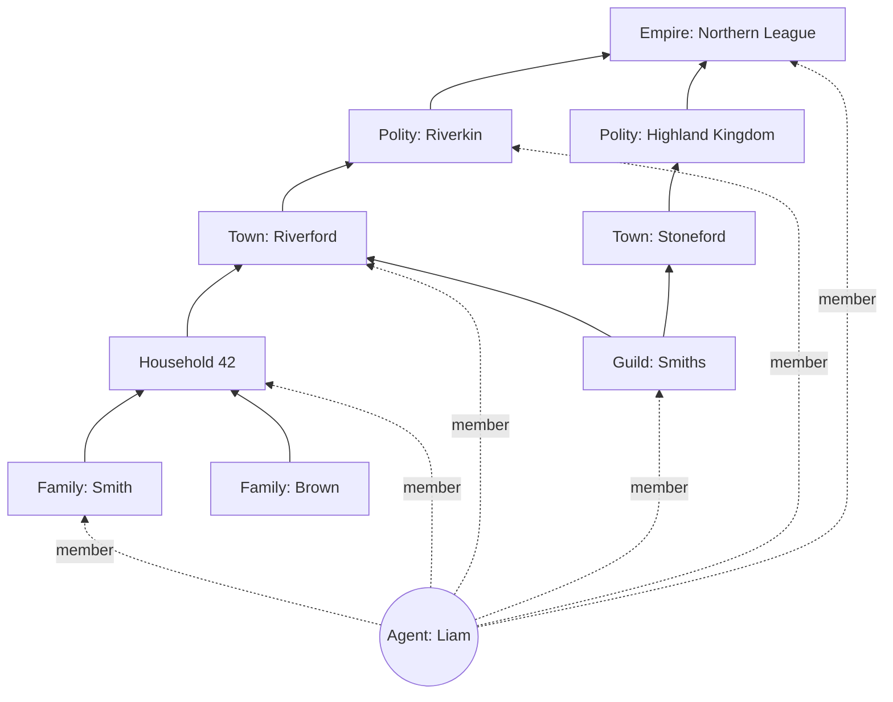

# 55 — Multi-Affiliation Group Membership

> **Status: SUPERSEDED by [56_relationship_graph_emergence.md](56_relationship_graph_emergence.md).**
>
> This document proposed a registry of *declared* group prototypes (kinship, settlement, polity, religion, …) plus declared containment rules. That choice was rejected on review: it still authors the hierarchy and the relationship taxonomy, in violation of the project's emergence-first invariant. Doc 56 replaces it with a typed multigraph on agents, with edge-types and node-clusters both emerging from primitive emissions and Chronicler clustering. Kept here for design-evolution traceability; do not implement.
>
> The five touch-points listed in §12 (Agent.faction_id removal, SettlementEconomic.faction_id removal, FactionGate generalisation, Voronoi-assignment generalisation in 50, Stage-7 sub-stage registration) carry over to doc 56 unchanged — only the *replacement* differs.

---

**Status (original):** design proposal — supersedes the single-membership assumptions in `50_social_emergence.md` §4.2 and `systems/03_faction_social_model.md` (Agent.faction_id) and `systems/04_economic_layer.md` (SettlementEconomic.faction_id).

**Replaces in v1 / pre-emergence-refactor:**

- `Agent.faction_id: faction_id or null` — single-slot political membership.
- `faction_clustering_step` Voronoi assignment of `ind.population_culture_id = nearest` — single cultural membership.
- `SettlementEconomic.faction_id` — single-faction settlements.
- `FactionGate { faction: faction_id, … }` in dialogue — predicate assumes single faction.
- The implicit assumption that `cluster_by_proximity` (pack/herd) places each beast in exactly one cluster.

**Depends on:** P5 (`50_social_emergence.md`), P3 biome prototype-gallery pattern (`30_biomes_emergence.md`), the `pedigree_record` carrier (already shipped in design), the existing `cultural_trait_vector`.

---

## 1. Problem statement

A real individual is simultaneously a member of a household, a clan, a settlement, a polity, possibly an empire above that, plus cross-cutting affiliations like a guild, a religion, a trade network, a language community. Each of these can have its own internal politics, can grow or shrink, and the individual can leave any of them at will (with cost). The current design forces *one* faction-shaped membership per agent. That collapses several distinguishable social tiers into one slot and prevents a whole class of phenomena (cross-cutting cleavages, enclaves, dual citizenship, religious diaspora, transnational guilds, vassalage chains) from emerging.

The goal of this document is to extend the existing emergence-first social model so that an entity can hold an arbitrary set of memberships at once, organised as an overlapping containment DAG — without breaking the determinism, mechanics-label-separation, or emergence-closure invariants.

---

## 2. Research basis

Anchoring this in research the project already cites plus the multi-affiliation literature:

- **Simmel, G. (1908)** *Soziologie*, ch. "Die Kreuzung sozialer Kreise" ("The web of group affiliations"). Foundational text: an individual is the *intersection* of overlapping social circles, and modernity differs from traditional society precisely in how many circles each person stands in.
- **Walzer, M. (1983)** *Spheres of Justice*. Distinct social spheres (kinship, citizenship, market, office, education, religion) have their own membership rules and currencies — overlap rather than nest.
- **Lipset, S.M., Rokkan, S. (1967)** *Cleavage Structures, Party Systems and Voter Alignments*. Cross-cutting cleavages reduce conflict; reinforcing cleavages amplify it. This is an emergent property we want to be able to *observe*, not author.
- **Dahl, R. (1961)** *Who Governs?* — pluralism arises from membership in many overlapping groups.
- **Kivelä, M. et al. (2014)** "Multilayer networks." *J. Complex Networks* 2. The formal substrate: each affiliation type is a layer; agents are nodes shared across layers; intra-layer edges are within-group ties; inter-layer edges are the "same person" mapping.
- **Lancichinetti, A., Fortunato, S., Kertész, J. (2009)** "Detecting the overlapping and hierarchical community structure in complex networks." *NJP* 11. Algorithms for overlapping community discovery (vs. partition-style).
- **Hirschman, A. O. (1970)** *Exit, Voice, and Loyalty*. The canonical model for voluntary group-leaving: members trade off costly exit against costly voice, with loyalty raising both costs. Provides the mechanism we attach to leave-at-will.
- **Wilson, D. S., Sober, E. (1994)** "Reintroducing group selection to the human behavioral sciences." *BBS* 17. Multilevel selection requires nested groups (family ⊂ deme ⊂ population) — the tier structure must exist in sim if multilevel-selection effects are to emerge, not be authored.
- **Coleman, J. (1990)** *Foundations of Social Theory*. Social capital accrues *across* memberships; cross-affiliation bridges (Granovetter 1973's "weak ties") are first-class.
- **Murdock, G. P. (1949)** *Social Structure* — kinship terminology / residence rules; already the basis for `residence_rule` in §3.3 of `50_social_emergence.md`.
- **Read, D. (2007)** "Kinship theory: a paradigm shift." *Ethnology* 46 — already cited; kinship-as-algebra rather than role-enum.
- **Carneiro, R. (1970)** "A theory of the origin of the state." *Science* 169 — already cited; nested polity formation under circumscription pressure.

Convergent message across this literature: **affiliation is multi-axial and overlapping, not partition-shaped.** A model that forces partition is a known sociological fiction.

---

## 3. Core proposal in one paragraph

A *group* is no longer a stored entity that an agent points to. It is the **derived output of a registered group prototype** running its similarity/clustering function over per-agent carriers each tick (or at the prototype's registered cadence). The kernel ships a small set of prototypes (kinship clan, settlement, polity, pack/herd) and the registry pattern from P3 lets mods add more (religion, guild, profession, trade network). Each agent's *membership-set* is the union over all prototypes' derivations. Containment between groups is itself derived from per-prototype containment rules, producing an overlapping DAG. Leaving a group at will is mediated by a new sparse per-agent carrier `allegiance_field`: voluntary "exit" decrements an entry, the next derivation pass excludes the agent — Hirschman's exit, made continuous.

---

## 4. Channels & carriers

### 4.1 New per-agent carrier: `allegiance_field`

Sparse map from `GroupId` to Q32.32 strength.

```
allegiance_field: SmallMap<GroupId, Q32_32>      // sparse; only entries above MIN_ALLEGIANCE
```

Update operators:

| Operator | Effect | When emitted |
|---|---|---|
| `allegiance_increment` | `field[g] += k` | Successful in-group cooperation, ritual participation, in-group reward |
| `allegiance_decay` | `field[g] *= (1 - λ)` per tick | Always (slow ambient decay) |
| `allegiance_renounce` | `field[g] -= K_RENOUNCE` (large, primitive-level) | Voluntary exit emission |
| `allegiance_purge` | `field[g] = 0` | Group dissolves (group entity retired) |

`MIN_ALLEGIANCE` controls when an entry drops out of the sparse map. Below `LEAVE_THRESHOLD` (a per-prototype tunable, registered alongside the prototype) the agent is no longer counted as a member during the next derivation. There is no enum "I have left" event in sim state — exit is what the carrier value crossing the threshold *means*.

### 4.2 Existing carriers reused (no schema change)

| Carrier | Used by which prototype |
|---|---|
| `cultural_trait_vector` (per-population, per-individual sample) | polity, religion, ideological-cluster |
| `pedigree_record` | kinship_clan, lineage, household |
| `residence_cell` (per-individual position bucket) | settlement, region, biome-affiliation |
| Coalition channels (`shared_defense`, `trade_freeness`, …) | suzerain/vassal containment, trade-league |
| Species channels (`gregariousness`, `chemical_sensing`) | pack, herd, swarm |

Critically: **no new structural data on `Agent`** beyond the sparse `allegiance_field`. Memberships are derived; they are *not* on the agent.

### 4.3 New registry: `group_prototype`

Each entry validated against a JSON schema (same pattern as `channel_manifest.schema.json`):

```jsonc
{
  "id": "polity",
  "family": "political",
  "carriers_used": ["allegiance_field", "cultural_trait_vector"],
  "similarity_fn": "weighted_l2",
  "leave_threshold": 0.30,
  "derive_groups_fn": "single_link_agglomerative",
  "derivation_cadence_ticks": 32,
  "containment": [
    { "parent_prototype": "empire", "rule": "elite_allegiance_overlap" }
  ],
  "rng_stream": "rng_polity",
  "provenance": "core"
}
```

Provenance pattern follows the existing `^(core|mod:[a-z_][a-z0-9_]*|genesis:[a-z_][a-z0-9_]*:[0-9]+)$` rule from the channel registry.

### 4.4 Core prototype set (shipped)

| `id` | Family | Carriers | Derivation | Leaveable? | Notes |
|---|---|---|---|---|---|
| `kinship_clan` | Kinship | pedigree, allegiance | transitive-closure under `KINSHIP_THRESHOLD`, intersected with `allegiance > LEAVE_THRESHOLD` | Yes — agent decrements allegiance toward clan | Pedigree DAG remains immutable; *social* clan membership is voluntary |
| `household` | Kinship/Territorial | pedigree, residence_cell | proximity + kinship | Yes — agent moves residence_cell | A household is a co-resident kin-cluster |
| `settlement` | Territorial | residence_cell | grid-bucket (P3 cells) + density | Yes — agent migrates | Settlement-as-cluster, not as faction |
| `polity` | Political | allegiance, cultural_trait_vector | single-link agglomerative on allegiance graph | Yes — Hirschman exit | Multiple polities can claim overlapping cells (contested territory) |
| `coalition_member` | Political | allegiance toward coalition | threshold | Yes | Replaces *individual* coalition affiliation; population-level coalitions remain as in §3.2 of doc 50 |
| `pack` / `herd` | Ecological | proximity, gregariousness, kinship | proximity cluster, sapience-gated off | Implicit — agent moves out of proximity | Same algorithm tier as in `50_social_emergence.md` §5; just registered as a prototype |
| `language_community` | Cultural | cultural_trait_vector (registered language axes) | density cluster | Yes — cultural drift | Emergent diasporas |

Mods may register `religion`, `guild`, `profession`, `trade_route_member`, `secret_society`, … without kernel changes.

### 4.5 New registry: `containment_rule`

Each containment rule is itself registry-extensible. Rules are *predicates over pairs of derived groups*, not declared edges.

| `rule_id` | Predicate (group A `parent_of` group B) |
|---|---|
| `geographic_inclusion` | A's territorial cells ⊇ B's territorial cells (settlement ⊂ region) |
| `member_overlap_majority` | ≥ X% of B's members are also members of A (guild ⊂ city) — produces DAG, not tree |
| `elite_allegiance_overlap` | mean allegiance among B's elite agents toward A > τ (polity ⊂ empire, vassal ⊂ suzerain) |
| `kinship_descendance` | members of B are pedigree-descendants of members of A (lineage ⊂ clan) |
| `coalition_membership` | A is a coalition that B is signatory to (population ⊂ defensive-pact) |

A given child group can satisfy multiple rules pointing to *different parents* — that is exactly what produces the overlapping DAG.

---

## 5. Update rules

### 5.1 Stage-7 derivation pipeline

```
fn group_derivation_step(world: &mut World, tick: u64) {
    // (1) For each registered prototype whose cadence fires this tick:
    for proto in world.group_prototype_registry.iter_sorted_by_id() {
        if tick % proto.derivation_cadence_ticks != 0 { continue; }
        let derive_fn = world.derive_fn_registry.get(proto.derive_groups_fn);
        let new_groups = derive_fn(world, proto);                // sorted-id output
        world.groups.replace_for_prototype(proto.id, new_groups);
    }

    // (2) For each registered containment rule whose participating
    //     prototypes were updated this tick, recompute parent-edges:
    for rule in world.containment_rule_registry.iter_sorted_by_id() {
        if !rule.participants_updated_this_tick(tick, world) { continue; }
        recompute_containment_edges(world, rule);                 // sorted-id pairs
    }
}
```

Per-prototype cadence keeps the per-tick budget bounded: kinship clans need recomputing rarely (e.g., every 256 ticks), packs every tick, polities somewhere between. Cadences are tunable.

Each derive-fn iterates sorted ids, uses Q32.32 throughout, and consumes its prototype's `rng_stream` if the algorithm is randomised (k-means seeding etc. are *not* randomised; we use deterministic single-link agglomerative or transitive-closure).

### 5.2 Generic similarity functions (registered, reused)

| `id` | Use |
|---|---|
| `weighted_l2` | Euclidean on weighted carrier vectors |
| `kinship_distance` | BFS on pedigree DAG with residence-rule-weighted edges |
| `proximity_q32` | Q32.32 spatial distance |
| `allegiance_strength` | Direct read from sparse `allegiance_field` |
| `composite_and` | Logical AND of multiple sims (used for kinship_clan = pedigree-close ∧ allegiance-positive) |

### 5.3 Generic group-derivation algorithms (registered, reused)

| `id` | Algorithm | Cost | Best for |
|---|---|---|---|
| `single_link_agglomerative` | Cluster pairs whose similarity > τ; transitive closure | O(N²) worst, O(N log N) with grid | Polities, factions |
| `transitive_closure_threshold` | BFS-flood on graph edges below distance threshold | O(V + E) | Kinship clans, coalitions-as-membership |
| `grid_bucket` | Spatial hash on cell ids | O(N) | Settlements, regions |
| `density_cluster` | DBSCAN-equivalent in carrier space | O(N log N) | Religions, language communities |
| `proximity_cluster` | Pairwise within radius | O(N²) per locale, OK for non-sapients | Packs, herds |

These five algorithms cover the seven shipped prototypes. Adding a prototype usually means *picking* one of these, not writing a new one.

### 5.4 Leave-at-will (Hirschman exit, made continuous)

```
fn renounce_action(agent: &mut Agent, group: GroupId, intensity: Q32_32) {
    // Agent emits the renunciation primitive. Action system applies:
    let cur = agent.allegiance_field.get(group).unwrap_or(Q32_32::ZERO);
    let new = cur - intensity;              // intensity is per-action, capped per tick
    if new < MIN_ALLEGIANCE {
        agent.allegiance_field.remove(group);
    } else {
        agent.allegiance_field.insert(group, new);
    }
    // No "I left" event in sim. Group's next derivation pass will not include this agent
    // if `new < proto.leave_threshold`. Chronicler labels the transition post-hoc as
    // "defection", "secession", "schism", "estrangement" via 1-NN cluster on
    // (allegiance_drop, prior_strength, neighbour_drop_correlation, in-group_consequence).
}
```

This composes: a cluster of agents simultaneously decrementing their allegiance toward the same group → the group's derivation pass collapses it (fewer agents, possibly below `MIN_GROUP_SIZE`) → a *secession* falls out of the dynamics, which the Chronicler can label.

Costs of exit are *not* hardcoded. They emerge from:

- Loss of in-group cooperative payoffs (group members no longer treat the exiter as kin/co-member).
- Allegiance-dependent settlement-economic redistribution (existing `communal_share` formula in `04_economic_layer.md` keys off membership; an exiter loses access).
- Reputational primitives emitted by remaining members.

### 5.5 What disappears or changes

| Today | After this design |
|---|---|
| `Agent.faction_id: faction_id or null` | Removed. Replaced by `agent.allegiance_field` (sparse) and a *derived* `agent.memberships` view computed from prototypes |
| `ind.population_culture_id = nearest` (Voronoi) | Generalised: `ind` may be *non-member* or have *partial* membership in multiple `population_culture` clusters depending on cultural-distance and registered prototype |
| `SettlementEconomic.faction_id` | Removed. Replaced by *derived* `dominant_polity` query: which polity has highest mean-allegiance among the settlement's members |
| `FactionGate { faction, relation }` in dialogue | Becomes `MembershipGate { prototype, group_id?, relation }`; relation queries derived membership-set |
| `cluster_by_proximity_and_kinship(species.members)` (packs) | Same algorithm, but registered as prototype `pack` with derive-fn `proximity_cluster` and `composite_and(proximity, kinship)` similarity |

These are five concrete refactor touch points. Each is mechanical once this design is in place.

---

## 6. Diagrams

### 6.1 Current model — single-membership chain



Every red node is a single-slot affiliation: there is exactly one place to point.

### 6.2 Proposed model — derived multi-axis membership

```mermaid
flowchart TB
    subgraph Carriers ["Per-agent carriers (only place state lives)"]
        C1[cultural_trait_vector]
        C2[residence_cell]
        C3[allegiance_field<br/>sparse map]
        C4[pedigree_record]
    end
    
    subgraph Reg ["GroupPrototype registry"]
        P1[kinship_clan]
        P2[settlement]
        P3[polity]
        P4[religion / guild / language /<br/>... mods]
        P5[pack / herd]
    end
    
    subgraph Algo ["Reusable derive-fns"]
        F1[transitive_closure_threshold]
        F2[grid_bucket]
        F3[single_link_agglomerative]
        F4[density_cluster]
        F5[proximity_cluster]
    end
    
    subgraph Stage7 ["Stage 7: derivation pipeline"]
        D1[derive groups per prototype]
        D2[apply containment rules]
    end
    
    subgraph Out ["Derived (not stored in save)"]
        M[Per-agent membership-set:<br/>SmallVec of (proto, group, strength)]
        DAG[Group containment DAG]
    end
    
    Carriers --> Stage7
    Reg --> Stage7
    Algo --> Stage7
    Stage7 --> Out
```

### 6.3 Containment DAG example — one agent, multiple parents per group



`SmithGuild` has two parents (`Riverford` and `Stoneford`) — that is the DAG escaping a tree. The agent stands at the intersection of seven groups, in three families (kinship, professional, political), with no single "primary" affiliation in sim state.

### 6.4 Leave-at-will sequence — Hirschman exit, continuous

```mermaid
sequenceDiagram
    participant Agent
    participant Action as Action system<br/>(emits primitives)
    participant Allegiance as agent.allegiance_field
    participant Derive as Stage 7 derivation
    participant Member as Membership-set<br/>(derived)
    
    Agent->>Action: emit "renounce" primitive (group_id=G, intensity=k)
    Action->>Allegiance: field[G] -= k
    Note over Allegiance: only allegiance carrier changes;<br/>no "left" event in sim
    rect rgb(245, 245, 220)
    Note right of Derive: ... at next derivation tick for prototype(G) ...
    Derive->>Allegiance: read allegiance_field for all agents
    Derive->>Member: re-cluster G; agent now < leave_threshold
    Member-->>Agent: agent ∉ G from this tick onward
    end
    Note over Action: Chronicler later 1-NN-clusters the<br/>allegiance trajectory and labels it<br/>"defection" / "secession" / "estrangement"
```

---

## 7. Tradeoff matrix

Same column structure as `50_social_emergence.md` §6, so comparison is direct.

| Decision | Options | Sim Fidelity | Implementability | Player Legibility | Emergent Power | Choice + Why |
|---|---|---|---|---|---|---|
| Membership cardinality | Single id / Explicit list per agent / **Derived multi-axis** / Hybrid | Derived strong (Simmel/Walzer) | Derived moderate (more compute in Stage 7, bounded by cadence) | Same — UI shows the membership-set | Derived much higher (cross-cutting cleavages, dual-loyalty, secession all emerge) | **Derived multi-axis.** Matches the existing pattern that pedigree-clans/factions/coalitions use; keeps save files free of derived state |
| Group axes | Hardcoded triple (family/town/kingdom) / **Registry-extensible prototypes** / Single continuous space | Registry strong | Registry moderate (one schema, one derive-fn registry) | Same | Registry highest (mods add religion, guild, profession; kernel stays small) | **Registry-extensible prototypes.** Reuses the manifest pattern from channels and the prototype-gallery pattern from biomes |
| Containment topology | Strict tree / **Overlapping DAG** / Flat (no containment) | DAG strong (real-world overlapping affiliations) | DAG moderate | DAG moderate (UI must show multiple parents) | DAG strong (enclaves, cross-border guilds, suzerainty all expressible) | **Overlapping DAG.** Matches the empirical structure literature converges on |
| Containment derivation | Declared parent edges / **Carrier-mediated rules** / Membership-overlap-only | Carrier strong (vassalage = mean-allegiance, not declared) | Carrier moderate | Same | Carrier strong (vassal-revolt, schism, secession dynamics emerge) | **Carrier-mediated rules.** Each containment kind is a registered predicate; declared edges would re-introduce ghost-mechanics |
| Leave-at-will mechanism | Enum action with effect / **`allegiance_field` carrier shift** / Explicit "leave" event in sim state | Allegiance strong (continuous; Hirschman) | Allegiance moderate (one new sparse carrier) | Same | Allegiance strong (slow drift, mass-defection, partial loyalty all expressible) | **`allegiance_field` carrier shift.** Continuous; gradual; composable with primitive emission. No "I left" enum needed |
| Derivation cadence | Every tick globally / Stage-7-only every tick / **Per-prototype cadence** | Same | Cadence strong (per-tick budget) | Same | Same | **Per-prototype cadence.** Kinship: 256 ticks. Settlements: 16 ticks. Packs: every tick. Tunable in registry |
| Save-state representation | Store memberships / **Store carriers, recompute on load** / Hybrid | Carriers-only strong (no derived state on disk) | Carriers-only easy (no migration) | Same | Same | **Carriers-only**, recompute on load. Preserves the bestiary-style invariant: derived state never goes to save |
| Pack/herd treatment | Stay separate / **Unify with social prototype model** | Unified strong (one schedule path for all clusters) | Unified easy (just register prototype) | Same | Same | **Unify.** Same Stage-7 derivation, same registry — packs are just a prototype with `proximity_cluster` algo |

---

## 8. Emergent properties this unlocks

1. **Cross-cutting cleavages dampen civil war.** A polity whose members share a religion across the rival polity exhibits less inter-polity violence (Lipset & Rokkan). This emerges if religion-prototype memberships span polity-prototype boundaries, *because* the in-group cooperation primitives toward co-religionists cancel out hostile primitives toward the rival polity. No special rule needed.
2. **Reinforcing cleavages amplify it.** When religion, language, and polity all align, no cross-cutting ties bridge — the conflict primitives stack. Same engine.
3. **Vassalage chains.** Polity A's elite have high allegiance toward Polity B → containment rule `elite_allegiance_overlap` fires → A is derived as ⊂ B → A inherits parts of B's policy vector via population-culture coupling (existing rule in 50). Vassal-revolt = the elite's allegiance decays below threshold; A is no longer derived as ⊂ B.
4. **Religious diaspora as derived cluster.** Members in polities X, Y, Z share a high `cultural_axis_27` value → a `religion` prototype with density-cluster derivation produces a single religion-group spanning three polities. The Chronicler labels it.
5. **Trans-border guild.** Smiths in Riverford and Stoneford share profession-axis high values + high mutual allegiance → guild is a single derived group with two settlement parents. UI shows it as a node with multiple incoming edges in the containment DAG.
6. **Hirschman exit-voice-loyalty patterns.** When a group's leadership stops delivering, members' allegiance decays; members high in a registered "voice" channel (charisma × cultural_cohesion) emit dissent primitives first; if voice fails, allegiance drops below leave-threshold and they exit. The pattern *is* the model, not a script.
7. **Multilevel selection on nested groups.** Selection on family ⊂ village ⊂ polity ⊂ empire is exactly the multilevel structure Wilson & Sober require. A change in family-level cooperation primitives propagates up the containment DAG via the existing P5 cultural-coupling rules.
8. **Pack-to-faction continuity at sapience boundary.** When a non-sapient lineage's neural_speed channel evolves through the sapience threshold (existing `Sapience-gated` mechanism), the lineage's group-prototype eligibility expands automatically: packs were already in the prototype registry; polities and religions become accessible without retrofitting.

---

## 9. Cross-pillar hooks

```mermaid
flowchart LR
    EVO[v1 evolution<br/>creature genome,<br/>sapience]
    P3[P3 Biomes<br/>cells, regions]
    P4[P4 Ecology<br/>carrying capacity]
    P5[P5 Social<br/>cultural_trait_vector,<br/>population_culture]
    M55[55 Multi-affiliation<br/>group_prototype registry,<br/>allegiance_field,<br/>derived membership-set]
    P6[P6 Culture/tech/econ/<br/>cog/disease/migration]
    Chron[Chronicler<br/>label clusters of<br/>allegiance trajectories]
    UI[UI<br/>containment DAG view]
    
    EVO -->|sapience gates which<br/>prototypes apply| M55
    P3 -->|residence_cell,<br/>region cells| M55
    P4 -->|surplus → polity formation pressure<br/>(existing)| P5
    P5 -->|cultural_trait_vector,<br/>population_culture| M55
    M55 -->|derived membership-set,<br/>containment DAG| P6
    M55 -->|allegiance trajectories| Chron
    M55 -->|hierarchy tree per agent| UI
    P6 -->|technology / disease<br/>shocks shift allegiance| M55
```

---

## 10. Determinism checklist

- [x] All derive-fns iterate sorted-id collections.
- [x] All similarity functions are Q32.32; no float in sim path.
- [x] `allegiance_field` updates are deterministic carrier writes; no clock reads.
- [x] Per-prototype `rng_stream` is registered alongside the prototype; one stream per algorithm that needs randomness (most don't).
- [x] Stage-7 cadence is `tick % cadence == 0` — tick-based, not wall-clock.
- [x] Group ids are minted from a deterministic counter, sorted-id of constituent agents.
- [x] Containment-rule application iterates registry in sorted-id order; pairs of groups in (parent_id, child_id) sorted order.
- [x] Save = carriers only. Derived state recomputed on load (one full Stage-7 pass).

---

## 11. Open calibration knobs

- `MIN_ALLEGIANCE`, `LEAVE_THRESHOLD` per prototype.
- Cadences per prototype (`derivation_cadence_ticks`).
- `KINSHIP_THRESHOLD` (already exists; reused).
- `K_RENOUNCE` — per-action allegiance-decrement intensity.
- `λ_allegiance_decay` — ambient per-tick decay constant.
- `MIN_GROUP_SIZE` per prototype (groups below this are retired).
- `containment_thresholds` per containment rule.
- Number of registered cultural axes used per non-political prototype (e.g., religion uses k cultural axes; guild uses a registered profession axis).

---

## 12. Implementation touch-points (refactor checklist)

The following must change when this design is implemented (recommended sprint slot: post-S6 once `beast-sim` exists, gated by determinism CI passing on the new pipeline).

1. **`crates/beast-core`** — define `GroupPrototype` schema, `GroupId` type, `allegiance_field` component.
2. **`crates/beast-channels`** — register the seven core prototypes per §4.4.
3. **`documentation/schemas/`** — add `group_prototype_manifest.schema.json` (mirror `channel_manifest.schema.json` shape). Add `containment_rule_manifest.schema.json`.
4. **`documentation/systems/03_faction_social_model.md`** — replace `Agent.faction_id` field with derived-membership-set; update affinity formulas to read membership-set instead of single id.
5. **`documentation/systems/04_economic_layer.md`** — replace `SettlementEconomic.faction_id` with derived `dominant_polity` query; update `determine_exchange_mode` and communal-share logic to query the derived polity.
6. **`documentation/systems/08_npc_dialogue_system.md`** — replace `FactionGate { faction, relation }` with `MembershipGate { prototype, group_id?, relation }`.
7. **`documentation/emergence/50_social_emergence.md`** §4.2 — generalise `faction_clustering_step` so the Voronoi-assignment becomes one of several derive-fns (the one used by the `population_culture` prototype specifically), not the universal pattern.
8. **`documentation/architecture/ECS_SCHEDULE.md`** — register the new sub-stage in Stage 7 with per-prototype cadence accounting.
9. **`documentation/INVARIANTS.md`** — add invariant: *"a group is a derived view, never authoritative state on disk"*.
10. **GitHub** — open epic issue covering this refactor with `label:epic`, story-issue per touch point above; reference target sprint.

---

## 13. Sources

- Simmel, G. (1908). *Soziologie. Untersuchungen über die Formen der Vergesellschaftung*. Berlin: Duncker & Humblot. — Specifically the chapter on intersecting social circles.
- Walzer, M. (1983). *Spheres of Justice: A Defense of Pluralism and Equality*. Basic Books.
- Lipset, S. M., Rokkan, S. (1967). *Cleavage Structures, Party Systems, and Voter Alignments*. In *Party Systems and Voter Alignments*. Free Press.
- Dahl, R. A. (1961). *Who Governs? Democracy and Power in an American City*. Yale UP.
- Kivelä, M., Arenas, A., Barthelemy, M., Gleeson, J., Moreno, Y., Porter, M. (2014). "Multilayer networks." *Journal of Complex Networks* 2 (3): 203–271.
- Lancichinetti, A., Fortunato, S., Kertész, J. (2009). "Detecting the overlapping and hierarchical community structure in complex networks." *New Journal of Physics* 11.
- Hirschman, A. O. (1970). *Exit, Voice, and Loyalty*. Harvard UP.
- Wilson, D. S., Sober, E. (1994). "Reintroducing group selection to the human behavioral sciences." *Behavioral and Brain Sciences* 17 (4): 585–608.
- Coleman, J. (1990). *Foundations of Social Theory*. Harvard UP.
- Granovetter, M. (1973). "The strength of weak ties." *AJS* 78.
- Murdock, G. P. (1949). *Social Structure*. Macmillan.
- Read, D. (2007). "Kinship theory: a paradigm shift." *Ethnology* 46.
- Carneiro, R. (1970). "A theory of the origin of the state." *Science* 169.
- Boyd, R., Richerson, P. (1985). *Culture and the Evolutionary Process*. — already cited, retained for cultural-axis dynamics.
