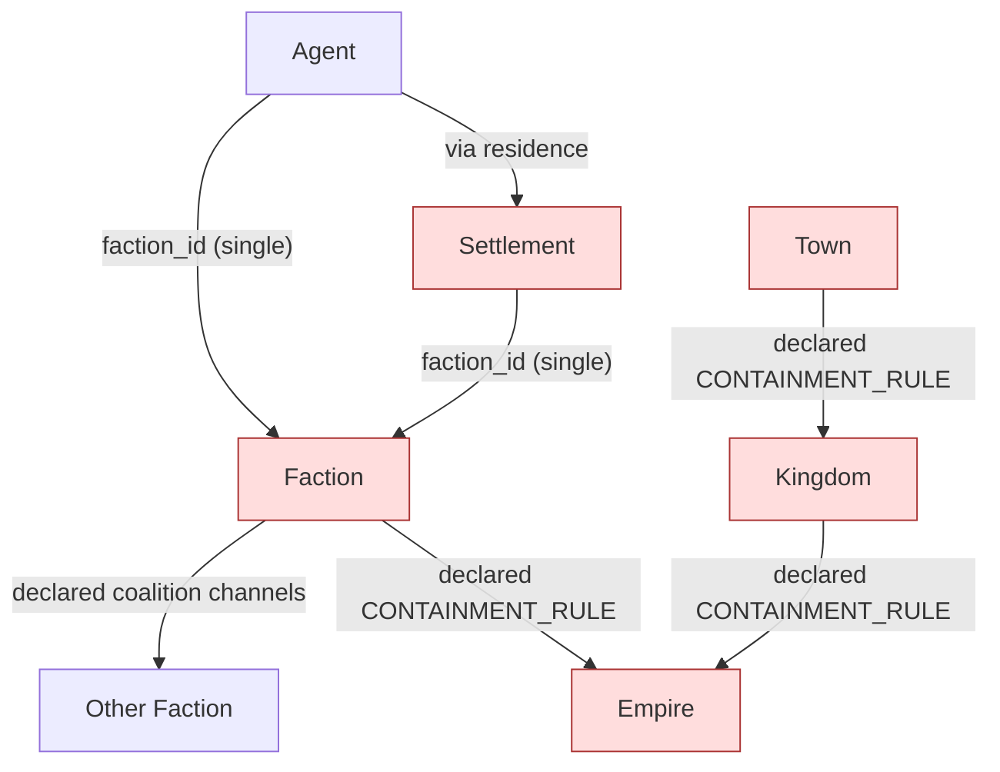
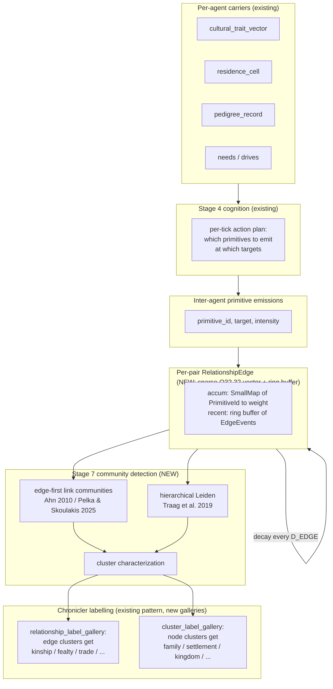
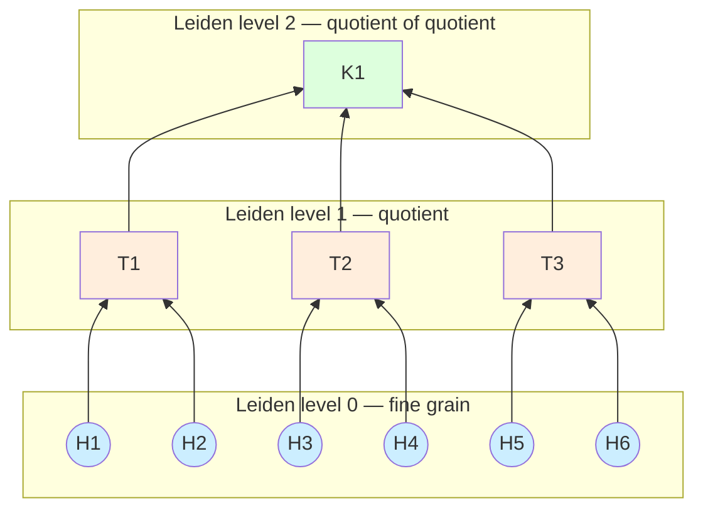
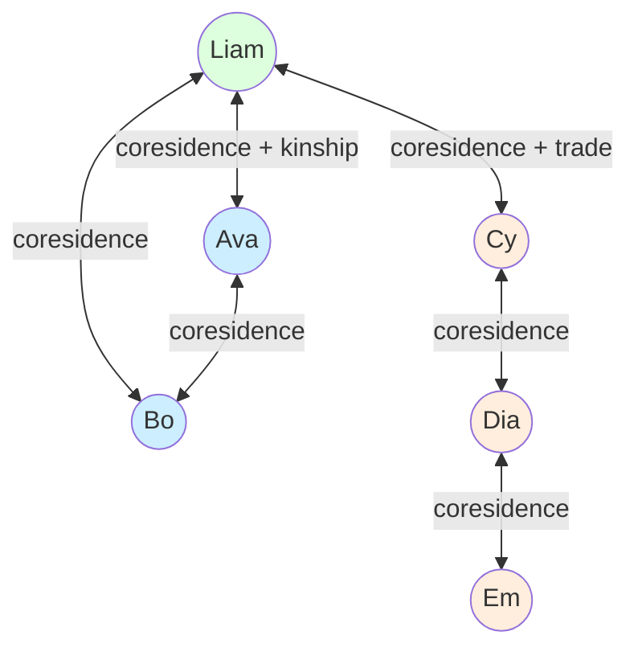
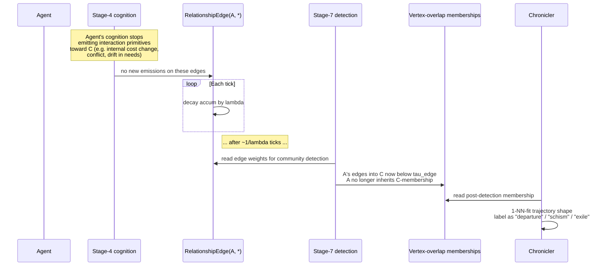

# 56 — Relationship-Graph Emergent Group Structure

**Status:** design proposal. Supersedes [55_multi_affiliation.md](55_multi_affiliation.md). Extends [50_social_emergence.md](50_social_emergence.md) by replacing the one-faction-per-agent assumption with a **typed multigraph** whose communities (and the relationship-types those communities sit on) are themselves emergent.

**Replaces:**

- The declared `group_prototype` and `containment_rule` registries proposed in doc 55. These authored *what kinds of groups exist* and *how they nest*; the project's emergence-first invariant says we don't get to author either.
- `Agent.faction_id` / `population_culture_id` (single-slot membership; from `systems/03_faction_social_model.md` and `50_social_emergence.md` §4.2).
- `SettlementEconomic.faction_id` (single-faction settlements; from `systems/04_economic_layer.md`).
- `FactionGate { faction, relation }` predicates (from `systems/08_npc_dialogue_system.md`).
- The implicit single-pack/single-herd assumption in `50_social_emergence.md` §5.

**Depends on:**

- The existing primitive vocabulary (`documentation/schemas/primitive_vocabulary/`). We add a `target_kind` tag to primitive manifests; the vocabulary itself is unchanged.
- Pillar P5 carriers (`cultural_trait_vector`, `pedigree_record`, `population_culture` — but these become *consequences* of graph-clustering rather than *primary state*).
- Stage 7 of the ECS schedule.
- The Chronicler labelling subsystem (already used for biomes, treaties, governance archetypes) and **Pillar P7 ([70_naming_and_discovery.md](70_naming_and_discovery.md))** — every cluster signature this design produces flows through P7's five-layer name-resolution pipeline. There is no `"unlabelled"` fallback in player view; P7 always resolves a name (or a sigil prompt for the player to coin one).

---

## 1. Problem statement

A "kingdom" is not a kind of thing the simulation knows about. Neither is a "town", a "guild", a "religion", a "family", or a "kinship tie". These are post-hoc *labels* that an observer attaches to recurring structural patterns in a graph of social interactions. If the simulation is to be emergence-first, then:

1. The kernel must not declare what relationship-types exist (no `kinship`, `fealty`, `trade` enum).
2. The kernel must not declare what group-types exist (no `polity`, `settlement`, `empire` enum).
3. The kernel must not declare a containment hierarchy between group-types (no "polity ⊂ empire" rule).
4. The kernel *must* model how individual interactions occur and accumulate, and provide deterministic algorithms to detect overlapping nested communities in the resulting graph.
5. Labels for both edge-clusters and node-clusters are 1-NN fits the Chronicler computes from cluster-feature-vectors — exactly the pattern doc 30 (biomes) and doc 50 (treaty types, governance archetypes) already use.

This document specifies that engine and the Chronicler labeling on top of it.

---

## 2. Research basis

### 2.1 Foundational

- **Simmel, G. (1908)** *Soziologie*, "Die Kreuzung sozialer Kreise" — society is the intersection of overlapping social circles, not partition into them.
- **Lorrain, F., White, H. (1971)** "Structural equivalence of individuals in social networks." *J. Math. Sociol.* 1 — *roles* (king, soldier, peasant) are structural patterns, not declared types. The basis for emergent role detection.
- **Granovetter, M. (1973)** "The strength of weak ties." *AJS* 78 — bridging edges between dense clusters are first-class structural entities, not reducible to within-cluster ties.
- **Burt, R. (1992)** *Structural Holes* — cross-cluster brokerage as a distinct structural position.
- **Hirschman, A. O. (1970)** *Exit, Voice, and Loyalty* — voluntary exit is continuous edge-strength decay, not a discrete event.
- **Wilson, D. S., Sober, E. (1994)** "Reintroducing group selection." *BBS* 17 — multilevel selection requires nested groups; the *nesting* must be derived to count as emergent.

### 2.2 Modern community detection (the substrate)

- **Mucha, P. J. et al. (2010)** "Community structure in time-dependent, multiscale, and multiplex networks." *Science* 328 — multilayer modularity; foundation for the project's multigraph approach.
- **Ahn, Y.-Y., Bagrow, J. P., Lehmann, S. (2010)** "Link communities reveal multiscale complexity in networks." *Nature* 466 — partition *edges* not nodes; nodes inherit communities from their edges, which gives node-overlap natively. **Critical for this design.**
- **Palla, G., Derényi, I., Farkas, I., Vicsek, T. (2005)** "Uncovering the overlapping community structure of complex networks in nature and society." *Nature* 435 — k-clique percolation; alternative overlap method.
- **Traag, V. A., Waltman, L., van Eck, N. J. (2019)** "From Louvain to Leiden: guaranteeing well-connected communities." *Sci. Rep.* 9 — the Leiden algorithm; deterministic with fixed seed; recursive form gives nested communities.
- **Peixoto, T. P. (2017–)** Bayesian stochastic block-modelling, including the *nested degree-corrected SBM*. Provides principled hierarchy + uncertainty without resolution limits, but with much higher cost than Leiden.
- **Karrer, B., Newman, M. E. J. (2011)** "Stochastic blockmodels and community structure in networks." *PRE* 83 — degree-corrected SBM.
- **Rossi, R., Ahmed, N. (2015)** "Role discovery in networks." *IEEE TKDE* 27 — roles as structural-equivalence clusters.

### 2.3 Recent literature (post-2023, surfaced for this design)

- **Sahu, S. (2024)** "A Starting Point for Dynamic Community Detection with Leiden Algorithm." arXiv:2405.11658 — incremental Leiden with batched edge updates; relevant for our Stage-7 cadence model.
- **Sahasrabudhe, A. et al. (2025)** "A Parallel Hierarchical Approach for Community Detection on Large-scale Dynamic Networks." arXiv:2502.18497 — parallel hierarchical Leiden with local-neighbourhood incremental updates.
- **Wang, X. et al. (2024)** "Finding multifaceted communities in multiplex networks." *Sci. Rep.* 14, article 65049 — a modularity measure that separates communities by overlapping *edge layers*, which is precisely our multigraph case.
- **Kojaku, S. et al. (2024)** "Network community detection via neural embeddings." *Nat. Commun.* 15 — comparison of embedding-based and traditional community detection. We do *not* propose embeddings (non-determinism cost too high), but the paper's benchmarking is useful calibration.
- **Hsu, A., Faradonbeh, M. K. S. (2024)** "Sequential Edge Clustering in Temporal Multigraphs." (NeurIPS GRL workshop, paper 27) — edge-clustering for time-evolving multigraphs that breaks the IID assumption — exactly our setting (recent activity is more weight-bearing).
- **Subelj, L. et al. (2025)** "Dynamic overlapping community detection via edge-centric temporal multilayer networks." Confirms the edge-clustering-then-promote-to-vertex approach is the dominant method for *overlap + dynamics + multilayer* simultaneously.
- **Pelka, M., Skoulakis, S. (2025)** "Detecting Patterns of Interaction in Temporal Hypergraphs via Edge Clustering." arXiv:2506.03105 — edge-clustering recovers vertex-overlap because a vertex is in *every* community to which any of its edges belong. Direct theoretical basis for the design below.
- **De Bacco, C. et al. (2024)** survey "Community Detection in Multilayer Networks: Challenges, Opportunities and Applications." arXiv:2511.23247 — current state-of-the-art survey; highlights that Leiden + edge-clustering hybrids are the practical sweet spot.

The convergent message across the recent literature is: **partition the edges first, derive vertex memberships from edge memberships.** This gives overlap natively and composes cleanly with hierarchical methods. We adopt this as the algorithmic core.

### 2.4 Anthropology / sociology that already grounded P5

- Read, D. (2007) — kinship as algebra over a relationship graph.
- Murdock, G. P. (1949) — residence rules.
- Cederman, L.-E. (1997) — agent-based polity formation.
- Carneiro, R. (1970), Turchin, P. (2003, 2016) — circumscription and secular cycles. These constrain *which clusters persist*, not what clusters look like; preserved as drivers, not as templates.

---

## 3. Core proposal in one paragraph

The kernel ships a **typed agent-pair multigraph** whose edges accumulate from inter-agent primitive emissions. Each edge is a sparse Q32.32 feature vector indexed by (registered or hashed) primitive-emission type plus a small ring buffer of recent events for short-term context. There is **no relationship-type vocabulary** in the kernel — clusters in edge-feature space yield emergent relationship-types (kinship-shaped, fealty-shaped, trade-shaped, ritual-shaped). At Stage 7 the kernel runs **edge-first community detection** (link-community partition over the multigraph) at registered cadences; vertex memberships are inherited from edge memberships, so a vertex naturally sits in many communities at once. **Hierarchical Leiden** is run recursively on the aggregated edge weights to expose the *nested* skeleton — kingdoms, towns, households are levels of the same dendrogram, not declared types. The Chronicler reads each detected cluster's structural-feature vector (size, density, persistence, edge-type composition, internal hierarchy index, spatial extent, overlap fraction) and 1-NN-fits an *etic* id from a registered prototype-gallery; that id is then the layer-5 input into the [P7 naming pipeline](70_naming_and_discovery.md), which resolves the player's actual visible name from a five-layer chain (player canonical → player alias → loan-word from a contact population → phonotactic auto-gen seeded by the player population's language channels → etic gallery). There is no `"unlabelled"` fallback in player view. Voluntary "leave" is not a primitive: an agent stops emitting interaction primitives toward a cluster of others, the edges decay, the next community-detection pass excludes them. Hierarchy, role, kinship-vs-trade-vs-fealty, kingdom, town, family — all of it is observed, none of it is declared.

---

## 4. Channels & carriers

### 4.1 Inter-agent primitive tag (additive, no new primitives)

Each entry in `documentation/schemas/primitive_manifest.schema.json` gains a field:

```jsonc
"target_kind": "self" | "broadcast" | "pair" | "group"
```

Existing primitives are tagged accordingly:

| Primitive | `target_kind` |
|---|---|
| `emit_acoustic_pulse` | broadcast |
| `emit_chemical_marker` | broadcast |
| `form_pair_bond` | pair |
| `form_host_attachment` | pair |
| `apply_bite_force` | pair |
| `inject_substance` | pair |
| `induce_paralysis` | pair |
| `absorb_substance` | self |
| `thermoregulate_self` | self |
| `temporal_integrate` | self |
| `spatial_integrate` | self |
| `apply_locomotive_thrust` | self |
| `enter_torpor` | self |
| `elevate_metabolic_rate` | self |
| `receive_acoustic_signal` | self |
| `receive_photic_signal` | self |

Only `pair` (and `group`, which decomposes into pair-emissions) primitives write to edges. The kernel does *not* know that `form_pair_bond` is "marriage" or "friendship" or "alpha–beta acceptance"; those are emergent labels.

> **Mods extend the vocabulary, not the channel-types.** A mod that adds `share_food`, `submit_to`, `deliver_tribute`, `give_gift`, `repay_debt`, `lead_ritual` is adding inter-agent primitives, not declaring relationship-types. The relationship-types those primitives compose into are still emergent.

### 4.2 New per-pair component: `RelationshipEdge`

Sparse, only allocated for pairs that have ever interacted.

```
RelationshipEdge(a: AgentId, b: AgentId) {
    // Continuous accumulator: dimension index k = registered primitive id k
    // Decays exponentially per tick. Q32.32 throughout.
    accum: SmallMap<PrimitiveId, Q32_32>,

    // Short-term ring buffer (last K events) for cognition-layer queries.
    // K is a calibration knob, default 16.
    recent: RingBuf<EdgeEvent, K_EDGE_RECENT>,

    // Last-touched tick, used by the GC to retire ancient zero-weight edges.
    last_touched: TickNumber,
}

EdgeEvent {
    tick: TickNumber,
    primitive_id: PrimitiveId,
    intensity: Q32_32,
    // direction: A→B or B→A (asymmetric primitives) or symmetric (both)
    direction: u8,
}
```

The pair `(a, b)` is canonicalised so `a < b` deterministically. Direction is encoded inside the event. There is **one** edge per pair from a storage standpoint, but each edge is a *vector* — that is what gives the multigraph its multiplexity.

#### Why one vector-edge instead of multiple labelled edges?

Either representation can be made equivalent. We choose the vector form because:
- Storage is sparse and aligned with the existing primitive registry (registered-id-keyed maps are already idiomatic in `beast-channels`).
- Decay and accumulation operations vectorise.
- Edge-clustering (link communities) treats this exactly as a multigraph by clustering edges in the joint feature-space.

Externally, **everything that wants to see a labelled multigraph sees one**: the projection `(a, b, primitive_id) ↦ accum[primitive_id]` is the multigraph view.

### 4.3 No relationship-type registry

There is no list of "the social relationships". Mods add inter-agent primitives; they do **not** add relationship-type names. The vocabulary of relationship-types — what counts as "kinship-shaped", what counts as "fealty-shaped" — is the output of an edge-clustering pass and a Chronicler 1-NN fit. Modders extend that vocabulary by adding **edge-cluster prototype labels** to the same prototype-gallery JSON pattern used for biomes (`30_biomes_emergence.md`) and governance archetypes (`50_social_emergence.md` §4.3).

### 4.4 Existing carriers retained (no schema change)

- `cultural_trait_vector` — still useful as an *extra* input feature on edges (cultural distance between A and B is an edge feature dimension). It is no longer the primary clustering input.
- `pedigree_record` — generates `pair`-targeted "biological-kin-edge" emissions at birth (a one-shot primitive emission per parent–child pair, plus subsequent care/teaching emissions). Kinship as we know it is *not* the pedigree; it is the cluster on edge-feature space dominated by these primitives.
- `residence_cell` — generates "coresidence" pair-emissions (one per tick per co-resident pair, with intensity scaled by interaction probability).
- `population_culture` — re-derived from the graph (it's a node-cluster, just like a polity is, just at a different Leiden level).

---

## 5. Update rules

### 5.1 How interactions emerge (Stage 4)

```
fn agent_interaction_step(agent: &mut Agent, world: &World, tick: TickNumber) {
    // Cognition (existing) selects an action plan: which primitives to emit, at whom.
    let plan = agent.cognition.plan(world, tick);                  // already exists
    for (primitive_id, target, intensity) in plan.emissions() {
        let proto = world.primitive_registry.get(primitive_id);
        match proto.target_kind {
            TargetKind::Self_ => apply_self(agent, primitive_id, intensity),
            TargetKind::Broadcast => emit_broadcast(world, agent, primitive_id, intensity),
            TargetKind::Pair => {
                let edge = world.edges.get_or_create(agent.id, target);
                edge.accum_inc(primitive_id, intensity, &world.params);  // see 5.2
                edge.recent.push(EdgeEvent { tick, primitive_id, intensity, direction: dir_of(agent.id, target) });
                edge.last_touched = tick;
            }
            TargetKind::Group => decompose_into_pairs(world, agent, target, primitive_id, intensity),
        }
    }
}
```

Cognition is unchanged — it already exists in P5/P6 and will be specified further in `60_culture_emergence.md`. The new contract is only: cognition decides *which primitive to emit at whom*, and the engine deterministically accumulates the result into an edge.

#### What drives cognition to choose interaction primitives?

This is the same cognition layer that already drives self-targeted primitives. Inputs:
- Internal carriers (needs vector, cultural_trait_vector sample, energy, etc.)
- External signals (perceived agents within social_reach, their visible primitive emissions)
- Existing edge state for pairs the agent has interacted with (accum and recent buffer)
- Reciprocity: if B emitted X at A last tick, A's policy gets a feature-conditioned response

The phenotype interpreter is unchanged. No new system; we are extending what the cognition layer reads and writes.

### 5.2 Edge accumulation and decay

```
fn edge_accum_inc(edge: &mut RelationshipEdge, p: PrimitiveId, intensity: Q32_32, params: &Params) {
    let cur = edge.accum.get(p).copied().unwrap_or(Q32_32::ZERO);
    edge.accum.insert(p, cur + intensity);
}

fn edge_decay_step(edge: &mut RelationshipEdge, params: &Params, tick: TickNumber) {
    // Run every D_EDGE ticks. Decay exponentially.
    for entry in edge.accum.iter_mut() {
        entry.value = entry.value * (Q32_32::ONE - params.lambda_per_primitive[entry.key]);
    }
    edge.accum.retain(|_, v| *v > params.eps_edge);
    if edge.accum.is_empty() && tick - edge.last_touched > params.gc_age {
        // GC: retire fully decayed edges.
        edge.dead = true;
    }
}
```

`lambda_per_primitive` is a registered Q32.32 decay rate per primitive type — slow for `form_pair_bond` (memory-like ties), fast for `apply_bite_force` (recency-weighted threat). Registered alongside the primitive manifest, default value supplied by the kernel, mod-extensible.

This decay is the **only mechanism behind voluntary leave**: stop emitting, edges fade, your community memberships drop in the next detection pass.

### 5.3 Multilayer community detection (the engine)

Stage 7 runs the following pipeline at registered cadences:

```
fn community_detection_step(world: &mut World, tick: TickNumber) {
    let g = world.edges.snapshot();          // canonical sorted-id edge list
    if tick % CADENCE_LINK == 0 {
        // (A) Edge-first: cluster the edges in their feature-space.
        // Output: per-edge primary cluster id; one edge can carry overlap if
        // the link-clustering dendrogram puts it in a soft-merge zone.
        let edge_clusters = link_communities_q32(&g, world.params.tau_edge);
        world.edge_clusters.replace(edge_clusters);

        // (B) Vertex memberships inherit from edges.
        //     A vertex v is in cluster c iff any of v's edges are in c
        //     (Ahn 2010 inheritance; Pelka & Skoulakis 2025).
        world.vertex_overlap_clusters.recompute_from_edges();
    }

    if tick % CADENCE_LEIDEN_L0 == 0 {
        // (C) Leiden on the aggregate (sum-of-features) weighted graph,
        //     producing a *partition* at the finest granularity. This is the
        //     nested-skeleton level 0.
        world.leiden_l0.replace(leiden_q32(&g.aggregate(), world.params.gamma_l0));
    }
    if tick % CADENCE_LEIDEN_L1 == 0 {
        // (D) Recurse: build a quotient graph over level-0 communities, run
        //     Leiden again. This is level 1. Continue up to MAX_LEIDEN_LEVELS.
        recurse_leiden(world);
    }

    // (E) Cluster characterization (computes feature vectors for the Chronicler).
    if tick % CADENCE_CHARACTERIZE == 0 {
        characterize_clusters(world);
    }

    // (F) Chronicler labeling: 1-NN cluster on (cluster-feature-vector) against
    //     the registered prototype gallery. Same code path as P3 biome labeling.
    if tick % CADENCE_CHRONICLER == 0 {
        chronicler_label(world);
    }
}
```

Cadences are tunable per registry. Defaults: `CADENCE_LINK = 64`, `CADENCE_LEIDEN_L0 = 64`, `CADENCE_LEIDEN_L1 = 256`, `CADENCE_LEIDEN_L2 = 1024`, `CADENCE_CHARACTERIZE = 256`, `CADENCE_CHRONICLER = 1024`. The slow upper levels (kingdoms, empires) are exactly the levels that change slowly, so this is naturally cost-aligned.

#### Why edge-first then Leiden?

Per the recent literature in §2.3 (Pelka & Skoulakis 2025, Subelj et al. 2025, Hsu & Faradonbeh 2024), edge-first methods give vertex-overlap natively and Leiden gives clean nested partitions. They aren't redundant: link communities give the **overlap structure** (a person in clan-edge-cluster *and* guild-edge-cluster *and* coresidence-edge-cluster); Leiden gives the **hierarchy** (level 0 households inside level 1 settlements inside level 2 polities). The two views co-exist. The Chronicler can label clusters from either view.

#### Why not nested SBM?

Peixoto's nested DC-SBM is the most principled option (no resolution limit, native uncertainty, no parameter tuning). We don't ship it as the primary because:
1. MCMC inference is hard to make tick-budget-bounded.
2. Q32.32 reimplementation is much heavier than for Leiden/link-communities.
3. The marginal sim-fidelity gain over edge-first + hierarchical-Leiden is small in our setting (small networks, frequent updates, dense edge structure once interactions are flowing).

We leave SBM as an *optional secondary* algorithm registered alongside the primary pair, available for offline analysis or for mods that need it.

### 5.4 Cluster characterization

For each detected cluster (at any level, in either the link-community view or the Leiden view), we compute a feature vector. This is what the Chronicler clusters on.

| Feature | What it measures | Computed how |
|---|---|---|
| `size` | # member vertices | count, sorted-id |
| `density` | internal-edge density | `2E/V(V-1)` over aggregated weights |
| `persistence` | how long this cluster has existed in roughly its current form | tracked across detection passes by Jaccard match |
| `edge_type_composition` | distribution over primitive ids inside vs. across cluster boundary | normalised primitive-histogram of internal edges |
| `boundary_isolation` | (internal edge weight) / (boundary edge weight) | conductance-style |
| `internal_hierarchy_index` | Krackhardt's hierarchy / flow-hierarchy index over directed primitives | DAG-acyclicity ratio on directed primitive subgraph |
| `leader_centrality_skew` | Gini coefficient over in-degree on directed primitives | Gini in Q32.32 |
| `spatial_extent` | bounding-cell count (P3) | union of `residence_cell` over members |
| `spatial_compactness` | (member residence-cell density) | members per cell |
| `cultural_cohesion` | inverse-variance of `cultural_trait_vector` over members | reuse P5 formula |
| `kinship_density` | fraction of internal edges with high pedigree-derived primitive | from edge composition |
| `overlap_fraction` | fraction of members shared with at least one other cluster of similar size | from link-community vertex inheritance |
| `containment_depth` | which Leiden level this cluster lives at | trivially from the recursion |

Each feature is Q32.32. The characterisation step iterates clusters in sorted-id order. Persistence is tracked cluster-id-stably: when a cluster's Jaccard with any prior-tick cluster exceeds `J_PERSIST`, the new cluster inherits the prior id.

### 5.5 Chronicler labelling — emergent vocabularies via the P7 naming pipeline

**Both edge-clusters and node-clusters are cluster signatures, and cluster signatures are exactly the input that the Pillar 7 naming-and-discovery pipeline (`70_naming_and_discovery.md`) was designed for.** This design *consumes* P7; it does not define its own labelling behaviour. The two galleries below are the **etic** half — one of five name-source layers in P7's resolution chain. The full chain is:

| Priority | Name source | Where it lives |
|---|---|---|
| 1 | Player canonical choice (per cluster, in player bestiary) | UI / save-derivative |
| 2 | Player alias the player typed before any in-world name was available | UI / save-derivative |
| 3 | Loan-word from a contact-population's lexicon (P6a iterated learning) | sim state: `population.lexicon` |
| 4 | Phonotactic auto-gen seeded by `(cluster_sig, lang_id, world_seed)` from the player population's language channels | sim state: `population.lexicon` |
| 5 | Etic gallery 1-NN match (the JSON prototypes below), shown italicised as an "outsider/scientific" label | registered gallery |
| — | Sigil placeholder `∅ unnamed` + UI prompt to coin (only when none of 1–5 produces anything) | UI only |

The literal string `"unlabelled"` does not exist anywhere in the player-facing system. A cluster the player has observed but for which no in-world population has a lexicon entry is the player's **opportunity to coin one**, which becomes a real `NamingEvent` in the input log and propagates through P6a iterated learning at speaker-weight `social_standing × interaction_frequency × player_presence_multiplier`. See `70_naming_and_discovery.md` §4 for the mechanism.

Two consequences worth stating explicitly:

1. **Relationship-types get per-population names too.** Different populations may carve the relationship-type space differently — one might lump biological-kin and adoptive-care into one cluster (and one lexeme), another might split them. Each population's lexicon for an edge-cluster signature is whatever its speakers have coined or borrowed. The `edge_label.kinship` etic prototype below is what an outside Chronicler labels the cluster; the players actually inside the world hear the population's own emic name.
2. **Group-types get per-population names too.** "Kingdom" is the etic label; the Riverkin call their polity something derived from their phonotactic profile, the Highlanders call theirs something else, and the player's avatar's bestiary shows whichever name the player's population has loaned-in or coined.

#### `relationship_label_gallery.json` — etic prototypes for edge-clusters

A registered list of `(etic_label_id, prototype-feature-vector)` pairs. The Chronicler 1-NN-fits each detected edge-cluster's primitive-histogram (and aux features like symmetry, persistence, `pair_kinship_distance`) against the gallery; the matched id becomes the *etic* label fed into the P7 chain at layer 5. Examples of what the kernel ships and what mods extend:

```jsonc
{
  "id": "edge_label.kinship",
  "prototype": {
    "primitive_histogram_dominant": ["form_pair_bond", "share_food", "parent_care"],
    "symmetry_mean": 0.9, "persistence_min": 5000
  }
}
{
  "id": "edge_label.fealty",
  "prototype": {
    "primitive_histogram_dominant": ["submit_to", "deliver_tribute"],
    "symmetry_mean": 0.05, "persistence_min": 2000
  }
}
{
  "id": "edge_label.trade",
  "prototype": {
    "primitive_histogram_dominant": ["give_gift", "repay_debt", "share_food"],
    "symmetry_mean": 0.6, "persistence_min": 800
  }
}
{
  "id": "edge_label.combat",
  "prototype": {
    "primitive_histogram_dominant": ["apply_bite_force", "inject_substance"],
    "symmetry_mean": 0.5, "persistence_min": 100
  }
}
```

An edge-cluster whose feature vector is far from every gallery prototype gets **no etic id** — but the cluster signature itself is well-defined and stable, and the P7 pipeline still produces a name for it: a population that has interactions matching that cluster will have a phonotactic-gen lexicon entry for it (layer 4), and the player can coin or alias it (layers 1–2). The kernel never invents a new etic gallery entry — that remains a mod or kernel-data update — but neither does the player ever see "unlabelled". The five-layer chain always resolves before that fallback.

#### `cluster_label_gallery.json` — etic prototypes for node-clusters

Same pattern, indexed by the cluster-feature-vector from §5.4. The matched id becomes the *etic* label fed into the P7 chain at layer 5. Examples:

```jsonc
{
  "id": "cluster_label.household",
  "prototype": {
    "size": [2, 12], "kinship_density": [0.7, 1.0],
    "spatial_compactness_high": true, "containment_depth": 0
  }
}
{
  "id": "cluster_label.settlement",
  "prototype": {
    "size": [10, 500], "spatial_compactness_high": true,
    "edge_type_composition_dominant": ["coresidence", "trade"],
    "containment_depth": 1
  }
}
{
  "id": "cluster_label.kingdom",
  "prototype": {
    "size": [500, 50000],
    "edge_type_composition_dominant": ["fealty", "trade"],
    "internal_hierarchy_index_high": true,
    "leader_centrality_skew_high": true,
    "containment_depth": 2,
    "contains_clusters_labelled": ["settlement"]
  }
}
{
  "id": "cluster_label.guild",
  "prototype": {
    "edge_type_composition_dominant": ["trade", "shared_craft"],
    "internal_hierarchy_index_low": true,
    "spatial_extent_dispersed": true,
    "overlap_fraction_high": true
  }
}
{
  "id": "cluster_label.religion",
  "prototype": {
    "edge_type_composition_dominant": ["ritual_coparticipation"],
    "spatial_extent_dispersed": true,
    "cultural_cohesion_high": true,
    "overlap_fraction_high": true
  }
}
{
  "id": "cluster_label.pack",
  "prototype": {
    "size": [3, 30], "kinship_density": [0.5, 1.0],
    "spatial_compactness_high": true,
    "internal_hierarchy_index_high": true,
    "sapience_low": true, "containment_depth": 0
  }
}
```

A "kingdom" is defined entirely by structural features. Anything that satisfies the prototype gets the etic id `cluster_label.kingdom`; the populations *inside* it call it whatever they call it (their own phonotactic-gen or coined lexeme); the player's bestiary shows whichever name flows out of the P7 resolution chain for the player's avatar's population. The kernel ships a starter etic gallery; mods extend it freely.

> **The kernel itself contains zero references to the strings "kingdom", "town", "guild", etc.** They appear only in JSON galleries that the Chronicler reads, and even those are only the etic layer (5) of the P7 chain. Per the Mechanics-Label-Separation invariant, this is the right boundary; per P7, the etic gallery is one input among five, not the canonical name.

#### Discovery thresholds (reuses P7 §4.5)

`bestiary_observations` already gates visibility per-cluster per-observer. The same thresholds apply to relationship-clusters and node-clusters:

| `observations` | Player-side visibility |
|---|---|
| 0 | invisible |
| 1 — `T_glimpse` | sigil-only ("seen but unnamed") |
| `T_glimpse` — `T_name` | player can coin alias; phonotactic-gen suggested; etic italicised hint |
| `> T_name` | loan-words from contact populations surface |
| `> T_canonised` | full naming history (who, when, in which language) shown in bestiary |

### 5.6 Voluntary leave

There is no `leave` primitive and no `allegiance_field`. Leaving is what edge decay *means*:

1. Agent stops emitting interaction primitives toward members of cluster C.
2. Edges decay over the next ~`1/λ` ticks.
3. Edge-cluster membership for those edges drops below `τ_edge`.
4. Vertex-inheritance no longer assigns the agent to cluster C.
5. The Chronicler may label the trajectory "departure", "exile", "schism", "estrangement", depending on whether neighbours decay correlated, whether antagonistic primitive emissions accompany the decay, etc.

The agent's choice is in their cognition policy; the structural consequence falls out of the algorithm.

#### What about leaving by a discrete action?

A mod may register a `renounce` inter-agent primitive that emits a single large negative-value entry on certain edges (e.g., a rite that publicly burns the bond). That is an action that *accelerates* edge decay, not a special-cased leave mechanism — same machinery. A kernel-level `kill_edge` operator is also available for catastrophic events (death of one party).

---

## 6. Diagrams

### 6.1 What we are throwing away



Every red box and every "declared" edge is something the designer has to author. The criticism in this round is that this includes the box labels themselves.

### 6.2 The new pipeline — primitives all the way down



The only authored thing in this whole pipeline is the **inter-agent primitive vocabulary** (which is the existing primitive vocabulary, plus a `target_kind` tag) and the **prototype galleries** that the Chronicler uses to attach human-readable labels (which are JSON data, mod-extensible, and have no behavioural effect on simulation).

### 6.3 A "kingdom" emerging — same picture at three Leiden levels



After characterisation:

- H1–H6: high `kinship_density`, small size, `containment_depth=0` → Chronicler fits prototype `cluster_label.household`.
- T1–T3: moderate size, high spatial compactness, edges dominated by coresidence + trade, `containment_depth=1` → fits `cluster_label.settlement`.
- K1: large, fealty-dominated edges, high `internal_hierarchy_index`, `containment_depth=2`, contains settlement-labelled clusters → fits `cluster_label.kingdom`.

If the same K1 cluster were instead spatially dispersed, fealty-poor, ritual-rich, it would fit `cluster_label.religion` instead. **The label is a function of structure, not of declaration.**

### 6.4 Overlap at the same level — owning a house in two towns



Liam emits *coresidence* primitives in two locales (he stays at Ava-Bo's place half the time and at Cy-Dia-Em's place the other half). Edges accumulate in both locales. Edge-first link clustering puts Liam–Ava, Liam–Bo edges in cluster `T1` and Liam–Cy edge in cluster `T2`. **Liam inherits both cluster memberships at the same Leiden level**, because vertex-membership is the union over the agent's edges. He is a resident of two towns. No special-casing required.

### 6.5 Leave-by-decay sequence



---

## 7. Tradeoff matrix

| Decision | Options | Sim Fidelity | Implementability | Player Legibility | Emergent Power | Choice + Why |
|---|---|---|---|---|---|---|
| Source of group structure | Declared types / Declared types + emergent strengths / **Fully emergent from interaction graph** | Emergent strong | Emergent moderate | Emergent moderate (UI must show evolving labels) | Emergent maximal (kingdoms/towns/guilds/religions all from same engine) | **Fully emergent.** Matches the project's biome and treaty pattern; honours emergence-first invariant |
| Edge representation | Multiple labelled edges per pair / **Single vector edge per pair (multigraph projection)** / Stream of events only | Same expressive power | Vector strong (sparse, decays vectorised) | Same | Same | **Single vector edge.** External views project to multigraph; storage and ops vectorise |
| Relationship-type vocabulary | Hardcoded enum / Registry of types / **Emergent from edge-clustering + Chronicler 1-NN gallery** | Emergent strong (Lorrain & White 1971; Ahn 2010) | Emergent moderate (one extra clustering pass) | Lower (labels can drift) | Maximal (mods add labels without changing kernel) | **Emergent + Chronicler gallery.** Same machinery as biomes |
| Hierarchy source | Declared parent edges / Declared rules / **Recursive Leiden levels + leader-centrality** | Recursive strong | Recursive moderate | Same | Recursive maximal (kingdoms-of-kingdoms, federations, vassalage chains all expressible) | **Recursive Leiden + leader-centrality.** Hierarchy is a feature of the data, not authored |
| Within-level overlap | Tree (Leiden alone) / **Edge-first link communities + Leiden levels** / Tag-based | Edge-first strong (Ahn 2010; Pelka & Skoulakis 2025) | Edge-first moderate | Same | Edge-first strong (one person, two towns; trans-border guilds; dual loyalties) | **Edge-first link communities** layered with Leiden hierarchy. Recent literature converges here |
| Algorithm choice | Leiden only / **Leiden + link communities** / Nested SBM (Peixoto) / Embeddings + clustering | Leiden+LC strong | Leiden+LC moderate (well-studied, deterministic with fixed seed) | Same | Leiden+LC strong | **Leiden + link communities.** SBM principled but per-tick budget-incompatible. Embeddings non-deterministic at our resolution |
| Voluntary leave mechanism | Special "leave" primitive / Allegiance carrier / **Edge decay alone** | Decay strong (Hirschman continuous exit) | Decay simplest (already needed for short-term memory) | Same | Decay strong (gradual drift, mass-defection, partial exit all expressible without special cases) | **Edge decay alone.** No new mechanism; emergent from cognition + decay |
| Save state | Store edges + carriers + cluster labels / **Store edges + carriers; recompute clusters on load** / Hybrid | Recompute strong (no derived state on disk) | Recompute easy | Same | Same | **Recompute on load.** One full Stage-7 pass post-load; preserves the "derived state never on disk" invariant |
| Determinism strategy | Float clustering with seed / **Q32.32 reimpl of Leiden + link clustering** / Quantise float results | Q32.32 strong (no float in sim path) | Q32.32 moderate (Leiden math is sums of weighted edges; ports cleanly) | Same | Same | **Q32.32 reimpl.** Already the project standard; algorithms admit it |
| Cluster persistence tracking | New ids each pass / **Jaccard-match to prior pass; inherit id when J > τ** / Stochastic match | Jaccard strong (clusters that "are the same" stay the same) | Jaccard moderate | Same | Jaccard strong (UI can show "this kingdom" across history) | **Jaccard match with persistence threshold.** Standard in dynamic-community-detection literature |

---

## 8. Emergent properties

1. **Kingdoms emerge.** A connected sub-population whose internal interactions are dominated by directed-asymmetric primitives (mod-supplied `submit_to`, `deliver_tribute`) and whose structure has high in-degree skew naturally fits `cluster_label.kingdom`. Without those primitive types being emitted, the same population might fit `cluster_label.confederation` or `cluster_label.tribe`. The label is a derivative of the behaviour, not a goal.
2. **Guild-like overlap.** Smiths in two settlements maintain trade primitives among themselves at higher frequency than coresidence primitives. Edge-first link clustering puts these inter-settlement edges in their own cluster; the smiths inherit two cluster memberships (their settlement plus the guild). Trans-border guilds are a basic side effect of the algorithm.
3. **Cross-cutting cleavages reduce conflict.** When religion-cluster overlap and polity-cluster boundaries cut differently, an agent has incoming interaction primitives from both sides; the cognition layer's reciprocity term dampens hostile primitive emissions toward co-religionists in the rival polity. Lipset & Rokkan 1967 falls out of the dynamics.
4. **Roles emerge.** Within any cluster, agents with high in-degree on certain primitives (deliver_tribute targets, follow targets, ask_advice targets) are leaders in those role-channels. The `leader_centrality_skew` feature on a cluster captures this; the Chronicler can additionally label individuals with role-strings drawn from a separate role-gallery.
5. **Peripheral and bridge agents are first-class.** A vertex that is in the boundary of multiple clusters (low-strength edges into many) without being central to any is a *broker* (Burt 1992). The link-community algorithm exposes this directly via low membership-strength in many clusters.
6. **Schisms and secessions.** If a sub-cluster's internal edges grow while its boundary edges to a parent cluster decay, the next Leiden pass at the relevant level produces a split. Persistence tracking gives the new cluster a fresh id but records the lineage. The Chronicler labels the trajectory "schism" or "secession" depending on whether antagonistic primitives accompanied the decay.
7. **Pack-to-polity continuity at sapience boundary.** A non-sapient lineage's communities exist via `coresidence` + `kinship` primitives only and fit `cluster_label.pack`. When neural_speed evolves through the sapience threshold, the lineage starts to emit additional primitive types (cooperation, ritual, fealty); cluster characterisation shifts; the same lineage's clusters now fit different labels. The transition from beast-pack to proto-polity has no special case.
8. **Network ecology.** The exact same engine, fed `predation_primitive` + `pollination_primitive` + `mutualistic_attachment_primitive` edges, produces species-cluster and food-web-cluster structures. Scale-band unification is preserved.
9. **Multilevel selection sees nested groups.** Wilson & Sober require nested groups to talk about group-level selection. The Leiden recursion *is* the nesting. Group-level selection on level-1 clusters (settlements) competing within level-2 clusters (polities) becomes expressible without authoring.
10. **Religion as a derived label, with diasporas.** A wide-spread cluster dominated by ritual primitives, low spatial compactness, high cultural cohesion → fits `cluster_label.religion`. Members in many polity-clusters; overlap fraction high. Diasporas are a structural property of the cluster, observable at the cluster-feature-vector level.

---

## 9. Cross-pillar hooks

```mermaid
flowchart LR
    EVO[evolution / sapience]
    P3[P3 Biomes / cells]
    P4[P4 Ecology]
    P5cult[P5 cultural_trait_vector]
    P5ped[P5 pedigree_record]
    P56[56 Relationship-graph engine]
    P6[P6 Culture / tech / econ /<br/>cog / disease / migration]
    P7[P7 Naming &<br/>Discovery pipeline]
    Chron[Chronicler<br/>etic galleries]
    UI[UI / Bestiary / Map]
    
    EVO -->|primitive vocabulary,<br/>cognition policy| P56
    P3 -->|residence_cell drives<br/>coresidence primitive emission| P56
    P5ped -->|kin primitive emissions<br/>at birth + care| P56
    P5cult -->|cultural distance<br/>as edge feature| P56
    P56 -->|cluster signatures<br/>edge + node| Chron
    P56 -->|cluster signatures| P7
    Chron -->|etic gallery 1-NN ids<br/>(layer 5 input)| P7
    P5cult -->|phonotactic profile<br/>per population| P7
    P7 -->|resolved per-population<br/>+ per-player names| UI
    P56 -->|cluster persistence,<br/>leader detection| P6
    P6 -->|technology / disease /<br/>migration shock primitive emissions| P56
    P56 -->|hierarchy + overlap<br/>structure| UI
    P4 -->|carrying-capacity → density →<br/>encounter-rate → primitive flux| P56
```

---

## 10. Determinism checklist

- [x] Edge canonicalisation: pair `(a, b)` always stored with `min(a,b) < max(a,b)`, sorted-id.
- [x] Decay step iterates edges in sorted-id order, Q32.32 throughout.
- [x] Link-community partition uses deterministic edge-ordering and a stable tie-break rule (`primary > secondary id`, fixed seed for the agglomerative step).
- [x] Leiden uses the project's `rng_leiden` Xoshiro stream, sorted-id node ordering, deterministic move-application.
- [x] Recursive Leiden: quotient-graph node ids minted from a deterministic counter over sorted constituent-id tuples.
- [x] Cluster characterization iterates clusters in sorted-id order; histograms accumulate in primitive-id order.
- [x] Persistence Jaccard match: when ties exist, lower-id prior cluster wins; tie-break deterministic.
- [x] Chronicler 1-NN: same code path as P3 biomes (already determinism-vetted).
- [x] All cadences are `tick % cadence == 0`; no wall-clock.
- [x] Save state = edges + carriers; one Stage-7 pass on load reproduces all derived clusters and labels exactly.

---

## 11. Open calibration knobs

- `lambda_per_primitive[k]` — decay rate per inter-agent primitive type (registered alongside the primitive).
- `K_EDGE_RECENT` — ring-buffer size on each edge.
- `eps_edge`, `gc_age` — edge GC thresholds.
- `tau_edge` — link-community cut threshold.
- `gamma_l0`, `gamma_l1`, `gamma_l2` — Leiden resolution per level.
- `MAX_LEIDEN_LEVELS` (default 4).
- Cadences: `CADENCE_LINK`, `CADENCE_LEIDEN_L0..L3`, `CADENCE_CHARACTERIZE`, `CADENCE_CHRONICLER`.
- `J_PERSIST` — Jaccard threshold for persistence-id inheritance.
- `MIN_CLUSTER_SIZE` per level (clusters below are not characterised — counted as noise).
- `social_reach` — already exists in `Agent`; bounds which pairs even *can* form an edge.

---

## 12. Implementation touch-points

Carries forward all five touch-points from doc 55 §12, plus new ones for the graph engine. Recommended sprint placement: **post-S6** (after `beast-sim` lands and the determinism CI gate is enforceable) and **after** the first cognition-layer prototype is in place (otherwise the graph stays empty).

1. **`crates/beast-core`** — `RelationshipEdge` component, `EdgeEvent` ring buffer, `target_kind` enum on primitives.
2. **`crates/beast-channels`** — extend `primitive_manifest.schema.json` with `target_kind` and `lambda_decay`; tag the existing 16 primitives.
3. **`documentation/schemas/`** — add `relationship_label_gallery.schema.json` and `cluster_label_gallery.schema.json` with example entries. Both are *etic* galleries (P7 layer 5); their entries supply ids, not displayed names.
3a. **`70_naming_and_discovery.md`** — confirm that `ClusterSig` covers both edge-cluster signatures and node-cluster signatures from this design (no new mechanism in P7; it already accepts arbitrary cluster signatures, but the doc currently lists biome/faction/ideology/coalition/good/language-family — extend the list to enumerate edge-cluster and node-cluster signatures from doc 56).
4. **NEW crate `beast-graph`** (planned but not yet listed in `CRATE_LAYOUT.md`) — Q32.32 implementations of:
   - Hierarchical Leiden
   - Link-community detection (Ahn 2010 in fixed-point)
   - Cluster characterisation
   - Persistence tracking via Jaccard
   - Open a follow-up issue to slot this crate into the layered DAG (likely L4 — sits above `beast-channels` and `beast-primitives`, below `beast-sim`).
5. **`documentation/architecture/CRATE_LAYOUT.md`** — register `beast-graph` and document its layer.
6. **`documentation/architecture/ECS_SCHEDULE.md`** — Stage 7 substages for community detection and characterization, with their cadences.
7. **`documentation/systems/03_faction_social_model.md`** — `Agent.faction_id` removed; replaced by *derived* membership-set from the relationship graph.
8. **`documentation/systems/04_economic_layer.md`** — `SettlementEconomic.faction_id` and the entire "Settlement entity" representation are derived (a settlement is the level-1 Leiden cluster spatially compact at the relevant cells, with the Chronicler label `cluster_label.settlement`); economic redistribution formulas read membership instead.
9. **`documentation/systems/08_npc_dialogue_system.md`** — `FactionGate` becomes `MembershipGate { cluster_id?, label?, role? }`.
10. **`documentation/emergence/50_social_emergence.md`** — `population_culture` is now a *derived* node-cluster that the Chronicler labels with the gallery prototype `cluster_label.population_culture`. The `faction_clustering_step` is removed; there is one cluster-detection step covering all node-clusters.
11. **`documentation/INVARIANTS.md`** — add invariant: *"the kernel does not declare relationship-types or group-types; both vocabularies are Chronicler galleries"*.
12. **GitHub** — open epic `Relationship-Graph Emergent Group Structure` referencing this doc; story-issues per touch-point.

---

## 13. Sources

### Foundational

- Simmel, G. (1908). *Soziologie*. Duncker & Humblot. Ch. "Die Kreuzung sozialer Kreise."
- Lorrain, F., White, H. C. (1971). "Structural equivalence of individuals in social networks." *Journal of Mathematical Sociology* 1: 49–80.
- Granovetter, M. (1973). "The strength of weak ties." *AJS* 78.
- Burt, R. (1992). *Structural Holes*. Harvard UP.
- Hirschman, A. O. (1970). *Exit, Voice, and Loyalty*. Harvard UP.
- Wilson, D. S., Sober, E. (1994). "Reintroducing group selection." *BBS* 17.
- Read, D. (2007). "Kinship theory: a paradigm shift." *Ethnology* 46.
- Carneiro, R. (1970). "A theory of the origin of the state." *Science* 169.
- Turchin, P. (2003) *Historical Dynamics*; (2016) *Ages of Discord*.

### Community detection (canon)

- Mucha, P. J., Richardson, T., Macon, K., Porter, M. A., Onnela, J.-P. (2010). "Community structure in time-dependent, multiscale, and multiplex networks." *Science* 328: 876–878.
- Ahn, Y.-Y., Bagrow, J. P., Lehmann, S. (2010). "Link communities reveal multiscale complexity in networks." *Nature* 466: 761–764.
- Palla, G., Derényi, I., Farkas, I., Vicsek, T. (2005). "Uncovering the overlapping community structure of complex networks in nature and society." *Nature* 435: 814–818.
- Karrer, B., Newman, M. E. J. (2011). "Stochastic blockmodels and community structure in networks." *PRE* 83.
- Traag, V. A., Waltman, L., van Eck, N. J. (2019). "From Louvain to Leiden: guaranteeing well-connected communities." *Sci. Rep.* 9: 5233.
- Peixoto, T. P. (2017). "Bayesian stochastic blockmodeling." (arXiv 1705.10225) — covers nested DC-SBM with MDL.
- Rossi, R., Ahmed, N. (2015). "Role discovery in networks." *IEEE TKDE* 27.

### Recent literature (post-2023)

- Sahu, S. (2024). "A Starting Point for Dynamic Community Detection with Leiden Algorithm." arXiv:2405.11658.
- Sahasrabudhe, A. et al. (2025). "A Parallel Hierarchical Approach for Community Detection on Large-scale Dynamic Networks." arXiv:2502.18497.
- Wang, X. et al. (2024). "Finding multifaceted communities in multiplex networks." *Sci. Rep.* 14, article 65049.
- Kojaku, S. et al. (2024). "Network community detection via neural embeddings." *Nature Communications* 15.
- Hsu, A., Faradonbeh, M. K. S. (2024). "Sequential Edge Clustering in Temporal Multigraphs." NeurIPS GRL workshop, paper 27.
- Subelj, L. et al. (2025). "Dynamic overlapping community detection via edge-centric temporal multilayer networks."
- Pelka, M., Skoulakis, S. (2025). "Detecting Patterns of Interaction in Temporal Hypergraphs via Edge Clustering." arXiv:2506.03105.
- De Bacco, C. et al. (2024). "Community Detection in Multilayer Networks: Challenges, Opportunities and Applications." arXiv:2511.23247.
