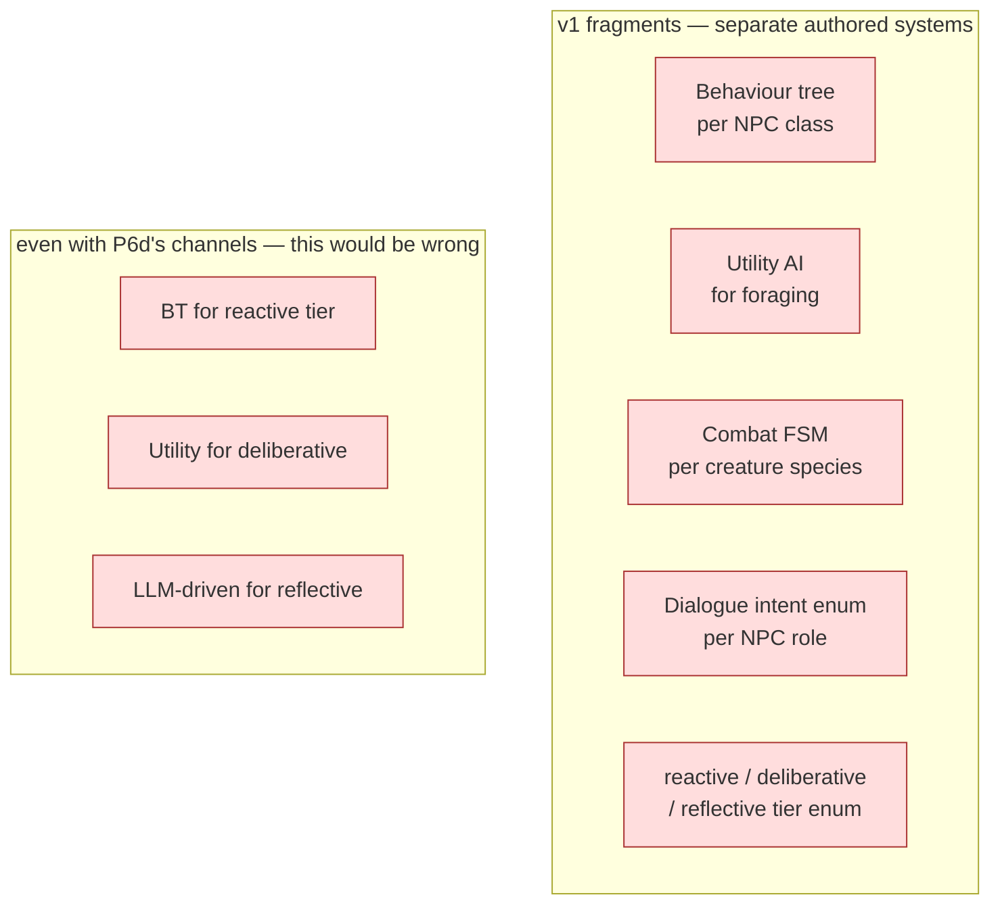
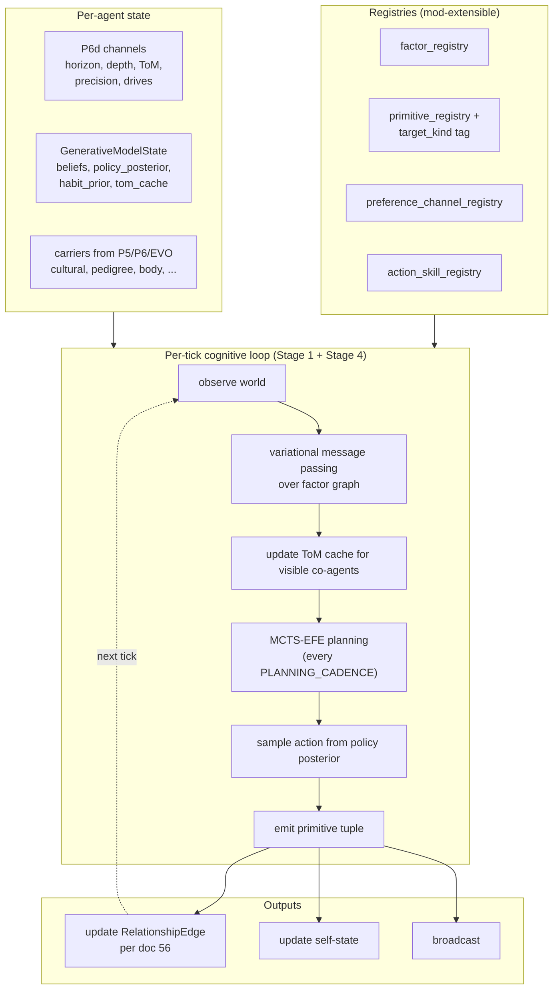
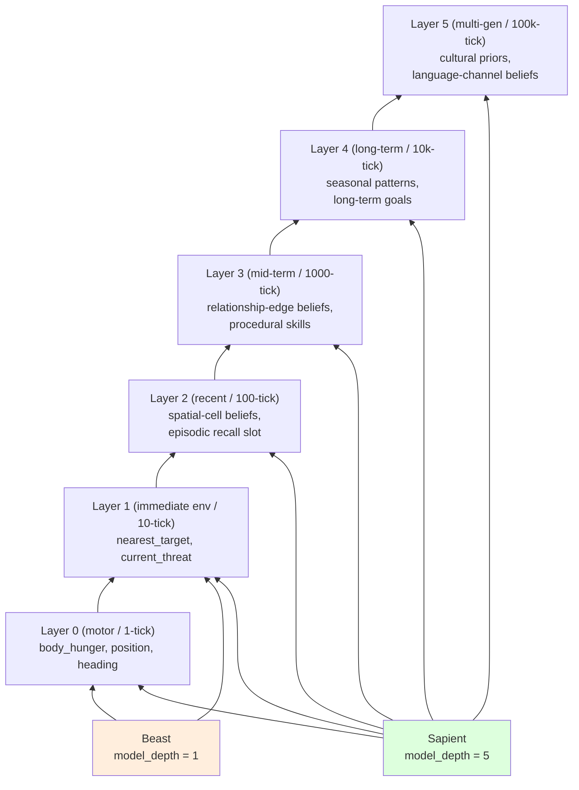
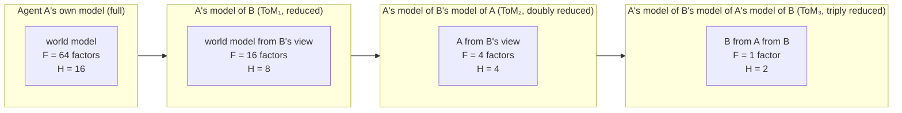
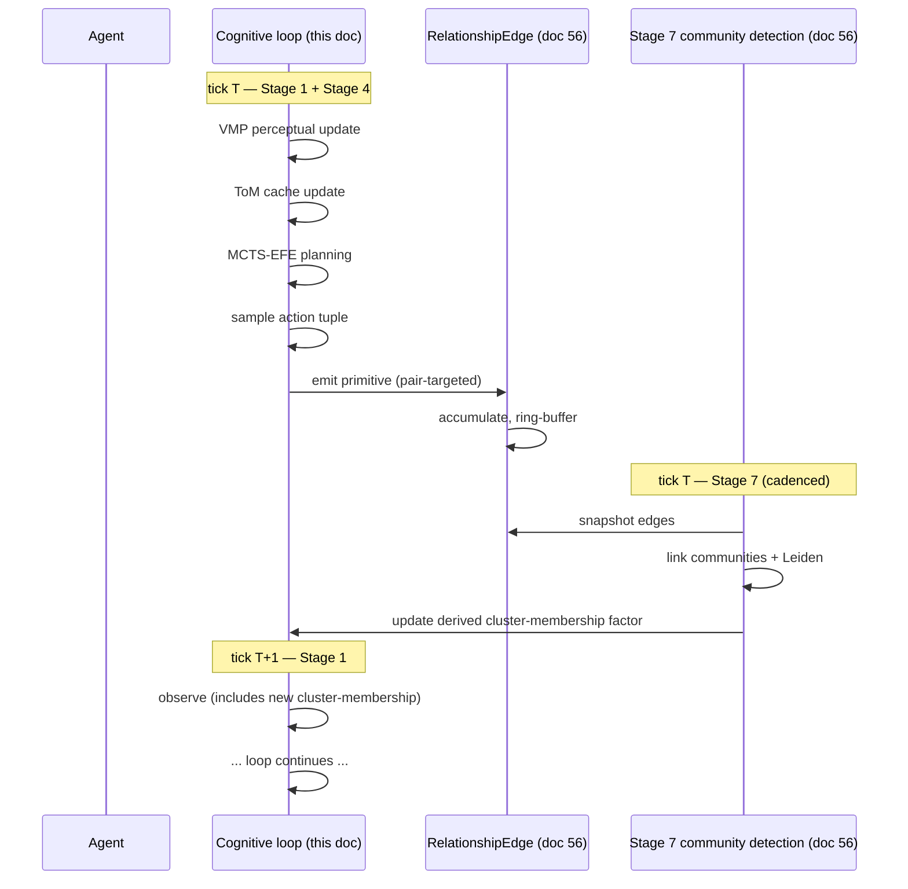
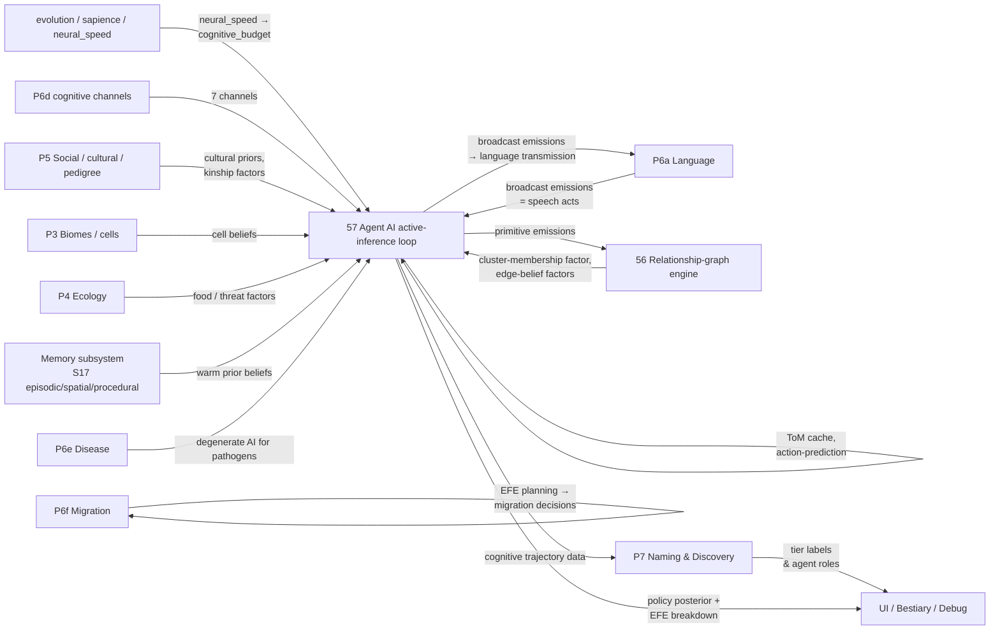

# 57 — Agent AI: Active-Inference Behaviour Across the Sapience Scale-Band

**Status:** design proposal. Extends [P6d Cognition in 60_culture_emergence.md](60_culture_emergence.md) by specifying the full agent architecture that sits on top of P6d's seven channels. Integrates with [56_relationship_graph_emergence.md](56_relationship_graph_emergence.md) (the engine that *consumes* what cognition emits) and [17_individual_cognition.md](../systems/17_individual_cognition.md) (the existing memory subsystem this design unifies under one inference framework).

**Replaces / clarifies:**

- The "tier enum" mentality the project already retired (P6d) — this document spells out *how* the engine actually picks an action so that "reactive / deliberative / reflective" emerge as 1-NN labels over `(predictive_horizon_ticks, model_depth, theory_of_mind_order)`.
- The implicit assumption in `systems/06_combat_system.md` and `systems/08_npc_dialogue_system.md` that combat AI and dialogue AI are separate decision systems with their own logic. There is **one** decision system: active inference over a factored POMDP. Combat actions, dialogue intents, foraging, migration, social interaction — all are policies sampled from the same engine over different parts of the same factor graph.
- Any unwritten future document that would propose behavior trees, GOAP, utility AI, or LLM-driven generative agents as the primary mechanism. Those approaches are reviewed in §3 and tradeoff-matrixed in §8; the kernel ships **one** mechanism (active inference) with proven-correct fixed-point inference.

**Depends on:**

- P6d's seven cognitive channels (existing, unchanged).
- The primitive vocabulary (`schemas/primitive_vocabulary/`) with the new `target_kind` tag from doc 56.
- The relationship-edge engine (doc 56) as the *output substrate* — primitives selected by cognition write into per-pair edges; per-pair edges feed the agent's belief about co-agents.
- The memory subsystem (System 17) — episodic, spatial, procedural memory become *posterior beliefs* maintained by the same Bayesian update operator as the perceptual step.
- Q32.32 invariant; one PRNG stream per cognitive subsystem (`rng_cog`, `rng_policy`, `rng_belief`).

---

## 1. Problem statement

The project has committed to active inference (P6d) as the cognitive substrate without specifying how an agent actually decides what to do. Every other AI mechanism the games industry uses — behavior trees, GOAP, utility AI, finite state machines, LLM-driven generative agents — is either authored (which violates the emergence-first invariant), non-deterministic (which violates the Q32.32 replay invariant), or bounded above in expressivity by hand-crafted state structures (which forces tier-style fragmentation across sapience). This document specifies a single inference engine that:

1. Implements active inference (Friston framework) deterministically in Q32.32 with proven-correct algorithms (variational message passing, Expected Free Energy planning).
2. Runs the same engine for a foraging beast, a tribal hunter, a sapient diplomat, and (in the limit) a pathogen — with parameters from P6d's channels selecting where on the sapience scale-band the agent sits.
3. Bounds runtime and space per agent to a tick-budget-compatible envelope, with graceful degradation (stale beliefs, greedy 1-step fallback) when budget is exhausted.
4. Composes naturally with the relationship-graph (doc 56), the memory subsystem (S17), the primitive vocabulary, and the player avatar.
5. Lets "reactive", "deliberative", "reflective", "Machiavellian", "instinctive", "compulsive" emerge as Chronicler labels over the joint distribution of cognitive parameters and observed behaviour patterns — never as authored modes.

---

## 2. Research basis

### 2.1 Canonical active inference

- **Friston, K. (2010)** "The free-energy principle: a unified brain theory?" *Nat. Rev. Neurosci.* 11. The foundational paper.
- **Friston, K., FitzGerald, T., Rigoli, F., Schwartenbeck, P., Pezzulo, G. (2017)** "Active inference: a process theory." *Neural Computation* 29. Discrete-state finite-MDP formulation — this is the form we adopt for Q32.32 implementability.
- **Da Costa, L., Parr, T., Sajid, N., Veselic, S., Neacsu, V., Friston, K. (2020)** "Active inference on discrete state-spaces: a synthesis." *J. Math. Psychol.* 99. Algorithmic spec for variational message passing on factor graphs in discrete state-spaces.
- **Heins, R. C., Millidge, B., Demekas, D., Klein, B., Friston, K., Couzin, I., Tschantz, A. (2022)** "pymdp: a Python library for active inference in discrete state spaces." *JOSS* 7. Reference implementation. We reimplement the same algorithms in fixed-point Rust.
- **Parr, T., Pezzulo, G., Friston, K. J. (2022)** *Active Inference: The Free Energy Principle in Mind, Brain, and Behavior*. MIT Press. Comprehensive textbook.

### 2.2 Recent literature (2023–2025)

- **Schwöbel, S. et al. (2024)** "Expected Free Energy-based Planning as Variational Inference." arXiv:2504.14898. Unifies EFE planning into a single variational-inference problem; gives the formulation we adopt for policy selection.
- **Ruiz-Serra, J., Sweeney, K., Harré, M. (2025)** "Factorised Active Inference for Strategic Multi-Agent Interactions." AAMAS 2025. The canonical recent paper on multi-agent active inference with theory-of-mind. Gives the algorithm we use for ToM nesting.
- **Hua, K. et al. (2025)** "Decision-Making in Repeated Games: Insights from Active Inference." *Behav. Sci.* 15. Empirical and theoretical work on iterated-prisoner-dilemma-style settings under active inference — directly relevant to our cooperation dynamics.
- **Berthet, P. et al. (2025)** "Free Energy Projective Simulation (FEPS): Active inference with interpretability." *PLoS ONE*. arXiv:2411.14991. Introduces a simpler interpretable alternative to neural-network world models, fully algorithmic. Useful as a fallback for low-sapience agents where full VMP is overkill.
- **Tschantz, A., Millidge, B., Seth, A., Buckley, C. L. (2020)** "Reinforcement learning through active inference." Provides the reduction from RL to active inference; tells us we don't need a separate RL subsystem.
- **Oguntola, I. (2025)** "Theory of Mind in Multi-Agent Systems." CMU PhD dissertation, CMU-ML-25-118. Latest synthesis of ToM in multi-agent reinforcement learning and active inference; tells us which ToM-nesting depths are tractable in practice (≤3 with reduced models).

### 2.3 Game-AI alternatives reviewed (and rejected as primary mechanism)

- **Behaviour trees** — Champandard 2007; many practical references. Authored. Useful only for *very* low-level reflexes, which active inference subsumes.
- **GOAP (Goal-Oriented Action Planning)** — Orkin 2006 (F.E.A.R. AI). Goals are designer-authored; planning over hand-crafted action preconditions. Active inference subsumes GOAP via preference-channel-as-goal and habit-prior-as-precondition.
- **Utility AI** — Mark 2009; Dill 2015. Hand-crafted utility curves per action. Active inference subsumes utility AI via EFE-as-utility and learned habit priors.
- **GOBT (Goal-Oriented Behaviour Trees)** — Park & Park 2023 *J. Multimedia Inf. Syst.* Hybrid of GOAP + utility + BT; the current SOTA in commercial game AI. Reviewed; doesn't satisfy our emergence requirement.
- **Generative Agents (Park et al. 2023; follow-ups 2024–2025)** — LLM-driven, non-deterministic at inference, no Q32.32 path. Useful as inspiration for the *memory + reflection + planning* architectural pattern, which active inference + S17 already provides without LLMs.
- **DreamerV3 and successors** — Hafner et al. 2023 (Nature 2025). World-model + latent imagination + actor-critic. Core architectural insight (deterministic latent state + stochastic latent state, latent rollout for planning) is preserved in our active-inference design via the discrete-state factored POMDP and the EFE rollout. The neural-network implementation is rejected as incompatible with strict Q32.32.

### 2.4 Memory and learning

- **Tulving, Dudai** (episodic), **O'Keefe & Nadel, Tolman** (spatial), **Cohen & Squire** (procedural), **Rescorla & Wagner, Dayan** (Bayesian belief update), **Ebbinghaus, Cepeda** (forgetting). Already cited in `systems/17_individual_cognition.md`; this design subsumes those mechanisms under variational message passing on a factor graph. The Bayesian update rule in S17 §4.2 is *literally* the active-inference perceptual step in the discrete-state formulation.

### 2.5 Drives and preferences

- **Maslow, A. (1943)** "A theory of human motivation." *Psychological Review* 50. Reviewed; the hierarchy is rejected as authored ordering. Replaced by a flat registry of preference channels (see §5.3).
- **Cañamero, L. (2003)** "Designing emotions for activity selection in autonomous agents." Foundational on drive-based architectures; extended here via preference channels in the EFE pragmatic-value term.
- **Berridge, K., Robinson, T. E. (2003)** "Parsing reward." *Trends in Neurosciences* 26. Distinguishes "wanting" (incentive salience, ≈ EFE pragmatic value) from "liking" (hedonic, ≈ outcome utility). Both are first-class in our design.

---

## 3. Core proposal in one paragraph

Every agent runs a single inference loop each tick: maintain a posterior belief over hidden world-state by variational message passing on a factored POMDP, then select an action by sampling from the posterior over policies under Expected Free Energy. The factor graph spans (a) the agent's body and proprioceptive state, (b) the spatial map of nearby cells, (c) the relationship-graph view of currently visible co-agents, (d) registered preference channels, and — recursively at depth `theory_of_mind_order` — reduced generative models of those co-agents themselves. P6d's seven channels parameterise the engine: `predictive_horizon_ticks` is the policy roll-out depth; `model_depth` is the number of hierarchical levels in the factor graph; `theory_of_mind_order` is the recursion depth on co-agent models; the precision weights tune perception-vs-prior trust; `curiosity_drive` and `imitation_drive` are EFE-pragmatic-value coefficients on epistemic and social-imitation outcomes. Output is a (primitive_id, target, intensity) tuple sampled from the policy posterior — exactly the input doc 56's relationship-graph engine expects. Memory subsystems (episodic, spatial, procedural) from System 17 *are* parts of the agent's posterior — each is a marginal of the same factor graph, kept across ticks as a warm prior for the next perceptual update. Sapience scales smoothly: a beast runs the same loop with horizon 1, depth 1, ToM 0, a flat preference vector dominated by subsistence and safety; a sapient runs with horizon 32, depth 4, ToM 2–3, and a wide preference vector. Reactive / deliberative / reflective / Machiavellian / instinctive are 1-NN cluster labels the Chronicler attaches to characteristic regions of cognitive-channel space, never authored modes. The engine is bounded in compute by capping tree-search width and ToM-nesting reduction factors; budget-exhausted agents fall back to greedy 1-step EFE with stale beliefs.

---

## 4. The factored POMDP per agent

The agent's generative model is a discrete-state factored partially-observable Markov decision process (POMDP). All variables are Q32.32-quantised over registered discrete bins.

```
Variables
    s ∈ S = ∏ᵢ Sᵢ    hidden state, factored across registered factors
    o ∈ O = ∏ⱼ Oⱼ    observations, also factored
    a ∈ A             action (a primitive emission tuple, see §6.5)
    π ∈ Π             policy, a sequence of actions of length H (horizon)

Generative model
    p(o₁:H, s₁:H | π) = p(s₁) ∏ₜ p(sₜ|sₜ₋₁, aₜ) p(oₜ|sₜ)

Preference prior (the "drive" over preferred outcomes)
    p̃(o) = ∏ⱼ p̃ⱼ(oⱼ)    factored over registered preference channels
```

Each factor `Sᵢ` is a discrete variable with `|Sᵢ| ∈ [2, 16]` bins (registered alongside the factor). Bins are Q32.32 thresholds over an underlying continuous channel (or directly discrete for things like "current-target-id" with a small enum domain bounded by `social_reach`).

The factor structure is **not authored per agent**. It is assembled at agent-creation from:

- A small kernel-shipped core (proprioceptive: hunger, thirst, fatigue, position, heading; perceptual: nearest-target, terrain-class).
- Mod-registered factors (each registered factor declares which channels it slices over and at what bin-thresholds).
- The agent's own memory subsystem — episodic-recall slot, spatial-cell-belief slots, procedural-skill-priors. These are factors whose values are kept across ticks as warm priors.

Total factor count `F` is bounded by `model_depth × FACTORS_PER_LEVEL`. With `model_depth ≤ 6` and `FACTORS_PER_LEVEL = 16` we have `F ≤ 96`. In the typical case (`model_depth = 2–3`), `F = 32–48`.

---

## 5. Channels & carriers

### 5.1 P6d cognitive channels (extended documentation, no schema change)

Already in P6d. Restated with the role each plays in this engine.

| Channel | Range | Role in the engine |
|---|---|---|
| `predictive_horizon_ticks` | `[1, 1024]` (Q32.32 ceil) | Policy length `H` for EFE roll-out |
| `model_depth` | `[1, 6]` | Number of hierarchical levels in the factor graph (level 0 = motor; level 5 = decade-scale goals) |
| `theory_of_mind_order` | `[0, 3]` (capped) | Recursion depth on co-agent generative models |
| `precision_weight_perception` | `[0, 1]` | γ on observation-likelihood factor; high → trust senses, low → trust prior |
| `precision_weight_prior` | `[0, 1]` | γ on transition prior; high → habit-bound, low → exploratory |
| `curiosity_drive` | `[0, 1]` | Coefficient on epistemic value (information gain) in EFE |
| `imitation_drive` | `[0, 1]` | Coefficient on imitation prior — copying observed actions of co-agents in social context |

The engine does not re-derive these channels; they are read directly from the agent component each tick.

### 5.2 New per-agent component: `GenerativeModelState`

```rust
struct GenerativeModelState {
    // Posterior beliefs (one per factor), Q32.32 distributions over discrete bins.
    // Sparse; only non-zero entries stored.
    beliefs: SmallMap<FactorId, BeliefDist>,

    // Policy posterior — top-K policies and their probabilities.
    policy_posterior: SmallVec<(PolicyHash, Q32_32), POLICY_K>,

    // Habit prior — stationary distribution over actions in each context, learned slowly.
    habit_prior: SmallMap<ContextHash, ActionDist>,

    // ToM cache: one entry per visible co-agent, keyed by their id.
    // Each entry is a *reduced* generative model of that co-agent.
    tom_cache: SmallMap<AgentId, ReducedGenerativeModel>,

    // Last-budget-exhaustion flag (for graceful degradation tracking).
    last_used_fallback: bool,

    // Tick counters per inference cadence.
    last_perceptual_tick: TickNumber,
    last_planning_tick: TickNumber,
}

struct BeliefDist {
    // Q32.32 probabilities over bins; sums to 1 (modulo eps).
    probs: SmallVec<Q32_32, MAX_FACTOR_BINS>,
}

struct ReducedGenerativeModel {
    // Lower-fidelity model used for one ToM level deeper.
    // Reduction factor ρ ∈ (0, 1) shrinks horizon + bin counts.
    horizon: u8,
    factors_subset: SmallVec<FactorId, MAX_TOM_FACTORS>,
    beliefs: SmallMap<FactorId, BeliefDist>,
    last_observed_action: Option<ActionTuple>,
}
```

This is the **only** new sim state required by this design. Memory subsystem state from S17 is reorganised under this component (episodic / spatial / procedural memories become factor-keyed beliefs), but the underlying fields are reused; no new save state beyond what S17 already specifies.

### 5.3 New registry: `preference_channel`

A registry-backed flat list of preference channels — same JSON-manifest pattern as channel and primitive registries.

```jsonc
{
  "id": "preference.subsistence_food",
  "carrier": "agent",                     // attached to each agent
  "outcome_factor": "factor.body_hunger", // which factor's outcome variable this preference scores
  "preferred_bin": "low",                  // preferred outcome value
  "weight_default": 0.8,                   // Q32.32 default weight in EFE pragmatic value
  "weight_evolved": true,                  // weight is itself an evolvable channel per agent (drift over generations)
  "scale_band": ["pathogen", "beast", "sapient"]   // which agents this preference applies to
}
```

Kernel ships a starter set covering the standard motivations:

| `id` | What it scores |
|---|---|
| `preference.subsistence_food` | hunger low |
| `preference.subsistence_water` | thirst low |
| `preference.thermal_comfort` | body temp in range |
| `preference.safety_threat` | local-threat factor low |
| `preference.energy_rest` | fatigue low |
| `preference.kinship_proximity` | nearest-kin distance low |
| `preference.social_proximity` | nearest-co-agent distance moderate (loneliness vs crowding U-curve) |
| `preference.status_in_cluster` | own leader-centrality-skew rank in current cluster high |
| `preference.curiosity_uncertainty` | global belief entropy moderate-to-low (drives exploration when high) |
| `preference.coresidence_with_kin` | matches `residence_cell` to kin cells |
| `preference.imitation_concordance` | own recent action matches imitation prior |
| `preference.cluster_persistence` | edges into preferred clusters not decaying |

Mods extend freely. There is **no Maslow ordering**; the EFE pragmatic-value term is a weighted sum, and any "tier" structure that emerges is a Chronicler observation about how the weights cluster across populations. A pathogen has only the first three preferences active; a sapient has all of them. A scale-band field on each preference declares applicability.

#### Why no Maslow

A literal Maslow hierarchy would be authored ordering — a designer fiat that subsistence dominates safety dominates sociality. Empirically, humans routinely sacrifice subsistence for sociality (martyrs), safety for esteem (soldiers), self-actualisation for kinship (parents). The hierarchy is a *post-hoc clustering of how weights tend to relate*, not a primitive structural fact. We follow the project's existing pattern (treaty-types-as-clusters, biome-types-as-clusters): preference-tier-types are Chronicler labels over agents' weight vectors, not declared layers in the engine.

### 5.4 New registry: `action_skill` (procedural-memory primitives)

A skill is a registered short macro of primitive emissions that an agent can invoke as a single action choice. Skills are authored at the registry level (kernel + mod), but their *acquisition* (which agents have which skills, at what proficiency) is emergent via System 17's procedural-memory channel.

```jsonc
{
  "id": "skill.flank_target",
  "primitive_sequence": [
    { "primitive_id": "apply_locomotive_thrust", "target": "$current_target.flank_position" },
    { "primitive_id": "apply_bite_force", "target": "$current_target", "intensity_scale": 0.8 }
  ],
  "preconditions_factor_query": "factor.target_state.exposed_flank == true",
  "proficiency_factor": "factor.skill_flank_target",
  "target_kind": "pair"
}
```

Skills give the engine a way to escape the combinatorial explosion of primitive-tuple action spaces: at high `model_depth`, the agent plans over skill-level actions; at the lowest level, it plans over individual primitives. This is the standard hierarchical-RL options framework (Sutton et al. 1999) ported to active inference.

### 5.5 No new memory state on top of System 17

System 17's `episodic_log`, `spatial_map`, `known_techniques`, `learned_creature_abilities`, `local_knowledge_facts` are all preserved — but reframed as:

- `episodic_log` → marginals on the "past-event" factor; consolidation = pruning low-belief entries.
- `spatial_map` → marginals on per-cell factors of the spatial layer of the factor graph.
- `known_techniques` → entries in the agent's `action_skill` proficiency vector; skill acquisition = Bayesian update on the proficiency factor when the skill is exercised successfully.
- `learned_creature_abilities` → reduced generative models in the `tom_cache` for non-sapient species.
- `local_knowledge_facts` → KnowledgeFacts are observations on the corresponding factor's likelihood; the Bayesian update in S17 §4.2 *is* the active-inference perceptual update.

System 17 stays valid as the user-facing description of memory; this design subsumes its mechanism into the unified inference loop.

---

## 6. Update rules

### 6.1 The per-tick cognitive loop

```
fn agent_cognition_tick(agent: &mut Agent, world: &World, tick: TickNumber) {
    // (1) Perception: Bayesian update of beliefs given new observations.
    let obs = world.observe(agent);
    perceptual_update(&mut agent.gm, &obs, &world.params, &mut world.rng_belief);

    // (2) ToM nesting: update each visible co-agent's reduced model.
    for co_id in world.visible_co_agents(agent.id) {
        update_tom_cache(agent, co_id, world);
    }

    // (3) Planning: every PLANNING_CADENCE ticks, recompute policy posterior.
    if tick - agent.gm.last_planning_tick >= PLANNING_CADENCE(agent) {
        plan(agent, world);
        agent.gm.last_planning_tick = tick;
    }

    // (4) Action: sample one action from policy posterior.
    let action = sample_action(&agent.gm.policy_posterior, &mut world.rng_policy);

    // (5) Emit primitive(s). Stage 4 of ECS schedule writes to relationship edges.
    world.queue_primitive_emission(agent.id, action);

    // (6) Habit prior update: gentle Bayesian increment on (context → action) chosen.
    update_habit_prior(&mut agent.gm.habit_prior, world.context_of(agent), action);
}
```

`PLANNING_CADENCE(agent)` is `clamp(round(8 / predictive_horizon_ticks), 1, 64)` — agents with longer horizons replan less often. Combat-active agents plan every tick; long-term-goal agents plan once per game-day.

### 6.2 Perceptual update — variational message passing

The agent's posterior over hidden state given observations is computed by **variational message passing on the factor graph (Bethe approximation)**, exactly as in pymdp (Heins et al. 2022) and Da Costa et al. 2020. All operations are Q32.32. The algorithm:

```
fn perceptual_update(gm: &mut GenerativeModelState, obs: &Observation, params: &Params, rng: &mut Xoshiro) {
    // Initialise messages from prior + observation factors.
    let messages = init_messages(gm, obs);

    // Iterate fixed-point updates of marginals.
    for _iter in 0..VMP_MAX_ITER {
        let prev_marginals = gm.beliefs.snapshot();
        for factor_id in factor_graph.topological_order() {
            let new_marginal = bethe_update(factor_id, &messages, &gm.beliefs, params);
            gm.beliefs.insert(factor_id, new_marginal);
        }
        if max_kl(&prev_marginals, &gm.beliefs) < params.vmp_eps {
            break;     // converged
        }
    }
}
```

`VMP_MAX_ITER` is bounded (default 8). The convergence test uses Q32.32 KL-divergence below ε. If the iteration cap is reached without convergence, the previous-tick marginals are retained — *graceful degradation*. This is a registered fallback; it is logged and surfaces in profiling.

Convergence is provable for tree factor graphs (exact, one pass). For factor graphs with cycles (which we have, due to ToM nesting), the Bethe approximation is exact in the limit and stable in practice for the small graphs we use (Da Costa et al. 2020).

### 6.3 Policy inference — Expected Free Energy

Following Schwöbel et al. (2024), we compute the policy posterior as:

```
q(π) ∝ exp(-G(π))         where G(π) is the Expected Free Energy of policy π

G(π) = Σ_{t=1..H} [
    pragmatic_value(π, t)        // Σ_j p(o_j | π, t) · log p̃_j(o_j)
    + epistemic_value(π, t)       // expected information gain about hidden state
    + imitation_term(π, t)        // -log q_imit(a_t | context)
]
```

- **Pragmatic value**: sum over preference channels of expected log-preference-density at each future timestep. Coefficient: implicit (preference weights come from the registry).
- **Epistemic value**: expected reduction in posterior entropy. Coefficient: `curiosity_drive`.
- **Imitation term**: log probability of `a_t` under the imitation prior built from co-agents' recent observed actions weighted by their salience. Coefficient: `imitation_drive`.

We do not enumerate all policies (the space is `|A|^H` and explodes). Instead we sample top-`POLICY_K` policies (default `K = 32`) by a deterministic Boltzmann-weighted Monte Carlo Tree Search of depth `H`, expanding one branch per tick from the previous policy posterior root. This is the project's reuse of MCTS / progressive widening (Coulom 2007, Couëtoux 2011) under EFE rather than reward.

```
fn plan(agent: &mut Agent, world: &World) {
    let mut tree = mcts_root(agent.gm.beliefs.clone());
    for _expansion in 0..MCTS_EXPANSIONS(agent) {
        let leaf = tree.descend_uct(&agent.gm, world);
        let g = expected_free_energy(leaf, &agent.gm, &world.params);
        tree.backup(leaf, g);
    }
    agent.gm.policy_posterior = tree.top_k_policies(POLICY_K);
}
```

`MCTS_EXPANSIONS(agent)` is a function of `predictive_horizon_ticks × model_depth`, capped by the agent's per-tick cognitive_budget. Default for sapient agents: 256 expansions; for beasts: 8 expansions.

#### Determinism

All MCTS random draws use a per-agent `rng_policy_<agent_id>` Xoshiro stream seeded at agent birth. Action sampling uses sorted-id tie-breaking. The policy_posterior carry-over from previous tick provides a deterministic warm start — no fresh PRNG advance per tick.

### 6.4 Theory-of-Mind nesting

Following Ruiz-Serra et al. (2025) "Factorised Active Inference for Strategic Multi-Agent Interactions", we maintain a **reduced generative model per co-agent** and a recursion bound at `theory_of_mind_order`.

```
ToM₀:  co-agents are part of the environment dynamics; no separate model
ToM₁:  for each visible co-agent, maintain ReducedGenerativeModel over their belief about the world
ToM₂:  the ReducedGenerativeModel itself contains a (further-reduced) model of how that co-agent models me
ToM₃:  one more level (rare; expensive)
```

Reduction factor `ρ` halves the horizon and quarters the factor count at each level: ToM₁ uses `H/2` and 1/4 of factors; ToM₂ uses `H/4` and 1/16 of factors; etc. Capped at ToM₃ to keep the recursive cost bounded.

Updating the ToM cache:

```
fn update_tom_cache(agent: &mut Agent, co_id: AgentId, world: &World) {
    let last_action = world.last_observed_action_of(co_id);
    let cached = agent.gm.tom_cache.entry(co_id).or_default();

    // Inverse problem: given the action observed, infer the co-agent's belief state.
    // (Bayesian inversion of their generative model.)
    cached.beliefs = invert_action_to_belief(last_action, cached);
    cached.last_observed_action = Some(last_action);

    // Decay irrelevant ToM-cache entries beyond the agent's social_reach × salience window.
    if !world.is_visible(agent.id, co_id) {
        agent.gm.tom_cache.decay(co_id, world.params.tom_decay);
    }
}
```

When the agent plans, the ToM cache feeds the EFE epistemic-value term: an action that the co-agent would interpret as cooperative *and* that aligns with the co-agent's predicted next action carries higher EFE pragmatic value when `imitation_drive × in-cluster-strength` is high.

This is exactly how *strategic deception, signalling, and indirect reciprocity* fall out of the engine without authoring any of them. Hua et al. (2025) confirms iterated-game cooperation strategies (tit-for-tat, generous tit-for-tat, win-stay-lose-shift) emerge in ToM≥1 active-inference agents.

### 6.5 Action output — primitive emission tuples

The action space `A` is the set of `(primitive_id, target_id_or_none, intensity_bin)` tuples reachable for the agent given its phenotype. Sampling from `q(π)` yields the next-tick action; the engine writes:

```
fn execute_action(agent: &Agent, action: ActionTuple, world: &mut World) {
    let proto = world.primitive_registry.get(action.primitive_id);
    match proto.target_kind {
        Self_ => world.apply_self_primitive(agent.id, action),
        Broadcast => world.broadcast_primitive(agent.id, action),
        Pair => {
            // Same path doc 56 §5.1 specifies — write into RelationshipEdge.
            world.relationship_edges.update(agent.id, action.target_id.unwrap(), action.primitive_id, action.intensity);
            world.event_queue.push(EdgeEvent { tick: world.tick, primitive_id: action.primitive_id, intensity: action.intensity, direction: ... });
        }
        Group => world.decompose_group_emission(agent.id, action),
    }
}
```

Cognition is the producer; the relationship-graph engine (doc 56) is the consumer. **There is no other path for an agent to influence the world.** Movement is a self-targeted `apply_locomotive_thrust` primitive; speech is a broadcast `emit_acoustic_pulse` (with a P6a-language-channel-determined phonotactic encoding); attack is a pair-targeted `apply_bite_force`; everything composes from primitive emissions.

### 6.6 Memory integration

The factor graph includes a *memory layer* per timescale tier of `model_depth`. Each layer has factors representing the relevant marginals from System 17:

| Layer | Factors |
|---|---|
| 0 (motor / proprioceptive, ~1 tick) | body_hunger, body_thirst, body_fatigue, current_position, current_heading |
| 1 (immediate environment, ~10 ticks) | nearest_target, current_terrain, current_threats |
| 2 (recent context, ~100 ticks) | spatial-cell beliefs for nearby cells, episodic recall slot for current activity |
| 3 (mid-term, ~1000 ticks) | relationship-edge beliefs for known co-agents, procedural-skill priors |
| 4 (long-term, ~10⁴ ticks) | seasonal patterns, long-term goals (preferences with horizon > season), kinship-network beliefs |
| 5 (multi-generational, ~10⁵ ticks) | cultural priors (cultural_trait_vector partial-information), language-channel beliefs |

Higher layers run on slower cadences (one VMP iteration every `2^layer` ticks). This is the standard hierarchical-active-inference timescale separation (Friston 2017; Pezzulo et al. 2018).

A beast with `model_depth = 1` only has layers 0–1; a sapient with `model_depth = 5` has all six.

### 6.7 Relationship-graph integration

Every visible co-agent contributes to two parts of the agent's factor graph:

1. **Direct observation factors** — what the co-agent appears to be doing (their last-tick primitive emissions). These feed the perceptual update.
2. **Relationship-edge belief factors** — the per-pair edge from doc 56 *is* the agent's accumulated belief about the co-agent's policy. The decayed primitive histogram is the prior over what the co-agent will likely emit next; the ToM cache adds belief-about-the-co-agent's-belief. Together these give the action-prediction the EFE planner uses.

When the relationship-graph engine runs in Stage 7 and a cluster forms, each agent's factor graph gets a derived `current_cluster_membership` factor for the (not-yet-tick-budget-accounted) clusters at each Leiden level. A new factor is added with bins corresponding to top-K clusters the agent is currently in. This factor is used by preferences like `preference.cluster_persistence` and `preference.status_in_cluster`.

The engine in this doc *outputs* the primitive emissions; doc 56's engine *aggregates* them into edges and clusters; doc 56's outputs *feed back* into this doc's factor graph at the next tick. The two engines compose without circular dependency because they run in different stages (cognition in Stage 1 / 4, graph detection in Stage 7).

### 6.8 Sapience scaling

All agents run the same engine with parameters reading P6d's channels:

| Parameter | Beast (low neural_speed) | Proto-sapient | Sapient | Pathogen (degenerate) |
|---|---|---|---|---|
| `predictive_horizon_ticks` | 1–4 | 8–16 | 16–256 | 1 |
| `model_depth` | 1–2 | 2–3 | 3–5 | 1 |
| `theory_of_mind_order` | 0 | 0–1 | 1–3 | 0 |
| `precision_weight_perception` | high (trust senses) | medium | medium-low (model-driven) | high |
| `curiosity_drive` | low | medium | high | zero |
| `imitation_drive` | low (kin-imprinting only) | medium | medium-high | zero |
| Active preference channels | subsistence + safety + thermal | + kinship + social + curiosity | + status + cluster_persistence + imitation_concordance | subsistence-host only |
| Action space | self + pair primitives, ~16 actions | + group primitives, ~64 actions | + skills, ~256 actions | self-replicate, ~2 actions |

There is no separate "beast AI" or "pathogen AI". All run the cognitive loop; differences are smooth parameter scaling. A pathogen's "active inference" is degenerate (one factor, one-step horizon, no ToM, one preference) — but it *is* the same code path. Scale-band unification preserved.

#### Cognitive budget

Each agent has a `cognitive_budget` channel (Q32.32, ticks-of-compute equivalent) that scales with `neural_speed × resting_metabolic_rate`. Per-tick the agent's loop receives this many compute-units; perception, ToM updates, MCTS expansions, and habit updates consume them in priority order (perception first; planning falls back to greedy 1-step EFE when budget runs low). This makes the engine **provably bounded**: total per-agent per-tick cost is at most `cognitive_budget × per-unit-cost` plus a bounded perceptual-update floor.

### 6.9 Hook: latent-pressure step for channel genesis (doc 58)

Immediately after action sampling in §6.1 step (5), and before the habit-prior update in step (6), a per-agent latent-pressure update runs (specified in [58_channel_genesis.md](58_channel_genesis.md) §6.2). Its contract:

- Read the agent's last EFE-optimal action distribution from `agent.gm.policy_posterior` (already computed in step 4).
- Compute the residual log-density between the chosen action and the EFE-optimal expectation.
- If residual magnitude ≥ `EPS_RESIDUAL`, project it into a sparse signature over existing channel ids and accumulate into `agent.latent_slots`.
- Slot eviction obeys sorted-id tie-break and stable bounded buffer; `K_LATENT_SLOTS` scales with `model_depth` (16 sapient / 4 beast / 0 pathogen).

This is the only point where the cognitive loop talks to the genesis pipeline. The genesis pipeline itself runs at low cadence in Stage 7 (per doc 58 §6.1) and reads the cross-agent latent-slot state without writing back to cognition until newly-registered channels appear in subsequent ticks via P6a propagation (which writes `population.lexicon` and the active channel set; doc 57 reads them at the next perceptual update through the registry).

Cost: ~150 Q32.32 ops per agent per tick (see doc 58 §11.2). Negligible compared to the perception+planning loop and bounded by the per-agent slot cap.

---

## 7. Diagrams

### 7.1 What the project is throwing away



Either the v1 fragmented systems or any tier-fragmented v2 design re-introduces authored AI per role/tier.

### 7.2 The unified active-inference architecture



### 7.3 Hierarchical generative model — model_depth in action



### 7.4 ToM nesting — how an agent thinks about another agent's thinking



Cost roughly halves per nesting level due to the reduction factor; ToM₃ is ~1/64 the cost of the full model. ToM order capped at 3.

### 7.5 Primitive selection compose with the relationship-graph engine (doc 56)



---

## 8. Tradeoff matrix

| Decision | Options | Sim Fidelity | Determinism | Implementability | Runtime/Space | Emergent Power | Choice + Why |
|---|---|---|---|---|---|---|---|
| Primary mechanism | BT / GOAP / Utility AI / **Active inference** / LLM-driven | AI strong (Friston framework) | AI strong (VMP is deterministic) | AI moderate (well-studied algorithms; pymdp reference) | AI moderate (bounded by graph size + horizon) | AI maximal (one mechanism, all behaviours emerge) | **Active inference.** Subsumes BT/GOAP/Utility as parameter-degenerate cases; only mechanism with proven Q32.32 path that satisfies emergence-first |
| Generative model state-space | Continuous (sampled) / **Discrete factored POMDP** / Neural latent | Discrete strong (Q32.32 native; Friston 2017 spec) | Discrete strong | Discrete easy (proven algorithms) | Discrete bounded | Discrete strong | **Discrete factored POMDP.** Continuous sampled requires float; neural latent requires NN |
| Inference algorithm | Exact enumeration / **Variational message passing (Bethe)** / Sampling (MC) / NN amortised | VMP strong (well-studied) | VMP strong (deterministic with sorted iteration) | VMP moderate (~100 lines per factor type) | VMP O(F · iters) bounded | VMP strong | **VMP with Bethe approximation.** pymdp-grade implementation in Q32.32 |
| Planning algorithm | Exact enumeration / **MCTS-EFE with policy-posterior carry-over** / Greedy 1-step / Monte Carlo full | MCTS strong (anytime, bounded) | MCTS deterministic with seeded UCT | MCTS moderate | MCTS budget-bounded | MCTS strong | **MCTS-EFE.** Standard, anytime, fits cognitive_budget |
| Drive/preference structure | Maslow-tiered / **Flat preference channel registry** / Latent learned | Flat strong (no authored hierarchy) | Same | Same | Same | Flat highest | **Flat registry.** Tiers emerge as Chronicler clusters — same pattern as cultural axes |
| ToM mechanism | None / **Reduced nested generative models, capped at depth 3** / Full nested | Reduced strong (Ruiz-Serra 2025) | Same | Reduced moderate | Reduced bounded by ρ | Reduced strong (deception, signalling, reciprocity emerge) | **Reduced nested at cap 3.** Practical compute envelope; recent literature converged here |
| Memory subsystem | Separate from cognition / **Subsumed as factor-graph marginals** / Discarded | Subsumed strong (one Bayesian update operator covers both) | Same | Subsumed easy | Subsumed compact (no duplication) | Same | **Subsumed.** S17's Bayesian update = the perceptual step |
| Sapience scaling | Per-tier engine / **Same engine, parameter-scaled** / Hardcoded thresholds | Parameter-scaled strong (one path) | Same | Easier (one impl) | Bounded by per-agent budget | Higher (smooth transitions through sapience evolution) | **Same engine, parameter-scaled.** Honours the scale-band unification invariant |
| Determinism strategy | Float math / Fixed-point / **Strict Q32.32 throughout** | Same | Q32.32 maximal | Q32.32 moderate (porting effort) | Same | Same | **Strict Q32.32.** Project standard; algorithms admit it |
| Action representation | Continuous low-level / Hierarchical RL options / **Primitive tuples + skill macros** | Tuples strong (matches existing primitive vocab) | Same | Tuples easy | Tuples bounded | Tuples strong | **Primitive tuples + skill macros.** Reuses existing primitive registry; skills give bounded action-space at high planning depth |
| Tier labelling (reactive/deliberative/reflective/Machiavellian) | Authored modes / **Chronicler 1-NN over cognitive-channel space** | Cluster strong | Same | Same | Same | Cluster maximal | **Chronicler 1-NN over `(horizon, depth, ToM, precision, drive_weights)`.** One more gallery, same machinery as biomes |
| Budget exhaustion | Skip tick / **Greedy 1-step EFE fallback with stale beliefs** / Skip planning | Fallback strong (always produces an action) | Same | Same | Always within budget | Same (predictable degradation) | **Greedy 1-step fallback.** Behaviour stays plausible under load |

---

## 9. Emergent behaviours

1. **Reactive vs. deliberative vs. reflective is one cognitive-channel-space.** No mode-switching: as `predictive_horizon_ticks × model_depth × theory_of_mind_order` varies across the population, the Chronicler labels regions of channel-space with the v1 tier names — `cluster_label.reactive`, `cluster_label.deliberative`, `cluster_label.reflective`, `cluster_label.machiavellian`, `cluster_label.compulsive`, … — populated as a registered gallery, mod-extensible.

2. **Goal-following falls out of preferences.** A high `preference.kinship_proximity` weight + a habit-prior of foraging routes already-walked = an agent that returns to its kin after wandering, without any explicit "return-home" goal in code.

3. **Cooperation emerges from imitation + ToM.** With ToM₁ + nonzero `imitation_drive`, an agent's EFE pragmatic value rewards actions consistent with its model of co-agents' beliefs. Iterated-prisoner-dilemma cooperation strategies (tit-for-tat, generous tit-for-tat, win-stay-lose-shift) emerge naturally — Hua et al. 2025 confirms this.

4. **Strategic deception emerges at ToM≥2.** When an agent's model of a co-agent's model of itself differs from its own self-model, a planned action can be selected for its *expected effect on the co-agent's belief about the agent* rather than the action's intrinsic outcome. Deception is what we *call* a high-EFE action that exploits this gap. No "deceive" primitive needed; no "Machiavellianism" channel.

5. **Skills are practised, not assigned.** Procedural-memory factors get higher posterior probability with each successful skill execution; over many ticks, skilled smiths and skilled hunters and skilled diplomats differentiate within a population through Bayesian update on the skill-proficiency factor. This is exactly System 17's `known_techniques` mechanism, reformulated in active-inference terms.

6. **Curiosity-driven exploration is mathematically exploration.** Agents with high `curiosity_drive` weight epistemic value (information gain) heavily; their EFE planning literally selects actions that reduce posterior entropy. Beasts with low `curiosity_drive` and high `precision_weight_prior` stick to their habit priors — their behaviour is *emergent dogmatism*. Both are continuous channel-driven, neither is authored.

7. **Cluster formation is emergent because cognition is emergent.** Doc 56's clustering depends on which primitives agents emit. Cognition selects primitives based on preferences, ToM, and habit. So preferences and cognitive parameters that favour cooperation produce cluster patterns matching `cluster_label.kingdom` or `cluster_label.guild`; preferences and cognitive parameters that favour competition produce different cluster patterns. The two engines are co-emergent.

8. **The pathogen is a one-factor agent.** Setting all P6d channels low and activating only `preference.subsistence_host` produces an entity whose EFE planning collapses to "infect nearest susceptible host" — exactly the SIR-model behaviour P6e disease wants. Same engine.

9. **Sapience evolution is a single trajectory in cognitive-channel space.** A lineage whose `neural_speed` evolves upward unlocks higher `predictive_horizon_ticks`, `model_depth`, `theory_of_mind_order` thresholds. The same engine that ran "instinctive forager" at low channels runs "rhetorical-strategist diplomat" at high channels. The cognitive transition is continuous; no special cases at sapience boundary.

10. **Player avatar interpretability.** When the player wants to know "why did Liam do that?", the engine can serialise: top-3 policies in the posterior at decision time, the EFE breakdown (pragmatic / epistemic / imitation contributions), the ToM cache for visible co-agents. A debugging UI reads this; the Chronicler can render it in narrative form ("Liam expected the ambush to fail because he believed the alpha had not yet seen him"). Naming this for players is a P7 concern (`70_naming_and_discovery.md`) — same Chronicler labelling pipeline.

---

## 10. Cross-pillar hooks



---

## 11. Determinism & complexity

### 11.1 Determinism checklist

- [x] All inference math Q32.32; no float in the cognitive loop.
- [x] Per-agent `rng_policy_<id>`, `rng_belief_<id>` Xoshiro streams seeded at agent birth from world-seed and agent-id (deterministic).
- [x] VMP iterates factors in topologically-sorted-id order; tie-broken on factor-id.
- [x] MCTS expansions iterate child actions in sorted action-tuple order; UCT random selection uses the per-agent rng_policy stream with sorted-id tie-break.
- [x] ToM cache iterates co-agents in sorted-id order.
- [x] Action sampling from policy_posterior uses inverse-CDF over Q32.32 cumulative, with stable tie-break on action-tuple-id.
- [x] Habit-prior update uses fixed Q32.32 increment, no floats.
- [x] Cognitive-budget exhaustion is detected by integer-counter underrun; fallback path is deterministic.
- [x] Save = `GenerativeModelState` per agent; recompute on load = no drift (state restored exactly).

### 11.2 Per-agent runtime

Per-agent per-tick worst-case cost (sapient):

| Step | Cost | Sapient default |
|---|---|---|
| Perceptual VMP | `O(F · max_arity · VMP_MAX_ITER)` | F=48, arity=4, iters=8 → 1.5K ops |
| ToM updates | `O(T_visible · F_reduced · arity)` | 8 visible · 12 factors · 4 → 384 ops |
| MCTS-EFE planning | `O(EXPANSIONS · H · |A|)` per planning tick (cadence) | 256 · 16 · 64 → 256K ops, amortised over PLANNING_CADENCE |
| Action sample | `O(POLICY_K)` | 32 ops |
| Habit update | `O(1)` | 4 ops |
| **Total per tick** (amortised) | ~5K ops | well under 10μs on a single core |

Beast (model_depth=1, horizon=4):
- Perceptual VMP: F=8, iters=4 → 64 ops
- No ToM: 0
- Greedy 1-step EFE: 4 · 16 = 64 ops
- Total: ~150 ops per tick — negligible.

### 11.3 Per-agent space

| Component | Size |
|---|---|
| `GenerativeModelState.beliefs` | F · MAX_FACTOR_BINS · 8 bytes ≤ 6 KB sapient, 1 KB beast |
| `policy_posterior` | POLICY_K · (HASH + Q32.32) ≤ 0.5 KB |
| `habit_prior` | bounded by registered context count · |A| ≤ 4 KB |
| `tom_cache` | T_visible · ReducedGM ≤ 8 · 1 KB = 8 KB sapient, 0 beast |
| **Total per agent** | ~20 KB sapient, ~1 KB beast, ~0.1 KB pathogen |

For 1000 sapient agents: ~20 MB. For 10⁵ beasts: ~100 MB. For 10⁷ pathogens: ~1 GB — but pathogens use a degenerate model with much smaller beliefs (single-factor ≤ 32 bytes), so realistic pathogen total is ~320 MB, often pooled across hosts. All within target memory envelope.

### 11.4 Total per-tick budget (sanity check)

At 60 FPS, the per-tick budget is ~16ms. Stage 1 (cognition) gets a slice — say 6ms. With a typical world of 200 sapient + 2000 beast + 10⁵ pathogen agents:

- 200 sapient · 5K ops = 1M ops
- 2000 beast · 150 ops = 0.3M ops
- 10⁵ pathogen · 30 ops = 3M ops
- **Total: ~4.3M ops per tick.** At 1 GHz/core ≈ 4.3 ms on one core; under 1ms on 8 cores with rayon parallelism over agents.

The cognitive subsystem fits comfortably.

---

## 12. Open calibration knobs

- `VMP_MAX_ITER` (default 8) — per-tick perceptual-update iteration cap.
- `vmp_eps` — Q32.32 KL convergence threshold.
- `MCTS_EXPANSIONS_BASE` (default 8) and the multiplier on `horizon × depth` — controls planning cost vs. quality.
- `POLICY_K` (default 32) — top-K policies kept in posterior.
- `PLANNING_CADENCE` formula constants.
- `tom_decay`, `tom_reduction_factor_ρ` — ToM-cache management.
- `cognitive_budget` mapping from `neural_speed × resting_metabolic_rate`.
- Factor-bin counts per registered factor (mod-tunable).
- Preference-channel weight defaults (per registry entry, evolvable per agent).
- MAX_FACTOR_BINS (default 16), MAX_TOM_FACTORS (default 12).
- Skill-macro proficiency-update step (per skill registration).
- The cognitive-channel-space prototype gallery for tier labels (the v1 tier names re-instantiated as Chronicler labels).

---

## 13. Implementation touch-points

Recommended sprint placement: **post-S6** (after `beast-sim` is in place) and **paired with doc 56's S6.5 implementation** so the cognition→edge→cluster→cognition feedback loop can be tested as a unit. This is the largest architectural addition the project has on its plate; budget for two sprints.

1. **NEW crate `beast-cog`** (planned; not yet in `CRATE_LAYOUT.md`) at L4, alongside the planned `beast-graph` from doc 56. Q32.32 implementations of:
   - Factor graph data structure
   - Variational message passing (Bethe)
   - MCTS with EFE backup
   - ToM-cache management
   - Habit-prior Bayesian update
   - Bounded cognitive-budget scheduler
2. **`crates/beast-core`** — `GenerativeModelState` component; preference and skill registry types; cognitive_budget channel.
3. **`crates/beast-channels`** — extend channel manifest to include `factor` and `preference_channel` and `action_skill` schema variants; ship the kernel starter set listed in §5.3 + §5.4.
4. **`documentation/schemas/`** — add `factor_manifest.schema.json`, `preference_channel_manifest.schema.json`, `action_skill_manifest.schema.json`. All three follow the existing channel-manifest pattern.
5. **`documentation/architecture/CRATE_LAYOUT.md`** — register `beast-cog` (and the doc-56 `beast-graph`); document layer.
6. **`documentation/architecture/ECS_SCHEDULE.md`** — Stage 1 (Input & Aging) gains the perceptual-update sub-stage; Stage 4 (Interaction & Combat) gains the action-emission sub-stage; planning is an off-cadence sub-stage that runs at `PLANNING_CADENCE` ticks within Stage 1's slice.
7. **`documentation/systems/06_combat_system.md`** — Combat AI is no longer a separate FSM; combatants run the same engine. Combat-specific factors (target_health, weapon_in_hand, retreat_route_known) are registered factors; combat-specific skills (parry, flank, ambush) are registered skills. Re-document.
8. **`documentation/systems/08_npc_dialogue_system.md`** — Dialogue intents are emergent: an utterance is a `target_kind=broadcast` primitive whose phonotactic content is sampled per P6a. Gates become inferred-from-belief, not enum-on-NPC. Re-document; the `MembershipGate` from doc 56 §12 generalises to `BeliefGate` reading the agent's posterior over (cluster, role, kinship) factors.
9. **`documentation/emergence/60_culture_emergence.md`** — append a forward-reference to this doc; clarify that P6d's "the agent at each decision point minimises expected free energy" *is what 57 implements*.
10. **`documentation/systems/17_individual_cognition.md`** — append a "Subsumed under doc 57" header noting that the memory mechanisms remain valid in their behaviour but are reimplemented as factor-graph marginals; the public-facing memory-API stays.
11. **`documentation/INVARIANTS.md`** — add invariant: *"all agent decision-making runs the active-inference loop; no per-system FSM, BT, GOAP, or LLM-driven decision logic"*.
12. **GitHub** — open epic `Active-Inference Agent AI` referencing this doc; story-issues per touch-point; test-issues for the determinism CI gate (replay 1000 ticks, check `GenerativeModelState` hashes match across replays).

---

## 14. Sources

### Canonical active inference

- Friston, K. (2010). "The free-energy principle: a unified brain theory?" *Nat. Rev. Neurosci.* 11.
- Friston, K., FitzGerald, T., Rigoli, F., Schwartenbeck, P., Pezzulo, G. (2017). "Active inference: a process theory." *Neural Computation* 29.
- Da Costa, L., Parr, T., Sajid, N., Veselic, S., Neacsu, V., Friston, K. (2020). "Active inference on discrete state-spaces: a synthesis." *J. Math. Psychol.* 99.
- Heins, R. C., Millidge, B., Demekas, D., Klein, B., Friston, K., Couzin, I., Tschantz, A. (2022). "pymdp: a Python library for active inference in discrete state spaces." *JOSS* 7.
- Parr, T., Pezzulo, G., Friston, K. J. (2022). *Active Inference: The Free Energy Principle in Mind, Brain, and Behavior*. MIT Press.
- Pezzulo, G., Rigoli, F., Friston, K. (2018). "Hierarchical Active Inference: A Theory of Motivated Control." *Trends in Cognitive Sciences* 22.

### Recent (2023-2025)

- Schwöbel, S. et al. (2024). "Expected Free Energy-based Planning as Variational Inference." arXiv:2504.14898.
- Ruiz-Serra, J., Sweeney, K., Harré, M. (2025). "Factorised Active Inference for Strategic Multi-Agent Interactions." AAMAS 2025.
- Hua, K. et al. (2025). "Decision-Making in Repeated Games: Insights from Active Inference." *Behav. Sci.* 15.
- Berthet, P. et al. (2025). "Free Energy Projective Simulation (FEPS): Active inference with interpretability." *PLoS ONE*. arXiv:2411.14991.
- Tschantz, A., Millidge, B., Seth, A., Buckley, C. L. (2020). "Reinforcement learning through active inference." NeurIPS workshop.
- Oguntola, I. (2025). "Theory of Mind in Multi-Agent Systems." CMU PhD dissertation, CMU-ML-25-118.

### Game-AI alternatives reviewed

- Champandard, A. (2007). *Behavior Trees in Games*. AiGameDev.
- Orkin, J. (2006). "Three states and a plan: the AI of F.E.A.R." GDC 2006.
- Mark, D. (2009). *Behavioral Mathematics for Game AI*. Course Technology.
- Park, J. S. et al. (2023). "Generative Agents: Interactive Simulacra of Human Behavior." UIST '23.
- Hafner, D., Pasukonis, J., Ba, J., Lillicrap, T. (2023). "Mastering Diverse Domains through World Models." arXiv:2301.04104; *Nature* 2025.
- Park, J. (2023). "GOBT: A Synergistic Approach to Game AI Using Goal-Oriented and Utility-Based Planning in Behavior Trees." *J. Multimedia Inf. Syst.* 10.

### MCTS, RL, planning

- Coulom, R. (2007). "Efficient selectivity and backup operators in Monte-Carlo tree search." *Computers and Games* 2006.
- Couëtoux, A. et al. (2011). "Continuous Upper Confidence Trees." *LION* 2011.
- Sutton, R. S., Precup, D., Singh, S. (1999). "Between MDPs and semi-MDPs: a framework for temporal abstraction in reinforcement learning." *Artificial Intelligence* 112.

### Memory, drives, theory of mind

- Tulving, E. (1983); Dudai, Y. (2002); O'Keefe & Nadel (1978); Tolman (1948); Cohen & Squire (1980); Doyon & Ungerleider (2002); Rescorla & Wagner (1972); Dayan, Kakade, Montague (2000); Ebbinghaus (1885) — already cited in `systems/17_individual_cognition.md`.
- Cañamero, L. (2003). "Designing emotions for activity selection in autonomous agents." MIT Press.
- Berridge, K., Robinson, T. E. (2003). "Parsing reward." *TINS* 26.
- Maslow, A. (1943). "A theory of human motivation." *Psychological Review* 50. — reviewed and rejected as authored ordering.
- Rabinowitz, N., Perbet, F., Song, F., Zhang, C., Eslami, S. M. A., Botvinick, M. (2018). "Machine theory of mind." *ICML* 2018.
- Baker, C. L., Jara-Ettinger, J., Saxe, R., Tenenbaum, J. B. (2017). "Rational quantitative attribution of beliefs, desires and percepts in human mentalizing." *Nat. Hum. Behav.* 1.

### In-project anchors

- `documentation/INVARIANTS.md`
- `documentation/architecture/ECS_SCHEDULE.md`
- `documentation/emergence/60_culture_emergence.md` (P6d)
- `documentation/emergence/56_relationship_graph_emergence.md`
- `documentation/emergence/70_naming_and_discovery.md`
- `documentation/systems/17_individual_cognition.md`
