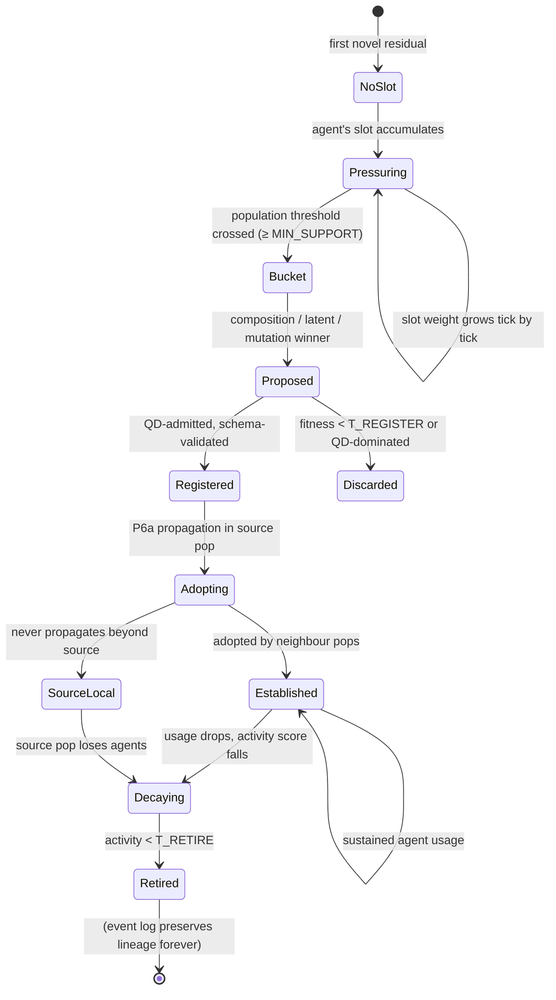
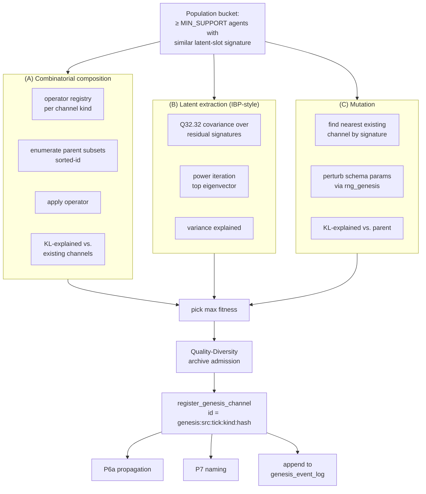
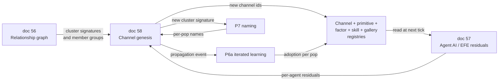
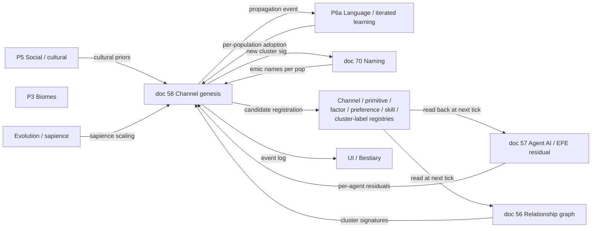

# 58 — Channel Genesis: Runtime Birth of New Channels

**Status:** design proposal. Specifies the mechanism behind the `genesis:<source>:<id>` provenance prefix already reserved in `documentation/schemas/channel_manifest.schema.json`. Closes the last authoring carve-out in the emergence-first pipeline: channels (preferences, factors, skills, primitives, cluster-label-gallery entries) are no longer fixed at startup — they are *born* from runtime dynamics through three combined mechanisms (combinatorial composition, latent slot extraction, mutation), triggered by per-agent latent-novelty pressure that crosses a population threshold.

**Closes the last loop:**

The project's emergence-first invariant says clusters and labels emerge from continuous channels (and the Chronicler labels stable clusters). Until now, the *channel vocabulary itself* has been authored: kernel + mod registries supply a fixed set of channels at startup, mods extend at startup, but no mechanism exists for the simulation to grow the registry from observed behaviour. With doc 58 the registry itself becomes a derivative of the simulation: any channel that has ever been registered in the running world traces back either to the kernel/mod startup load or to a `genesis:` event whose lineage is recorded in the history log.

**Replaces / clarifies:**

- The implicit assumption across docs 30, 50, 56, 57, 60, 70 that the channel registry is read-only after startup.
- The existing reservation of the `genesis:` provenance prefix in `channel_manifest.schema.json` (gives it a documented mechanism for the first time).
- The cultural_trait_vector "axes labelled post-hoc by Chronicler" pattern (`50_social_emergence.md` §3.1) — that pattern is *naming* an existing latent dimension. This doc generalises the pattern from naming-only to full registration of new dimensions across all channel kinds.
- The "compound-tech registry mod-extensible" promise in P6b (`60_culture_emergence.md`) — under doc 58, compound techs can also be born at runtime, not only at mod-load time.

**Depends on:**

- Doc 56 (relationship graph) — its cluster-detection and the per-pair edge histograms supply the population-level evidence that drives genesis.
- Doc 57 (agent AI) — every agent's per-tick EFE residual is the *signal* that latent pressure accumulates from. Without active inference there is nothing meaningful to call "unexplained variance in agent behaviour."
- Doc 70 (P7 naming) — every newly registered channel is a cluster signature that flows through the same five-layer name-resolution chain. There is no special "system-generated channel name" surface.
- The existing channel-manifest schemas and prototype-gallery JSON pattern (`schemas/channel_manifest.schema.json`, `schemas/primitive_manifest.schema.json`).
- P6a iterated learning (`60_culture_emergence.md` §1) — used as the propagation mechanism for adoption of newly registered channels across populations.

---

## 1. Problem statement

Five tiers of authoring still exist after docs 30, 50, 56, 57, 60, 70:

1. **Channel registry**: a fixed list of carrier channels (cultural axes, governance dimensions, P6d cognitive channels, P5 carriers, …).
2. **Primitive registry**: a fixed list of inter-agent / self / broadcast primitives.
3. **Factor / preference / skill registries** (added by doc 57): fixed lists of factor types, preference channels, action-skill macros.
4. **Cluster-label galleries** (added by doc 56): fixed JSON galleries of biome / faction / coalition / treaty / cluster prototypes.
5. **Cognitive-tier galleries** (added by doc 57): fixed gallery of reactive / deliberative / reflective / Machiavellian prototypes.

Every entry in every one of those tiers is a designer-or-modder-authored shape. A simulation that runs for a thousand subjective years cannot add a single new entry to any of them. That is *the* remaining authoring carve-out.

The user-pinned phrasing is "channel genesis": **channels are born during the run from agent dynamics, recorded with deterministic lineage, propagated culturally, named via P7, and garbage-collected when they lose support.** This document specifies the engine.

---

## 2. Research basis

### 2.1 Foundational

- **Piaget, J. (1937)** *La construction du réel chez l'enfant.* Constructivist concept formation as schema accommodation: when existing schemas can't predict, new ones are constructed.
- **Drescher, G. (1991)** *Made-up Minds: A Constructivist Approach to Artificial Intelligence.* MIT Press. The first computational schema mechanism — schemas as `(context, action, result)` triples that get *spun off* when statistics indicate a regularity unaccounted-for. Doc 58's "latent pressure" mirrors Drescher's spin-off statistics, generalised across channel kinds.
- **Griffiths, T. L., Ghahramani, Z. (2011)** "The Indian Buffet Process: an introduction and review." *JMLR* 12. Bayesian nonparametric prior over a potentially unbounded number of latent features. Each customer (observation) decides whether to sample existing dishes (features) or invent new ones via a Poisson(α / N) process. **The IBP is the canonical mathematical object for unbounded latent-feature discovery, and it admits a fully deterministic Q32.32 implementation when the customer order is sorted and α is a fixed-point parameter.**
- **Lake, B. M., Salakhutdinov, R., Tenenbaum, J. B. (2015)** "Human-level concept learning through probabilistic program induction." *Science* 350. Bayesian program learning: new concepts are *programs over existing primitive parts*, sampled from a hierarchical prior. The composition mechanism in doc 58 is closely modelled on this.
- **Arthur, W. B. (2009)** *The Nature of Technology: What It Is and How It Evolves.* Free Press. Combinatorial-evolutionary theory of novelty: technologies arise as *combinations of existing components* under domain-specific operator sets. Maps directly onto doc 58's combinatorial composition mechanism — each channel kind has a registered operator set (AND, OR, gradient, threshold, hash, sequence concatenation), and new channels are recombinations under those operators.
- **Stanley, K. O., Lehman, J. (2011)** "Abandoning objectives: evolution through the search for novelty alone." *Evol. Comput.* 19. Novelty search: selection on *behavioural distance from known* rather than on fitness. Justifies the design choice that genesis is driven by *unexplained behaviour* rather than by reward or fitness.
- **Lehman, J., Stanley, K. O. (2011)** "Evolving a diverse set of virtual creatures through novelty search and local competition." Quality-Diversity / MAP-Elites. Each new candidate channel inhabits a niche of "behaviour-feature space"; selection is per-niche local competition rather than global. Used to bound active-channel count (§5.6).
- **Bedau, M. A., Snyder, E., Packard, N. H. (1998)** "A classification of long-term evolutionary dynamics." Open-ended evolution metrics — **evolutionary activity statistics**: novelty, diversity, total activity. Used to define the genesis-engine's health metrics (§9).
- **Soros, L. B., Stanley, K. O. (2014)** "Identifying necessary conditions for open-ended evolution through the artificial life world of Chromaria." Identifies four necessary conditions for OEE; doc 58 explicitly satisfies all four (§3).

### 2.2 Recent (2023–2025)

- **Wang, R., Lehman, J., Clune, J., Stanley, K. O. (2019, 2020)** "POET" / "Enhanced POET." Paired open-ended trailblazer — environments and agents coevolve. The genesis engine is the project's analogue of POET: the channel registry is the "environment" and the agents that adopt new channels are the "solutions"; both coevolve.
- **Clune, J. (2019)** "AI-GAs: AI-generating algorithms, an alternate paradigm for producing general artificial intelligence." Argues that the substrate must generate its own learning environments; doc 58 is one piece of that substrate for our domain.
- **Faldor, M., Cully, A., Mouret, J.-B. (2024)** "Toward Artificial Open-Ended Evolution within Lenia using Quality-Diversity." arXiv:2406.04235. Quality-Diversity in continuous cellular automata — directly relevant to multi-niche archives of channel candidates.
- **Lim, B. et al. (2025)** "Dominated Novelty Search: Rethinking Local Competition in Quality-Diversity." arXiv:2502.00593. New local-competition strategy — each candidate competes only against dominators in its niche. The doc 58 GC strategy adopts this for active-channel maintenance.
- **Lijoi, A., Mena, R. H. et al. (2023)** "Bayesian Analysis of Generalized Hierarchical Indian Buffet Processes for Within and Across Group Sharing of Latent Features." arXiv:2304.05244. Hierarchical IBP — natural fit for multi-population / multi-scale-band channel genesis.
- **Lana, A. et al. (2025)** "Constructivist procedural learning for grounded cognitive agents." *Cognitive Systems Research*. Schema mechanisms grounded in primitive-emission events rather than perceptual snapshots. Maps onto our active-inference + relationship-graph substrate exactly.
- **Tartaglia, M. et al. (2024)** "Schema Mechanisms 2.0 for Developmental Artificial Intelligence." Springer. Introduces interactional motivation framework + hierarchical abstraction over schemas; informs the multi-tier latent-slot design in §5.
- **Lim, B. et al. (2024)** "ShinkaEvolve: Towards Open-Ended And Sample-Efficient Program Evolution." arXiv:2509.19349. Recent open-ended program evolution; informs the composition-proposal mechanism (§5.2).

### 2.3 Memetic dynamics

- **Dawkins, R. (1976)** *The Selfish Gene*. Memes as cultural replicators; relevant to the propagation step.
- **Boyd, R., Richerson, P. (1985)** *Culture and the Evolutionary Process.* Already cited in doc 50; transmission rules apply equally to "memetic" channel-adoption.
- **Henrich, J. (2015)** *The Secret of Our Success.* Group-level cultural variation as a selective force — supports per-population channel adoption rather than world-wide.

### 2.4 In-project anchors

- `documentation/schemas/channel_manifest.schema.json` — already specifies `genesis:<source>:<id>` provenance prefix.
- `documentation/emergence/50_social_emergence.md` §3.1 — cultural-axis labelling pattern (genesis-like for axis names; this doc generalises).
- `documentation/emergence/56_relationship_graph_emergence.md` — cluster signatures and their feature vectors are inputs to the genesis engine.
- `documentation/emergence/57_agent_ai.md` — per-agent EFE residual is the latent-pressure signal.
- `documentation/emergence/60_culture_emergence.md` §P6a — iterated-learning operator reused for channel propagation.
- `documentation/emergence/70_naming_and_discovery.md` — every new channel is a cluster signature that flows through the five-layer naming pipeline.

---

## 3. Soros & Stanley (2014) necessary conditions check

The four necessary conditions for OEE per Soros & Stanley:

| Condition | How doc 58 satisfies it |
|---|---|
| **(1) Reproduction with heritable variation** | Channels propagate via P6a iterated learning (heritable across populations), with mutation (`mutation` mechanism) supplying variation. |
| **(2) Selection pressure** | EFE-residual reduction (does this channel make agent behaviour more predictable) is the per-channel fitness signal. Quality-Diversity per-niche competition prevents convergence. |
| **(3) Minimum complexity threshold** | The agent active-inference loop already has the threshold (an agent must have non-trivial generative-model state for residuals to even be defined). Pathogens' degenerate state produces almost no genesis pressure; sapients produce the most. |
| **(4) Innovation potential / generativity** | Combinatorial composition over registered operators is provably generative: the closure of a finite operator set over a finite seed set under composition is countably infinite. |

The genesis engine is thus *open-ended* in the formal Soros-Stanley sense.

---

## 4. Core proposal in one paragraph

Each agent maintains a small latent-slot buffer (Indian-Buffet-Process-style; default 16 slots). Every tick, the active-inference residual — the part of the agent's chosen action that the current channel set fails to predict — is projected into the buffer. When a slot's accumulated weight crosses a per-agent threshold *and* a population-wide cluster of agents has slots with similar signatures, the genesis engine runs three composition mechanisms in parallel: combinatorial composition over existing channels using a registered per-channel-kind operator set (Brian Arthur 2009 + Lake et al. 2015 BPL); latent-slot extraction taking the principal axis of slot variance across the support cluster (IBP-style); and schema-mutation perturbing the parameters of the most-similar existing channel. Each mechanism's best candidate is scored on KL-explained vs. its parents; the best-scoring candidate is registered with id `genesis:<source_population_id>:<tick>:<channel_kind>:<sig_hash>`, schema-validated, and seeded into the source population's lexicon for naming via P7. Adoption propagates through P6a iterated learning at imitation × contact × cultural-similarity weights; populations whose latent slots converge to the same channel adopt it organically. Garbage collection retires channels whose evolutionary-activity score (Bedau 1998) decays below a threshold; lineage is preserved in the history log. The kernel registry is unchanged at runtime — kernel/mod-loaded channels are *seed* channels; everything else is genesis-derived. Determinism is maintained by sorted-id iteration, Q32.32 throughout, deterministic id-hashing, and the same per-population PRNG streams the rest of the engine uses. All five channel kinds (preference, factor, skill, primitive, cluster-label-prototype) participate, with the constraint that primitive genesis is **mutation-only** — primitives are kernel-level concepts whose taxonomy (`target_kind`, decay class) cannot drift via composition without breaking the relationship-graph engine's invariants.

---

## 5. Channels & carriers

### 5.1 New per-agent component: `LatentSlotBuffer`

```rust
struct LatentSlotBuffer {
    // Sparse map from slot-id (deterministic hash of slot signature)
    // to the slot itself. Bounded by K_LATENT_SLOTS (default 16).
    slots: SmallMap<SlotId, LatentSlot, K_LATENT_SLOTS>,
    last_pressure_tick: TickNumber,
    last_proposed_genesis_tick: TickNumber,
}

struct LatentSlot {
    // Channel kind this slot is accumulating pressure for (preference / factor / skill / primitive / cluster_label).
    kind: ChannelKind,

    // Signature: a sparse Q32.32 vector over the existing channel space of `kind`.
    // Specifies which existing channels' deviations are co-occurring in this slot.
    signature: SparseVec<ChannelId, Q32_32>,

    // Accumulated weight (un-normalised).
    weight: Q32_32,

    // Last-touched tick (for decay / GC).
    last_touched_tick: TickNumber,

    // The candidate channel id once promoted (None until promotion).
    promoted_to: Option<ChannelId>,
}
```

K_LATENT_SLOTS is 16 default for sapients, 4 for beasts (scaled by `model_depth`), 0 for pathogens (no genesis from pathogens — degenerate).

### 5.2 New registry: `composition_operator`

A registry-backed list of composition operators per channel kind. Following Arthur 2009 + Lake et al. 2015. JSON-manifest pattern.

```jsonc
{
  "id": "operator.preference.threshold_and",
  "channel_kind": "preference",
  "arity": 2,
  "operator_kind": "threshold_and",
  "description": "Two factor-conditions both pass thresholds → preferred"
}
{
  "id": "operator.factor.gradient",
  "channel_kind": "factor",
  "arity": 1,
  "operator_kind": "gradient_over_time",
  "description": "Time-derivative of an existing factor"
}
{
  "id": "operator.skill.sequence",
  "channel_kind": "skill",
  "arity": "variable",
  "operator_kind": "primitive_sequence_concat",
  "description": "Concatenation of primitive emissions in order"
}
{
  "id": "operator.cluster_label.shape_pattern",
  "channel_kind": "cluster_label",
  "arity": "variable",
  "operator_kind": "feature_threshold_conjunction",
  "description": "Conjunction of cluster-feature-vector thresholds"
}
```

Kernel ships ~12 operators total across kinds; mods extend. Primitive composition is **not** in the operator set (see §5.5).

### 5.3 New registry: `genesis_event_log`

Append-only log of every genesis event. Sim state. Serialised.

```rust
struct GenesisEvent {
    event_id: GenesisEventId,
    tick: TickNumber,
    channel_kind: ChannelKind,
    new_channel_id: ChannelId,
    mechanism: GenesisMechanism,            // Composition / LatentExtraction / Mutation
    parent_channel_ids: SmallVec<ChannelId, 8>,   // empty for LatentExtraction; non-empty otherwise
    operator_id: Option<OperatorId>,        // for Composition
    source_population_id: PopulationId,
    support_agent_ids: SmallVec<AgentId, K_SUPPORT>,
    initial_fitness: Q32_32,                // KL-explained vs. previous channel set
}
```

The history log is queryable by the Chronicler and by the player's bestiary; it is the channel's *birth certificate*.

### 5.4 `genesis:` provenance now formally specified

The schema already does some of this work for us. `channel_manifest.schema.json` defines:

- `provenance` pattern `^(core|mod:[a-z_][a-z0-9_]*|genesis:[a-z_][a-z0-9_]*:[0-9]+)$` — described as "duplicated and diverged" (i.e., the **mutation** mechanism, mechanism C in §6.5).
- A `mutation_kernel.genesis_weight` field on every channel — *"Relative probability this channel is selected for duplication during channel genesis. Higher weight = more likely to be copied."*

This doc extends both:

- `genesis_weight` is now also used as the bias on **parent-channel selection during composition** (mechanism A): when enumerating parent subsets, the engine weights selection probability by the product of constituents' `genesis_weight`. This means kernel/mod authors can already steer which channels are more likely to be ancestors of new ones — without authoring the new ones themselves.
- The provenance pattern is extended (in implementation touch-point #4) to accept the four-component form `genesis:<src_pop>:<tick>:<kind>:<sig_hash>` for composition + latent-extraction events that have ≥1 parent or no single parent. The original two-component form `genesis:<parent_id>:<generation>` remains valid for pure mutation events for backward compatibility.

The new-channel id components:

| Position | Meaning |
|---|---|
| `<src_pop>` | Source population id where the supporting bucket originated |
| `<tick>` | Tick of registration |
| `<kind>` | Channel kind (preference / factor / skill / primitive / cluster_label) |
| `<sig_hash>` | Deterministic Q32.32 hash over `(signature_bytes, sorted_parent_ids, mechanism)` |

This guarantees: (a) ids are deterministic across replays from the same world-seed; (b) collisions are vanishingly unlikely (the hash plus tick plus pop disambiguators give >2^96 keyspace); (c) lineage is recoverable from the id alone (decode parent ids from the genesis-event log keyed by id).

### 5.5 What is *deliberately not* allowed

| Forbidden | Why |
|---|---|
| Primitive genesis via composition | A composed primitive would have no defined `target_kind`, decay class, or physical effect on the world. The relationship-graph engine (doc 56) has invariants that depend on a fixed-meaning primitive vocabulary at the lowest layer. Only **mutation** of an existing primitive's parameters (intensity range, decay, scale-band applicability) is allowed — and even mutation requires schema validation against `primitive_manifest.schema.json`. |
| Channel genesis without lineage | Every genesis-born channel must have at least one parent channel id (or be a registered latent-extraction with a recorded slot signature). This guarantees emergence-closure: every channel traces back to kernel/mod seed channels through a finite chain of recorded events. |
| Genesis from a single agent | A candidate must be supported by at least `MIN_SUPPORT` agents (default 5) whose latent slots share the same signature. This prevents idiosyncratic noise from polluting the registry. |
| Genesis without P6a propagation eligibility | A channel that doesn't propagate (no agent imitates the source) is retired by GC. There is no "private channel" persistence beyond the source population's eventual decay. |
| Genesis writing into kernel registries | Genesis-born channels live in their own registry namespace (`genesis_registry`) which the engine reads alongside the kernel/mod registries. Kernel/mod registries are read-only at runtime. |

### 5.6 Bounded growth — Quality-Diversity archive per channel kind

Following Lehman & Stanley 2011 + Lim et al. 2025 Dominated Novelty Search, each channel kind maintains a **per-niche archive** in a low-dimensional "behaviour-feature space". Niches are coarse buckets in:

- For preference: (factor-subset-hash, weight-sign-vector) niche
- For factor: (carrier-set-hash, scale-band) niche
- For skill: (primitive-sequence-prefix-hash) niche
- For cluster_label: (feature-vector-octant) niche

Per niche, only the top-K (default K=4) channels by fitness are retained. New candidates that don't dominate any incumbent in their niche are rejected. Old channels that are dominated by newcomers OR whose fitness decays below `T_RETIRE` are GC'd. **This bounds the active channel count globally regardless of how long the simulation runs.**

Steady-state active-channel count: `Σ_kind |niches_kind| × K`. With a few hundred niches per kind and K=4, the cap is in the low thousands — manageable for serialisation and memory.

---

## 6. Update rules

### 6.1 The genesis pipeline (Stage 7, low cadence)

```
fn channel_genesis_step(world: &mut World, tick: TickNumber) {
    if tick % CADENCE_GENESIS != 0 { return; }   // default 1024 ticks

    // (1) Per-agent latent-pressure update (already runs every tick in Stage 4
    //     post-action; this step gathers cross-agent state).
    let cluster_buckets = cluster_latent_slots_by_signature(world);

    // (2) For each candidate cluster (≥ MIN_SUPPORT agents with similar
    //     slot signatures), propose new channels.
    for bucket in cluster_buckets.iter_sorted_by_id() {
        if bucket.support_count < MIN_SUPPORT { continue; }

        // (3) Run all three mechanisms in parallel; pick the winner.
        let comp_candidate = propose_composition(bucket, world);
        let latent_candidate = propose_latent_extraction(bucket, world);
        let mut_candidate = propose_mutation(bucket, world);
        let winner = pick_max_fitness(&[comp_candidate, latent_candidate, mut_candidate]);

        // (4) Register if the winner is fit enough.
        if winner.fitness > T_REGISTER && quality_diversity_admits(winner, &world.archive) {
            let new_id = register_genesis_channel(winner, bucket, tick, world);

            // (5) Promote agents' slots to use the new channel.
            for agent_id in &bucket.support_agents {
                let agent = &mut world.agents[agent_id];
                let slot = agent.latent_slots.find_signature(bucket.signature);
                slot.promoted_to = Some(new_id);
            }

            // (6) Seed the new channel's salience in the source population's
            //     lexicon (P7 phonotactic-gen) and propagate via P6a.
            world.populations[bucket.source_pop].lexicon.seed_genesis(new_id);
            world.queue_p6a_propagation(new_id, bucket.source_pop);
        }
    }

    // (7) GC: retire channels whose evolutionary-activity score has decayed.
    gc_genesis_registry(world, tick);
}
```

### 6.2 Per-agent latent-pressure update

Runs every tick in Stage 4 (after action selection):

```
fn latent_pressure_step(agent: &mut Agent, action: ActionTuple, world: &World) {
    // Compute residual: how much this action's chosen distribution diverges
    // from what the agent's registered-channel-only EFE-optimal would predict.
    let efe_optimal_dist = compute_efe_optimal_action_dist(agent, world);
    let residual_log_density = log(actual_action_density(action) / efe_optimal_dist.density(action));

    if residual_log_density.abs() < EPS_RESIDUAL { return; }

    // Project residual into a slot signature: sparse vector over existing channels
    // whose values were consulted but not predictive. Hash → SlotId.
    let signature = project_residual_to_signature(residual_log_density, agent, world);
    let slot_id = signature_hash(&signature);

    let slot = agent.latent_slots.entry(slot_id)
        .or_insert(LatentSlot::new(signature.clone(), agent.gm.channel_kind_focus(world)));

    slot.weight += residual_log_density.abs();
    slot.last_touched_tick = world.tick;

    // Bounded slot count: if buffer is full and a new slot wants in, evict
    // the lowest-weight slot deterministically.
    if agent.latent_slots.len() > K_LATENT_SLOTS {
        agent.latent_slots.evict_lowest_weight_sorted();
    }
}
```

### 6.3 Composition proposal (mechanism A)

```
fn propose_composition(bucket: &Bucket, world: &World) -> Candidate {
    // Iterate registered operators for this channel kind in sorted-id order.
    let mut best: Option<Candidate> = None;
    for op in world.composition_operator_registry.iter_kind(bucket.channel_kind).sorted_by_id() {
        for parent_subset in choose_parent_subsets_sorted(op.arity, bucket, world) {
            let candidate = apply_operator(op, parent_subset, bucket);
            let fitness = score_kl_explained(candidate, bucket, world);
            if best.is_none() || fitness > best.as_ref().unwrap().fitness {
                best = Some(Candidate { mechanism: Composition, fitness, ... });
            }
        }
    }
    best.unwrap_or(Candidate::null())
}
```

`choose_parent_subsets_sorted` enumerates small subsets of channels referenced in `bucket.signature`, sorted by support count then id. Bounded enumeration: at most `K_PARENT_CANDIDATES` (default 64) subsets per operator.

### 6.4 Latent-extraction proposal (mechanism B)

```
fn propose_latent_extraction(bucket: &Bucket, world: &World) -> Candidate {
    // Take the top eigenvector of the within-bucket covariance of agents'
    // residual signatures (Q32.32 power iteration, deterministic).
    let mat = build_residual_covariance_matrix(bucket, world);
    let (axis, eigenvalue) = q32_power_iter(&mat, POWER_ITER_MAX, EPS_POWER);
    let candidate = LatentExtractionCandidate { axis, kind: bucket.channel_kind };
    let fitness = score_variance_explained(&axis, eigenvalue, &mat);
    Candidate { mechanism: LatentExtraction, fitness, ... }
}
```

This is the IBP-style step: the slot's accumulated covariance points to a previously-unmodeled latent dimension. Power iteration in Q32.32 is deterministic and well-studied (numerical stability bounded by per-step normalisation).

### 6.5 Mutation proposal (mechanism C)

```
fn propose_mutation(bucket: &Bucket, world: &World) -> Candidate {
    // Find the existing channel most-similar to bucket.signature in cosine
    // distance; mutate its schema parameters slightly (Q32.32 step from rng_genesis).
    let parent = find_nearest_existing_channel(bucket.signature, world);
    let mut mutated = parent.clone();
    mutate_schema_params(&mut mutated, &mut world.rng_genesis, world.params.mutation_step);
    let fitness = score_kl_explained(mutated.as_candidate(), bucket, world);
    Candidate { mechanism: Mutation, fitness, ... }
}
```

For primitives, mutation may *only* perturb registered numeric parameters (intensity range, decay constant, scale-band weights); structural fields (`target_kind`, `decay_class`, primitive name) are immutable.

### 6.6 Adoption / propagation (P6a hook)

When `register_genesis_channel` succeeds, the new channel id is written to the **source population's `population.lexicon`** as a cluster signature with a phonotactic-gen seed name (per P7 §4.3). On the next P6a iterated-learning pass, the lexicon entry has a chance to be borrowed by neighbouring populations weighted by:

```
P(adopt | source pop S, target pop T, channel C)
    ∝ contact_frequency(S, T)
    × (1 - cultural_distance(S, T))
    × (avg_imitation_drive over T-agents)
    × fitness(C, T)                         // does C explain T-agents' behaviour too?
```

Adoption in T means: T's agents' active channel set includes C, weighted by the lexicon entry's `usage_count`. As more T-agents have non-trivial signature on C, the channel becomes "established" in T.

### 6.7 Garbage collection

Following Bedau 1998 + Dominated Novelty Search (Lim et al. 2025):

```
fn gc_genesis_registry(world: &mut World, tick: TickNumber) {
    for ch in world.genesis_registry.iter_mut() {
        // Decay activity score by ambient lambda_genesis.
        ch.activity *= (Q32_32::ONE - world.params.lambda_genesis_decay);
        // Add fresh activity from agents currently using this channel non-trivially.
        ch.activity += sum_agent_usage(ch.id, world);

        if ch.activity < T_RETIRE { ch.dead = true; }
    }
    // Drop dead channels from the active registry (lineage preserved in event log).
    world.genesis_registry.retain(|ch| !ch.dead);
}
```

Retired channels still appear in the genesis event log forever; they are inactive, not erased. The Chronicler can label them as "extinct ideologies", "lost crafts", "forgotten relationships".

### 6.8 Determinism

| Step | Determinism strategy |
|---|---|
| Latent-pressure projection | Q32.32 hashing of signature; sorted-id iteration |
| Slot eviction | Stable sort on (weight ASC, last_touched_tick ASC, slot_id ASC) |
| Bucket clustering | Sorted-id agent iteration; deterministic cluster-id assignment by lowest-id agent |
| Operator enumeration | Sorted operator-id; sorted parent-subset enumeration |
| Power iteration | Fixed iteration cap, Q32.32, sorted-id basis |
| Mutation | `rng_genesis` Xoshiro stream seeded by `(world_seed, tick, source_pop_id)` |
| New channel id | Q32.32 hash over signature bytes + sorted parent ids + tick + source pop |
| Quality-Diversity admission | Sorted niche-id; deterministic dominator comparison |
| GC | Same `T_RETIRE` threshold every tick; deterministic order |

Every step uses Q32.32, sorted iteration, or named PRNG streams. **Replay reproducibility is preserved.**

---

## 7. Diagrams

### 7.1 Lifecycle of a born channel



### 7.2 The three composition mechanisms



### 7.3 Per-agent residual flow

```mermaid
sequenceDiagram
    participant Agent
    participant Cog as active-inference loop (doc 57)
    participant Edge as RelationshipEdge (doc 56)
    participant Slot as LatentSlotBuffer
    participant Pipe as Genesis pipeline (Stage 7)
    participant Reg as genesis_registry
    
    Agent->>Cog: tick — perceive, plan, sample action
    Cog->>Cog: compute EFE-optimal action distribution
    Cog->>Agent: chosen action
    Agent->>Edge: emit primitive (per doc 56)
    Cog->>Slot: residual_log_density = chosen vs. EFE-optimal
    Slot->>Slot: project to signature; accumulate in slot
    
    Note right of Pipe: every CADENCE_GENESIS ticks
    Pipe->>Slot: gather all agents' slots
    Pipe->>Pipe: cluster by signature similarity
    Pipe->>Pipe: 3 proposal mechanisms
    Pipe->>Reg: register winner with genesis: provenance
    Reg-->>Cog: new channel available next tick (via P6a propagation)
```

### 7.4 Cross-pillar integration



---

## 8. Tradeoff matrix

| Decision | Options | Sim Fidelity | Determinism | Implementability | Runtime/Space | Emergent Power | Choice + Why |
|---|---|---|---|---|---|---|---|
| Genesis trigger | Designer-injected events / Chronicler-only / **Per-agent latent novelty** / Random mutation | Latent-novelty strong (Drescher 1991 spin-off) | All deterministic | Latent moderate | Bounded by per-agent slot cap | Latent maximal (every agent contributes) | **Per-agent latent novelty.** Pushes the trigger as deep as possible into agent dynamics |
| Genesis mechanism | Composition only / Latent only / Mutation only / **All three combined** | All three strong (Arthur 2009 + IBP + biology) | All deterministic | All three moderate (same scaffolding for each) | Bounded by Quality-Diversity archive | All three maximal | **All three.** Each mechanism reaches different parts of channel-space |
| Composition operators | Hardcoded set / **Registry-extensible** / Learned | Registry strong | Same | Same | Same | Registry highest (mods extend the substrate) | **Registry-extensible per channel kind.** Same pattern as channel/primitive/preference registries |
| Active-channel cap | Unbounded / Per-agent cap / **Quality-Diversity archive per niche** | QD strong (Lehman & Stanley 2011) | Same | QD moderate | QD bounded | QD strong (preserves diversity) | **Quality-Diversity per niche.** Recent literature converges here (Lim et al. 2025) |
| Channel id format | Random uuid / **`genesis:<src_pop>:<tick>:<kind>:<sig_hash>`** / sequential counter | hash strong (deterministic + lineage) | Hash strong | Hash easy | Hash compact | Hash strong (ids are queryable lineage) | **Hash with provenance.** Already reserved in manifest schema |
| Adoption | Immediate world-wide / **P6a iterated learning per population** / Manual approval | P6a strong (matches doc 70 lexicon model) | Same | Reuses P6a code | Same | P6a strong (multi-population dynamics emerge) | **P6a iterated learning.** Channels are memes; treat them like memes |
| Naming | Designer-named / **P7 five-layer pipeline** / Auto-generated only | P7 strong | Same | P7 reused | Same | P7 maximal | **P7 pipeline.** Genesis-born channels are cluster signatures; same machinery |
| Garbage collection | None (unbounded growth) / Time-based decay / **Activity-score decay (Bedau 1998) + QD dominance** | QD+activity strong | Same | Moderate | Bounded | Same | **Activity-score decay + QD dominance.** Active channel count is bounded; lineage preserved in event log |
| Save state | Active registry only / Active + event log / **Active + full event log + agent latent buffers** | Full strong | Same | Full largest | Bounded but largest | Full maximal (replays reconstruct everything) | **Full save**, with prune of dead-channel-related metrics |
| Primitive genesis | Allowed via composition / **Mutation-only of registered parameters** / Forbidden | Mutation-only strong (preserves doc 56 invariants) | Same | Mutation easy | Same | Mutation-only sufficient | **Mutation-only.** Composition would break the primitive vocabulary's structural invariants |
| Latent-buffer cap per agent | Unbounded / **K_LATENT_SLOTS scaled by sapience** / 1 | Sapience-scaled strong (matches scale-band) | Same | Same | Bounded | Same | **K_LATENT_SLOTS scaled by sapience.** Bounded per-agent compute, more genesis from sapients |
| Power-iteration in Q32.32 | Float / **Q32.32 with normalisation per step** / Skip latent extraction | Q32.32 strong (proven stable) | Same | Q32.32 moderate | Bounded | Same | **Q32.32 power iteration with per-step normalisation.** Standard fixed-point linear-algebra technique |

---

## 9. Emergent properties

1. **Genuine memetic evolution.** A channel born in one population can spread, mutate as it spreads (via in-population mutation proposals), get out-competed by a better channel, and go extinct — leaving a lineage trace in the event log. This is real cultural evolution operating on the simulation's own representational substrate.

2. **Founder effects on channel vocabulary.** Two isolated populations, given the same starting conditions and identical PRNG-drawing seeds for their own streams, will develop *different* channel vocabularies because their residual histories diverge after first contact with environmental noise. When they later meet, channel-vocabulary loanwords, hybrids, and conflicts are first-class events.

3. **The "discovery" of fire is a genesis event.** A skill-channel sequence (apply_locomotive_thrust toward fuel + emit_thermal_pulse + spatial_integrate) that recurs in one population spawns `genesis:northwood:T:skill:<hash>` registered in their lexicon as a phonotactic-gen-named lexeme that the player's bestiary records as "the Northwood word for [skill prototype]". When trade contact transmits the lexeme to the player's population, P6a iterated learning loans the skill itself.

4. **Ideology birth, propagation, schism, extinction.** A preference-channel born from a stable behavioural pattern in one population (`genesis:marsh:T:preference:<hash>`) propagates through P6a, becomes a "religion-like" cluster (per `cluster_label.religion`), and either persists or fades. Schisms occur when mutation produces a competing variant. The Chronicler labels the trajectory "founding", "schism", "decline", "revival".

5. **Convergent evolution of channel vocabulary across worlds.** Across many worlds (different seeds, same kernel), the same *kinds* of channels tend to be born — kinship-shaped preferences, fealty-shaped relationship-clusters, weather-pressure factors — because the EFE residual dynamics are seed-invariant in their *structure*. But the specific channel parameters and especially the names differ — exactly the pattern of real-world cultural universals + local variation (Brown 1991).

6. **Cognition and channel set co-evolve (POET-style).** A new factor channel makes the agent's generative model richer; a richer model produces different residuals; different residuals propose different new channels. The genesis loop closes; the kernel's expressive ceiling is unbounded in finite resources.

7. **Player can witness genesis.** When a channel is born in the player's avatar's population, a NamingEvent is emitted (UI prompt). When a channel is born elsewhere, the player observes its arrival via P6a contact events ("the traders from the south have a word for [phonotactic-gen]; you don't"). Genesis is gameplay.

8. **Cluster-label genesis = Chronicler vocabulary growth.** When the relationship-graph engine detects a cluster shape unmatched by any registered `cluster_label.*` prototype, AND the same shape recurs across populations / time, the cluster-label gallery itself gets a new entry. Years later, players exporting their world will find labels like `cluster_label.genesis:moss:5821:cluster_label:abc123` for things the kernel never knew about — which the player has named.

9. **Pathogen factor genesis is degenerate but possible.** Pathogens have minimal latent slots (K_LATENT_SLOTS = 0 by default); they don't drive genesis. But host-immune-system factors (registered via the host's cognitive state) *can* drive genesis when host populations adapt; the new factor becomes part of host-side perceptual modelling. This is exactly the immunological-perceptual-coevolution pattern that real epidemiology predicts.

10. **The primitive vocabulary slowly mutates.** Across many in-game centuries, mutation-only primitive genesis lets fundamental physical action parameters drift — a culture that practises ritual cutting may evolve a slightly-modified `apply_bite_force`-derivative with different intensity ranges. The drift is bounded by schema-validation, but it's there. New worlds run long enough will diverge in their primitive parameters from the kernel defaults, and that's a feature.

---

## 10. Cross-pillar hooks



---

## 11. Determinism & complexity

### 11.1 Determinism checklist

- [x] All inference math Q32.32; no float anywhere in genesis pipeline.
- [x] Per-tick latent-pressure update iterates agents in sorted-id order.
- [x] Bucket clustering uses sorted-id agent iteration with deterministic cluster-id from lowest-id agent in cluster.
- [x] Composition operator enumeration: sorted operator-id; sorted parent-subset enumeration.
- [x] Power iteration for latent extraction: Q32.32 with per-step normalisation; fixed iteration cap; sorted-id basis.
- [x] Mutation: `rng_genesis` Xoshiro stream seeded deterministically.
- [x] New-channel id: deterministic Q32.32 hash over `(signature, parent_ids_sorted, tick, source_pop_id)`.
- [x] Quality-Diversity admission: niche bucketing by sorted feature; dominator comparison sorted by id.
- [x] GC: `T_RETIRE` threshold, deterministic order.
- [x] Adoption / P6a propagation: reuses already-deterministic P6a operator.
- [x] Save state = full `genesis_registry` + `genesis_event_log` + per-agent `LatentSlotBuffer`. Reload reconstructs exactly.

### 11.2 Per-agent runtime (latent-pressure update, every tick)

| Step | Cost | Default |
|---|---|---|
| Compute residual | O(\|A\|) given EFE distribution from doc 57 | ~64 ops |
| Project to signature | O(F_active) | ~64 ops |
| Slot lookup / insert | O(K_LATENT_SLOTS) sparse map | ~16 ops |
| Eviction (rare) | O(K_LATENT_SLOTS log K_LATENT_SLOTS) | ~64 ops |
| **Per-tick total per agent** | ~150 ops | well under 1μs |

### 11.3 Per-tick genesis pipeline cost (every CADENCE_GENESIS ticks)

| Step | Cost |
|---|---|
| Bucket clustering | O(N_agents · K_LATENT_SLOTS) pair-similarity → O(N_agents) per bucket with hash |
| Per bucket | proposal cost: O(\|operators\| · \|parent_subsets\| · score_kl) for composition; O(F² · POWER_ITER_MAX) for latent extraction; O(1) for mutation |
| QD admission | O(active_channel_count_in_niche) per candidate; small |
| GC | O(active_channel_count) per cadence |

For N=1000 agents, F=64 factors, |operators|=12, |parent_subsets|=64, POWER_ITER_MAX=12:

- Bucket clustering: ~16K ops total
- Per bucket per kind: ~50K ops; ~10 buckets × 5 kinds = ~2.5M ops total per genesis pass
- Amortised over CADENCE_GENESIS = 1024 ticks: ~2.5K ops/tick
- **Negligible compared to the ~1M ops/tick the cognitive subsystem already consumes.**

### 11.4 Per-agent space

| Component | Size |
|---|---|
| `LatentSlotBuffer` | K_LATENT_SLOTS · (~64 entries · 8 bytes + overhead) ≤ ~9 KB sapient, ~2 KB beast, 0 pathogen |

For 200 sapient + 2000 beast worlds: ~6 MB extra per-agent state. Acceptable.

### 11.5 Genesis registry global space

- Active genesis channels: bounded by Σ_kind |niches_kind| × K. With ~5 kinds, ~200 niches/kind, K=4 → ~4000 active channels. Each channel manifest: ~512 bytes → ~2 MB.
- Genesis event log: append-only, growth ~10 events/in-game-day on average. Pruned by GC for retired channels (lineage kept in compressed form).
- **Global space cost: low single-digit MB at steady state, growing linearly with simulation length but bounded by GC.**

### 11.6 Save format addendum

`master_serialization` (`systems/22`) adds three new sections:

- `genesis_registry` (active channels)
- `genesis_event_log` (lineage; appendable, prunable for retired ancestors beyond `RETIRE_KEEP_GENERATIONS`)
- per-agent `LatentSlotBuffer` (already counted under agent state)

Estimated additional save bytes per in-game year: ~1 MB worst-case. Acceptable per `systems/22` budget.

---

## 12. Open calibration knobs

- `K_LATENT_SLOTS` (default 16 sapient, 4 beast, 0 pathogen).
- `EPS_RESIDUAL` — minimum log-density residual to count as "novelty".
- `MIN_SUPPORT` — minimum agents in a bucket for genesis (default 5).
- `T_REGISTER` — minimum fitness for registration (default 0.05 KL).
- `T_RETIRE` — activity-score threshold for GC (default 0.001).
- `lambda_genesis_decay` — per-cadence ambient activity decay.
- `CADENCE_GENESIS` (default 1024 ticks ≈ 17 minutes of game time).
- `POWER_ITER_MAX`, `EPS_POWER` — power-iteration controls.
- `K_PARENT_CANDIDATES` — composition subset enumeration cap (default 64).
- `mutation_step` — mutation perturbation magnitude (Q32.32).
- `niches_per_kind` — Quality-Diversity archive granularity per channel kind.
- `RETIRE_KEEP_GENERATIONS` — how many ancestor-retired channels to keep in the event log (lineage depth) before compression.
- Adoption-rate tunables (mirror P6a's already-existing knobs).

---

## 13. Implementation touch-points

Recommended sprint placement: **after docs 56, 57 ship.** This is the keystone: it requires the relationship-graph engine and the active-inference loop to produce the residuals it consumes. Budget **two sprints** for the full pipeline + tests.

1. **NEW crate `beast-genesis`** at L4, alongside `beast-graph` (doc 56) and `beast-cog` (doc 57). Q32.32 implementations of:
   - LatentSlotBuffer + per-tick pressure update
   - Composition operator engine
   - Q32.32 power iteration for latent extraction
   - Mutation engine with schema-aware perturbation
   - Quality-Diversity archive (per-niche dominance)
   - Activity-score GC
   - Genesis event log + serialisation
2. **`crates/beast-core`** — add `LatentSlotBuffer` component; `GenesisChannelId` type with `genesis:` prefix encoding; `GenesisEvent` type.
3. **`crates/beast-channels`** — extend channel/primitive/preference/factor/skill/cluster-label-gallery registries to support runtime `genesis:` provenance entries; ensure schema-validation at registration time.
4. **`documentation/schemas/`** — extend `channel_manifest.schema.json` `provenance` pattern to accept the four-component form `genesis:<src_pop>:<tick>:<kind>:<sig_hash>` alongside the existing two-component `genesis:<parent_id>:<generation>`; the existing `mutation_kernel.genesis_weight` field is reused as the bias for parent selection in composition (mechanism A) as well as the duplication probability it already documents for mutation. Add `composition_operator.schema.json` and `genesis_event.schema.json`; mirror the four-component-id grammar in `primitive_manifest.schema.json` and the future `factor_manifest.schema.json`/`preference_channel_manifest.schema.json`/`action_skill_manifest.schema.json` from doc 57.
5. **`documentation/architecture/CRATE_LAYOUT.md`** — register `beast-genesis`; document its layer.
6. **`documentation/architecture/ECS_SCHEDULE.md`** — Stage 7 sub-stage for `channel_genesis_step` at `CADENCE_GENESIS` cadence; Stage 4 post-action sub-stage for `latent_pressure_step` per agent every tick.
7. **`documentation/INVARIANTS.md`** — add invariant: *"any channel id of the form `genesis:*` MUST appear in the `genesis_event_log` with parent lineage; the kernel/mod registries are read-only at runtime"*.
8. **`documentation/emergence/30_biomes_emergence.md`** — note that biome cluster-label gallery is `cluster_label`-kind; runtime-born biome labels are `genesis:` entries.
9. **`documentation/emergence/50_social_emergence.md`** — note that the cultural-axis labelling pattern is now a special case of doc 58 (latent-extraction mechanism); the existing 32 axes are still preallocated, but they live in the same `genesis:` namespace once labelled.
10. **`documentation/emergence/56_relationship_graph_emergence.md`** — add cross-reference: relationship-label gallery and cluster-label gallery may grow at runtime via the doc 58 pipeline; the etic galleries become *seeds*, not the closed set.
11. **`documentation/emergence/57_agent_ai.md`** — add a §6.9 hook documenting where `latent_pressure_step` is called and how `agent.gm.policy_posterior` integrates with the residual computation.
12. **`documentation/emergence/60_culture_emergence.md`** §P6a — extend the iterated-learning op to handle channel-id payloads (currently it handles language structure + lexemes; add channel-adoption events).
13. **`documentation/emergence/70_naming_and_discovery.md`** — extend the lexicon's cluster-signature taxonomy to include genesis-born channel ids; phonotactic-gen + player aliasing apply unchanged.
14. **`documentation/systems/22_master_serialization.md`** — extend save format with `genesis_registry`, `genesis_event_log`, and per-agent `LatentSlotBuffer`.
15. **GitHub** — open epic `Channel Genesis` referencing this doc; story-issues per touch-point; test-issues for replay-determinism (1000-tick replay must produce identical genesis events).

---

## 14. Sources

### Foundational

- Piaget, J. (1937). *La construction du réel chez l'enfant.* Delachaux et Niestlé.
- Drescher, G. (1991). *Made-up Minds: A Constructivist Approach to Artificial Intelligence.* MIT Press.
- Griffiths, T. L., Ghahramani, Z. (2011). "The Indian Buffet Process: an introduction and review." *JMLR* 12: 1185–1224.
- Lake, B. M., Salakhutdinov, R., Tenenbaum, J. B. (2015). "Human-level concept learning through probabilistic program induction." *Science* 350.
- Arthur, W. B. (2009). *The Nature of Technology: What It Is and How It Evolves.* Free Press.
- Bedau, M. A., Snyder, E., Packard, N. H. (1998). "A classification of long-term evolutionary dynamics." *Artificial Life VI*.
- Stanley, K. O., Lehman, J. (2011). "Abandoning objectives: evolution through the search for novelty alone." *Evol. Comput.* 19.
- Lehman, J., Stanley, K. O. (2011). "Evolving a diverse set of virtual creatures through novelty search and local competition." *GECCO 2011*.
- Mouret, J.-B., Clune, J. (2015). "Illuminating search spaces by mapping elites." arXiv:1504.04909.
- Soros, L. B., Stanley, K. O. (2014). "Identifying necessary conditions for open-ended evolution through the artificial life world of Chromaria." *Artificial Life* 14.
- Brown, D. E. (1991). *Human Universals.* McGraw-Hill — for the convergent-evolution-across-worlds prediction.
- Dawkins, R. (1976). *The Selfish Gene.* OUP.

### Recent (2023-2025)

- Faldor, M., Cully, A., Mouret, J.-B. (2024). "Toward Artificial Open-Ended Evolution within Lenia using Quality-Diversity." arXiv:2406.04235.
- Lim, B. et al. (2025). "Dominated Novelty Search: Rethinking Local Competition in Quality-Diversity." arXiv:2502.00593.
- Lim, B. et al. (2024). "ShinkaEvolve: Towards Open-Ended And Sample-Efficient Program Evolution." arXiv:2509.19349.
- Lijoi, A., Mena, R. H., et al. (2023). "Bayesian Analysis of Generalized Hierarchical Indian Buffet Processes for Within and Across Group Sharing of Latent Features." arXiv:2304.05244.
- Lana, A. et al. (2025). "Constructivist procedural learning for grounded cognitive agents." *Cognitive Systems Research*.
- Tartaglia, M. et al. (2024). "Schema Mechanisms 2.0 for Developmental Artificial Intelligence." Springer.
- Wang, R., Lehman, J., Clune, J., Stanley, K. O. (2019). "Paired Open-Ended Trailblazer (POET)." GECCO 2019; arXiv:1901.01753.
- Wang, R. et al. (2020). "Enhanced POET." ICML 2020.
- Clune, J. (2019). "AI-GAs: AI-generating algorithms, an alternate paradigm for producing general artificial intelligence." arXiv:1905.10985.

### In-project anchors

- `documentation/INVARIANTS.md`
- `documentation/schemas/channel_manifest.schema.json` (the `genesis:` provenance prefix)
- `documentation/architecture/ECS_SCHEDULE.md`
- `documentation/emergence/56_relationship_graph_emergence.md`
- `documentation/emergence/57_agent_ai.md`
- `documentation/emergence/60_culture_emergence.md` (P6a iterated learning)
- `documentation/emergence/70_naming_and_discovery.md`
- `documentation/systems/22_master_serialization.md`
