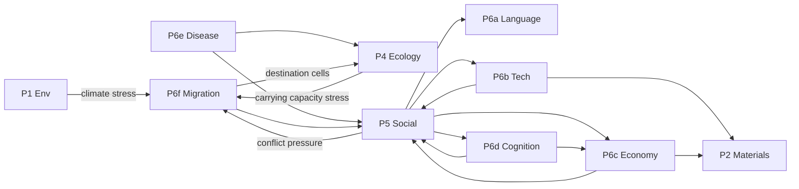

# 60 — Pillar P6: Language, Technology, Economy, Cognition, Disease, Migration

**Replaces in v1:**
- language-family enums (`systems/18_language_culture.md`),
- tech-tree nodes (`systems/19_technology_innovation.md`),
- resource-type enums and the Polanyi 3-mode economy (`systems/04_economic_layer.md`),
- cognition tier enum (reactive/deliberative/reflective) (`systems/17_individual_cognition.md`),
- disease class enum (viral/bacterial/parasitic) and disease-template scaffolding (`systems/16_disease_parasitism.md`),
- scripted migration triggers (`systems/20_migration_movement.md`),
- the dialogue intent enum and gate-kind enum in (`systems/08_npc_dialogue_system.md`).

**Depends on:** P5 cultural state, P4 demographics & resource state, P1+P2 environmental and material state, the existing v1 creature evolution (genome → phenotype-interpreter) pipeline.

This pillar is sub-divided into six sub-pillars; each gets its own concise treatment. The shared design pattern is the same as P5: continuous channels on registry-backed carriers, with post-hoc Chronicler labels replacing all enums.

---

## P6a Language — iterated learning over continuous phonology

**Replaces:** language-family enums; "echolocation" / "pack-call" / etc. as fixed types.

### New carrier: `language_lineage`

Per coherent communicative population (often 1-1 with `population_culture` but with split/merge dynamics of its own).

| Channel id | Range | Role |
|------------|-------|------|
| `phoneme_inventory_size` | `[0, 200]` | Distinct phoneme categories the population reliably distinguishes |
| `morphological_complexity` | `[0, 5]` | Morphemes per word (mean) |
| `syllable_structure_entropy` | `[0, 1]` | Diversity of allowed syllable shapes |
| `vocabulary_size` | `[0, 1e5]` | Lexicon size |
| `syntactic_nesting_depth` | `[0, 6]` | Maximum embedding depth |
| `pragmatic_indexicality` | `[0, 1]` | How much meaning depends on context vs. encoding |
| `language_homogeneity` | `[0, 1]` | Variance among speakers, inverse |

### Mechanism (iterated learning, Kirby-Smith)

Each tick within a population, a fraction of speakers transmit utterances to learners; learners infer rules; the rule-set with the highest learnability + expressivity score replaces the old. Two populations in contact (P5 coalition + co-occupancy) blend toward shared phonology weighted by interaction frequency. Geographic isolation drives drift; trade-network width drives expansion.

The Chronicler labels "language families" by clustering language-lineage trajectories over the channel space — never an enum.

```mermaid
flowchart LR
    A[Speaker pop A] -->|interaction freq| L[language_lineage A]
    B[Speaker pop B] -->|interaction freq| M[language_lineage B]
    L -.contact: blend.-> M
    L -- isolation: drift --> L
    M -- isolation: drift --> M
    L --> CH[Chronicler:<br/>family labels<br/>(post-hoc)]
    M --> CH
```

---

## P6b Technology — combinatorial recombination of capability channels

**Replaces:** tech-tree nodes; "fire-tech", "agriculture-tech" as discrete unlocks.

### New carrier: `technology_capability`

Per population, a vector of primitive capability channels:

| Channel id | Range | Role |
|------------|-------|------|
| `mechanical_leverage` | `[0, 10]` | Lever, pulley, wheel mastery |
| `thermal_control` | `[0, 10]` | Fire, cooking, smelting, kiln |
| `chemical_utility` | `[0, 10]` | Fermentation, metallurgy, extraction |
| `material_durability_use` | `[0, 10]` | Stone → bone → metal → ceramic mastery |
| `energy_capture` | `[0, 10]` | Muscle, animal, wind, water |
| `information_encoding` | `[0, 10]` | Notches → tokens → writing |
| `pattern_replication` | `[0, 10]` | Copying, casting, printing |
| `selective_breeding` | `[0, 10]` | Domestication of P4 species |

### Compound techs are emergent

A tech is "available" when all its primitive capability prerequisites pass thresholds. Brian Arthur (2009) showed every "invention" is recombination; here we encode recombination explicitly:

```jsonc
{ "id": "tech_compound.bow_and_arrow",
  "requires": { "mechanical_leverage": 2.0, "material_durability_use": 1.5 },
  "produces_modifier": { "predation_efficiency": +0.3, "ranged_combat": +1.0 },
  "provenance": "core" }
```

The compound-tech registry is mod-extensible. Mods add new compounds without engine changes — same as biome prototypes in P3 and governance prototypes in P5.

Capability channels rise via *use*: agents who successfully apply a primitive get population-level reinforcement for it. Capability channels also rise via *imitation* (CMLS horizontal transmission, weighted by the source population's success). Domain-crossing innovations emerge when two capabilities are both high — the registry's compound-tech entries fire automatically.

---

## P6c Economy — continuous goods space + emergent matching markets (ACE)

**Replaces:** resource-type enum, Polanyi 3-mode (`Reciprocity | Redistribution | Market`) classification, fixed exchange-mode weights.

### New carrier: `goods_inventory` (per-individual or per-household)

Replaces the v1 `MaterialSignature` 17-property economic role: economic goods are now `material_instance` entries (P2 carrier) plus a small number of **derived utility channels** per inventory:

| Channel id | Range | Role |
|------------|-------|------|
| `subsistence_value` | `[0, 1]` | Calories + nutrient adequacy from inventory |
| `productive_value` | `[0, 1]` | Tool/material instrumentality |
| `prestige_value` | `[0, 1]` | Cultural value (read from P5 cultural-trait correlations) |
| `liquidity` | `[0, 1]` | How readily goods can be exchanged in current market |

### Matching markets

ACE-style (Tesfatsion & Judd 2006) double-auction matching runs per cell per N_TRADE ticks. No global price; agents post bids and asks; orders match in sorted-bid-id order (deterministic). Money is *emergent* per Menger 1892: whichever good has highest `liquidity` (most often demanded as intermediate) becomes a unit of account; the Chronicler labels it "currency" once a population reaches a threshold of money-mediated exchanges.

The Polanyi 3-mode taxonomy is not state. It is a Chronicler clustering label over `(reciprocity_score, redistribution_score, market_score)`, where:

- `reciprocity_score` ∝ proportion of trades within high-kinship pairs,
- `redistribution_score` ∝ flow through high-`gov_centralisation` coalition entities,
- `market_score` ∝ proportion of trades using emergent currency.

---

## P6d Cognition — continuous Active-Inference channels

> **Forward reference (added with doc 57/58).** This subsection sketches the *substrate* (seven channels). The full agent AI architecture that runs on these channels — discrete factored POMDP, variational message passing, MCTS-EFE planning, reduced-nested theory-of-mind, flat preference-channel registry, action-skill macros, sapience scaling, runtime/space complexity analysis — is specified in **[57_agent_ai.md](57_agent_ai.md)**. Per **Invariant 9**, doc 57 is the single decision-making engine for the entire project; combat AI / dialogue intent / foraging / migration policies are all sampled from the same engine over different parts of the same factor graph.
>
> P6a's iterated-learning lexical-transmission op (§1 of this doc) is extended in **[58_channel_genesis.md](58_channel_genesis.md)** §6.6 — newly registered channels propagate as memetic payloads through the same operator. No new mechanism is introduced; the op handles channel-id payloads alongside the lexeme payloads it already handles.

**Replaces:** the cognition-tier enum (reactive / deliberative / reflective).

### New carrier: extension to existing `cognitive_agent` (every NPC creature)

| Channel id | Range | Role |
|------------|-------|------|
| `predictive_horizon_ticks` | `[1, 1e3]` | How far ahead the agent's generative model plans |
| `model_depth` | `[1, 6]` | Hierarchy depth of the agent's predictive model |
| `theory_of_mind_order` | `[0, 4]` | "I think you think I think …" recursion depth |
| `precision_weight_perception` | `[0, 1]` | Variance assumed on observations (Friston) |
| `precision_weight_prior` | `[0, 1]` | Variance assumed on priors |
| `curiosity_drive` | `[0, 1]` | Active sampling for information gain |
| `imitation_drive` | `[0, 1]` | Weight on copying others |

### Mechanism

The agent at each decision point minimises expected free energy over the horizon, weighted by precision channels. "Reactive" / "deliberative" / "reflective" labels are 1-NN cluster labels over `(horizon, depth, ToM)` — Chronicler-emitted, not state.

The dialogue-intent enum and gate-kind enum from `systems/08` are removed: dialogue intents emerge from active inference (the agent's model of the conversation goal) and gates are continuous activation thresholds over (cultural-similarity, kinship, governance, current-need) inputs.

---

## P6e Disease — multi-strain SIR over continuous antigenic space

**Replaces:** disease class enum (`viral | bacterial | parasitic`); designer-authored disease templates.

### New carrier: `pathogen_strain`

| Channel id | Range | Role |
|------------|-------|------|
| `transmissibility` | `[0, 5]` | Per-contact infection probability |
| `virulence` | `[0, 1]` | Probability of host death per tick infected |
| `incubation_ticks` | `[1, 100]` | Latency before infectiousness |
| `recovery_ticks` | `[1, 1000]` | Time to clearance (or chronic if very high) |
| `antigenic_position` | `[Q32_32; ANTIGENIC_DIM]` | Position in continuous antigenic space; default ANTIGENIC_DIM = 4 |
| `host_specificity_vector` | `[Q32_32; N_HOST_TRAITS]` | Which host trait values are most susceptible |
| `transmission_route_aerosol` | `[0, 1]` | Aerosol weight |
| `transmission_route_contact` | `[0, 1]` | Direct-contact weight |
| `transmission_route_vector` | `[0, 1]` | Mediated by a third species |
| `transmission_route_environmental` | `[0, 1]` | Soil/water reservoir |

### Mechanism

Multi-strain SIR (Gog & Grenfell 2002) per population, per cell. Infection rate uses host-trait similarity and antigenic-distance-discounted prior immunity:

```
P(infect | host I, strain S) ∝ S.transmissibility
                              * trait_match(I, S.host_specificity_vector)
                              * route_overlap(I.contact_pattern, S)
                              * (1 - cross_immunity(I.exposure_history, S.antigenic_position))
```

Strain mutation drifts `antigenic_position` and other channels every M ticks; antigenically distant new strains escape prior immunity.

Disease-class labels (viral / bacterial / parasitic / fungal) are *not state* — they're Chronicler clusters over `(transmissibility, virulence, recovery_ticks, transmission_route_*)` plus host-range patterns.

---

## P6f Migration — utility-driven gravity flow on the SCVT graph

**Replaces:** scripted migration triggers (`systems/20`); push-pull threshold enums.

### Mechanism

Per individual or household, migration *probability* in a tick is a continuous utility-difference function:

```
U(cell) = w_subsist * (P4 calories) + w_safety * (1 - P5 conflict_pressure)
        + w_kinship * pedigree_attractor(cell) + w_climate * (1 - climate_stress(cell))
        + w_culture * (1 - cultural_distance(cell))
        - w_distance * geodesic_distance_on_neighbour_graph(here, cell)
```

Sample destinations Boltzmann-weighted by `exp(U / T_MIGRATION)` over reachable cells (BFS-bounded for tractability). Aggregate flux follows a gravity-model pattern (mass × mass / distance²) without anyone hardcoding it.

Push-pull labels ("famine migration", "war refugee", "trade migration") are 1-NN clusters over the dominant utility-component term per migration event — Chronicler-emitted.

---

## 1. Cross-pillar hooks (whole pillar)



---

## 2. Tradeoff matrix (subset; per-subpillar above)

| Decision | Option set | Choice | Why |
|----------|------------|--------|-----|
| Language | Family enum / **Iterated-learning continuous** | Iterated learning | Emergence of structure from transmission; Chronicler labels families |
| Technology | Tech tree DAG / **Combinatorial recombination over capability vector** | Combinatorial | Brian Arthur framing; mod-extensible compound registry |
| Economy mode | Polanyi enum / **Continuous matching markets (ACE) with emergent currency** | ACE | Money emerges per Menger 1892; modes are post-hoc clusters |
| Cognition | Tier enum / **Continuous Active Inference channels** | Active Inference | Friston framework; tiers are clusters |
| Disease | Class enum / **Multi-strain antigenic-distance SIR** | Multi-strain SIR | Strain dynamics, vaccine-evasion, classes emerge |
| Migration | Trigger enum / **Utility-driven gravity flow** | Gravity flow | Push-pull labels are clusters; one continuous mechanism |
| Currency | Designer-authored / **Emergent from liquidity ranking** | Emergent | Per Menger; Chronicler labels |

---

## 3. Emergent properties (highlights)

1. **Language families form, split, merge across millennia.** No designer ever names a family; Chronicler clustering does.
2. **Domain-crossing innovations.** Two unrelated capability channels at high values may unlock a compound tech registered by a mod (e.g., "metallurgy" requires `thermal_control` + `material_durability_use` + `chemical_utility`); the registry is open.
3. **Money emerges from liquidity.** Whichever good is most often used as an intermediate becomes "currency"; different worlds may settle on different currencies (cattle, beads, salt, metal) without scripting.
4. **Pandemics with antigenic drift and re-emergence.** Multi-strain SIR generates flu-like dynamics, including reinfection waves with antigenically distant strains.
5. **Famine migration → cultural blending.** Climate stress in P1 drives utility-flux gradients in P6f; resulting movement induces P5 horizontal transmission; cultural blending follows naturally.
6. **Cognitive arms race.** Theory-of-mind escalation in coalition-vs-coalition conflict (P5) selects for higher `theory_of_mind_order`; exposes latent design-space for "advanced sapience" without an enum.

---

## 4. Open calibration knobs (selected)

- `N_CULTURAL_AXES`, `ANTIGENIC_DIM`, `N_HOST_TRAITS`.
- Iterated-learning bottleneck size; vertical:horizontal transmission ratio.
- Compound-tech registry contents (mod-extensible).
- ACE matching cadence `N_TRADE`; bid-ask spread tolerance.
- Active Inference precision-weight priors, curiosity-drive default.
- Multi-strain mutation rate per M ticks; antigenic-drift step size.
- Migration utility weights (subsistence, safety, kinship, distance).

---

## 5. Determinism checklist

- ✅ Per-subpillar Xoshiro stream (`rng_lang`, `rng_tech`, `rng_econ`, `rng_cog`, `rng_disease`, `rng_migration`).
- ✅ Sorted iteration in all pairwise updates.
- ✅ Lookup tables for `exp`, `log`, `pow` in Q32.32.
- ✅ ACE matching uses sorted-bid-id order; ties resolved by sorted-id.
- ✅ Multi-strain SIR uses per-cell sorted strain id.
- ✅ Migration BFS uses sorted neighbour edges.

---

## 6. Sources (compact)

- **Language.** Kirby, S., Cornish, H., Smith, K. (2008) *PNAS* 105; Smith, K., Kirby, S., Brighton, H. (2003) *Artificial Life* 9; Tamariz, M., Kirby, S. (2015) *Curr. Opin. Behav. Sci.* 6.
- **Technology.** Arthur, W. B. (2009) *The Nature of Technology*; Lehman, J., Stanley, K. (2011) *Evol. Comput.* 19.
- **Economy.** Tesfatsion, L., Judd, K., eds. (2006) *Handbook of Computational Economics, Vol. 2: ACE*; Menger, C. (1892) "On the origins of money"; Epstein, J., Axtell, R. (1996) *Growing Artificial Societies*.
- **Cognition.** Friston, K. (2010) *Nat. Rev. Neurosci.* 11; Clark, A. (2013) *Behav. Brain Sci.* 36 (predictive processing).
- **Disease.** Gog, J., Grenfell, B. (2002) *PNAS* 99; Anderson, R., May, R. (1991) *Infectious Diseases of Humans*.
- **Migration.** Stouffer, S. A. (1940) "Intervening opportunities" — gravity-flow precursor; Anderson, J. E. (2011) *Annu. Rev. Econ.* 3 (gravity model survey).
