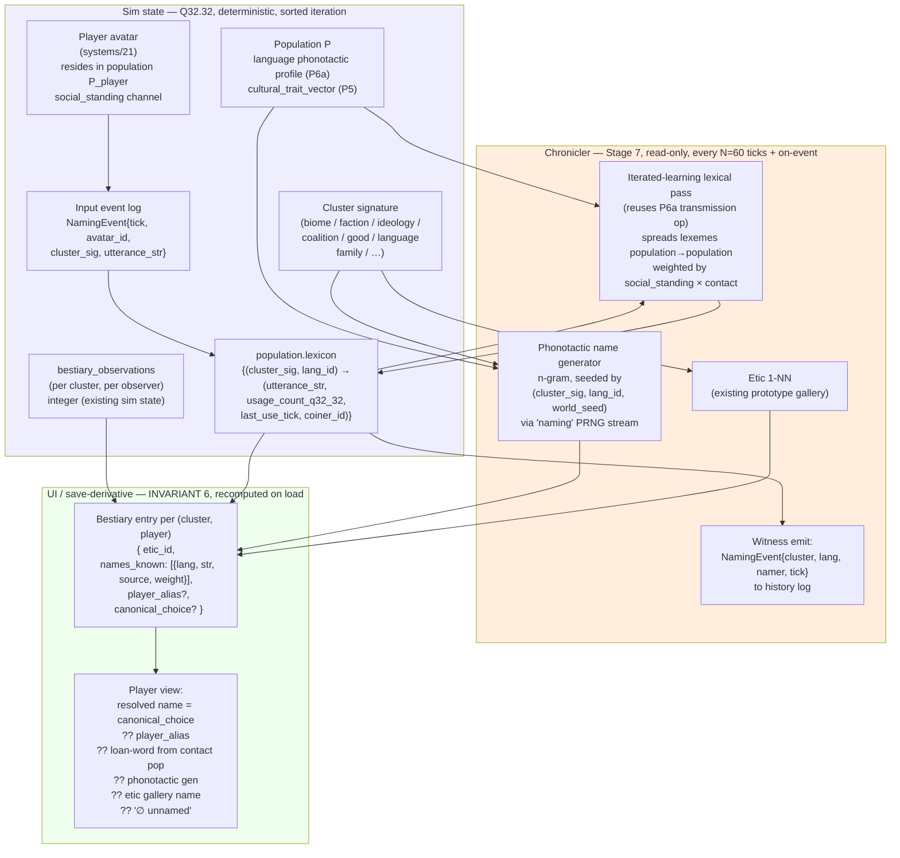

# 70 — Pillar P7: Naming, Discovery, and Player Presence

**Replaces in v1:** the implicit assumption — present throughout `systems/01–23` — that every named-thing in the world (biomes, factions, treaties, languages, technologies, currencies, ideologies, wars, species, individual creatures, places) carries a *single canonical designer-authored name* visible identically to every observer. That assumption never appears in a single doc, but it is what the v1 bestiary, map labels, and tooltips silently rely on.

**Replaces in v2 (provisionally):** the `"uncategorised"` literal fallback in the 1-NN labelling rule of `30_biomes_emergence.md` §4 (and its analogues in `50_social_emergence.md`, `60_culture_emergence.md`, and the new edge-cluster + node-cluster galleries from `56_relationship_graph_emergence.md`). Those galleries remain — they become the *etic* (view-from-nowhere) layer — but the *emic* (per-observer) layer added by this pillar is what the player and in-world populations actually see. **Per Invariant 8, no `"unlabelled"` / `"uncategorised"` string ever appears in player view.**

> **Cluster-signature taxonomy extended (with docs 56/58).** The `ClusterSig` input to this pipeline now covers, in addition to biomes / factions / ideologies / coalitions / goods / language families / species:
> - **Edge-cluster signatures** from doc 56 (kinship-shaped, fealty-shaped, trade-shaped, ritual-shaped relationship-types) — per-pair-aggregated edge-feature-vector clusters.
> - **Node-cluster signatures** from doc 56 at every Leiden level (households, settlements, polities, guilds, religions, packs) — vertex-overlap clusters with size, edge-type composition, internal-hierarchy-index features.
> - **Genesis-born channel ids** from doc 58 (`genesis:<src_pop>:<tick>:<kind>:<sig_hash>`) — runtime-registered preference / factor / skill / cluster-label channels propagated through P6a.
>
> The phonotactic-gen, loan-word, alias, and discovery-threshold mechanics in §4 apply unchanged to all of these. The five-layer resolution chain is the **single name-resolution path** for every cluster signature in the simulation.

**Special note.** This pillar is the bridge between the simulation and the player. Where every other v2 pillar replaces a designer-authored taxonomy with a continuous channel space and post-hoc Chronicler labels, P7 turns *labelling itself* into a participatory in-world act. The player is not an oracle reading the Chronicler's labels off a screen — they are an avatar embedded in a population whose utterances are real speech acts that propagate through the same iterated-learning mechanism (P6a) that drives every other in-world language. **Naming is gameplay.**

A future narrative mode ("Demiurge") may relax the avatar embedding and allow out-of-world labelling, but the in-world model is the canonical case and the only one specified here.

---

## 1. Why this pillar exists

Three forces converge on the same need:

**The "uncategorised" UX gap.** A cell whose feature vector is far from every prototype gets the literal label `"uncategorised"`. The biome pillar treats this as a feature (it surfaces gallery gaps for modders), but the player sees it as a glitch. Worse, it flickers in and out as cells drift across distance thresholds. There is no narrative continuity attached to it.

**The implicit designer-authored canon.** Even when v2 pillars produce real emergent clusters — a faction whose `cultural_trait_vector` lands in a new region, an ideology that crystallises around `cultural_axis_27`, a war between two coalitions, a good that crosses the liquidity threshold and becomes "currency" — the *names* for these things are still designer-authored strings in JSON galleries. The simulation can produce a polity nobody has ever seen before, and the Chronicler will dutifully attach the closest gallery name to it. This is the last hardcoded taxonomy in v2.

**The player-as-tourist problem.** In v1 and in v2-as-currently-written, the player reads labels off a UI surface that is ontologically outside the world. They do not *participate* in the world's epistemology. The project rule is "the simulation comes first and gameplay emerges from it," and naming is currently the largest carve-out — the player's relationship to discovery is presentational, not simulational.

P7 closes all three. The `"uncategorised"` literal becomes a player-fillable placeholder. Designer-authored canon becomes one of several name sources, weighted by in-world contact. The player's avatar becomes a speaker in the iterated-learning pool whose coinings can propagate, persist, or fade exactly like any other in-world utterance.

---

## 2. The unifying principle

> **Every named-thing has a namer.** The Chronicler does not assign names; it *witnesses* them. A name is a tuple `(utterance_str, language_id, coiner_id, coined_tick, usage_weight)` attached to a cluster signature. Multiple namers may coexist for the same cluster — that is the default, not an edge case. The player's avatar is one such namer, weighted by their social-standing channels.

This is a strict generalisation of P6a iterated learning (`60_culture_emergence.md` §1) from grammatical structure to lexical content. P6a already models how phoneme inventories and syllable structures propagate across populations via transmission; P7 extends the same machinery to *individual lexemes* keyed to cluster signatures.

It is also a strict honouring of `INVARIANT 2: Mechanics-Label Separation` and `INVARIANT 6: UI vs. Sim State`. Names are never read by systems 01–20 in any branch; the *lexicon channel* (which is sim state) records only `(cluster_signature → utterance bytes, usage count)` mappings, and which name a given player sees is derived UI state recomputed on load.

---

## 3. Architecture



The arrows that matter: the player's NamingEvent enters the **sim** (input log → lexicon), then the iterated-learning pass propagates it through populations exactly like any other utterance. The Chronicler is downstream of all of this; it watches, generates fallback names, and emits the witness log. The UI bestiary reads sim state and renders one of several name sources to the player based on a deterministic resolution order.

The naming pass is part of **Stage 7 (Labelling & Persistence)** of the existing 8-stage tick loop (`architecture/ECS_SCHEDULE.md`). Lexicon iterated-learning runs every N=60 ticks (matching biome labelling); contact-driven loan-word events run on the tick the contact occurs (cheap, sparse).

---

## 4. Mechanism

### 4.1 The five name layers, in priority order

Every cluster signature in the world (biome cell, faction, ideology, coalition, good, language family, individual creature, place) has up to five name candidates. The bestiary resolves them in this order for the player's view:

1. **Player canonical choice.** The player has explicitly chosen one of the available names as canonical for their bestiary. (Rare; high agency.)
2. **Player alias.** The player typed a placeholder before any in-world name was available. Persists until the player explicitly lifts it.
3. **Loan-word from contact population.** A name borrowed via P6a iterated learning from a population the player's avatar has contact with. Phonotactically adapted to the player's language.
4. **Phonotactic auto-gen from player's own language.** When a cluster has been observed (`bestiary_observations > threshold`) but no name has been adopted, the Chronicler generates one using the player population's phonotactic profile and seeds it as the avatar's spontaneous coining. The player sees it as "their language's word for it"; mechanically it is an n-gram-generated string.
5. **Etic gallery name.** The 1-NN gallery label from P3/P5/P6, italicised in the UI as a "scientific" or "outsider" name. This is the v2-as-currently-written label.

If none of (1)–(5) applies, the player sees a sigil placeholder (`∅ unnamed`) and a UI prompt to coin a name. **The literal `"uncategorised"` is removed from player view**; it remains in developer/debug surfaces only.

### 4.2 The lexicon as sim state

A new field on each population:

```rust
struct PopulationLexicon {
    // Sorted by (cluster_sig_bytes, lang_id) for determinism.
    entries: BTreeMap<(ClusterSig, LangId), LexEntry>,
}

struct LexEntry {
    utterance: SmolStr,        // bytes; deterministic across replays
    usage_count: Q32_32,        // Q32.32 weight
    last_use_tick: TickId,
    coiner_id: NamerId,         // avatar id, NPC individual id, or POP_GENESIS
    source: LexSource,           // Coined | LoanFrom(LangId) | PhonotacticGen
}
```

This is the only *new* sim state introduced by P7. The lexicon is per-population, owned by the existing population entity. Iteration is always sorted by `(cluster_sig, lang_id)` keys to satisfy `INVARIANT 1`.

The lexicon is serialised. The bestiary entry that *renders* it (UI/save-derivative state) is not.

### 4.3 The phonotactic name generator

P6a already gives every population continuous language channels (`phoneme_inventory_size`, `morphological_complexity`, `syllable_structure_entropy`, …). The generator turns them into a sampleable n-gram phonotactic model:

- **Determinism.** Seeded by `splitmix64(world_seed ⊕ cluster_sig_hash ⊕ lang_id)` from the dedicated `naming` Xoshiro256PlusPlus stream. Same inputs → same bytes, every replay.
- **Length.** Sampled from a Q32.32-discretised log-normal whose mean is `f(morphological_complexity)`.
- **Phoneme set.** Drawn from the population's quantised phoneme inventory (registry-backed; mods register phoneme sets via JSON manifests, same pattern as channels and prototype galleries).
- **Syllable shaping.** Markov transitions over phoneme classes (V, C, glide, etc.) with transition probabilities derived from `syllable_structure_entropy`.
- **Anti-collision.** If the generated bytes already exist in the population's lexicon for a different cluster, increment the seed counter and retry up to 8 times; if all 8 collide, append a deterministic disambiguator suffix.

The generator runs at most once per `(cluster, language)` pair per game (cached in lexicon). It is the cheapest part of the pipeline.

### 4.4 The player avatar as speaker

The avatar (per `systems/21`) belongs to a population P_player. The avatar is a *speaker* in P6a's iterated-learning pool with weight:

```
avatar_speaker_weight = social_standing × interaction_frequency × player_presence_multiplier
```

`social_standing` is an existing P5 channel. `interaction_frequency` is derived from the avatar's recent contact ticks. `player_presence_multiplier` is a small registry-backed constant (default 1.5) that gives the player a modest extra weight to make their coinings *plausibly canonical* without dominating — a low-status pariah avatar's neologisms still struggle to spread, by design.

When the player types a name N for cluster X via the bestiary UI:

1. A `NamingEvent { tick, avatar_id, cluster_sig: X, utterance: N }` is appended to the deterministic input event log (the same log that records movement, dialogue, combat actions).
2. On the next Stage 7 pass, the event is replayed: P_player's lexicon entry for X is set or strengthened, `coiner_id = avatar_id`, `source = Coined`, `usage_count += avatar_speaker_weight`.
3. P6a's standard iterated-learning lexical-transmission op runs over sorted population pairs with contact > threshold; the lexeme has a probability of being learned by population Q proportional to `(P→Q contact frequency) × (P.social_standing for cluster X observers)`.
4. In Q's lexicon the borrowed lexeme is phonotactically adapted (its phoneme sequence is projected onto Q's phoneme inventory, with non-Q phonemes substituted by nearest-in-feature neighbours) — exactly the same loan-word adaptation P6a already does for grammatical features.

The result: a high-status avatar in a well-connected population can canonise names that propagate to neighbouring civilizations within a few in-game generations. A low-status avatar's coinings stay private. Both are *real linguistic events* in the simulation, not UI annotations.

### 4.5 Discovery state, reusing `bestiary_observations`

`CLAUDE.md` already establishes the rule: `bestiary_observations` is sim state (an integer counter); `bestiary_discovered` is derived UI state. P7 reuses this directly and adds resolution thresholds:

| `observations` value | UI behaviour |
|---|---|
| `0` | Cluster invisible to player. |
| `1` … `T_glimpse` (default 3) | "Something seen" — sigil placeholder, no name UI. |
| `T_glimpse` … `T_name` (default 12) | Player can coin an alias. Phonotactic auto-gen offered as suggestion. Etic gallery name visible as italicised hint. |
| `> T_name` | Loan-word from any contact-population lexicon entry surfaces. Player can choose canonical. |
| `> T_canonised` (default 60) | Bestiary entry shows full naming history (who named it, in which language, when). |

Thresholds are registry-backed, mod-tunable.

### 4.6 What about clusters with no in-world observers?

Genuine wilderness — a cluster nobody has ever seen, in-world or as the player. The lexicon is empty. The Chronicler still computes the etic 1-NN cluster id (cheap), but emits no name. Such clusters appear in the *world map* as fog-of-war regions and in no bestiary at all. They cost essentially zero CPU and zero memory until first observation.

---

## 5. Cross-pillar hooks

| Pillar | Read | Write |
|---|---|---|
| **P1 Environment** | cell channels feed into etic cluster signatures | none |
| **P2 Materials** | material_instance signatures feed into "currency" cluster sig | none |
| **P3 Biomes** | etic gallery + cluster ids | none |
| **P4 Ecology** | species cluster sigs (creature individuals → lineage cluster) | none |
| **P5 Social** | `social_standing`, `cultural_trait_vector` → speaker weight; coalition/treaty/ideology cluster sigs | none |
| **P6a Language** | phonotactic profile per population; iterated-learning lexical-transmission op | extends lexicon (not language structure) |
| **P6b Tech** | compound-tech cluster sigs | none |
| **P6c Economy** | currency cluster sig | none |
| **P6d Cognition** | active-inference horizon cluster sigs | none |
| **P6e Disease** | strain cluster sigs | none |
| **P6f Migration** | push-pull cluster sigs | none |
| **systems/21 Player Avatar** | avatar_id, residence population, social_standing | NamingEvent input |
| **systems/22 Serialization** | lexicon serialised; bestiary UI state derived | none |

P7 is *almost* a pure read-only consumer: it reads from every other pillar and writes only to its own `population.lexicon`. The single new write surface — NamingEvent input → lexicon — runs in Stage 7, late in the tick.

---

## 6. Tradeoff matrix

| Decision | Options | Sim Fidelity | Determinism | Implementability | Player Legibility | Emergent Power | Choice + Why |
|---|---|---|---|---|---|---|---|
| **Source of fallback names** | (a) `"uncategorised"` literal · (b) Designer fallback strings · (c) Markov from fixed phoneme table · (d) **Phonotactic gen from in-world language channels** · (e) Pure player input | (d) high — uses already-required state | All deterministic if seeded; (d) seeded by `(cluster_sig, lang_id, world_seed)` | (a) trivial; (d) moderate (n-gram + Q32.32 sampler) | (a) lowest; (d) highest — names *feel* like the civilization | (d) highest — names ride existing P6a emergence | **(d) with (e) override.** The phonotactic state is already paid for. |
| **Who owns the name** | Omniscient Chronicler · **Per-population emic + Chronicler witness** · Player only | Per-pop matches real ethnobiology | All equal | Per-pop moderate (extra UI layer) | Per-pop highest (synonyms, contact-driven name change) | Per-pop highest (the whole point of v2) | **Per-population emic.** Multiple names per cluster is a feature. |
| **Player avatar's role** | Read-only observer · **Speaker in iterated-learning pool with social-standing weight** · Free dictator over canonical names | Speaker-with-weight matches sociolinguistics (Labov) | Same | Speaker moderate (NamingEvent → existing IL op) | Speaker highest — names have stakes | Speaker highest — naming is a real verb | **Speaker with weight.** Player has agency that is bounded by their in-world standing. |
| **Player override** | None · **Alias on undiscovered, lift on contact, canonical-choice always available** · Player alias always wins | Same — alias is profile-side | Same | Moderate | Highest — folk-taxonomy → scientific arc playable | Highest — naming as a *gameplay verb* | **Alias-with-lift + canonical-choice.** Bestiary surfaces synonyms even when player has chosen one. |
| **Discovery thresholds** | Binary discovered / not · **`bestiary_observations` thresholds** · Continuous familiarity | Threshold reuses existing sim state | Same | Trivial (threshold compares) | Threshold legible (progression UI) | High — encourages exploration | **Threshold model**, reusing `bestiary_observations`. |
| **Generator algorithm** | Hand-tuned phoneme table per language family · **Bigram Markov over phoneme classes** · Trigram · Learned RNN | Bigram sufficient at 20k cells | Bigram fully deterministic | Bigram moderate | Bigram legible | Bigram good (varied per population) | **Bigram with per-pop transition table**. Trigram reserved for future. |
| **Iterated-learning of lexemes** | Lexemes outside IL · **Lexemes inside IL (P6a extension)** · Separate language-spread system | Inside IL matches Croft 2000 | Same | Inside IL low-cost (reuses op) | Inside IL highest legibility (one mechanism) | Inside IL highest | **Extend P6a's lexical-transmission op.** Modular reuse. |
| **Naming pass timing** | Every tick · **Every N=60 ticks for IL pass + on-event for player NamingEvent + on-event for first-contact loan** · Continuous | Same | All deterministic | N-tick easiest; on-event cheap | Same | Same | **N=60 + on-event.** Matches biome timing. |
| **Lexicon serialised?** | Yes — sim state · No — derived from history · **Yes for current entries, prune cold lexemes after T_decay ticks** | Yes-with-prune matches working memory | Same | Moderate | Same | Same | **Serialise current entries; prune.** Bounded storage cost. |
| **Demiurge mode** | Always in-world · **In-world default + opt-in Demiurge mode for sandbox/storyteller play** · Always demiurge | In-world mode is canonical | Demiurge mode skips IL pass cleanly | Demiurge as feature flag | Demiurge has different UX (god-naming) | In-world has all of v2's emergent power | **In-world default; Demiurge as future toggle.** Per project-owner direction. |

---

## 7. Emergent properties

The point of this pillar is that *interesting naming behaviour falls out of the dynamics*, not out of designer authoring. Highlights:

**The player's words become history.** A high-status avatar coins "Ashfall Plains" for a volcanically perturbed grassland; the name spreads to two neighbouring populations within forty in-game years; eight generations later, the player's descendants find the name in records of a war fought on those plains. The player's naming has become canonised lore *because their avatar's social standing earned it propagation*, not because the UI saved a string.

**Multiple names per place are normal.** Five civilizations in contact with the same biome cluster will coin five different names in five different phonotactic profiles, with cross-loanings producing a tangled web of cognates and false friends. The bestiary's "synonyms" view shows all of them; the world's map shows whichever name the player's culture has adopted.

**Folk taxonomy precedes scientific consensus.** Early-game populations name biomes and species crudely (low `morphological_complexity` → short, polysemous lexemes). Late-game populations with high cognition channels can introduce *taxonomic prefixes* (registered in the registry, not hardcoded) that compose with base lexemes, producing Linnaean-style binomials emergently — Berlin (1992)'s "generic + specific" rank ordering falls out of language complexity, not designer fiat.

**Loan-words betray contact history.** A name that survives in population Q with phonotactic features that don't match Q's profile is *evidence of past contact*. The Chronicler's history log can surface this: "the Marsh-Folk word for this metal is phonotactically inconsistent with their language, suggesting it was borrowed from the Northwood ~600 ticks ago." This is real historical-linguistics methodology (Trask 1996) applied to in-world data.

**Wars are named by survivors.** A coalition with the war signature (`50_social_emergence.md` §4.4) is witnessed by the Chronicler as a war event. The first population to coin a name for it does so in their own language ("the Long Winter of the Cattle-Lords"); other populations adopt or invent variants; the player's bestiary records all of them. There is no `war.name` field; there is only "what people called this when they wrote it down."

**Currency naming is automatic.** When a `material_instance` crosses the liquidity threshold and gets the etic label `"currency"`, the lexicon already has a name for that material in every population that uses it. The "currency" of the Marsh-Folk is just *whatever they called the underlying good*, plus a derived honorific suffix once trade volumes pass a higher threshold. No `currency_name` field anywhere.

**Player can name dead clusters too.** A volcanically destroyed biome that no longer has any cells with that signature still has a lexicon entry in any population that observed it. The bestiary records "the Ashfall Plains, named by you in year 412, signature last observed year 489." Names persist past their referents — exactly as they do in real history (the "Mediterranean" still names the sea even though "in the middle of the land" describes a Roman geography that no longer exists).

**The `"uncategorised"` UX gap closes structurally.** A cluster the player has observed but no in-world population has named is *the player's chance to name it*. A cluster nobody has observed remains invisible. There is no third state where the player sees a clinical placeholder.

---

## 8. What is *deliberately* missing

- **No `name` field on any cluster, faction, treaty, ideology, war, currency, or species.** Names live only in lexicons. Reading a name is a query against a population's lexicon, not a struct field access.
- **No global canonical name for anything.** Even in the player's bestiary, the canonical-choice field is *the player's choice*, not the world's. A different player in the same seed could choose differently.
- **No Linnaean-style hardcoded ranks.** Genus / species / variety distinctions, if they emerge, do so through compound-name registration in mods following the same JSON pattern as channels — not as a sim-state field.
- **No translation tooltips by default.** When the player hears a foreign name, they hear it untranslated unless their avatar's population has a lexicon entry for that cluster. Translation is a gameplay verb (linguistic study), not a UI affordance.
- **No designer-authored "good name" gallery.** The phonotactic generator is the only fallback. If the generator produces unmemorable names, that is a calibration problem on the language channels, not a hole to plug with hand-authored strings.
- **No name-permanence guarantee.** A name with `usage_count` decaying below a threshold may be forgotten — its lexicon entry pruned. This matches the historical pattern of dead languages losing words.
- **No omniscient "true name."** The etic gallery label is shown italicised as one source among many, never privileged. The Chronicler is a witness, not an oracle.

---

## 9. Open questions / calibration

1. **`player_presence_multiplier`** default value (1.0 / 1.5 / 2.0). Higher = player-coinings dominate; lower = the world's existing speakers do most of the naming. Recommended starting point: 1.5, tuned via playtesting.
2. **Lexicon prune threshold** `T_decay` (in ticks) and `usage_count` floor. Recommended: prune when `usage_count < 0.01` and `last_use_tick + T_decay < current_tick`, with `T_decay = 3650` (one in-game decade).
3. **n-gram order.** Bigram is the current recommendation; trigram captures more language-feel but doubles the per-population transition-table memory. Defer trigram to a later phase.
4. **Anti-profanity / anti-collision hardening.** Player-typed names are user input — a safe-words registry-backed deny-list is needed before public release. Out of scope for v2 design; tracked as a separate concern.
5. **Save-format extension.** The lexicon adds bytes to the save. At 20 000 cells × ~50 distinct cluster signatures × ~10 in-world populations × ~8 byte average lexeme = ~80 MB upper bound, prunable. Confirm with `systems/22` Master Serialization owner.
6. **Demiurge mode design.** Out of scope here; tracked as a future-phase narrative-mode pillar (P7-D).
7. **Voice / pronunciation.** If audio is added later, names need to be pronounceable. The phonotactic generator output is by construction; player-typed names are not. A future TTS layer would need a phonemiser for player input.

---

## 10. Sources

### Linguistics & ethnobiology
- Berlin, B. (1992). *Ethnobiological Classification: Principles of Categorisation of Plants and Animals in Traditional Societies.* Princeton University Press. — folk taxonomic ranks (kingdom > life-form > generic > specific > varietal); the empirical basis for the discovery-threshold model.
- Atran, S. (1990). *Cognitive Foundations of Natural History.* Cambridge University Press. — cross-cultural stability of folk taxonomic ranks.
- Hunn, E. (1999). "Size as Limiting the Recognition of Biodiversity in Folk Biological Classifications," *Journal of Ethnobiology* 19(1). — perceptual-salience scaling, justifies the observation-threshold UI.
- Croft, W. (2000). *Explaining Language Change: An Evolutionary Approach.* Longman. — utterance-selection model that grounds the lexical-IL extension.
- Labov, W. (2001). *Principles of Linguistic Change, Vol. 2: Social Factors.* Blackwell. — sociolinguistic basis for weighting speakers by social standing.
- Trask, R. L. (1996). *Historical Linguistics.* Arnold. — loan-word phonotactic adaptation; cognate inference from phonotactic mismatches.
- Lewis, M. & Wigen, K. (1997). *The Myth of Continents.* University of California Press. — geographic naming as cultural act, not natural fact.

### Iterated learning & language emergence
- Kirby, S., Cornish, H., Smith, K. (2008). "Cumulative cultural evolution in the laboratory: An experimental approach to the origins of structure in human language," *PNAS* 105(31). — empirical IL paradigm; already cited in P6a.
- Smith, K., Kirby, S. (2008). "Cultural evolution: implications for understanding the human language faculty and its evolution," *Phil. Trans. R. Soc. B* 363. — IL operator family.

### Procedural generation
- Adams, T. (2008+). *Dwarf Fortress* world-gen language documentation (devblog). — practical n-gram phonotactic generation in roguelike contexts.
- van der Linden, R., Lopes, R., Bidarra, R. (2014). "Procedural Generation of Dungeons," *IEEE TCIAIG* 6(1). — broader survey including name generation; relevant to anti-collision and disambiguation strategies.

### In-project anchors
- `documentation/INVARIANTS.md` — determinism, mechanics-label separation, UI-vs-sim state.
- `documentation/architecture/ECS_SCHEDULE.md` — Stage 7 timing budget for the IL lexical pass.
- `documentation/emergence/60_culture_emergence.md` §1 — P6a iterated-learning model that this pillar extends.
- `documentation/emergence/30_biomes_emergence.md` §4 — etic 1-NN labelling rule that this pillar wraps.
- `documentation/systems/21_*.md` — player avatar, social_standing channel, residence population.
- `CLAUDE.md` — `bestiary_observations` (sim state) vs `bestiary_discovered` (UI-derived) — extended here to bestiary_names.
