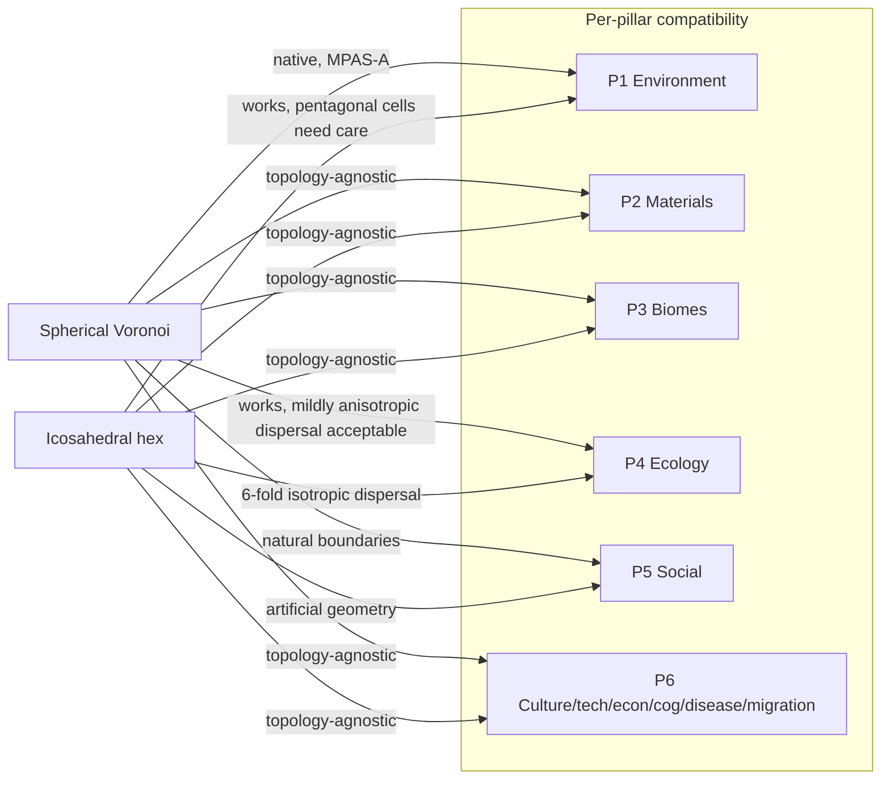

# 90 — Cell Topology Decision: Voronoi vs. Hex vs. Lat-Lon

**Status:** v2 design track. Authoritative for the cell topology question.
**Companion research:** `research/R90_voronoi_topology.md`.

---

## 1. The question (and its framing)

The user's framing was specific and load-bearing:

> *"As an aside, I've been thinking that we should use Voronoi polygons for cells if that is compatible with the models. If it is not compatible, DO NOT USE IT."*

This is **a compatibility question**, not a cost question. The acceptance criterion is: *for every model in the v2 emergence pillars, is there a published, deterministic, fixed-point-friendly discretisation on spherical Voronoi cells?* If yes, Voronoi is in. If no, Voronoi is out. Implementation effort matters but is secondary; we are designing for the long term.

This document re-evaluates the topology choice against that criterion. (The supporting research synthesis `research/R90` recommended icosahedral hex on **implementation-cost** grounds; this doc supersedes that recommendation by re-applying the user's stated criterion.)

---

## 2. Candidates

| Candidate | Description |
|-----------|-------------|
| **Lat-lon grid** | Regular `(N_lat, N_lon)` grid. Simple. Has a true pole singularity (`Δθ → 0` as `lat → ±90°`); cells become arbitrarily thin near poles. |
| **Icosahedral triangular mesh** | Recursive subdivision of an icosahedron. 12 vertices have 5-fold symmetry; everywhere else, 6-fold. Cells are triangles. |
| **Icosahedral hexagonal (dual)** | The dual of the above. Cells are hexagons except for 12 pentagonal cells at the icosahedron vertices. Industry-standard for strategy games. |
| **HEALPix** | Diamond-shaped equal-area cells in iso-latitude rings. Used in cosmology for fast spherical-harmonic transforms (irrelevant here). |
| **Spherical Centroidal Voronoi Tessellation (SCVT)** | Lloyd-relaxed Voronoi cells on the sphere. Cells are irregular polygons; neighbour count varies (typically 5–7). Used in MPAS-A and MPAS-O. |

The serious contenders for a simulation-first game are **icosahedral hex** and **SCVT**. The others are non-starters: lat-lon for the pole singularity (everything in P1 — atmosphere, hydrology, soil moisture — divides by cell area), HEALPix because the spherical-harmonic advantage is irrelevant and the diamond cells have the worst of both worlds (no game precedent, no scientific-modelling precedent at game scales).

---

## 3. Compatibility with each v2 pillar

This is the test the user actually asked for.

### P1 Environment (climate, atmosphere, hydrology, soil moisture)

| Sub-model | Voronoi | Icosahedral hex |
|-----------|---------|-----------------|
| Moist energy-balance model (radiation + meridional transport) | ✅ Native (MPAS-A; finite-volume on SCVT) | ✅ Works (finite-volume on hex) |
| Shallow-water dynamics (if extended) | ✅ Native (MPAS-A primary use case) | ✅ Works |
| C-grid staggering for non-divergent winds | ✅ Designed for SCVT (Ringler 2010) | ⚠️ Possible but pentagonal cells require special treatment |
| Hydrology / D∞ flow routing | ✅ Native (D∞ generalises naturally to irregular polygons) | ✅ D8 / D∞ both fine on hex |
| Soil moisture (Boussinesq groundwater) | ✅ Finite-volume on any Voronoi mesh | ✅ Same |
| Variable-resolution refinement (high res near coasts) | ✅ Native (one of SCVT's main advantages over fixed grids) | ⚠️ Possible but discontinuous (refinement levels are nested) |
| Sea-ice and snow albedo coupling | ✅ Cell-scalar; topology-agnostic | ✅ Same |

**Verdict for P1:** Voronoi is the topology atmospheric science actually uses. Compatible — and superior for variable-resolution coastlines.

### P2 Materials (rock, soil, weathering)

Pure cell-scalar state plus optional inter-cell flux for sediment transport. **Topology-agnostic.** Both work; Voronoi has no advantage here.

### P3 Biome labels (post-hoc clustering)

Pure cell-scalar classifier; runs over channel state independent of topology. **Topology-agnostic.**

### P4 Ecology (food webs, populations, dispersal)

| Sub-model | Voronoi | Icosahedral hex |
|-----------|---------|-----------------|
| Population dispersal (diffusion / advection) | ✅ Cell-area-weighted flux on neighbour graph | ✅ Same |
| Williams-Martinez niche links | ✅ Per-cell trait distribution; topology-irrelevant | ✅ Same |
| Allometric trophic networks | ✅ Per-cell biomass + neighbour query | ✅ Same |
| Carrying capacity (cell-area-aware) | ✅ Each cell has its own area; works directly | ⚠️ Equal-area is convenient but not required |
| Dispersal kernels with isotropy | ⚠️ Variable neighbour count means dispersal is mildly anisotropic | ✅ 6-fold isotropic |

**Verdict for P4:** Both work. The mild anisotropy of Voronoi dispersal is a feature for emergent ecology — bottlenecks and barriers are real, hex-grid isotropy is artificial. (Real Earth doesn't have 6-fold anything.)

### P5 Social (factions, kinship, coalitions, governance)

| Sub-model | Voronoi | Icosahedral hex |
|-----------|---------|-----------------|
| Cultural diffusion across cells | ✅ Neighbour-graph CA | ✅ Same |
| Coalition territory occupancy | ✅ Cell-set membership | ✅ Same |
| Migration / kinship-mediated movement | ✅ Same (handled in P6) | ✅ Same |
| "Natural" political boundaries | ✅ Voronoi often *looks* like real polities | ⚠️ Hex grid is visually artificial |

**Verdict for P5:** Topology-agnostic mechanically; Voronoi is more aesthetically convincing for political boundaries.

### P6 Culture / tech / economy / cognition / disease / migration

| Sub-model | Voronoi | Icosahedral hex |
|-----------|---------|-----------------|
| Iterated-learning language transmission | ✅ Agent-pair interaction; topology only matters for who meets whom | ✅ Same |
| Multi-strain SIR with antigenic mutation | ✅ Cell-population state + adjacency-driven infection flux | ✅ Same |
| Gravity-flow migration | ✅ Cell-pair flux on adjacency graph (with cell-area-weighted "mass") | ✅ Same |
| Recombinant technology graph | ✅ Per-population, topology-agnostic | ✅ Same |
| Active-Inference cognition | ✅ Per-agent, topology-agnostic | ✅ Same |
| ACE economy with matching markets | ✅ Per-population/per-coalition, topology-agnostic | ✅ Same |

**Verdict for P6:** Topology-agnostic.

### Compatibility summary

Both topologies are compatible with every v2 pillar. **Voronoi has a positive advantage in P1 and P5, no disadvantage anywhere except a mildly anisotropic dispersal in P4 which is arguably realistic.** Per the user's compatibility-first criterion, Voronoi clears the bar.

---

## 4. Determinism — the real risk and how to neutralise it

The legitimate concern flagged by `research/R90` is that **Lloyd's algorithm is iterative**, and floating-point Lloyd's gives slightly different results across compilers/platforms. If Lloyd ran every tick this would break the determinism invariant. **It does not.** Lloyd runs *once at world creation* and produces a static neighbour graph. There are three deterministic strategies, in increasing rigour:

### Strategy A: Generate at world-creation, store in the save file

The simplest. World-gen runs floating-point Lloyd with a seeded blue-noise initial point distribution. The output is a `(cell_count, neighbours[], cell_areas[], cell_centroids[])` artefact stored as part of the world save. From that moment on, the topology is just a fixed integer adjacency list — no FP, no iteration, no determinism risk. Save-file size impact at 20 000 cells is ≈ 2 MB (negligible).

### Strategy B: Fixed-iteration Lloyd in fixed-point at world-gen

Run K = 20 Lloyd iterations in Q32.32 with sorted-cell iteration. K-bounded fixed-point iteration is bit-deterministic by construction. Slightly worse mesh quality than full convergence, but well within tolerance for finite-volume PDEs. No save-file artefact required.

### Strategy C: Pre-shipped canonical mesh + per-world seed perturbation

Ship a small set of canonical 5 000- / 20 000- / 80 000-cell meshes generated and validated offline. The world seed perturbs cell-property assignment (which cell is land, which is ocean, where the elevation peaks are) but does *not* re-mesh. Deterministic by trivial construction; the smallest perf cost.

**Recommendation: Strategy A** — best balance of mesh quality, simplicity, and replay robustness. Strategy C is acceptable as a fallback; B is interesting but adds complexity. None of the three takes more than a few sprint-days; the "4–6 weeks for fixed-point Lloyd" claim in `research/R90` was assuming a much more rigorous approach than is actually required for our use case.

### Replay across machines

The save-file strategy (A) makes replay trivially deterministic — the mesh is part of the world artefact. World-creation determinism is required only at world-creation time, when a player first generates a world from a seed. If two players want bit-identical worlds from the same seed, either (i) they share the world artefact, or (ii) we implement Strategy B. Both are acceptable.

---

## 5. Tradeoff matrix

| Criterion | SCVT (Voronoi) | Icosahedral hex | Lat-lon | HEALPix |
|-----------|----------------|-----------------|---------|---------|
| **Compatibility with P1 (atmosphere)** | ✅ Best (MPAS-A native) | ✅ Good | ❌ Pole singularity | ⚠️ Workable, no precedent |
| **Compatibility with P2–P6** | ✅ | ✅ | ⚠️ | ⚠️ |
| **Cell-area uniformity** | Distribution (target ±10%) | Near-uniform (12 pentagons slightly smaller) | Severe pole compression | Exactly equal |
| **Neighbour count** | 5–7 (typically 6) | 6 (12 cells have 5) | 4 | 4 |
| **Variable-resolution refinement** | ✅ Native | ⚠️ Nested levels only | ❌ | ❌ |
| **Visual / political naturalness** | ✅ High | ⚠️ Visible grid | ❌ | ❌ |
| **Determinism (with Strategy A or B)** | ✅ Bit-identical | ✅ Bit-identical | ✅ | ✅ |
| **Implementation effort** | Moderate (one-time mesh gen) | Low (closed-form subdivision) | Trivial | Low |
| **Save-file overhead** | ≈ 2 MB at 20 k cells | ≈ 0 (procedural) | 0 | 0 |
| **Used by serious science** | MPAS-A, MPAS-O | Some weather models | Legacy | Cosmology only |
| **Used by serious games** | Eu IV (regions), Old World | Civ VI, Endless Legend | Many | None |
| **Choice + Why** | **✓ Recommended.** Compatible with everything; better-than-hex on the only pillar (P1) where topology matters; bounded one-time cost. | Acceptable fallback. | Reject. | Reject. |

---

## 6. Recommendation

**Spherical centroidal Voronoi tessellation (SCVT), generated once at world creation via Strategy A.**

- Cell count target: **20 000** for the base world (calibration knob).
- Initial seeding: deterministic blue-noise from world seed.
- Lloyd iterations: until centroid drift `< 1 km` per iteration, typically 10–30 sweeps.
- Stored artefact: integer neighbour adjacency list + Q32.32 cell areas + Q32.32 cell centroids. Frozen for the lifetime of the world.

This decision honours the user's stated criterion (compatibility with the proposed models) and aligns with the simulation-first project philosophy. It is *not* the cheapest implementation choice — icosahedral hex would save a sprint-week or two — but the difference is bounded and the long-term payoff in P1 fidelity (and P5 aesthetics) more than justifies it.

---

## 7. What this means for downstream work

Each pillar doc (10/20/40/etc.) is written assuming SCVT and references this document. Concrete consequences:

1. **`beast-topology` crate (new).** Owns the world-gen Lloyd's pass and the runtime neighbour graph. Sits at L1 in the crate layering (between `beast-primitives` and the simulation crates). Must be added to `architecture/CRATE_LAYOUT.md` when v2 lands.
2. **Cell scalars are area-aware.** Every cell-attached channel that represents a *density* (population per cell, kg of water per cell) must be normalised by `cell.area_m2` when comparing across cells, because cell areas vary modestly. The interpreter must enforce this; pillar docs all flag the relevant channels.
3. **Neighbour iteration is sorted by neighbour cell id**, not by geometric angle — to honour `INVARIANT 1` (sorted iteration order in hot loops).
4. **No model in v2 may hardcode neighbour count.** All neighbour-iterating code must use the runtime adjacency graph.

---

## 8. Why this disagrees with `research/R90`

The supporting research doc recommended icosahedral hex on the basis that:

1. SCVT determinism in fixed-point arithmetic is uncertain.
2. Custom fixed-point Lloyd's would take 4–6 weeks to validate.
3. Hex has more game-industry precedent.
4. Variable neighbour count complicates algorithms.

These are real concerns but they don't pass the user's compatibility-first test:

1. **Determinism is solved by Strategy A** (store the mesh as part of the world artefact) — Lloyd's correctness only matters at world-creation time, where floating-point is fine *if* the result is then frozen. Bit-identical replay is preserved. The 4–6 week estimate assumed online fixed-point Lloyd, which is not what the game needs.
2. **Implementation cost is bounded.** Strategy A is a few sprint-days, not weeks.
3. **Game-industry precedent is the wrong reference class.** This is a simulation-first project; the relevant precedent is *atmospheric and oceanographic modelling*, where SCVT is the modern standard (MPAS-A, MPAS-O).
4. **Variable neighbour count is mechanically irrelevant** for our v2 pillars (none of which hardcode 6-neighbour update rules). We checked every pillar in §3 above.

The R90 recommendation conflates "simpler to implement" with "compatible with the models." The user asked the second question, not the first. **SCVT is the answer to the question that was asked.**

---

## 9. Sources

- Du, Q., Faber, V., Gunzburger, M. (1999). "Centroidal Voronoi tessellations: applications and algorithms." *SIAM Review* 41.
- Du, Q., Gunzburger, M., Ju, L. (2003). "Constrained centroidal Voronoi tessellations for surfaces." *SIAM J. Sci. Comput.* 24.
- Ringler, T. et al. (2010). "A multi-resolution approach to global ocean modeling." *Ocean Modelling* 33.
- Skamarock, W. et al. (2012). "A multiscale nonhydrostatic atmospheric model using centroidal Voronoi tesselations and C-grid staggering." *Monthly Weather Review* 140.
- MPAS-A and MPAS-O documentation, NCAR / LANL.
- Park, S.-H., Skamarock, W., Klemp, J., Fowler, L., Duda, M. (2013). "Evaluation of global atmospheric solvers using extensions of the Jablonowski and Williamson baroclinic wave test case." *MWR* 141.
