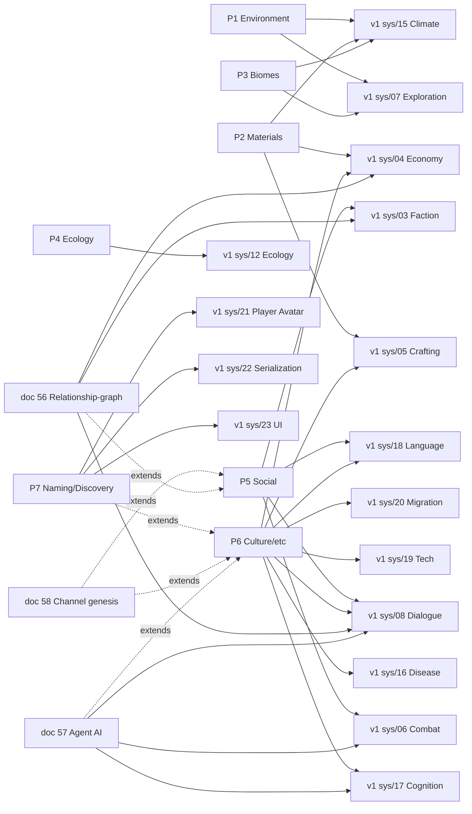

# 99 — Integration With v1: System-by-System Mapping

**Status:** v2 design track. Reference document only — no migration path is required at this stage per project-owner direction. When a v2 pillar is approved for implementation, the cells in the table below dictate which v1 system specs receive a "Superseded by emergence/Nx" header.

---

## 1. How to read this document

Each row is a v1 system spec. The "Replaced / extended by" column shows which v2 pillar(s) supersede or extend it. The "Status under v2" column says one of:

- **Superseded** — the v1 spec is fully replaced by one or more v2 pillars; no v1 mechanics survive.
- **Extended** — v1 mechanics survive but get new emergent inputs and outputs.
- **Untouched** — v1 spec is still authoritative; no v2 pillar touches it.
- **UI-only** — v1 spec is for UI/presentation and is unaffected by v2 (which is sim-only).

---

## 2. The mapping table

| v1 system | Title | Replaced / extended by | Status under v2 | Notes |
|-----------|-------|------------------------|-----------------|-------|
| `systems/01` | Evolutionary Model | (creature evolution untouched) — but **P5** subsumes the post-`SAPIENCE_THRESHOLD` opinion-space scaffolding | Extended | The pre-sapience evolution loop is unchanged; the post-sapience faction/opinion machinery is replaced by P5's CMLS + governance vector. |
| `systems/02` | Trait System | (untouched) | Untouched | Already continuous-channel-based; nothing to refactor. |
| `systems/03` | Faction & Social Model | **P5** + **doc 56 relationship-graph** + **doc 57 agent AI** | Superseded | `Agent.faction_id` removed. Memberships derived from edge-clusters in the typed agent-pair multigraph (doc 56). All 32 hardcoded items become continuous channels on `population_culture` / `coalition` carriers (P5). Faction-affinity dynamics become EFE-residual reads of relationship-edge factors (doc 57). |
| `systems/04` | Economic Layer | **P6c** for exchange, **P2** for `MaterialSignature` replacement, **doc 56** for `SettlementEconomic.faction_id` removal | Superseded | Polanyi 3-mode → ACE matching markets. 17-property material signature → composition vector + derived signature. Settlement-as-entity is a derived spatial Leiden-level-1 cluster, not a stored entity with `faction_id`. |
| `systems/05` | Crafting System | **P6b** for technology emergence, **P2** for materials, **doc 58** for runtime tech genesis | Superseded | 8 tool archetypes → emergent function from material composition × technology capability channels. Compound techs can be born at runtime via doc 58, not just at mod-load time. |
| `systems/06` | Combat System | (force-application primitives untouched) — but **morale/leadership formulas** become emergent from **P5**, and **combat AI is subsumed under doc 57 active inference** | Superseded | Combat actions still come from primitives. Combat-AI FSMs and damage formulas are gone: combat is a policy region of the same EFE-planning engine all agents run. Combat-specific factors (target_health, weapon_in_hand, retreat_route_known) are registered factors; combat-specific skills (parry, flank, ambush) are registered skills (or genesis-born under doc 58). |
| `systems/07` | Exploration System | **P1** environmental channels replace per-cell climate state; **P3** replaces biome enum | Superseded (climate) + Extended (POI mechanics) | POI discovery state machine kept; cell scalars become P1+P2+P4 channels. |
| `systems/08` | NPC Dialogue System | **P5** (continuous attitude vector) + **doc 57** (intents emerge from active inference) + **doc 56** (`MembershipGate` replaces `FactionGate`) | Superseded | 7-band disposition → continuous; 6 gate kinds → `BeliefGate` reading the agent's posterior over (cluster, role, kinship) factors; canonical intents → policy regions sampled from doc 57's MCTS-EFE planner; `FactionGate` becomes `MembershipGate { cluster_id?, label?, role? }` (doc 56). |
| `systems/09` | World History & Lore | (untouched, but Chronicler integration with v2 is critical) | Extended | The Chronicler is the post-hoc labeller for biomes (P3), faction archetypes (P5), tech tiers (P6b), language families (P6a), money (P6c), governance types (P5). v2 doesn't replace it — v2 *needs* it. |
| `systems/10` | Procgen Visual Pipeline | (largely untouched; see notes) | Extended | The 12 directive types / 7 shapes / 12 patterns are designer vocabulary for visual interpretation of primitive effects, not sim state. v2 leaves them; visual emergence from "physics alone" is out of v2 scope. |
| `systems/11` | Phenotype Interpreter | (untouched) | Untouched | Already the canonical example of mechanics-label separation; v2 generalises *its* invariant to other domains, not the reverse. |
| `systems/12` | Ecology & Ecosystem Dynamics | **P4** entirely | Superseded | Williams-Martinez + ATN replace fixed transfer efficiency, integer trophic levels, biome_productivity lookup. |
| `systems/13` | Reproduction & Lifecycle | (mostly untouched) — but **life-stage enum** + **reproductive-strategy enum** are tagged for future review | Extended | Life stages are a fundamental scaffolding choice (we keep them as a small registered taxonomy, like residence-rule in P5). Reproductive strategy may become continuous if needed. |
| `systems/14` | Calendar & Time | (untouched per project-owner directive) | Untouched | Time + calendar are explicitly accepted as scripted scaffolding. P1 reads insolation from this system. |
| `systems/15` | Climate, Biome & Geology | **P1** (climate / atmosphere / hydrology) + **P2** (geology / soils / weathering) + **P3** (biome labelling) | Superseded | The single most-impacted v1 spec; its 7 hardcoded enums + circulation table + Whittaker classifier all go. |
| `systems/16` | Disease & Parasitism | **P6e** | Superseded | Multi-strain antigenic-distance SIR; pathogen-class enum becomes Chronicler labels. |
| `systems/17` | Individual Cognition | **P6d** + **doc 57** (full agent AI architecture on top of the channels) | Superseded | Episodic-event enum, focus-type enum, cognition-tier enum → continuous Active Inference channels (P6d). Doc 57 fully specifies the inference engine: discrete factored POMDP, VMP, MCTS-EFE planning, ToM nesting, flat preference registry, action skills. The S17 memory subsystems (episodic/spatial/procedural) are subsumed as factor-graph marginals; the Bayesian-update formula in S17 §4.2 IS the active-inference perceptual step. |
| `systems/18` | Language & Culture | **P6a** + **P5** | Superseded | Language families, parts-of-speech enum → iterated-learning channels with Chronicler labels. Cultural-trait categories become entries in the open registry of named cultural axes. |
| `systems/19` | Technology & Innovation | **P6b** | Superseded | Tech-tree categories → combinatorial recombination of capability channels. Compound-tech registry replaces the tech tree. |
| `systems/20` | Migration & Movement | **P6f** | Superseded | Settlement-migration state machine → utility-driven gravity flow. Push-pull labels → Chronicler clusters. |
| `systems/21` | Player Avatar | (mostly UI-only; permadeath untouched) + **P7** (avatar as in-world speaker / namer) | UI-only / Extended | Career-type enum is a Chronicler label over emergent skill-channel clusters; v2 surfaces it that way without changing the avatar mechanics themselves. P7 additionally promotes the avatar to a weighted speaker in the P6a iterated-learning pool — the player's coinings propagate as real linguistic events. |
| `systems/22` | Master Serialization | (untouched — legitimate scaffolding) + **P7** (lexicon entries) + **docs 56/57/58** (new components and event logs) | Extended | All v2 channels go through the existing schema; new carriers register new channel ids; no new file format. P7 adds `population.lexicon`. Doc 56 adds `RelationshipEdge` per pair (sparse Q32.32 vector + ring buffer). Doc 57 adds `GenerativeModelState` per agent (beliefs / policy posterior / habit prior / ToM cache). Doc 58 adds `LatentSlotBuffer` per agent + `genesis_registry` + append-only `genesis_event_log`. **Cluster memberships, edge-cluster types, and node-cluster labels are NOT saved** — they are derived every Stage 7 on load (Invariant 7). |
| `systems/23` | UI Overview | (UI-only) + **P7** (bestiary naming UI, synonyms view) | UI-only / Extended | UI taxonomies (rendering modes, widgets, screens) are presentation, not sim. v2 doesn't touch them, but P7 adds bestiary affordances for player-coined names, synonyms, and discovery thresholds — all derived UI state per `INVARIANT 6`. |

---

## 3. Cross-cutting: which v2 pillars touch which v1 systems?



P5 and P6 both touch many v1 systems because the social, cultural, and cognitive scaffolding in v1 is heavily entangled. Docs 56/57/58 (the latest extension layer) further refine: 56 replaces faction-id slots and dialogue gates with derived multigraph clusters; 57 replaces combat AI / dialogue intent with one active-inference engine; 58 promotes the channel registry from authored to runtime-genesis-bearing.

---

## 4. Pillar dependency order

If a sprint plan ever materialises for v2, this is the dependency-respecting order:

```mermaid
flowchart LR
    T[Topology<br/>(SCVT mesh)] --> P1
    P1 --> P2
    P1 --> P4
    P2 --> P4
    P2 --> P3
    P1 --> P3
    P4 --> P3
    P4 --> P5
    P5 --> P6
    P2 --> P6
```

Topology is the foundation (SCVT mesh + neighbour graph); P1 + P2 are the physical-world layer; P3 is purely a Chronicler labelling pass; P4 closes the eco-physical loop; P5 and P6 build the social and cultural layer on top.

---

## 5. What v2 does *not* touch

For absolute clarity:

- **`core-model/01–09`** (channels, carriers, operators, registries, manifests, gates, interpreter, determinism, crate blueprint) — unchanged. v2 *uses* this machinery; it does not redesign it.
- **`architecture/CRATE_LAYOUT.md`** — three new L4 crates planned (`beast-graph`, `beast-cog`, `beast-genesis`) for docs 56/57/58 respectively. The existing layout/layering rules are preserved; nothing reshapes the L0..L6 stack. The new crates sit alongside `beast-sim`, `beast-chronicler`, `beast-serde` at L4.
- **`architecture/ECS_SCHEDULE.md`** — Stage 1 and Stage 7 grow new sub-stages (cognitive perception/planning in Stage 1; community detection, cluster characterisation, channel-genesis in Stage 7). The 8-stage outer structure is preserved.
- **`INVARIANTS.md`** — extended from 6 to 10 invariants (groups derived; no authored relationship/group vocabulary; all decisions are active inference; genesis lineage closure). Existing invariants are unchanged; the new ones strictly tighten the contract.
- **`systems/02` Trait System, `systems/11` Phenotype Interpreter, `systems/14` Calendar & Time** — explicitly untouched. `systems/22` is *extended* with new component fields per docs 56/57/58 but the file format is otherwise unchanged.

---

## 6. Approval gates

Before any v2 pillar is implementation-ready, it must pass:

1. **Invariant audit** (task #10 in this design track) — every pillar verified against the six engineering invariants.
2. **Tradeoff matrix sign-off** by the project owner.
3. **Calibration-knob inventory** complete (each pillar lists its tunable constants).
4. **Cross-pillar contract check** — read/write sets on shared channels (cell, individual, population_culture, …) verified non-overlapping within stage.
5. **Performance budget check** — pillar's per-tick cost fits within `architecture/ECS_SCHEDULE.md` 16 ms target at the chosen cell count (default 20 000).

This document is the integration spine; the per-pillar docs (10/20/30/40/50/60) are the substance.
