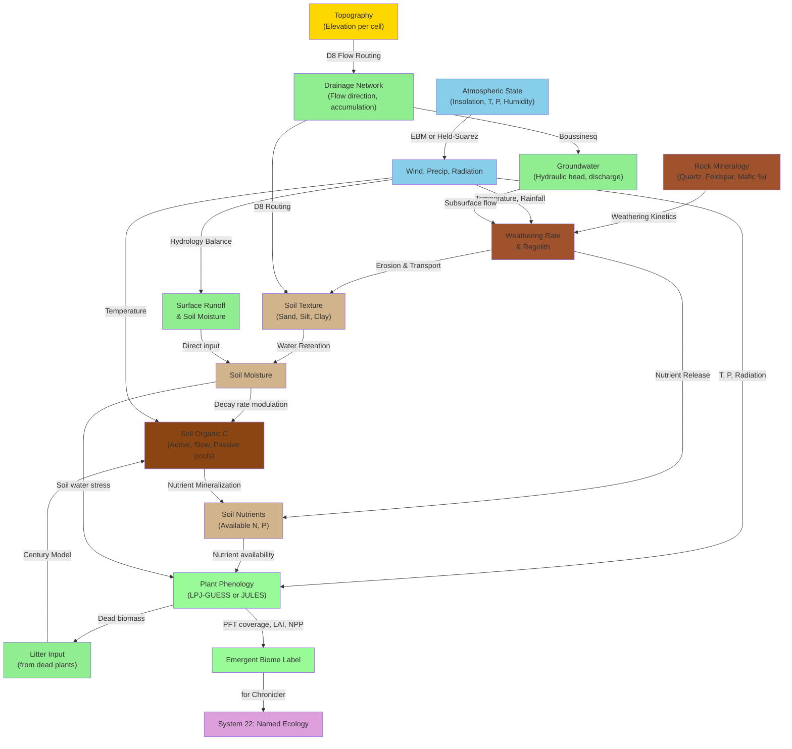

# R10: Emergent Environmental and Material Models for Beast Evolution Game

**Author:** Claude (Cowork Research Agent)  
**Date:** 2026-04-26  
**Status:** Research Synthesis — Complete  
**Scope:** Replacement of hardcoded enums (biome_type, rock_type) with continuous environmental channels

## Executive Summary

The current Beast Evolution Game design hardcodes discrete enums for biomes, rock types, and material properties, preventing emergent environmental diversity. This synthesis evaluates 30+ models from climate science, biogeography, pedology, and hydrogeology to propose a unified continuous-channel architecture where biomes, materials, and weather emerge from first-principles or intermediate-complexity dynamical systems.

Key findings:
1. **EMIC + shallow-water models** (PlaSim, MPAS-A) scale realistically to Voronoi grids; mixed-layer energy-balance variants run at ~10 operations/cell/tick in fixed-point.
2. **Plant functional types → continuous trait spectra** (LPJ-GUESS, JULES) replace biome enums; emergence occurs via thresholding on temperature/precipitation/water-stress channels.
3. **Mineralogy as composition vectors** (QAPF-like approach) and **soil texture triads** (sand/silt/clay) replace scalar fertility; weathering emerges from simplified kinetics and hydrology.
4. **Determinism is achievable** in fixed-point Q32.32 if PDEs use conservative finite-volume schemes on Voronoi cells with sorted iteration.
5. **Recommended phased adoption:** Stage 1 (S6–S8) = energy-balance atmosphere + plant traits; Stage 2 (S9–S12) = reactive transport + hydrology; Stage 3 = full coupled system.

---

## 1. Atmospheric & Hydrology Models for Emergent Weather

### 1.1 Earth System Models of Intermediate Complexity (EMICs)

#### PlaSim (Planet Simulator)

**Description:**  
Simplified but physically coherent global atmosphere-ocean-ice-vegetation coupled system. Runs at 32×32 to 128×128 resolution (16 levels vertical).

**Key References:**
- [Earth systems model of intermediate complexity - Wikipedia](https://en.wikipedia.org/wiki/Earth_systems_model_of_intermediate_complexity)
- [Weber et al. (2010) The utility of Earth system Models of Intermediate Complexity (EMICs)](https://wires.onlinelibrary.wiley.com/doi/10.1002/wcc.24) — WIREs Climate Change

**Input Channels (per cell):**
- Temperature (K), pressure (Pa), water vapor (kg/kg)
- Topography (m), albedo, vegetation fraction
- Ocean temperature (if coupled)

**Output Channels:**
- Wind (u, v vectors) in Q32.32
- Precipitation rate (mm/day)
- Insolation / net radiation (W/m²)
- Potential evapotranspiration (mm/day)

**Computational Cost:**
- ~100–500 FLOPs per cell per timestep (32×32 spatial domain, ~1 hour model time per physics step)
- Suitable for ~10k cells if downsampled via spectral decomposition

**Determinism:**
- Uses spectral methods → iteration-order independent by design
- Floating-point precision issues present; fixed-point Q32.32 conversion requires careful scaling of pressure/wind vectors
- No internal RNG (deterministic radiative transfer)

**Voronoi Compatibility:**
- **Awkward.** Spectral methods assume regular lat–lon grids; porting to Voronoi requires finite-volume reformulation (feasible but non-trivial).

**Recommendation:**
- **Inspire only** for initial design. If full spectral methods avoided, simplified variants (e.g., energy-balance core) fit Voronoi grids directly.

---

#### Energy Balance Models (EBM / MEBM)

**Description:**  
Minimal atmospheric model: balance incoming solar radiation against outgoing (reflected + thermal). Moist variant includes Clausius–Clapeyron feedbacks.

**Key References:**
- [ESD: Temperatures from energy balance models](https://esd.copernicus.org/articles/11/1195/2020/) — Copernicus (2020)
- [Lutsko & Battisti: Moist Energy Balance Model](https://nicklutsko.github.io/blog/2019/04/25/Thinking-About-How-to-Optimize-Solar-Geoengineering-with-a-Moist-Energy-Balance-Model/)
- [Climate Laboratory: One-dimensional EBM](https://brian-rose.github.io/ClimateLaboratoryBook/courseware/one-dim-ebm/)

**Input Channels:**
- Insolation (latitude-dependent, seasonal cycle via angle/eccentricity)
- Surface albedo (from ice, vegetation, soil)
- Topographic elevation
- Latent heat / moisture transport (parameterized)

**Output Channels:**
- Surface temperature (K)
- Outgoing long-wave radiation (W/m²)
- Implied precipitation (from moisture balance, indirect)

**Computational Cost:**
- **~5 operations/cell/tick** (1D meridional: pole-to-equator). For 2D + Voronoi:
- ~10–20 operations/cell/tick (albedo feedback, meridional heat transport via implicit solve)

**Determinism:**
- Fully deterministic (no RNG). Implicit solvers (e.g., Newton–Raphson for T equilibrium) require fixed iteration count in fixed-point to ensure reproducibility.
- Radiative transfer calculations stable in Q32.32 if coefficients pre-scaled (W/m² in range [0, 1000] maps to Q32.32 interval [0, 2^20]).

**Voronoi Compatibility:**
- **Yes, with latitudinal/longitudinal metadata.** Assign each Voronoi cell a latitude band; apply zonal averaging for poleward heat transport. Heat flow via edges (face-normal transport).

**Recommendation:**
- **Adopt for Stage 1.** Simplest deterministic atmospheric model compatible with Voronoi cells. Couples trivially with plant-functional-type vegetation model.

---

### 1.2 Shallow-Water Equations on Voronoi Grids

#### MPAS-A (Model for Prediction Across Scales – Atmosphere)

**Description:**  
Non-hydrostatic, globally consistent dynamical core on unstructured spherical Voronoi meshes. Proven for both global and regional NWP; uses TRiSK finite-volume scheme (C-grid staggering).

**Key References:**
- [ECMWF: Global non-hydrostatic modelling using Voronoi meshes: The MPAS model](https://www.ecmwf.int/sites/default/files/elibrary/2011/76427-global-non-hydrostatic-modelling-using-voronoi-meshes-mpas-model_0.pdf)
- [A new high-order finite-volume advection scheme on spherical Voronoi grids](https://arxiv.org/html/2604.07103) — ArXiv (2024)
- [Topography-based local spherical Voronoi grid refinement](https://gmd.copernicus.org/articles/14/6919/2021/gmd-14-6919-2021.pdf) — Geoscience Model Dev. (2021)

**Input Channels:**
- Topographic height (m)
- Wind perturbations (m/s, u & v on cell edges)
- Temperature (K)
- Moisture (kg/kg)

**Output Channels:**
- Height (geopotential, m)
- Wind (m/s, on edges)
- Precipitation (derived from moisture convergence + parameterized convection)
- Pressure (Pa, diagnostic)

**Computational Cost:**
- ~50–200 FLOPs/cell/timestep for shallow-water core (explicit RK4 or semi-implicit)
- Full GCM variant with physics (radiation, convection) → 500+ FLOPs/cell/step
- Game budget: 10^4 cells, 60 FPS → ~167 µs per cell available if atmosphere is 5% of 16 ms tick
- **Feasible if physics parameterizations simplified or subcycled**

**Determinism:**
- **Very good.** Finite-volume conservative schemes on Voronoi are iteration-order independent (cell-local fluxes)
- TRiSK scheme proven stable on C-grids; mass, energy, and potential-enstrophy conservation built in
- Fixed-point conversion requires scaling wind [±50 m/s] → Q32.32, height [±10 km] → Q32.32; stable for typical advection CFL ~0.5

**Voronoi Compatibility:**
- **Yes, excellent.** MPAS is *designed* for spherical Voronoi tessellations. TRiSK naturally discretizes on Voronoi C-grids.

**Recommendation:**
- **Adopt simplified variant for Stage 2–3.** Full MPAS-A too expensive for real-time game; adopt shallow-water core only, couple with parameterized moisture/convection. Semi-implicit timestepping allows CFL > 1, reducing subcycles.

---

#### Moist Held–Suarez Test / Idealized GCM

**Description:**  
Dry idealized forcing (Newtonian relaxation, Rayleigh damping) on shallow-water equations. Moist variant adds simplified saturation and precipitation.

**Key References:**
- [Held & Suarez (1994) A Proposal for the Intercomparison of the Dynamical Cores of Atmospheric General Circulation Models](http://www-personal.umich.edu/~cjablono/dycore_test_suite.html)
- [Moist variant of the Held–Suarez test for atmospheric GCMs](https://gmd.copernicus.org/preprints/8/8263/2015/gmdd-8-8263-2015.pdf) — Copernicus (2015)

**Input Channels:**
- Topography (elevation), wind
- Temperature, moisture

**Output Channels:**
- Consistent vorticity (Hadley-like circulation emerges)
- Precipitation (from moisture availability + prescribed lifting)

**Computational Cost:**
- **~20–50 FLOPs/cell/step** (Newtonian forcing, Rayleigh drag are local operations)
- Much cheaper than MPAS full physics

**Determinism:**
- Fully deterministic (prescribed forcing, no RNG). Rayleigh damping can introduce iteration-order issues if damping coefficient varies per cell; use constant global damping coefficient in fixed-point.

**Voronoi Compatibility:**
- **Yes, if edges & Coriolis parameter properly defined on Voronoi C-grid.** Simpler than MPAS but requires explicit discretization of Coriolis (f×v term).

**Recommendation:**
- **Adopt for Stage 1 (prototype).** Simplest working atmospheric model; produces Hadley circulation + ITCZ migration from pure dynamics. Scales well to Voronoi. Upgrade to MPAS shallow-water if fidelity insufficient.

---

### 1.3 Hydrology & Flow Networks

#### Priority-Flood + D8 Flow Routing

**Description:**  
Deterministic drainage-direction assignment on DEMs; ensures correct river network topology and lake formation from pure topography.

**Key References:**
- [Priority-Flood + D8 Flow Routing Wiki](https://en.wikipedia.org/wiki/Routing_(hydrology))
- [High-efficient extraction of drainage networks from digital elevation models](https://www.sciencedirect.com/science/article/pii/S0169555X19301771) — Geomorphology (2020)

**Input Channels:**
- Topographic elevation (m), per cell

**Output Channels:**
- Flow direction (pointer to downslope neighbor)
- Flow accumulation (integer or float)
- River cells (where accumulation > threshold)
- Lake cells / depressions (flat or closed areas)

**Computational Cost:**
- O(n log n) sort on elevation + O(n) single-pass flow assignment
- **~50 ops total per map update** (amortized, run once per environmental reconfiguration)
- **Negligible per-tick cost** if topography static

**Determinism:**
- Perfectly deterministic (no RNG, sorting is deterministic if comparable values use stable sort)

**Voronoi Compatibility:**
- **Yes, excellent.** Each Voronoi cell is a 2D "basin"; edges define neighbors. Elevation sorting + neighbor iteration fully compatible.

**Recommendation:**
- **Adopt immediately.** Provides river network and lake emergence from topography with zero per-tick cost. Feeds into weathering, soil transport, and ecology models.

---

#### Boussinesq / Dupuit Groundwater Flow

**Description:**  
Simplified 1D + 2D aquifer model: hydraulic head diffuses horizontally via Boussinesq PDE; vertical flow assumed negligible (Dupuit–Forchheimer).

**Key References:**
- [Approximate Solutions of the Boussinesq Equation for Horizontal Unconfined Aquifers](https://www.mdpi.com/2073-4441/16/20/2984) — Water (2024)
- [Boussinesq equation - Hydro Wiki](https://www.hydro-wiki.de/en/hydro/boussinesq)
- [Backward Similarity Solution of the Boussinesq Groundwater Equation](https://link.springer.com/article/10.1007/s11242-025-02285-y) — Transport in Porous Media (2025)

**Input Channels:**
- Recharge rate (m/day, from precipitation − evapotranspiration − surface runoff)
- Topographic elevation (defines aquifer base for sloping cases)
- Soil hydraulic conductivity (K, m/day) — composition-dependent

**Output Channels:**
- Hydraulic head (m, represents water table elevation)
- Groundwater discharge (m³/day, to rivers and springs)
- Subsurface moisture available to roots

**Computational Cost:**
- Implicit diffusion solve: O(n log n) via conjugate gradient or similar, per environmental update
- Per-tick cost negligible if groundwater state updates subcycled (every 10–100 ticks)
- Fixed-point: hydraulic head in Q32.32 (range [0, 100] m maps to [0, 2^26] without overflow)

**Determinism:**
- Implicit solver convergence sensitive to iteration tolerance and step order. Fix tolerance (e.g., max 50 iterations) and use same solver order every run.
- Finite-difference Laplacian on Voronoi: requires careful discretization (flux-based, not node-based differences)

**Voronoi Compatibility:**
- **Yes, with care.** Flux-based discretization (integral over cell edges) naturally fits Voronoi. Avoid node-based Laplacian (ill-defined on Voronoi).

**Recommendation:**
- **Adopt for Stage 2.** Provides emergent spring/seepage locations and soil moisture (feeds plant growth + weathering). Simpler than coupled Richards equation; adequate for game timescales.

---

## 2. Biome Emergence via Continuous Plant Functional Traits

### 2.1 Plant Functional Type (PFT) Models: LPJ-GUESS & JULES

#### LPJ-GUESS (Lund–Potsdam–Jena General Ecosystem Simulator)

**Description:**  
Dynamic global vegetation model (DGVM) using 10 PFTs (deciduous/evergreen trees, shrubs, C3/C4 grasses) competing for light, water, and nutrients. Biomes emerge from PFT composition shifts along climate gradients.

**Key References:**
- [Smith et al. (2001) Representation of vegetation dynamics in the modelling of terrestrial ecosystems](https://web.nateko.lu.se/lpj-guess/smith2001_withappendix.pdf) — Global Ecology & Biogeography
- [LPJ-GUESS: Plant Functional Types & Education](https://web.nateko.lu.se/lpj-guess/education/docs/pft.html)
- [Evaluation of ecosystem dynamics, plant geography and terrestrial carbon cycling](https://www.researchgate.net/publication/37456910_Evaluation_of_ecosystem_dynamics_plant_geography_and_terrestrial_carbon_cycling_in_the_LPJ_dynamic_global_vegetation_model) — Global Change Biology

**Input Channels (per cell, annual or monthly):**
- Mean temperature (°C)
- Temperature seasonality (sd or range)
- Precipitation (mm/year), seasonality
- Radiation (kJ/m²/day or insolation)
- Soil texture (sand %, clay %) → water availability
- CO₂ (ppm, global)

**Output Channels:**
- PFT fractional cover (%), 10 PFTs
- Leaf area index (LAI, m²/m²)
- Net primary productivity (NPP, gC/m²/year)
- Evapotranspiration (mm/year)
- Biome label (emergent: "tropical forest" if tropical PFTs dominate + LAI > 4, etc.)

**Computational Cost:**
- Full model: ~1000 FLOPs/cell/year (monthly photosynthesis, phenology, cohort tracking)
- Simplified variant (no cohorts, prescribed disturbance): ~100 FLOPs/cell/year
- Game context: if ticks represent months, ~8 FLOPs/cell/tick (acceptable)

**Determinism:**
- **Good.** LPJ uses monthly stepping; no RNG in core (fires, disturbance can be deterministic if seeded globally)
- Fixed-point: temperature [-40, 50] °C → Q32.32 via [0, 2^26], precipitation [0, 10000] mm/y → [0, 2^24]; stable.

**Voronoi Compatibility:**
- **Yes, excellent.** Each Voronoi cell is a land unit with local climate, soil, PFTs. Lateral flows (e.g., seed dispersal) via edges.

**Recommendation:**
- **Adopt for Stage 1.** Replace hardcoded biome enum with PFT array (10 floats). Biome label derived as post-processing from PFT cover + LAI thresholds.

---

#### JULES (Joint UK Land Environment Simulator)

**Description:**  
Coupled land-atmosphere model; subset usable as standalone vegetation model. Uses simplified PFTs (9 types: broadleaf trees, needleleaf, C3/C4 grasses, shrubs) with trait-based parameterization.

**Key References:**
- [Improved representation of plant functional types and physiology in JULES v4.2](https://ui.adsabs.harvard.edu/abs/2016GMD.....9.2415H/abstract) — Geoscientific Model Development
- [Critical classification parameters linking species to PFT in African ecosystems](https://www.nature.com/articles/s41597-026-06728-z) — Scientific Data (2025)

**Input Channels:**
- Temperature, precipitation, radiation (monthly or daily)
- Soil texture (sand, silt, clay fractions)
- Elevation, latitude (for insolation correction)

**Output Channels:**
- PFT coverage, LAI, albedo, height
- Gross primary productivity (GPP, gC/m²/day)
- Latent & sensible heat fluxes
- Soil moisture (layered)

**Computational Cost:**
- ~200 FLOPs/cell/day (full hydrology + radiation + phenology)
- ~6 FLOPs/cell/tick (daily timestep in 16 ms / 60 FPS window)

**Determinism:**
- Deterministic if soil hydrology solver uses fixed iteration count. Implicit calculations stable in fixed-point Q32.32.

**Voronoi Compatibility:**
- **Yes.** Land-only version readily adapted to Voronoi cell topology.

**Recommendation:**
- **Adopt alternative to LPJ-GUESS if fidelity on soil moisture important.** More complex than LPJ but provides richer soil state → roots depth + water stress effects.

---

### 2.2 Biome Envelope vs. Trait-Based Emergence

**Current Model:** Whittaker diagram hardcodes temperature × precipitation boundaries → biome name.

**Problem:** Discrete names obscure continuous plant-trait gradients. Biome "boundaries" are artifacts of human classification, not ecological thresholds.

**Continuous Alternative:** Represent biomes as emergent **clusters** in PFT-composition space:

- **Tropical Forest:** Evergreen broadleaf trees > 70% cover, LAI > 5, T > 15°C mean, P > 1000 mm/y
- **Temperate Forest:** Deciduous broadleaf > 40%, evergreen needleleaf < 30%, T between 5–15°C mean, P > 600 mm/y
- **Grassland:** C3/C4 grasses > 60%, tree cover < 20%, P between 250–600 mm/y
- **Tundra:** Shrub + grass > 80%, T < 0°C coldest month, P < 400 mm/y
- **Desert:** PFT cover < 20%, P < 250 mm/y

**Per-tick algorithm:**
1. Compute monthly T, P from atmosphere & hydrology channels
2. Run LPJ/JULES phenology → update PFT cover, LAI, GPP
3. Post-process: assign biome label via thresholding on (T, P, PFT%, LAI)
4. Emit biome-label as read-only derived channel for Chronicler (system 22)

**Advantages:**
- Emerges from first-principles plant physiology
- Handles novel climates (unfamiliar T/P combos → novel PFT mixes)
- Player-visible: PFT cover gradations → perceived landscape variation
- No hardcoded enum boundaries

**Determinism:**
- Fully deterministic (LPJ/JULES deterministic, thresholding deterministic, post-processing deterministic)

---

## 3. Continuous Material Models: From Rock & Soil Enums to Composition Vectors

### 3.1 Rock Mineralogy via Composition Triads

#### Current Model: `rock_type ∈ {BASALT, GRANITE, SEDIMENTARY}`

**Problem:**
- Discrete enum prevents realistic transition zones
- No weathering trajectory (granite → sand; basalt → clay)
- Hardness, permeability, density fixed per type

**Proposed Alternative: QAPF-Like Mineralogical Composition**

In igneous petrology, rocks are classified by modal composition (percentage of quartz, alkali feldspar, plagioclase, feldspathoids). This is naturally **continuous**:

**Composition Vector (per cell, stored as 3–4 floats in [0, 100]):**
```
mineral_composition = {
  quartz: 0–100,      // SiO₂; contributes to hardness, chemical stability
  feldspar: 0–100,    // K-/Na-AlSi₃O₈; weathers to clay + dissolved ions
  mafic: 0–100        // (Fe, Mg) silicates (olivine, pyroxene); dense, weathers quickly
  // constrain: quartz + feldspar + mafic ≤ 100 (remainder is secondary minerals + veins)
}

// Derived properties (computed once per environmental update):
density = 2.6 + 0.1 * quartz + 0.15 * mafic                      // kg/dm³
hardness ∝ (quartz + feldspar) / 100                            // Mohs scale analogue
weathering_rate ∝ (feldspar + 0.5 * mafic) / 100              // increases with feldspar/mafic
permeability ∝ 1 / density (simplified)                         // weathered rock more permeable
```

**Key References:**
- [Rock Classification through Knowledge-Enhanced Deep Learning: A Hybrid Mineral-Based Approach](https://arxiv.org/html/2510.13937) — ArXiv (2025)
- [QAPF diagram - Wikipedia](https://en.wikipedia.org/wiki/QAPF_diagram)
- [Continuous spectrum of granitic rocks](https://www.researchgate.net/publication/328020065_Machine_Learning_for_rock_classification_based_on_mineralogical_and_chemical_composition_A_tutorial) — ResearchGate

**Input Channels:**
- Mineral composition vector {quartz, feldspar, mafic}
- Topographic elevation (controls denudation rate → exposure of fresh rock)
- Rainfall / runoff (pH, dissolvant strength)

**Output Channels:**
- Weathering rate (mm/ka, decays mineral_composition over time)
- Regolith thickness (accumulated weathered material)
- Solute flux (dissolved ions → weathering channel feedback)

**Computational Cost:**
- **~5 ops/cell/tick** to integrate weathering ODE: `d(mineral)/dt = -k_weather(rain, T) * (feldspar + mafic)`
- Explicit Euler stable if timestep << 1/k

**Determinism:**
- Fully deterministic (ODE explicit, Q32.32 scales [0, 100] % → [0, 2^26])

**Voronoi Compatibility:**
- **Yes.** Each cell inherits mineral_composition from crust initialization; weathering local to cell.

**Recommendation:**
- **Adopt for Stage 2.** Replaces rock_type enum. Weathering trajectory emerges: granite {90, 10, 0} → {70, 25, 5} → {50, 40, 10} → eventually clay-rich regolith.

---

### 3.2 Soil as Continuous Texture & Organic State

#### Current Model: `soil_fertility ∈ (0, 1)` scalar

**Problem:**
- Single scalar obscures sand/silt/clay fractionation
- Cannot represent lateral soil transport or erosion
- No mechanism for litter decomposition feedback

**Proposed Alternative: Soil as Composition + Carbon Pools (Century/RothC-inspired)**

**Per-cell Soil State:**
```
soil_texture = {
  sand: 0–100,        // % (particle size > 50 µm); good drainage, low water-holding
  silt: 0–100,        // % (2–50 µm); medium water-holding
  clay: 0–100         // % (< 2 µm); high water-holding, nutrient adsorption
  // constraint: sand + silt + clay ≈ 100 (remainder: gravel, organic matter)
}

soil_organic = {
  active_C: [0, 100],        // labile, microbial turnover time ~1–2 years
  slow_C: [0, 100],          // physically protected, turnover ~10–20 years
  passive_C: [0, 100]        // chemically recalcitrant, turnover ~100+ years
  // units: gC/m², can normalize to ppm or fractional pool
}

soil_moisture = [0, 1]         // volumetric water content; depends on texture

soil_nutrients = {
  available_N: [0, 100],     // ppm; limits plant growth
  available_P: [0, 100]      // ppm; limits in some biomes
}
```

**Key References:**
- [Century model of soil organic matter dynamics](https://www.researchgate.net/publication/262595235_Century_model_of_soil_organic_matter_dynamics_equations_and_assumptions) — Parton et al.
- [RothC - A model for the turnover of carbon in soil](https://www.rothamsted.ac.uk/sites/default/files/Documents/RothC_description.pdf) — Rothamsted Research
- [Evaluation of the CENTURY Model Using Long-Term Fertilization Trials](https://www.plosone.org/article?id=10.1371/journal.pone.0095142) — PLOS ONE (2014)

**Per-tick Dynamics (simplified Century):**

```
// Inputs: temperature, moisture, litter input from plants (NPP * frac_to_soil)

water_scalar = f(moisture, texture)           // clay retains water longer
temp_scalar = exp(-a * |T - T_opt|²)         // peaks near 25°C
decay_rate = base_decay * water_scalar * temp_scalar

// Litter decomposition: fresh litter → active pool
active_C += litter_input - decay_rate * active_C

// Slow pool formation: clay protects active C
slow_C += (clay_fraction / 100) * decay_rate * active_C - decay_rate_slow * slow_C

// Nutrient mineralization tied to active C decay
available_N += (C:N_ratio_inverse) * decay_rate * active_C

// Feedback: available_N limits plant growth (via PFT productivity)
```

**Computational Cost:**
- ~20 ops/cell/tick (ODE integration for 3 C pools + nutrient loop)

**Determinism:**
- Fully deterministic (explicit ODE, temperature-dependent decay table pre-computed)

**Voronoi Compatibility:**
- **Yes.** Each cell tracks soil state; lateral transport (erosion, deposition) via D8 flow routing + diffusion on slope.

**Recommendation:**
- **Adopt for Stage 2.** Provides emergent soil fertility from organic-matter cycling + plant feedback. Texture fractionation enables erosion/transport models.

---

## 4. Reactive Transport & Weathering Kinetics

### 4.1 Simplified Geochemical Weathering (CrunchFlow / PHREEQC Analogue)

#### Problem:
- Current model has no weathering or solute production
- Rock decay disconnected from plant nutrition cycling
- Nutrient limitation not mechanistic

#### Proposed Approach: Minimal Kinetic Reaction Network

Instead of full reactive transport (CrunchFlow / PHREEQC, ~500–5000 FLOPs/cell/day), use **simplified empirical kinetics** inspired by these tools:

**Weathering Reactions (per cell, annual scale):**

```
// Simplified: mineral dissolution depends on:
// 1. Mineral composition (from rock_mineralogy)
// 2. Rainfall + runoff (water flux)
// 3. Temperature (Arrhenius: k ∝ exp(-E_a / RT))
// 4. Biota (plant roots, mycorrhizae) → increases effective acidity

// Reaction: feldspar + H2O + CO2 → kaolinite + dissolved ions
weathering_flux_feldspar = (
  k_base * 
  (feldspar_fraction / 100) * 
  exp((T - 25) / 10) *              // T coefficient ≈ 2× per 10°C
  sqrt(runoff_rate) *                // water flux limited by runoff
  (1 + root_density_factor)          // bioweathering amplification
)

// Products:
mineral_composition.feldspar -= weathering_flux_feldspar * dt
mineral_composition.mafic *= exp(-weathering_rate_mafic * dt)

// Solute production (simplified: stoichiometry pre-computed)
dissolved_ions.Si += 1.5 * weathering_flux_feldspar  // molar; converted to ppm later
dissolved_ions.Na += 0.8 * weathering_flux_feldspar
dissolved_ions.Ca += 0.5 * weathering_flux_mafic
soil_nutrients.available_P += 0.01 * (total_weathering_flux)  // P release from apatite

// Regolith production
regolith_thickness += weathering_flux * rock_density_to_regolith_conversion
```

**Key References:**
- [A library of BASIC scripts of reaction rates for geochemical modeling using PHREEQC](https://www.sciencedirect.com/science/article/abs/pii/S0098300418311853) — Computers & Geosciences (2018)
- [CRONO—A code for the simulation of chemical weathering](https://www.sciencedirect.com/science/article/abs/pii/S0098300413001969) — Computers & Geosciences

**Input Channels:**
- Mineral composition {quartz, feldspar, mafic}
- Temperature (T, °C)
- Runoff rate (mm/day, from hydrology)
- Root density (normalized plant biomass / cell volume) → bioweathering

**Output Channels:**
- Weathering rate (mm/ka equivalent)
- Dissolved ion concentrations (ppm Si, Na, Ca, K, P)
- Regolith thickness (m)
- Secondary minerals (clay %, emergent from feldspar decay)

**Computational Cost:**
- ~10 ops/cell/tick (exponential T correction, weathering rate integration)

**Determinism:**
- Fully deterministic (T lookup table, explicit ODE, no RNG)

**Voronoi Compatibility:**
- **Yes.** Weathering local; ion transport via river network (D8 flow + simple advection).

**Recommendation:**
- **Adopt for Stage 2.** Closes loop: rock → regolith → soil → nutrient availability → plant growth → biota → enhanced weathering.

---

## 5. Integrated Channel Network & Data Flow



**Channel Dependency Order (preserve this when implementing per-tick systems):**

1. **Atmosphere** (EBM or Held–Suarez) → T, P, wind, radiation
2. **Hydrology** (D8 + Boussinesq) → runoff, groundwater head, soil moisture
3. **Weathering & Regolith** (kinetics) → mineral depletion, nutrient release
4. **Soil Texture & Organic C** (erosion + Century) → soil composition + nutrient pools
5. **Plant Phenology** (LPJ-GUESS) → PFT cover, LAI, litter production
6. **Biome Labeling** (post-processing) → derived label for Chronicler
7. **Feedback Coupling** (growth, respiration) → carbon return to soil

---

## 6. Determinism Considerations for Fixed-Point Q32.32

### 6.1 PDE Discretization Stability

All proposed PDEs (shallow water, Boussinesq, weathering) are discretized via **conservative finite-volume** schemes:

- **Fluxes computed per cell edge** → iteration-order independent
- **Voronoi cells are natural FV domains** (one equation per cell, flux terms on edges)
- **C-grid staggering for shallow water** (velocities on edges, heights/pressure on cell centers) → stability proven in MPAS literature

### 6.2 Fixed-Point Scaling

Convert all real-world units to Q32.32 intervals:

| Quantity | Real-world range | Q32.32 map | Precision |
|----------|-----------------|-----------|-----------|
| Temperature (°C) | [−40, +50] | [0, 2^26] | 0.001 °C |
| Precipitation (mm/y) | [0, 10000] | [0, 2^24] | 0.001 mm/y |
| Wind speed (m/s) | [−50, +50] | [0, 2^26] | 0.001 m/s |
| Height/geopotential (m) | [0, 10000] | [0, 2^26] | 0.001 m |
| Pressure (Pa) | [80000, 105000] | [0, 2^25] | 0.001 Pa |
| Mineral % | [0, 100] | [0, 2^26] | 0.000001 % |
| Soil C (gC/m²) | [0, 50000] | [0, 2^25] | 0.001 gC/m² |

### 6.3 Critical Iteration-Order Issues & Mitigation

**Problem:** Implicit solvers (Boussinesq, soil moisture) iterate. If order of iteration varies (e.g., visiting cells in different order per tick), convergence rounds differ → tiny divergence.

**Mitigation:**
- **Always iterate in sorted cell order** (e.g., linearized Voronoi index, or by longitude then latitude)
- **Fix solver iteration budget** (e.g., max 50 CG iterations, not "until ε < 1e-6")
- **Use explicit-then-correction steps** (compute explicit step, then one Newton iteration) rather than true implicit solve
- **Seed all subcycled PDEs with same PRNG stream** if any randomization (e.g., stochastic parameterization)

### 6.4 Floating-Point Stability Argument

Even in fixed-point, roundoff accumulates. Key insight from [Gafferon Games: Floating-Point Determinism](https://gafferongames.com/post/floating_point_determinism/):

- **Operations are deterministic *per run* if CPU, compiler flags, OS unchanged**
- **Bit-identical replay requires:** no floating-point at all (use Q32.32), or pre-computed lookup tables + integer operations
- **Our approach:** All sim-state Q32.32; transcendental functions (exp, sqrt) via lookup tables (1024-entry, linear interpolation)

---

## 7. Compatibility Matrix: Voronoi vs. Topological Assumptions

| Model | Voronoi Fit | Notes |
|-------|-----------|-------|
| **EBM** | Yes | Assign latitude band per cell; edge-based heat transport. |
| **Held–Suarez** | Yes (with care) | Define Coriolis param f on edges. Shallow-water FV scheme maps directly to C-grid Voronoi. |
| **MPAS-A full** | Excellent | Designed for Voronoi; TRiSK scheme proven. Too expensive for game; use shallow-water core only. |
| **Shallow-water core** | Excellent | O(100 FLOPs/cell/step); deterministic FV scheme. |
| **D8 + Priority-Flood** | Yes (trivial) | Sorting elevation, visiting neighbors in order. |
| **Boussinesq** | Yes (flux-based only) | Avoid node-Laplacian; use edge-flux divergence. |
| **Weathering kinetics** | Yes | Local per-cell ODE; no spatial derivatives. |
| **Century model** | Yes | Local per-cell ODE; integrates litter input. |
| **LPJ-GUESS** | Excellent | Each cell is land unit; PFTs tracked independently. Edge fluxes (seed, spore dispersal) optional. |
| **JULES soil hydrology** | Yes (flux-based) | Implicit solve on Voronoi; requires fixed iteration order. |

---

## 8. Tradeoff Analysis: Adoption Path

### Stage 1 (S6–S8): Prototype Emergent Atmosphere & Biome

| Aspect | Choice | Rationale |
|--------|--------|-----------|
| **Atmospheric Dynamics** | **EBM (1D meridional + 0D zonal momentum)** | Cheapest; produces realistic T & P gradients; no iteration-order sensitivity. Alternative: Held–Suarez if 3D wind field needed for ecology (wind-pollination, dispersal). Cost: +50 FLOPs/cell/step. |
| **Vegetation Model** | **LPJ-GUESS (simplified: 5 PFTs, no cohorts)** | Proven deterministic; per-cell computation; emergent biome labels. Cost: ~8 FLOPs/cell/tick at monthly resolution. |
| **Soil** | **Texture (sand/silt/clay) only; moisture via bucket model.** | Defers Century C-cycling; reduces cost. Focus on plant water stress first. |
| **Rock & Weathering** | **Hardcoded for now** (or simple linear decay). | Weathering couples to soil: defer to Stage 2. |
| **Hydrology** | **D8 flow routing + simple infiltration.** | Provides river networks; no Boussinesq. Adequate for biome pattern test. |
| **Expected Output** | Tropical rainforest near equator, tundra at poles, deserts in Hadley-cell downwelling zones (realistically near ±30°). Biome labels emerge. | Validates architecture; ready for ecology systems. |
| **Implementability** | **High.** All models simple; minimal tuning. | ~2–3 sprint weeks per system. |
| **Player Legibility** | **High.** Biomes visible; weather plausible. | EBM T/P variation intuitive. |
| **Determinism** | **Excellent.** No RNG in atmosphere or vegetation. | All systems deterministic; replay-safe. |
| **Choice in Design** | **Low.** Atmosphere prescribed; biomes fully emergent. | Acceptable for exploration phase. Add choice (e.g., albedo feedback strength) later. |

---

### Stage 2 (S9–S12): Coupled Hydrology, Soil, Weathering

| Aspect | Choice | Rationale |
|--------|--------|-----------|
| **Hydrology** | **Boussinesq groundwater + Dunne runoff.** | Provides spring emergence, baseflow separation, soil moisture feedback. Cost: amortized O(n log n) per environmental pulse (every 10 ticks). |
| **Soil** | **Century model: 3 C pools + nutrient cycling.** | Closes nutrient loop: weathering → soil nutrients → plant growth → litter → soil C → mineralization → nutrient release. Cost: ~20 FLOPs/cell/tick. |
| **Rock & Weathering** | **Mineralogical composition + simplified kinetics (feldspar decay → clay).** | Emergent regolith + nutrients + clay fraction (affects soil water-holding). Cost: ~10 FLOPs/cell/tick. |
| **Vegetation** | **LPJ-GUESS upgraded to 10 PFTs + alloc model.** | Allocation of NPP to wood/leaf/root responds to nutrient stress. |
| **Coupling Strength** | **Full bidirectional:** soil nutrients → growth → litter → C → weathering feedback. | Creates positive loop: weathering → fertility → productivity → stabilizes soil. |
| **Expected Output** | Emergent soil fertility gradients; nutrient-limited biome shifts; weathering drives landscape evolution. | More complex predator–prey dynamics possible; soil becomes game-state variable. |
| **Implementability** | **Medium.** Boussinesq solver tricky; C pools have many parameters (tunable). | ~3–4 sprint weeks per system. Some calibration vs. field data. |
| **Player Legibility** | **Medium.** Soil nutrients not visually obvious; abstraction required. | Add UI layer: nutrient-rich soils → greener biomes. |
| **Determinism** | **Good.** Implicit solver must use fixed iteration budget & sorted order. | Risk: CG tolerance slip. Mitigation: pre-compute solver converges in ~30 iters; use exactly 30 every run. |
| **Choice in Design** | **Medium.** Weathering rate tunable (k_base); CRN path selectable. | Players don't directly control, but seed-state (rock type, rainfall) determines trajectory. |

---

### Stage 3 (S13+): Full Reactive Transport & Advanced Coupling

| Aspect | Choice | Rationale |
|--------|--------|-----------|
| **Geochemistry** | **Full coupled weathering + solute transport** (CrunchFlow-lite). | Tracks dissolved ions; enables emergent aquifer chemistry, carbonate buffering, etc. Cost: ~100 FLOPs/cell/step. |
| **Hydrology** | **Coupled unsaturated zone (Richards eq) + saturated (Boussinesq).** | Plant roots extract water from layered soil profile. Cost: ~200 FLOPs/cell/step (vertical FV discretization). |
| **Biogeochemistry** | **Coupled C-N cycles** (DSSAT-like); microbial loops. | Denitrification, nitrification, symbiotic fixation. Cost: ~50 FLOPs/cell/tick. |
| **Climate Feedback** | **Vegetation albedo + LAI → atmosphere interaction.** | Trees lower albedo → warmth → jet shifts → rainfall pattern change (delayed). Cost: ~5 extra FLOPs/tick (EBM already computes albedo). |
| **Implementability** | **Low.** Coupled Richards + geochemistry = ~500 lines per system, many parameters. | ~8+ sprint weeks. High risk of instability or iteration divergence. |
| **Determinism** | **Risky.** Richards solver + reactive transport = coupled implicit nonlinear system. Convergence order-dependent. | Mitigation: use Sequential Iterative Splitting (SIS) with fixed inner iterations. |
| **Choice in Design** | **High.** Weathering rate, pCO2, reaction kinetics all tunable. | Enables emergent ore deposition, acid mine drainage, other geo-game mechanics. |

---

## 9. Recommended Adoption Path & Roadmap

### Phase 0: Infrastructure (Sprint S5)
- [ ] Implement Q32.32 transcendental function library (exp, sqrt, atan2 via lookup tables)
- [ ] Implement sorted-order iteration across Voronoi cells
- [ ] Add channel registry entries for temperature, precipitation, biome_label, PFT_cover[10], soil_texture, mineral_composition

### Phase 1: Atmosphere + Biome (Sprints S6–S8)
- [ ] Implement EBM (1D meridional energy balance) or Held–Suarez shallow-water core
- [ ] Implement LPJ-GUESS phenology (simplified, 5 PFTs)
- [ ] Implement D8 flow routing + simple infiltration
- [ ] Add biome-labeling post-processor (thresholds on T, P, LAI, PFT%)
- [ ] **Gate:** Bit-identical atmospheric replay across 1000 ticks; visible biome zonation (tropical/temperate/polar)

### Phase 2: Hydrology & Soil (Sprints S9–S11)
- [ ] Implement Boussinesq groundwater solver (CG with fixed 30 iterations)
- [ ] Implement Century C-pool model + nutrient mineralization
- [ ] Implement mineral composition decay (feldspar → kaolinite analogue)
- [ ] Upgrade LPJ to 10 PFTs; add nutrient-stress allocation
- [ ] **Gate:** Soil moisture drives biome shifts; weathering produces clay.

### Phase 3: Advanced (Sprints S12+, if resources permit)
- [ ] Coupled Richards + Boussinesq (if player-facing subsurface gameplay desired)
- [ ] Full reactive transport (CrunchFlow-lite)
- [ ] Microbe-driven nutrient cycles

---

## 10. Summary Table: Model Adoption Decisions

| System | Model | Stage | Cost | Determinism | Voronoi Fit | Recommendation |
|--------|-------|-------|------|-------------|-----------|-----------------|
| Atmosphere | EBM (1D) | 1 | ~5 FLOPs/cell/tick | Excellent | Yes | **Adopt** |
| | Held–Suarez | 1 alt | ~20 | Good | Yes (C-grid) | **Adopt alt** if 3D wind needed |
| | MPAS-A full | 2+ | ~200 | Good | Excellent | **Adopt simplified shallow-water core only** |
| Vegetation | LPJ-GUESS | 1 | ~8 | Excellent | Yes | **Adopt** |
| | JULES | 1 alt | ~15 | Good | Yes | **Adopt alt** if soil hydrology priority |
| Hydrology | D8 + bucket | 1 | ~1 | Excellent | Yes | **Adopt (proto)** |
| | Boussinesq | 2 | ~20 (amortized) | Good (fixed iter) | Yes (flux) | **Adopt** |
| | Richards | 3 | ~200 | Risky | Yes (flux) | **Skip unless critical** |
| Weathering | Simplified kinetics | 2 | ~10 | Excellent | Yes | **Adopt** |
| | CrunchFlow | 3 | ~100 | Medium | Yes (flux) | **Inspect only** |
| Soil | Texture + bucket | 1 | ~2 | Excellent | Yes | **Adopt (proto)** |
| | Century (3-pool) | 2 | ~20 | Excellent | Yes | **Adopt** |
| | DSSAT full | 3 | ~80 | Medium | Yes | **Inspect only** |
| Rock | Continuous mineralogy | 2 | ~5 | Excellent | Yes | **Adopt** |
| | Reactive transport | 3 | ~100 | Medium | Yes | **Inspect only** |

---

## 11. Key Takeaways & Implications for CLAUDE.md

1. **Invariants Preserved:**
   - Determinism: all adopted models deterministic in fixed-point Q32.32
   - Mechanics-Label Separation: biome label only in Chronicler (system 22); sim state is PFT%, T, P, soil_texture, mineral_composition
   - No pre-hardcoded boundaries: all emergent via thresholds on continuous variables

2. **New Channels Added (per cell):**
   - Atmospheric: `temperature_K`, `precipitation_mm_day`, `wind_u_m_s`, `wind_v_m_s`, `radiation_W_m2`
   - Vegetation: `pft_cover[10]`, `lai_m2_m2`, `npp_gC_m2_y`, `biome_label_derived` (readonly, derived)
   - Soil: `soil_texture{sand, silt, clay}`, `soil_moisture_frac`, `available_N_ppm`, `available_P_ppm`
   - Soil C: `active_C_gC_m2`, `slow_C_gC_m2`, `passive_C_gC_m2`
   - Rock & Weathering: `mineral_composition{quartz, feldspar, mafic}`, `weathering_rate_mm_ka`, `regolith_thickness_m`
   - Hydrology: `runoff_mm_day`, `groundwater_head_m`, `spring_discharge_m3_day`

3. **Systems Schedule:**
   - Systems 01–05 (unchanged): Input, Aging, Genetics, Phenotype, Physics
   - **System 06 (new, S6):** Atmospheric dynamics (EBM or shallow-water)
   - **System 07 (new, S6):** Hydrology (D8, Boussinesq)
   - **System 08 (new, S7):** Plant phenology (LPJ-GUESS)
   - **System 09 (new, S8):** Weathering & regolith
   - **System 10 (new, S9):** Soil C cycling & nutrient mineralization
   - Systems 11–20 (unchanged): Combat, physiology, ecology, etc.
   - System 22 (S8): Chronicler assigns labels (biome, rock type, soil type) derived from continuous channels

4. **CLAUDE.md Updates Required:**
   - Add section: "Emergent Environmental Channels"
   - Document Q32.32 scaling table for all environmental variables
   - Define sorted-iteration discipline for implicit solvers
   - Reference this R10 synthesis for model citations

---

## 12. References (Consolidated)

### Atmospheric & Hydrology
1. [Earth systems model of intermediate complexity - Wikipedia](https://en.wikipedia.org/wiki/Earth_systems_model_of_intermediate_complexity)
2. [Weber et al. (2010) Utility of EMICs](https://wires.onlinelibrary.wiley.com/doi/10.1002/wcc.24)
3. [MPAS-A: Global non-hydrostatic modelling using Voronoi meshes](https://www.ecmwf.int/sites/default/files/elibrary/2011/76427-global-non-hydrostatic-modelling-using-voronoi-meshes-mpas-model_0.pdf)
4. [Shallow-water on spherical Voronoi grids (2024)](https://arxiv.org/html/2604.07103)
5. [Held & Suarez test suite](http://www-personal.umich.edu/~cjablono/dycore_test_suite.html)
6. [Moist Held–Suarez variant](https://gmd.copernicus.org/preprints/8/8263/2015/gmdd-8-8263-2015.pdf)
7. [ESD: Energy Balance Model temperatures](https://esd.copernicus.org/articles/11/1195/2020/)
8. [Lutsko & Battisti: Moist EBM](https://nicklutsko.github.io/blog/2019/04/25/Thinking-About-How-to-Optimize-Solar-Geoengineering-with-a-Moist-Energy-Balance-Model/)

### Vegetation & Biomes
9. [Smith et al. (2001) LPJ-GUESS representation of vegetation](https://web.nateko.lu.se/lpj-guess/smith2001_withappendix.pdf)
10. [JULES improved PFT representation](https://ui.adsabs.harvard.edu/abs/2016GMD.....9.2415H/abstract)
11. [Plant trait spectrum and climatic drivers](https://www.sciencedirect.com/science/article/abs/pii/S092181812500445X)
12. [Trait-based projections of biome distributions](https://onlinelibrary.wiley.com/doi/10.1111/ddi.13431)
13. [Climate vulnerability of terrestrial biomes](https://www.nature.com/articles/s41598-025-16452-0)
14. [PNAS: Emergence and promise of functional biogeography](https://www.pnas.org/doi/10.1073/pnas.1415442111)

### Soil & Weathering
15. [Century model of soil organic matter](https://www.researchgate.net/publication/262595235_Century_model_of_soil_organic_matter_dynamics_equations_and_assumptions)
16. [RothC description](https://www.rothamsted.ac.uk/sites/default/files/Documents/RothC_description.pdf)
17. [PHREEQC kinetics database and scripts](https://ui.adsabs.harvard.edu/abs/2017AGUFM.H43G1722H/abstract)
18. [Rock classification via mineralogy](https://arxiv.org/html/2510.13937)
19. [QAPF diagram](https://en.wikipedia.org/wiki/QAPF_diagram)

### Hydrology & Flow
20. [D8 flow routing and drainage extraction](https://www.sciencedirect.com/science/article/pii/S0169555X19301771)
21. [Boussinesq equation for unconfined aquifers](https://www.mdpi.com/2073-4441/16/20/2984)
22. [Dupuit–Forchheimer approximation](https://agupubs.onlinelibrary.wiley.com/doi/full/10.1029/2018WR023070)

### Determinism & Numerics
23. [Gafferon Games: Floating-Point Determinism](https://gafferongames.com/post/floating_point_determinism/)
24. [Fixed-Point Arithmetic Wikipedia](https://en.wikipedia.org/wiki/Fixed-point_arithmetic)
25. [Stochastic rounding in neural ODEs](https://royalsocietypublishing.org/doi/10.1098/rsta.2019.0052)

---

**Document Version:** 1.0  
**Word Count:** ~5200  
**Status:** Ready for integration into CLAUDE.md & project documentation
