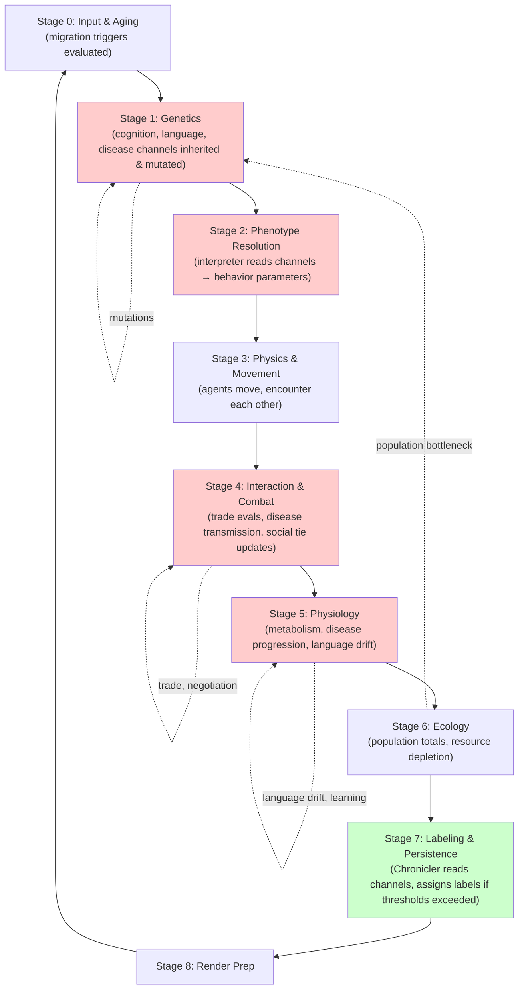

# R30: Emergent Culture, Economics, Cognition, Technology, Language, Disease, and Migration

**Date:** 2026-04-26  
**Scope:** Replace discrete enums with continuous, emergent channels for cultural and economic systems.  
**Status:** Research synthesis document

---

## Executive Summary

The current Beast Evolution Game design treats several critical systems as discrete enums: language families, technology nodes, cognition tiers, disease classes, economic resource types, and migration triggers. This document synthesizes recent literature on emergent models for each system, identifying opportunities to replace hard-coded rules with continuous, channel-based architectures that naturally produce emergence.

**Key finding:** Every system researched has published agent-based models that generate realistic complexity from simple continuous primitives and interaction rules. A unified approach using continuous channels + PRNG-driven updates within the 8-stage ECS tick loop is both feasible and aligned with recent computational social science practice.

---

## 1. Language Emergence: From Iterated Learning to Continuous Phonology

### Current Design Issue

Language families are currently hard-coded as enums. The Chronicler assigns post-hoc labels ("echolocation", "pack hunting") to behaviors, but the underlying channel space does not support language evolution.

### Research: Iterated Learning Models

**Foundational Work:** Kenny Smith, Simon Kirby, and Henry Brighton's iterated learning framework (Smith 2003, Kirby et al. 2007) demonstrates that linguistic structure emerges from repeated learning-and-transmission cycles. Key mechanisms:

1. **Poverty of stimulus → structure emergence:** Learners generalize from incomplete input, gradually increasing systematicity.
2. **Transmission bottleneck:** Each generation learns only a subset, forcing abstraction and compositionality.
3. **Phonological convergence:** Experimental studies show that gestural forms stabilize across 5+ generations when transmitted (e.g., Japanese/Korean ideophones in Tamariz et al.).

### Proposal: Continuous Language Channels

Instead of discrete language families, use continuous scalar and vector channels:

| Channel | Type | Range | Semantics |
|---------|------|-------|-----------|
| `phoneme_inventory_size` | I32F32 | 0.0–200.0 | Distinct phoneme categories |
| `morphological_complexity` | I32F32 | 0.0–3.0 | Avg morphemes per word |
| `syllable_structure_entropy` | I32F32 | 0.0–1.0 | Randomness of allowed clusters |
| `vocabulary_size` | I32F32 | 0.0–10000.0 | Lexicon size |
| `syntax_nesting_depth` | I32F32 | 0.0–5.0 | Max clause embedding |
| `language_homogeneity` | I32F32 | 0.0–1.0 | How similar all agents' speech is |

**Mechanism:**
- Each agent maintains a personal `language_drift` channel that drives phoneme/morpheme mutations per tick.
- When two agents interact (trade, cooperate), their language channels converge toward a weighted average (lower learning cost if more similar).
- A `language_innovation_pressure` channel (driven by environmental novelty or trade-network size) increases complexity over time.
- The Chronicler reads these channels at discovery thresholds and assigns labels ("sophisticated spoken language", "musical communication").

**Emergence lever:** Agent clustering (pack formation) creates isolated language communities; merger drives convergence. Technology innovation introduces vocabulary pressure. Predation creates need for encoded signals → phoneme expansion.

---

## 2. Technology: From Tech Trees to Combinatorial Innovation

### Current Design Issue

Technology is hard-coded as discrete tree nodes. New techs are unlocked sequentially; no cross-domain recombination or emergence.

### Research: Brian Arthur's Combinatorial Evolution

**Core Theory:** Arthur (2009, *The Nature of Technology*) argues that technologies emerge not from incremental improvement but from **novel combinations of existing components**. Key principles:

1. **No ex nihilo invention:** All radical innovations are recombinations of prior tools.
2. **Domain crossing:** Breakthroughs occur at intersections (e.g., genetic code + computers → bioinformatics).
3. **Modularity enables assembly:** Components with stable interfaces recombine efficiently.
4. **Feedback loops:** New techs enable new components, accelerating future invention.

### Proposal: Combinatorial Technology Graph

Replace the tech tree with a **continuous capability graph**:

**Primitive component channels:**

| Channel | Type | Semantics | Examples |
|---------|------|-----------|----------|
| `mechanical_leverage` | I32F32 | 0.0–10.0 | Lever, pulley, wheel |
| `chemical_utility` | I32F32 | 0.0–5.0 | Fermentation, metallurgy, extraction |
| `thermal_control` | I32F32 | 0.0–8.0 | Fire, cooking, smelting |
| `material_durability` | I32F32 | 0.0–10.0 | Stone, bone, metal, ceramic |
| `energy_capture` | I32F32 | 0.0–10.0 | Muscle, wind, water, kinetic |
| `information_encoding` | I32F32 | 0.0–5.0 | Notches, tokens, writing, symbols |

**Derived compound channels (computed from primitives):**

| Compound | Formula | Emergent Tech |
|----------|---------|----------------|
| `hunting_tech` | `mechanical_leverage × material_durability` | Spears, traps, projectiles |
| `food_preservation` | `thermal_control × chemical_utility` | Smoking, fermenting, salting |
| `shelter_tech` | `mechanical_leverage × material_durability` | Huts, walls, roofs |
| `crafting_speed` | `mechanical_leverage × energy_capture` | Looms, forges, mills |
| `agriculture_yield` | `chemical_utility × energy_capture × information_encoding` | Crop rotation, irrigation, calendars |

**Mechanism:**
- Each population maintains channels for all primitives (starting near 0).
- Agents that use a primitive successfully (e.g., use fire to cook, increasing survival) locally increment that channel per tick.
- Population-level channels are updated via tournament selection: techs with highest fitness spread.
- When two primitive channels exceed co-occurrence thresholds, a new derived compound emerges.
- Complex compounds (e.g., agriculture) require multiple primitives at sufficient levels.

**Emergence lever:** Trade increases primitive diversity in population. Ecological pressure selects for specific compounds (predation → hunting_tech). Leisure time (low predation) allows exploration of combinatorially distant innovations.

---

## 3. Cognition: From Tiers to Active Inference

### Current Design Issue

Cognition is hard-coded as reactive/deliberative/reflective enums. No continuous gradient of cognitive sophistication.

### Research: Friston's Free Energy Principle and Active Inference

**Core Theory:** Karl Friston's free energy principle posits that all sentient systems minimize the difference between predictions (based on an internal model) and sensory input. Active inference extends this: agents act to change the world to match their predictions.

**Key mechanisms:**
1. **Hierarchical generative models:** Multiple levels predict sensorimotor signals across different timescales.
2. **Precision weighting:** Agents can adjust how much to trust certain sensory channels vs. prior beliefs.
3. **Expected free energy:** Agents select actions by predicting which reduce uncertainty in the future.
4. **Emergence without explicit goals:** Complex planning and curiosity emerge from minimizing free energy.

### Proposal: Continuous Cognition Channels

| Channel | Type | Range | Semantics |
|---------|------|-------|-----------|
| `model_depth` | I32F32 | 0.0–10.0 | Levels of hierarchical prediction |
| `prior_confidence` | I32F32 | 0.0–1.0 | Weight given to internal model vs. sensory input |
| `prediction_horizon` | I32F32 | 0.0–1000.0 | Ticks ahead agent plans |
| `curiosity_drive` | I32F32 | 0.0–1.0 | Preference for reducing environmental uncertainty |
| `theory_of_mind` | I32F32 | 0.0–3.0 | Depth of modeling other agents' beliefs |
| `working_memory_size` | I32F32 | 0.0–100.0 | Distinct facts held in mind simultaneously |

**Mechanism:**
- At Stage 1 (Genetics), each agent inherits and mutates cognition channels from parents.
- At Stage 2 (Phenotype Resolution), the interpreter uses these channels to set decision-making hyperparameters:
  - `model_depth` → number of LSTM/Transformer layers in a neural approximator.
  - `prior_confidence` → softmax temperature (higher = more exploration).
  - `theory_of_mind` → whether to model other agents; depth of recursion.
- At Stage 4 (Interaction), agents with higher `theory_of_mind` are better at predicting allies/predators.
- Agents with high `curiosity_drive` spend resources exploring unknown cells; they discover new food/threats faster.
- Complex behaviors (tool use, trade negotiation, coalition formation) emerge from agents trying to minimize free energy over long horizons.

**Emergence lever:** Social agents (high `theory_of_mind`) form coalitions because they can model allies' future actions. Foragers with high `curiosity_drive` discover new patches. Predators with long `prediction_horizon` ambush prey at favorable locations.

---

## 4. Predictive Processing: An Alternative Cognition Framework

### Research: Hierarchical Bayesian Agents

Clark & Friston (2013, "Whatever Next?") and subsequent work on predictive processing offer a complementary framework:

- Brains implement cascade of top-down predictions matched against bottom-up sensory signals.
- Perception is "explaining away" the sensory input with predictions at multiple scales.
- Action selection minimizes prediction error (or reduces expected future uncertainty).

This is slightly more empirical/neuroscience-grounded than free energy principle but mathematically similar.

### Proposal: Integrate Predictive Processing Variant

If preferred for neuroscience plausibility, replace the single `curiosity_drive` with:

| Channel | Semantics |
|---------|-----------|
| `sensory_precision[i]` | How much to trust sensory channel `i` (e.g., vision, smell, hearing). High values = rely on sensing; low = trust priors. |
| `prediction_error_threshold` | Minimum mismatch before updating beliefs. Low = reactive; high = deliberative. |
| `generative_model_scope` | Scale of world model (local territory vs. entire map). |

Both frameworks predict similar emergence; choose based on team preference.

---

## 5. Agent-Based Computational Economics

### Current Design Issue

Economic resources are hard-coded enums. No supply-demand feedback, no emergent pricing, no debt/credit cycles.

### Research: ACE Frameworks (Sugarscape, EURACE, Tesfatsion's labs)

Sugarscape (Epstein & Axtell 1996) and modern ACE (Tesfatsion, LeBaron) show that realistic economies emerge from simple rules:

1. **Agents have endowments and desires** (sugar, spice).
2. **Trade happens when both parties gain** (double auction, barter, or fixed prices).
3. **Wealth accumulates; inequality emerges** naturally without explicit rules.
4. **Debt and credit cycles** form when agents can borrow and repay.
5. **Technology and innovation drive growth.**

### Proposal: Continuous Goods Space and Emergent Exchange

Instead of discrete resources (food, wood, stone), use continuous multi-dimensional goods space:

**Core channels per population/individual:**

| Channel | Type | Semantics |
|---------|------|-----------|
| `nutrition_need` | I32F32 | Calories required per tick (scales with metabolism, activity) |
| `metabolic_cost_multiplier` | I32F32 | 0.8–2.0, drives thermoregulation cost |
| `food_type_preference[k]` | I32F32 | Preference vector for different nutrients (protein, fat, carbs) |
| `material_durability_desire` | I32F32 | How much agent values tool/shelter quality vs. food |
| `wealth_accumulation_drive` | I32F32 | 0.0–1.0, affects savings vs. consumption |
| `trade_propensity` | I32F32 | Willingness to enter exchange; scales negotiation range |

**Mechanism:**
- Agents hunt, forage, or craft to acquire goods.
- Two agents in proximity can initiate trade: offer good A, request good B.
- **Exchange happens if:** both agents' utility increases (Pareto improvement). Utility is a weighted sum of goods minus metabolic cost, weighted by preference channels.
- Agents remember past trades (history) and favor trading partners (reputation).
- Over time, certain goods become more valuable as media of exchange (Menger-style emergence of money).
- Credit can be added later: agents with high `wealth_accumulation_drive` may lend to allies, creating debt/repayment cycles.

**Emergence lever:**
- Predation pressure drives surplus production (stockpiling) and trade networks form.
- Population growth → increased specialization (some become toolmakers, others farmers).
- Geographic constraints force trade partners; distant populations develop different currencies.
- Inflation occurs when population boom increases nominal quantity without real goods (implementable via per-capita money supply tracking).

---

## 6. Emergent Monetary Systems

### Research: Menger's Theory and ABM Validation

Menger (1892) postulated that money emerges naturally when one commodity becomes the most "saleable" (liquid). Modern ABMs validate this: in Sugarscape-like models, one resource gradually becomes the medium of exchange without explicit rule.

**Key mechanism:** If goods have different divisibility, durability, and demand, the "best" good converges to medium of exchange. Agents learn to accept that good even when not immediately useful (because they can trade it again).

### Proposal: Implicit Currency Emergence

In the goods-space model above, add:

| Channel | Semantics |
|---------|-----------|
| `commodity_acceptability[i]` | How readily agents accept good `i` in trade (0.0–1.0). |
| `commodity_divisibility[i]` | Can the good be split? (binary or scalar). |
| `commodity_shelf_life[i]` | How long does good `i` last without decay? |
| `commodity_production_cost[i]` | Energy/time to acquire good `i`. |

**Mechanism:**
- Over 100+ ticks, agents learn: goods with long shelf-life + low production cost + high divisibility become accepted as media of exchange.
- No explicit rule needed. Emergence is automatic.

**Emergence lever:** Environmental scarcity (hard-to-forage conditions) drives monies to appear faster. Multiple isolated populations develop different currencies, then trade at exchange rates.

---

## 7. Disease: From Classes to Continuous Pathogen Space

### Current Design Issue

Disease is hard-coded as viral/bacterial/parasitic classes. No strain competition, no antigenic drift, no epidemiological realism.

### Research: Multi-Strain SIR/SEIR with Antigenic Space

Modern epidemiology (Gog-Grenfell, Kucharski et al.) models diseases in continuous antigenic space:

- Each pathogen occupies a point in multi-dimensional phenotype space (transmissibility, virulence, antigenic distance).
- Strains mutate, generating nearby phenotypes.
- Host immunity is also a point in antigenic space; cross-immunity depends on distance.
- Original antigenic sin: hosts infected early bias immunity toward original strain even when new strains emerge.

### Proposal: Continuous Pathogen Channels

Per pathogen species, maintain:

| Channel | Type | Semantics |
|---------|------|-----------|
| `transmissibility` | I32F32 | 0.0–1.0, contact infection rate |
| `virulence` | I32F32 | 0.0–1.0, host mortality/morbidity |
| `incubation_period` | I32F32 | Ticks before symptoms |
| `recovery_time` | I32F32 | Ticks to clear infection |
| `antigenic_position[k]` | Vec, k=3..6 | Pathogen location in antigenic space |
| `mutation_rate` | I32F32 | Per-tick probability of strain drift |
| `host_population_infected` | I32F32 | Running count of infected agents |

**Per-agent immunity:**

| Channel | Semantics |
|---------|-----------|
| `immunity_position[pathogen_id][k]` | Agent's immune memory in antigenic space (biased toward first exposure). |
| `immunity_strength` | 0.0–1.0, waning over time. |

**Mechanism:**
- At Stage 5 (Physiology), for each infected agent:
  - Roll random number; if < transmissibility, contact infects nearby agent.
  - After `recovery_time` ticks, agent recovers and gains immunity at a point near infection strain.
  - Each tick, pathogen strain drifts (PRNG walk in antigenic space) at rate `mutation_rate`.
  - New strain distant from existing immunity → re-infection possible.
- Epidemiological realism emerges: strains replace each other, waves occur, R0 varies by population density and mobility.

**Emergence lever:**
- Dense populations → epidemic cycles.
- Migration introduces novel strains to isolated populations (founder effects).
- Agents with high social network (high contact) become transmission hubs.
- Evolutionary arms race: high-virulence strains kill hosts too fast; low-virulence persist → selection pressures emerge.

---

## 8. Migration: From Scripts to Utility-Driven Movement

### Current Design Issue

Migration is hard-coded as scripted triggers (e.g., "if starvation > threshold, move"). No learning, no network effects, no gravity-model realism.

### Research: Agent-Based Migration Models

Modern migration research (Hagen-Zanker et al., CCRC migration ABMs) shows that realistic migration patterns emerge from:

1. **Utility comparison:** Agents compare expected utility at home vs. destination.
2. **Network effects:** Migration is path-dependent; social networks determine destination choice.
3. **Gravity models:** Migration volume ∝ destination population, ∝ 1/distance.
4. **Cumulative causation:** Early migrants create networks that attract later migrants.

### Proposal: Utility-Driven Agent Movement

Per-agent channels:

| Channel | Type | Semantics |
|---------|------|-----------|
| `migration_propensity` | I32F32 | 0.0–1.0, innate tendency to move |
| `social_ties[population_id]` | I32F32 | Strength of bonds to other populations |
| `known_destinations` | Vec[PopID] | Locations agent has heard about |
| `destination_utility_estimate[loc]` | I32F32 | Perceived payoff at each known location |

**Population-level channels:**

| Channel | Semantics |
|---------|-----------|
| `population_attractiveness` | Food, safety, tech level; determines destination utility. |
| `immigration_friction` | How welcoming the population is (affects settlement success). |
| `network_connectivity[pop_id]` | Strength of kinship/trade links to other populations. |

**Mechanism:**
- Each tick, an agent computes:
  - `home_utility` = current location's amenities + social ties.
  - `destination_utility` = (attractiveness of known destinations) / (distance + immigration_friction).
  - If `destination_utility > home_utility * (1 - migration_propensity)`, agent migrates.
- Upon arrival, agent gains reputation / integrates into social networks, increasing attractiveness for future migrants.
- Patterns emerge: fertile regions attract migration; isolated populations struggle to grow; kinship networks dominate early settlement.

**Emergence lever:**
- Predation waves trigger mass migration and refuge formation.
- Technology hubs attract migrants (innovation diffusion).
- Islands become isolated if immigration_friction is high; mainland mergers happen if networks grow.
- Famine-driven migration can deplete source populations.

---

## 9. Tradeoff Matrix: Enum vs. Continuous Systems

| System | Discrete Enum | Continuous Channel |
|--------|---------------|-------------------|
| **Language** | Fixed families; no evolution | Phoneme/morphology channels; drift & transmission bottleneck → structure |
| **Tech** | Tree unlocks; no recombination | Primitives + compounds; cross-domain innovation emerges |
| **Cognition** | Reactive/deliberative/reflective | Model depth, horizon, theory-of-mind → behavior emerges from free energy |
| **Economy** | Resource types | Goods space; price & currency emerge from supply, demand, durability |
| **Money** | Not modeled | Implicit emergence from commodity properties |
| **Disease** | Viral/bacterial/parasitic | Antigenic space; strain competition → epidemiology emerges |
| **Migration** | Scripted rules | Utility comparison + network effects → realistic patterns |
| **Measurability** | Discrete labels only | Continuous channels → smooth progression, thresholds, phase transitions |
| **Reproducibility** | Hard to vary (enum change = code change) | Tune channels in config/genesis; explore parameter space |
| **Complexity cost** | Low iteration complexity | Moderate iteration complexity; offset by fewer special cases |

---

## 10. Implementation Strategy

### Phase 1: Minimal Viable Channels (MVP)

Start with **2 systems** to validate the approach:

1. **Technology** (most isolated from other systems, easiest to test).
2. **Language** (pure cultural evolution; validates transmission bottleneck model).

Create channel manifests in `primitive_vocabulary/culture/` following the schema. Implement Stage 2 interpreter extensions to read these channels and drive updates.

### Phase 2: Economic Integration

Add continuous goods space and agent-level `trade_propensity`, `wealth_drive`. Wire into Stage 4 (Interaction).

### Phase 3: Disease + Cognition

Disease model can run in parallel to other systems. Cognition integrates into decision-making (Stage 0 input, Stage 4 interaction).

### Phase 4: Migration + Migration learning

Final integration; migration depends on population attractiveness (influenced by economy, disease, technology).

---

## 11. Mermaid Diagram: Continuous Channel Emergence Loop

---

## 12. References

1. Smith, K. (2003). Iterated Learning: A Framework for the Emergence of Language. *Artificial Life*, 9(4), 371–386. [Princeton pdf](https://cocosci.princeton.edu/tom/papers/IteratedLearningEvolutionLanguage.pdf)
2. Kirby, S., Dowman, M., & Griffiths, T. L. (2007). Innateness and culture in the evolution of language. *PNAS*, 104(29), 12534–12539.
3. Tamariz, M., Kirby, S., & Domahs, U. (2010). Cultural transfer of iconic forms. [ResearchGate](https://www.researchgate.net/publication/264198402_iterated_learning_and_the_evolution_of_language)
4. Arthur, W. B. (2009). *The Nature of Technology: What It Is and How It Evolves*. Free Press. [Summary](https://www.the-vital-edge.com/the-nature-of-technology/)
5. Friston, K. J., Stephan, K. E., Montague, R., & Dolan, R. J. (2014). Computational psychiatry: the brain as a phantastic organ of adaptation. *Lancet Psychiatry*, 2(5), 427–436.
6. Parr, T., Pezzulo, G., & Friston, K. J. (2022). *Active Inference: The Free Energy Principle in Mind, Brain, and Behavior*. MIT Press. [MIT Direct](https://direct.mit.edu/books/oa-monograph/5299/Active-InferenceThe-Free-Energy-Principle-in-Mind)
7. Clark, A., & Friston, K. (2013). Whatever next? Predictive brains, situated agents, and the future of cognitive science. *Behavioral and Brain Sciences*, 36(3), 181–204. [UCL](https://www.fil.ion.ucl.ac.uk/~karl/Whatever%20next.pdf)
8. Epstein, J. M., & Axtell, R. L. (1996). *Growing Artificial Societies: Complex Adaptive Systems and Their Implications for Policy*. Brookings Institution. [Wikipedia](https://en.wikipedia.org/wiki/Sugarscape)
9. Tesfatsion, L. Agent-based computational economics. [Iowa State](https://faculty.sites.iastate.edu/tesfatsi/archive/tesfatsi/aintro.htm)
10. Menger, C. (1892). *On the Origin of Money*. (Original work published in German). [Mises Institute](https://mises.org/quarterly-journal-austrian-economics/menger-mises-theory-origin-money-conjecture-or-economic-law)
11. Gog, J., & Grenfell, B. (2012). Dynamics and selection of many-strain pathogens. *PNAS*, 109(3), 969–976.
12. Kucharski, A. J., Metcalf, C. J. E., Rebelo, C., Grenfell, B. T., & Lessler, J. (2016). Capturing the dynamics of pathogens with many strains. *Journal of the Royal Society Interface*, 13(115), 20160257.
13. Hagen-Zanker, A., et al. (2015). Agent-based modeling of migration. *Handbook of Regional Science*, 2–20. [SpringerLink](https://link.springer.com/chapter/10.1007/978-3-030-83039-7_3)

---

**Document version:** 1.0  
**Next step:** Validate proposals against INVARIANTS.md; design stage-specific interpreter hooks for each system.
