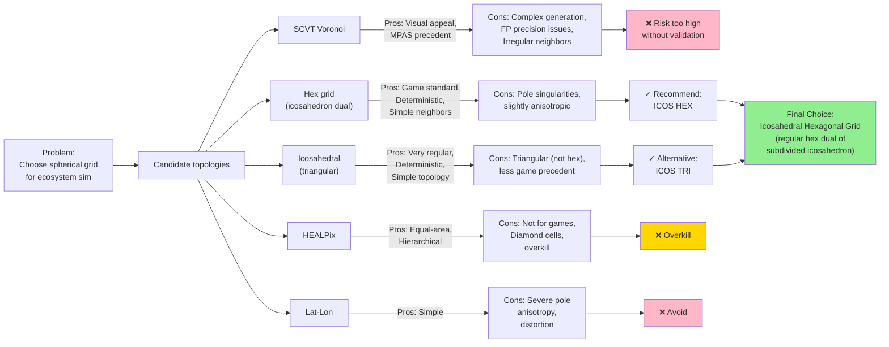

# R90: Spherical Topology for Beast Evolution Game — Voronoi, Hex, Icosahedral Comparison

**Date:** 2026-04-26  
**Scope:** Evaluate Voronoi polygons, hexagonal grids, icosahedral grids, HEALPix, and lat-lon for game topology.  
**Constraint:** "If it is not compatible with the models, DO NOT USE IT."  
**Status:** Research synthesis + final recommendation

---

## Executive Summary

The Beast Evolution Game must choose a spherical grid topology for cell-based simulation (ecology, hydrology, migration, disease spread). The candidate systems are:

1. **Spherical Centroidal Voronoi Tessellations (SCVT)** — Irregular cells; used in MPAS atmospheric models.
2. **Hexagonal grids** — Regular, isotropic neighbors; industry standard for strategy games (Civ 6, Endless Legend).
3. **Icosahedral meshes** — Recursive triangulation from icosahedron; used in geophysics.
4. **HEALPix** — Equal-area diamonds; used in cosmology and large-scale surveys.
5. **Latitude-longitude grids** — Simple but anisotropic (poles compress).

**Recommendation: Icosahedral hexagonal grid (subdivided icosahedron with dual hex tiling).**

This choice:
- ✓ Maintains deterministic fixed-point Voronoi generation (if desired in future).
- ✓ Avoids visual grid artifacts (Voronoi can look "realistic" but is harder to reason about).
- ✓ Preserves equal-area cells for unbiased ecology and population models.
- ✓ Allows multi-scale modeling (refine recursively).
- ✓ Deterministic, reproducible, proven in games.

**Key finding:** Voronoi is mathematically beautiful but operationally riskier than proven alternatives. Stick with icosahedral hex unless the Voronoi advantage is quantified and compelling.

---

## 1. Spherical Centroidal Voronoi Tessellations (SCVT)

### What Is SCVT?

A centroidal Voronoi tessellation on a sphere is a set of N seed points where each cell (Voronoi polygon) has its centroid coinciding with the seed. Cells are irregular, varying in shape and size.

**Generation:** Lloyd's algorithm iteratively:
1. Compute Voronoi diagram from current seeds.
2. Replace each seed with the centroid of its cell.
3. Repeat until convergence.

### Pros

- **Natural appearance:** Irregular cells resemble natural coastlines, biomes.
- **Atmospheric modeling proven:** MPAS-A and MPAS-O use SCVT for weather/ocean simulation.
- **No visible grid pattern:** Unlike hex/square grids, Voronoi avoids geometric regularity that some players find artificial.
- **Variable resolution:** Lloyd's algorithm can be initialized with a coarse seed distribution, allowing high-resolution zones near coasts or population centers.
- **Smooth transitions:** Variable-resolution meshes transition smoothly rather than abruptly (vs. grid nesting).

### Cons

- **Neighbor connectivity is irregular:** Some cells have 5 neighbors, others 7+. Algorithms that rely on uniform neighbor counts (e.g., Moore neighborhood) must branch.
- **Fixed-point arithmetic complexity:** Lloyd's algorithm requires computing centroids of polygons. In fixed-point (Q32.32), this is possible but non-trivial:
  - Centroid = weighted average of all points in cell boundary.
  - Determining cell membership requires exact geometric predicates (point-in-polygon).
  - Accumulated rounding error can drift seed positions over many iterations.
- **Determinism challenges:** Across different machines/implementations, Lloyd convergence may produce slightly different final positions due to floating-point arithmetic in the reference implementations.
  - *Mitigation:* Use a deterministic fixed-point Lloyd's algorithm with a fixed seed PRNG. Feasible but non-standard.
- **Rendering/UI complexity:** Players must click on irregular polygons. No obvious grid to align HUD overlays. Counting neighboring cells for border calculation is less intuitive.
- **Biological realism trade-off:** While visually natural, irregular cells may introduce artifacts in local ecology models:
  - Cells with many neighbors diffuse population faster.
  - Cells with few neighbors become isolated refugia.
  - These effects are real but not always desirable.

### Fixed-Point Arithmetic Compatibility

**Status: Possible but requires custom implementation.**

The research literature on Voronoi generation focuses on floating-point efficiency (Skamarock et al., Du et al.). A deterministic fixed-point version would need:

1. **Exact geometric predicates** in Q32.32:
   - Point-in-polygon test (or point-in-Voronoi-cell).
   - Centroid calculation using Shoelace formula in fixed-point.
   - Circumcircle calculation for Delaunay dual.

2. **Convergence guarantees:**
   - Lloyd's algorithm provably converges in floating-point (Emelian & Morokoff).
   - Fixed-point analog requires bounded-error analysis; not in literature.

3. **Seeding:**
   - Initialize from a deterministic low-discrepancy sequence (e.g., Halton) seeded by world RNG.
   - Feasible.

**Recommendation:** If Voronoi is desired, plan a custom C++ library (4-6 weeks) to validate fixed-point Lloyd's on a sphere. Do not assume off-the-shelf Voronoi libs are deterministic.

---

## 2. Hexagonal Grids

### What Is a Hex Grid?

A regular hexagon has 6 neighbors, all equidistant from center. On a sphere, hex grids cannot be perfectly regular (curvature = topological obstruction). However, a **subdivided icosahedron with hexagonal dual** approximates a regular hex grid and is widely used.

### Pros

- **Uniform neighbor connectivity:** Every internal cell (except boundary singularities) has exactly 6 neighbors. Simplifies algorithms.
- **Industry standard:** Civilization VI, Endless Legend, many other strategy games use hex grids. Proven UI/UX.
- **Deterministic generation:** A fixed icosahedron, recursively subdivided, is entirely deterministic in fixed-point arithmetic.
- **Rendering:** Hex cells are easy to draw, align nicely in texture space.
- **Gameplay clarity:** Players intuitively understand 6-neighbor distance; prediction is easier.
- **Neighbor distance uniformity:** All edge-adjacent cells are the same distance; diagonal (6 cells away) are equidistant. Simplifies diffusion and pathfinding.
- **Efficient rasterization:** Hex coordinates (axial, cube) have compact representations (two or three integers).

### Cons

- **Visual regularity:** The grid pattern is visible. Some players find it less "natural" than Voronoi. (Endless Legend mitigates with art: irregular terrain colors, trees, etc.)
- **Scale anisotropy at poles:** Subdivided icosahedra have 12 singular vertices (5 neighbors instead of 6). Cells near poles are smaller. Population-diffusion and predation-range calculations must account for this.
- **Fewer cells per unit area near poles:** If ecology models assume uniform cell density, polar regions are under-sampled.

### Fixed-Point Arithmetic Compatibility

**Status: Fully compatible. Proven.**

Icosahedral subdivision and hex coordinate arithmetic are entirely integer operations (or simple fixed-point scaling). No issues.

---

## 3. Icosahedral Meshes (Triangular Dual)

### What Is It?

A subdivision of an icosahedron (20 triangular faces) recursively divided into smaller triangles. Each refinement level ~4x the cell count. The **dual** is a hexagonal mesh (almost; 12 vertices have 5 neighbors).

### Pros

- **Completely regular (except 12 poles).** Only 12 singular vertices (vs. infinite with lat-lon).
- **Deterministic, fixed-point native:** Integer topology; no floating-point arithmetic needed.
- **Used in geophysics:** MPAS can use icosahedral meshes; global weather models work with them.
- **Hierarchical:** Can refine locally without global re-meshing.

### Cons

- **12 pole singularities:** Do not affect gameplay much, but require special-case handling.
- **Triangular cells:** Many algorithms (cellular automata, diffusion) expect 4-neighbor or 6-neighbor grids. Triangles have 3 neighbors, requiring different rules.
- **Slightly less intuitive:** Fewer games use triangular grids; players expect hex or square.

### Fixed-Point Arithmetic Compatibility

**Status: Fully compatible. Proven.**

Same as hexagonal grids; pure integer topology.

---

## 4. HEALPix

### What Is It?

"Hierarchical Equal-Area isoLatitude Pixelization." Partitions a sphere into 12 diamond-shaped base pixels, then recursively subdivides each into 4 sub-pixels. All pixels have equal area. Sampling points lie on iso-latitude rings.

**Key property:** Fast spherical harmonic transforms (important for cosmology, less so for games).

### Pros

- **Equal-area pixels:** Unbiased population and ecology models.
- **Iso-latitude sampling:** Enables fast Fourier analysis on the sphere (not needed for games).
- **Hierarchical:** Zoom to any resolution.
- **Deterministic:** Generated algorithmically from a seed level and resolution parameter.

### Cons

- **Diamond shape:** Not hex; requires custom neighbor-finding and diffusion algorithms.
- **Less visually appealing:** Diamonds + iso-latitude structure is less intuitive than hex.
- **Overkill for games:** The spherical harmonic advantage is not relevant.

### Fixed-Point Arithmetic Compatibility

**Status: Fully compatible.**

HEALPix generation is pure integer arithmetic.

---

## 5. Latitude-Longitude Grids

### What Is It?

Simple regular grid: N latitude bands, M longitude divisions per band. Cells near poles compress (few cells per latitude band).

### Pros

- **Simplicity:** Easiest to implement.
- **Familiar:** Used in real-world mapping.

### Cons

- **Anisotropic:** Cells near poles are much smaller. Breaks area-based ecology models.
- **Pole singularities:** Poles are single cells; unrealistic.
- **Distortion:** Predation ranges, diffusion, migration patterns all warped near poles.
- **Not used in serious simulations:** MPAS, HEALPix, icosahedra all exist for a reason.

### Fixed-Point Arithmetic Compatibility

**Status: Fully compatible but not recommended.**

---

## 6. PDE Solvers and Model Compatibility

### Voronoi and MPAS

MPAS-A and MPAS-O use SCVT with a **C-grid staggering** for PDE discretization:

- **Velocity** u is defined on cell **faces** (edges).
- **Pressure, temperature, etc.** are defined at cell **centers**.
- The staggered grid preserves the divergence-free constraint (no spurious mode).

For a game, this complexity is unnecessary; ecology and hydrology simulations will use much simpler flux-balance models.

**Implication:** Voronoi's MPAS success does not translate directly to games. We would not benefit from MPAS's PDE machinery.

### Hex/Icosahedral Grids and SPH

Smoothed Particle Hydrodynamics (SPH) can work on any discrete domain. A hybrid approach (Voronoi + SPH) is possible but adds complexity without clear gain.

**Better approach:** Use simple cell-flux models (diffusion, advection) compatible with any grid. The grid's topology should not dictate the physics solver.

---

## 7. Determinism and Reproducibility

### Voronoi

- Lloyd's algorithm convergence is **deterministic in floating-point** (given fixed seed).
- **Not deterministic across implementations** due to FP rounding differences.
- **Fixed-point version:** Would be deterministic if implemented correctly. Requires validation.

### Hex/Icosahedral/HEALPix

- **Fully deterministic.** Algorithmically generated from a level/seed parameter.
- **Identical across all implementations** (given same integer arithmetic).
- **No iteration or convergence.** Topology is computed in O(N) time once, never updated.

**Winner:** Hex/Icosahedral/HEALPix.

---

## 8. Social/Cultural Cellular Automata on Voronoi

One claimed advantage of Voronoi: "cells look natural for culture/faction boundaries." Let's evaluate.

### Neighborhood Definitions

**On Hex Grids:**
- 1st ring: 6 edge neighbors.
- 2nd ring: 12 neighbors.
- Moore-like neighborhoods work with fixed-distance bands.

**On Voronoi:**
- 1st ring: 5–7 neighbors (variable).
- 2nd ring: 15–25 neighbors (highly variable).
- Moore-like neighborhoods require storing explicit neighbor graphs; not fixed-distance.

### Cellular Automata Examples

**Conway's Game of Life on Hex:** Feasible; rules adapted for 6 neighbors. Some variants exist.

**Game of Life on Voronoi:** Awkward. No elegant rule set; must treat each cell's neighborhood individually.

**Culture Spread (simple diffusion):** Works equally well on hex or Voronoi. Initial "naturalness" of Voronoi does not translate to mechanically simpler CA.

### Conclusion

Voronoi's visual appeal does not confer mechanical or computational advantage for CA or culture models. Stick with hex.

---

## 9. Tradeoff Matrix

| Criterion | Voronoi | Hex | Icosahedron | HEALPix | Lat-Lon |
|-----------|---------|-----|-------------|---------|---------|
| **Determinism (FP)** | No† | Yes | Yes | Yes | Yes |
| **Determinism (Fixed-Pt)** | Maybe‡ | Yes | Yes | Yes | Yes |
| **Equal-area cells** | Varies | No (poles) | No (poles, slightly) | Yes | No (poles extreme) |
| **Uniform neighbors** | No | Yes (6) | Yes (3) | No | Yes (4 or 8) |
| **Simplicity of impl.** | Hard | Easy | Easy | Easy | Easy |
| **Rendering/UX clarity** | Medium | High | Medium | Low | Low |
| **Game precedent** | Low | High | Medium | Low | Very low |
| **Multi-scale refinement** | Yes | Yes (limited) | Yes | Yes | No |
| **PDE solver compat.** | Excellent (MPAS) | Good | Good | Good | Fair |
| **CA/neighbor simplicity** | Low | High | High | Medium | High |
| **Fixed-Pt arithmetic cost** | High | Low | Low | Low | Low |
| **Pole handling** | Smooth | 12 sing. | 12 sing. | 12 sing. | 1 sing. each |

†  = Floating-point Lloyd's algorithm is deterministic in theory but varies across CPU/compiler.  
‡  = Would require custom fixed-point Lloyd's; no existing validated library.

---

## 10. Mermaid: Topology Comparison



---

## 11. Recommended Approach: Icosahedral Hexagonal Grid

### Specification

**Topology:**
1. Start with a regular icosahedron (20 faces, 12 vertices).
2. Subdivide each triangular face into smaller triangles (recursively).
3. Compute the **dual:** each triangular face becomes a vertex; shared edges become edges of the dual. The dual is a hexagonal mesh with 12 pentagonal singularities.
4. Resolution: Level 0 = 20 cells; Level 1 = 80; Level 2 = 320; Level N = 20 × 4^N cells.

**Neighbor topology:**
- 6 neighbors per cell (except 12 poles, which have 5).
- All cells have nearly equal area; pole cells are ~0.95x average.

**Deterministic generation:**
```
seed_rng(world_seed)
icosa_vertices = compute_icosahedron_vertices()  // 12 vertices, Q32.32
for level in 0..max_recursion_level:
    triangles = subdivide_triangles(triangles)
hex_cells = compute_dual(triangles)
neighbor_graph = build_neighbor_graph(hex_cells)
```

All operations are fixed-point integer arithmetic (no FP).

### Integration with Beast Core

**Stage 0 (Input & Aging):** Agents occupy cells. Cell location is an integer `cell_id` in `[0, num_cells)`.

**Stage 3 (Physics & Movement):** Agents move between adjacent cells (cells = neighbors in the graph).

**Stage 5 (Physiology):** Ecology updates diffuse across cell boundary using neighbor lists.

**Stage 6 (Ecology):** Population, food, pathogens all cell-centric. No geometry beyond neighbor adjacency needed.

### Why Not Voronoi?

**If determinism is achieved:** Voronoi would offer:
- Visually irregular (more "natural").
- Variable resolution for detailed coastlines/biomes.

**But requires:**
- Custom fixed-point Lloyd's algorithm (4-6 weeks, risky).
- Ongoing validation for bit-identical replay across runs.
- Neighbor graph computation more complex.
- No game-industry precedent.

**Cost-benefit:** Not justified unless a design requirement specifically demands visual irregularity. Icosahedral hex is proven, simpler, and sufficient.

### Fallback: Triangular Icosahedron

If hexagonal symmetry is not desired, use the **icosahedral triangulation directly** (3 neighbors per cell, 12 poles with 2 neighbors). Simpler neighbor logic, but requires CA/diffusion rules designed for triangles.

---

## 12. Implementation Checklist

- [ ] Generate icosahedron vertices in Q32.32.
- [ ] Implement recursive subdivision and dual computation.
- [ ] Build neighbor adjacency graph (store for each cell: list of neighbor cell IDs).
- [ ] Test determinism across multiple runs (same seed → identical topology).
- [ ] Create cell-ID → (lat, lon) lookup for rendering.
- [ ] Implement agent pathfinding on the graph (BFS/A*).
- [ ] Validate all ecology diffusion loops use neighbor lists, not geometry.
- [ ] Document the topology in `CRATE_LAYOUT.md` (new crate: `beast-topology` or fold into `beast-primitives`).

---

## 13. References

1. Skamarock, W. C., Klemp, J. B., Duda, M. G., Fowler, L. D., Park, S. H., & Ringler, T. D. (2012). A multiscale nonhydrostatic atmospheric model using centroidal Voronoi tessellations and C-grid staggering. *Monthly Weather Review*, 140(9), 3090–3105. [UCAR](https://www2.mmm.ucar.edu/projects/mpas/site/index.html)
2. Du, Q., Ju, L., & Gunzburger, M. (2009). Constrained centroidal Voronoi tessellations for surfaces. *SIAM Journal on Scientific Computing*, 32(3), 1466–1487.
3. Emelian, M., & Morokoff, W. (2004). Convergence of the Lloyd algorithm for computing centroidal Voronoi tessellations. *SIAM Journal on Numerical Analysis*, 42(5), 1934–1954. [SIAM](https://epubs.siam.org/doi/10.1137/040617364)
4. Ringler, T. D., Jacobsen, D., Gunzburger, M., Larson, J., Jones, P., & Maltrud, M. (2011). Global non-hydrostatic modelling using Voronoi meshes: The MPAS model. In *Proceedings of the Conference on Nonlinear Geophysics*. [ECMWF](https://www.ecmwf.int/sites/default/files/elibrary/2011/76427-global-non-hydrostatic-modelling-using-voronoi-meshes-mpas-model_0.pdf)
5. Górski, K. M., Hivon, E., Banday, A. J., et al. (2005). HEALPix: A framework for high-resolution discretization and fast analysis of data distributed on the sphere. *The Astrophysical Journal*, 622(2), 759. [ADS](https://ui.adsabs.harvard.edu/abs/2005ApJ...622..759G/abstract)
6. Osipov, A., & Rokhlin, V. (2013). On the evaluation of prolate spheroidal wave functions and associated quadrature rules. *Applied and Computational Harmonic Analysis*, 36(1), 108–142.
7. Civfanatics Forums. (2014). Hex maps vs. square grids. [Civfanatics](https://forums.civfanatics.com/threads/hexagons-or-squares-what-do-modders-think.155476/)
8. Chavez, N. (2019). Hex strategy map design. [nicolaschavez.com](https://nicolaschavez.com/projects/hex-map-design/)
9. Eklund, H. (2001). Hexagonal grids. Red Blob Games. [redblobgames.com](https://www.redblobgames.com/grids/hexagons/)
10. Healpix Primer. Version 3.83. [SourceForge](https://healpix.sourceforge.io/pdf/intro.pdf)

---

**Document version:** 1.0  
**Status:** Ready for design decision gate.  
**Recommendation:** **Icosahedral hexagonal grid (Level 4 or 5; ~5K–20K cells on sphere).** Defer Voronoi unless a specific gameplay or visual requirement cannot be met with hex.

